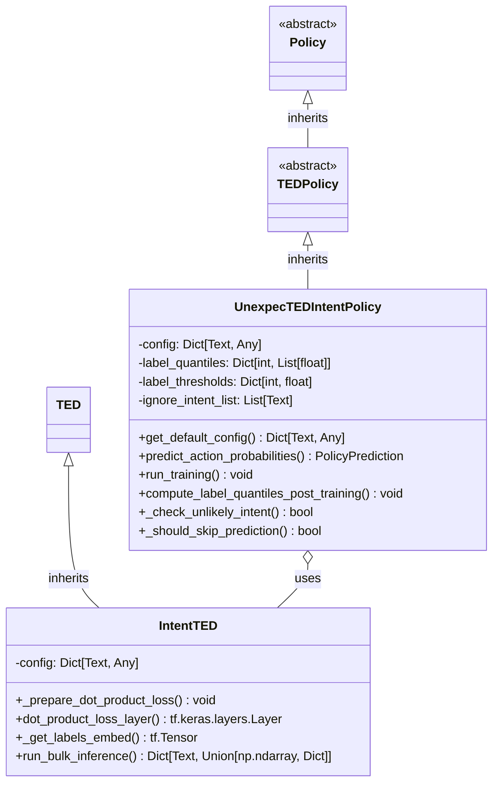
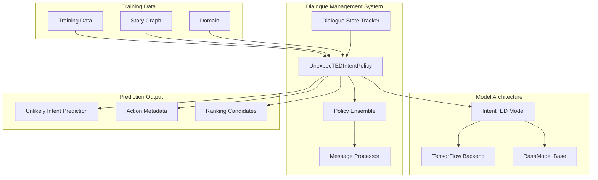
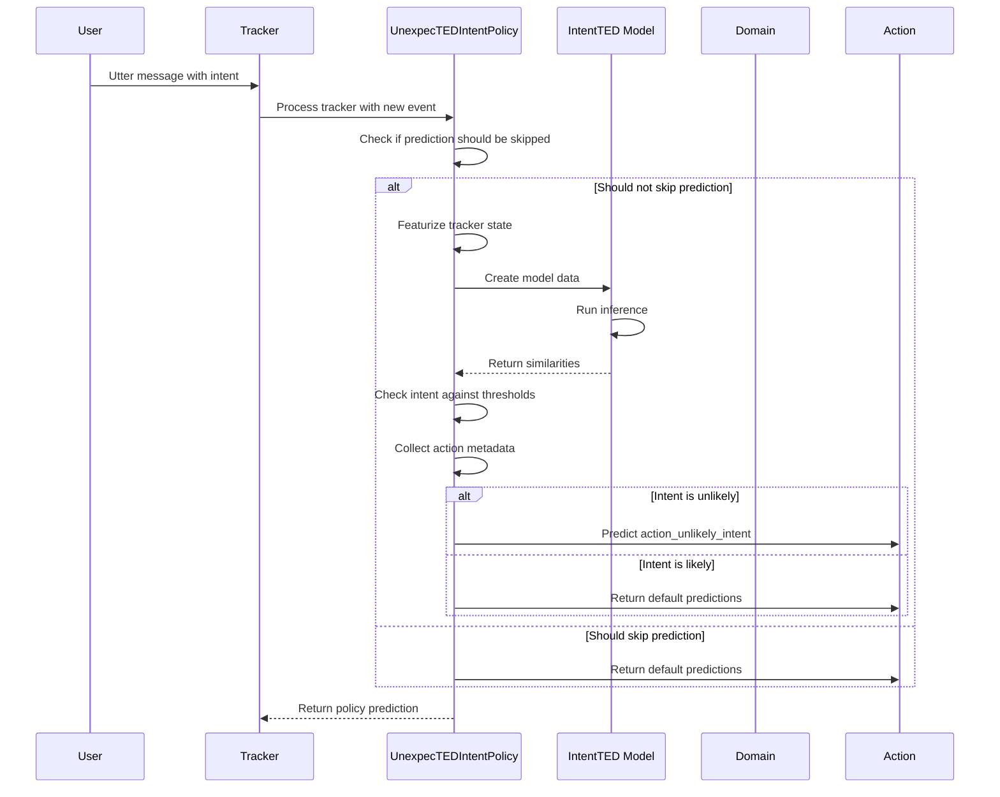
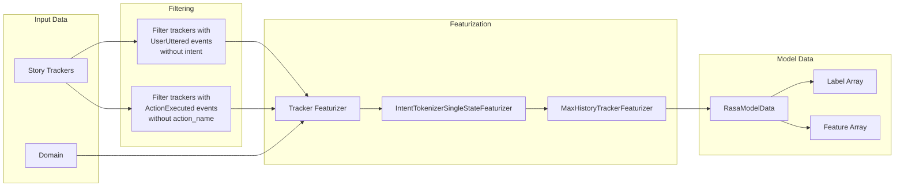
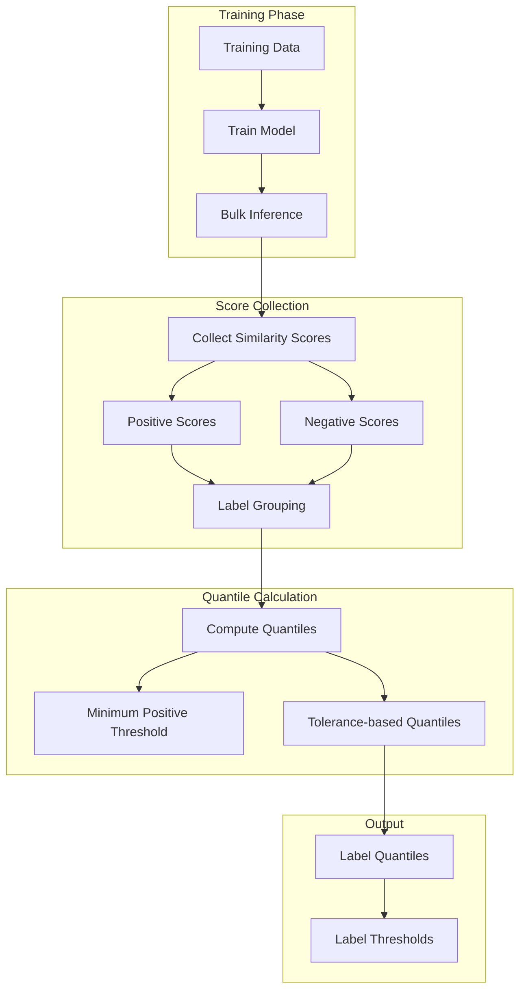
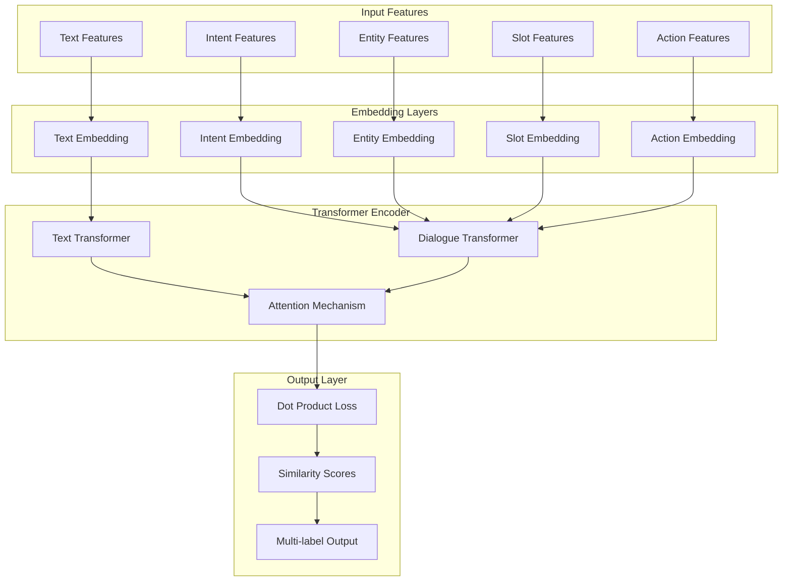

# UnexpecTED Intent Policy Module

## Introduction

The UnexpecTED Intent Policy is an advanced dialogue policy in Rasa that detects unlikely or unexpected user intents during conversations. Built on the same neural architecture as the TED (Transformer Embedding Dialogue) Policy, it repurposes the model to predict whether the last user intent is likely given the conversation context, rather than predicting the next action. This policy helps identify when users say something unexpected, enabling more robust conversation handling.

## Overview

The UnexpecTED Intent Policy (`UnexpecTEDIntentPolicy`) extends `TEDPolicy` to provide intent-level anomaly detection in conversational AI systems. It analyzes the conversation context and determines if the user's last intent is consistent with the patterns learned from training stories. When an unlikely intent is detected, the policy triggers a special `action_unlikely_intent` action, allowing the assistant to handle unexpected user inputs gracefully.

## Architecture

### Core Components



### System Integration



## Key Features

### 1. Intent Anomaly Detection
- Analyzes conversation context to detect unexpected user intents
- Uses learned patterns from training stories to determine intent likelihood
- Triggers `action_unlikely_intent` when suspicious patterns are detected

### 2. Adaptive Threshold System
- Computes per-intent thresholds during training based on tolerance settings
- Uses quantile-based approach to determine decision boundaries
- Supports configurable tolerance levels (0.0 to 1.0) for sensitivity control

### 3. Context-Aware Analysis
- Considers conversation history when evaluating intent likelihood
- Uses transformer-based architecture for context understanding
- Employs attention mechanisms for relevant context selection

### 4. Configurable Intent Filtering
- Allows ignoring specific intents from unlikely intent detection
- Supports intent-specific threshold adjustments
- Provides flexible configuration for domain-specific needs

## Data Flow



## Training Process

### 1. Data Preparation


### 2. Threshold Computation


## Configuration

### Default Configuration Parameters

| Parameter | Default Value | Description |
|-----------|---------------|-------------|
| `tolerance` | 0.0 | Tolerance for unlikely intent prediction (0.0-1.0) |
| `ignore_intents_list` | [] | List of intents to ignore from detection |
| `ranking_length` | 10 | Number of intents to include in ranking metadata |
| `policy_priority` | UNLIKELY_INTENT_POLICY_PRIORITY | Priority level for policy decisions |
| `hidden_layers_sizes` | {TEXT: []} | Hidden layer sizes for text features |
| `dense_dimension` | {...} | Dense dimensions for various features |
| `transformer_size` | {TEXT: 128, DIALOGUE: 128} | Transformer encoder dimensions |
| `epochs` | 1 | Number of training epochs |
| `batch_sizes` | [64, 256] | Batch size range for training |

### Key Configuration Options

1. **Tolerance Control**: Higher tolerance values make the policy more lenient, resulting in fewer unlikely intent triggers
2. **Intent Filtering**: Specific intents can be excluded from detection using `ignore_intents_list`
3. **Architecture Tuning**: Transformer and embedding dimensions can be adjusted for performance
4. **Training Parameters**: Batch sizes, epochs, and learning rates are configurable

## Model Architecture

### IntentTED Model Structure


## Integration with Rasa System

### Policy Ensemble Integration
The UnexpecTED Intent Policy integrates with the [Policy Ensemble](Policy%20Ensemble.md) system, providing specialized intent detection capabilities alongside other dialogue policies.

### Tracker Store Integration
Works with various [Tracker Store](Tracker%20Store.md) implementations to access conversation history and maintain state across interactions.

### NLU Pipeline Integration
Leverages the [NLU Pipeline](NLU%20Pipeline.md) for intent classification and entity extraction, using processed user inputs as the basis for likelihood analysis.

### Domain Integration
Utilizes the [Domain](Domain.md) system to understand available intents, actions, and conversation structure for context-aware predictions.

## Usage Patterns

### 1. Basic Configuration
```yaml
policies:
  - name: UnexpecTEDIntentPolicy
    tolerance: 0.1
    ignore_intents_list:
      - greet
      - goodbye
```

### 2. Advanced Configuration
```yaml
policies:
  - name: UnexpecTEDIntentPolicy
    tolerance: 0.2
    ranking_length: 5
    hidden_layers_sizes:
      text: [256, 128]
    transformer_size:
      text: 256
      dialogue: 256
    epochs: 5
    batch_sizes: [32, 128]
```

### 3. Handling Unlikely Intents
When the policy triggers `action_unlikely_intent`, the assistant can:
- Ask for clarification
- Provide helpful suggestions
- Transfer to human support
- Log the incident for analysis

## Performance Considerations

### 1. Training Efficiency
- Uses GPU acceleration when available (`use_gpu: true`)
- Implements batch size scheduling for optimal training
- Supports checkpointing for long training runs

### 2. Inference Speed
- Optimized model inference with TensorFlow backend
- Efficient tracker featurization with caching
- Minimal overhead in prediction pipeline

### 3. Memory Usage
- Configurable embedding dimensions for memory control
- Efficient data structures for threshold storage
- Optimized feature representation

## Error Handling

### 1. Training Errors
- Validates tracker compatibility before training
- Handles missing intents in domain gracefully
- Provides detailed error messages for debugging

### 2. Prediction Errors
- Skips prediction when tracker state is invalid
- Handles missing model gracefully
- Provides fallback to default predictions

### 3. Model Persistence
- Robust model saving and loading with SafeTensors
- Handles corrupted model files gracefully
- Maintains backward compatibility

## Monitoring and Debugging

### 1. Logging
- Detailed debug logs for prediction decisions
- Threshold computation logging
- Intent ranking information

### 2. Metadata Output
- Comprehensive action metadata with similarity scores
- Ranking of likely intents
- Severity calculations for unlikely intents

### 3. TensorBoard Integration
- Training metrics visualization
- Validation accuracy tracking
- Loss function monitoring

## Best Practices

### 1. Training Data
- Ensure diverse conversation patterns in training stories
- Include both expected and edge case scenarios
- Maintain balanced representation of different conversation paths

### 2. Tuning
- Start with low tolerance values and increase gradually
- Monitor false positive rates in production
- Adjust ignore_intents_list based on domain requirements

### 3. Integration
- Combine with other policies for comprehensive coverage
- Use metadata for detailed analysis
- Implement appropriate fallback strategies

## Dependencies

### Core Dependencies
- [TED Policy](TED%20Policy.md): Base architecture and training logic
- [Tracker Featurizers](Core%20Featurization.md): Conversation state representation
- [TensorFlow Model Components](TensorFlow%20Model%20Components.md): Neural network backend
- [Dialogue Policies](Dialogue%20Policies.md): Policy framework integration

### Supporting Components
- [Dialogue State Tracker](Dialogue%20Management%20Core.md): Conversation state management
- [Domain](Domain.md): Intent and action definitions
- [NLU Training Data](Domain%20&%20Training%20Data.md): Intent classification data

## Future Enhancements

### 1. Advanced Threshold Mechanisms
- Dynamic threshold adjustment based on conversation context
- Intent-specific threshold learning
- User behavior adaptation

### 2. Enhanced Model Architecture
- Multi-modal intent understanding
- Contextual embedding improvements
- Attention mechanism enhancements

### 3. Production Features
- Real-time threshold updates
- A/B testing support
- Advanced monitoring and alerting

## Conclusion

The UnexpecTED Intent Policy provides a sophisticated approach to handling unexpected user inputs in conversational AI systems. By leveraging the proven TED architecture and adapting it for intent-level anomaly detection, it offers a robust solution for improving conversation quality and user experience. The policy's configurable thresholds, comprehensive metadata, and integration with the Rasa ecosystem make it a valuable tool for building more resilient conversational assistants.