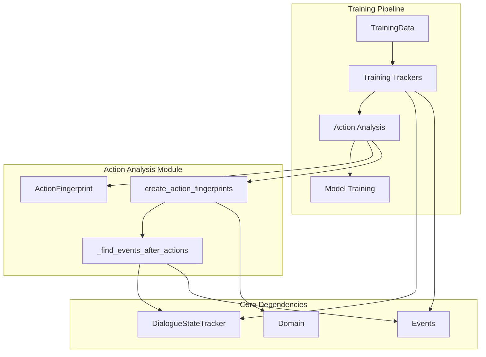
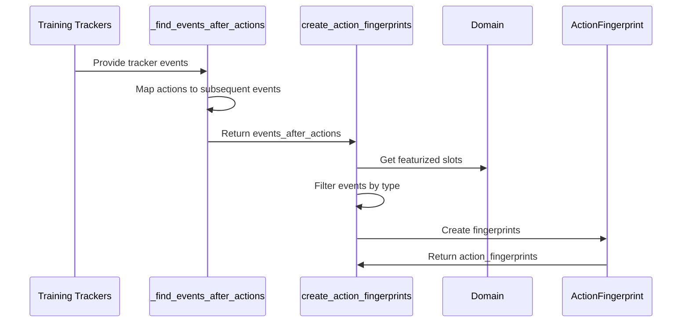
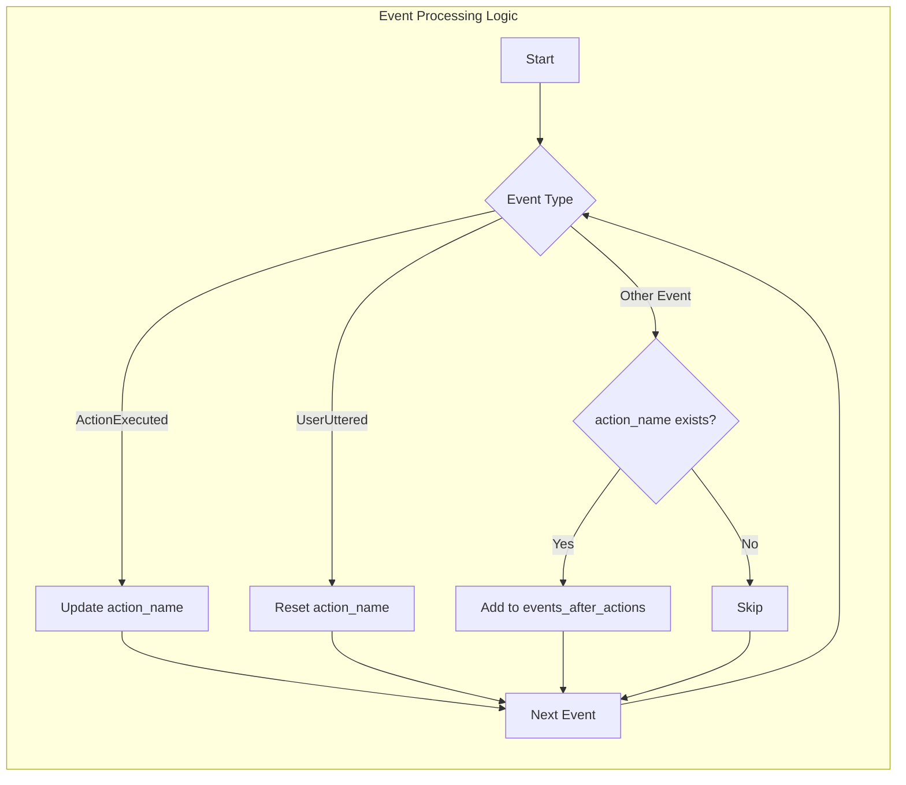
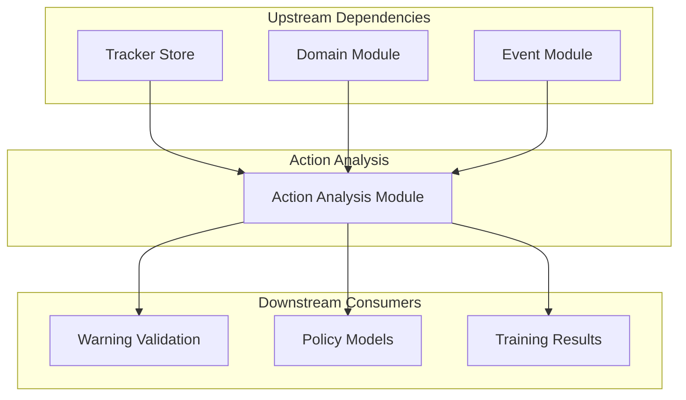
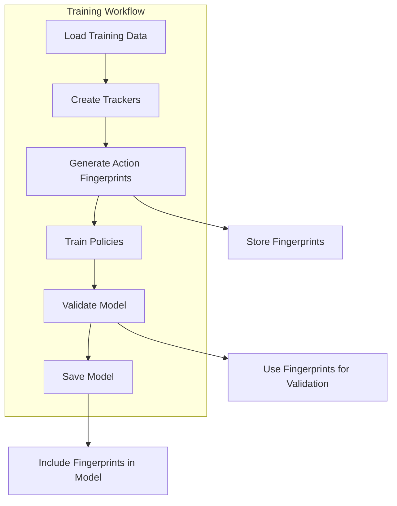
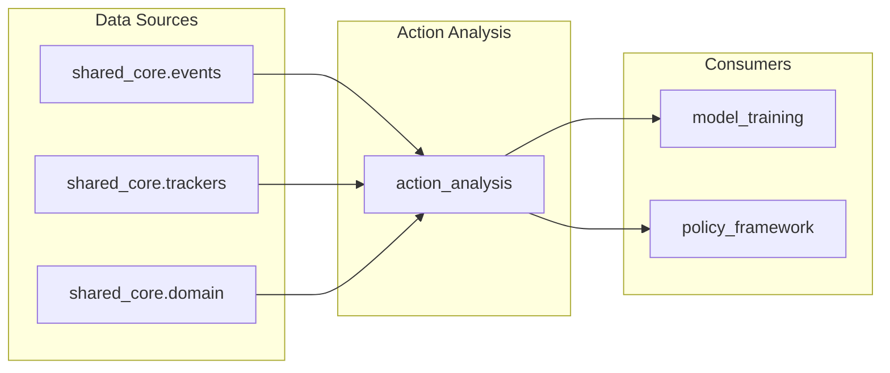

# Action Analysis Module Documentation

## Introduction

The action_analysis module is a critical component of Rasa's training framework that analyzes and fingerprints actions based on their behavior during training. This module provides essential functionality for understanding what effects each action has on the dialogue state, enabling runtime validation and warning systems to detect when actions behave differently than expected.

The module's primary purpose is to create "fingerprints" of actions by tracking the events they generate during training, particularly focusing on slot modifications and active loop changes. These fingerprints serve as a reference for detecting anomalies and ensuring model consistency during inference.

## Architecture Overview

### Core Components

The action_analysis module consists of two main components:

1. **ActionFingerprint**: A data class that encapsulates the signature of an action's effects
2. **create_action_fingerprints**: A function that analyzes training data to generate fingerprints for all actions

### Module Position in System Architecture



## Component Details

### ActionFingerprint Data Class

The `ActionFingerprint` is a lightweight dataclass that captures the essential characteristics of an action's behavior:

```python
@dataclasses.dataclass
class ActionFingerprint:
    """Dataclass to represent an action fingerprint."""
    slots: List[Text]          # Slots that the action modifies
    active_loop: List[Optional[Text]]  # Active loops that the action influences
```

**Key Characteristics:**
- **Immutable**: Uses dataclasses for immutability and hashability
- **Focused**: Only tracks featurized slots and active loops
- **Lightweight**: Minimal memory footprint for efficient storage

### Action Fingerprinting Process



### Event Analysis Algorithm

The core algorithm `_find_events_after_actions` implements a sophisticated event tracking mechanism:

1. **Sequential Processing**: Iterates through each tracker's event sequence
2. **Action Context Tracking**: Maintains the current action context
3. **Event Attribution**: Associates events with the preceding action
4. **Special Handling**: Treats UserUttered events as context reset points



## Data Flow and Dependencies

### Input Dependencies

The module requires three primary inputs:

1. **DialogueStateTracker instances**: Contain the training conversation histories
2. **Domain object**: Provides slot configuration and featurization information
3. **Event stream**: The sequence of events that occurred during training

### Output Generation

The module produces a comprehensive mapping:

```python
Dict[Text, ActionFingerprint]
```

Where each key is an action name/text and the value is its corresponding fingerprint.

### Integration Points



## Key Features and Capabilities

### 1. Action Behavior Profiling

The module creates comprehensive profiles of each action's side effects:
- **Slot Modifications**: Tracks which slots are set by each action
- **Loop Interactions**: Monitors active loop changes
- **Featurization Awareness**: Only considers slots that affect model features

### 2. Training Consistency Validation

By creating fingerprints during training, the system can:
- **Detect Anomalies**: Identify when actions behave differently at runtime
- **Emit Warnings**: Alert developers about unexpected action behavior
- **Validate Rules**: Ensure rule-based policies are complete and consistent

### 3. Efficient Event Processing

The implementation includes several optimizations:
- **Set Operations**: Uses set intersections for efficient filtering
- **DefaultDict**: Leverages defaultdict for automatic key creation
- **Single Pass**: Processes all trackers in a single iteration

## Error Handling and Edge Cases

### Special Event Handling

The module implements specific logic for edge cases:

1. **UserUttered Events**: Reset the action context to prevent attributing entity-extracted slots to action_listen
2. **Missing Action Names**: Gracefully handles actions without explicit names
3. **Empty Trackers**: Returns empty dictionaries when no relevant events are found

### Data Validation

The module includes implicit validation:
- **Type Checking**: Uses isinstance checks for event type identification
- **Intersection Logic**: Only includes slots that are both modified AND featurized
- **Deduplication**: Uses set operations to eliminate duplicate entries

## Performance Considerations

### Time Complexity

- **O(n × m)**: Where n is the number of trackers and m is the average number of events per tracker
- **Linear Scaling**: Processing time increases linearly with training data size

### Memory Efficiency

- **Set-Based Operations**: Minimizes memory usage through efficient data structures
- **Streaming Processing**: Processes events without loading entire datasets into memory
- **Compact Output**: Fingerprints contain only essential information

## Integration with Training Pipeline

### Training Phase Integration



### Runtime Validation

During inference, the fingerprints enable:
- **Behavior Monitoring**: Compare actual action effects with expected fingerprints
- **Warning Generation**: Alert when actions deviate from training behavior
- **Model Debugging**: Help identify sources of unexpected behavior

## Relationship to Other Modules

### Core Dependencies

- **[shared_core](shared_core.md)**: Utilizes events, domain, and tracker components
- **[model_training](model_training.md)**: Integrates with the broader training framework
- **[policy_framework](policy_framework.md)**: Provides validation data for policy decisions

### Data Flow Connections



## Best Practices and Usage Guidelines

### 1. Training Data Quality

- Ensure training conversations represent expected runtime behavior
- Include diverse scenarios to create comprehensive fingerprints
- Validate that featurized slots are properly configured

### 2. Fingerprint Interpretation

- Empty fingerprints indicate actions with no side effects
- Multiple slots suggest complex action behavior
- Active loop changes indicate form or loop interactions

### 3. Runtime Monitoring

- Monitor warning frequency to detect model drift
- Investigate actions that frequently deviate from fingerprints
- Use fingerprints for debugging unexpected behavior

## Future Enhancements

### Potential Improvements

1. **Extended Event Tracking**: Include more event types in fingerprints
2. **Temporal Analysis**: Track timing patterns of action effects
3. **Confidence Scoring**: Add confidence levels to fingerprint predictions
4. **Incremental Updates**: Support online fingerprint updates

### Scalability Considerations

- Implement parallel processing for large training datasets
- Add caching mechanisms for frequently accessed fingerprints
- Optimize memory usage for models with many actions

## Conclusion

The action_analysis module serves as a crucial bridge between training and inference in the Rasa system. By creating detailed fingerprints of action behavior, it enables robust validation, debugging, and monitoring capabilities that enhance the reliability and maintainability of conversational AI models. Its lightweight design and efficient algorithms make it suitable for production deployments while providing valuable insights into model behavior.