# Action Base Module Documentation

## Introduction

The action_base module serves as the foundational framework for Rasa's action system, providing the core abstractions and implementations that enable conversational AI agents to execute responses and interact with external services. This module defines the base `Action` class and its various implementations, forming the backbone of Rasa's dialogue management capabilities.

The action system is responsible for translating policy predictions into concrete operations that affect the conversation state, generate bot responses, and interact with external systems through custom actions. It provides a flexible architecture that supports everything from simple bot utterances to complex form-based interactions and external API calls.

## Architecture Overview

### Core Components

The action_base module is built around several key components that work together to provide a comprehensive action execution framework:

```mermaid
graph TB
    subgraph "Action Base Module"
        A[Action<br/>Abstract Base Class]
        B[ActionBotResponse<br/>Bot Response Actions]
        C[RemoteAction<br/>Custom Actions]
        D[ActionRetrieveResponse<br/>Response Selector]
        E[ActionEndToEndResponse<br/>End-to-End Actions]
    end
    
    subgraph "Default Actions"
        F[ActionListen]
        G[ActionRestart]
        H[ActionSessionStart]
        I[ActionDefaultFallback]
        J[ActionExtractSlots]
        K[ActionBack]
        L[ActionDeactivateLoop]
    end
    
    subgraph "Fallback Actions"
        M[ActionDefaultAskAffirmation]
        N[ActionDefaultAskRephrase]
        O[ActionRevertFallbackEvents]
        P[ActionUnlikelyIntent]
    end
    
    A --> B
    A --> C
    A --> D
    A --> E
    
    A --> F
    A --> G
    A --> H
    A --> I
    A --> J
    A --> K
    A --> L
    
    A --> M
    A --> N
    A --> O
    A --> P
```

### Module Dependencies

The action_base module integrates with several other Rasa modules to provide its functionality:

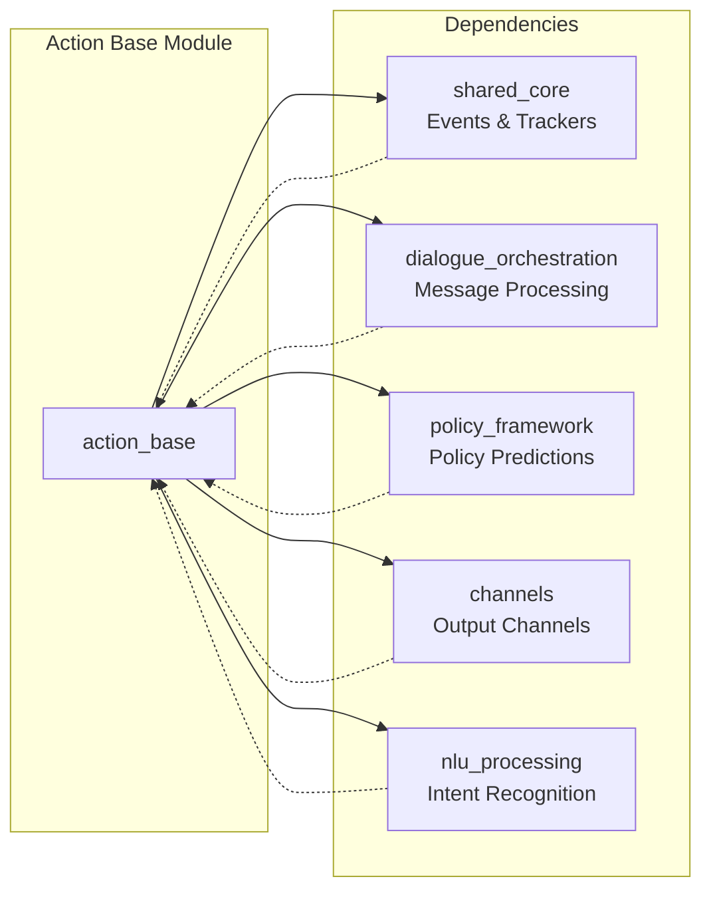

## Component Details

### Action Abstract Base Class

The `Action` class serves as the foundation for all action implementations in Rasa. It defines the contract that every action must fulfill, ensuring consistency across the action system.

**Key Responsibilities:**
- Define the action's unique identifier through the `name()` method
- Execute the action's side effects via the `run()` method
- Generate appropriate events for successful execution tracking
- Provide string representation for debugging and logging

**Integration Points:**
- Works with [DialogueStateTracker](shared_core.md) to access conversation state
- Utilizes [OutputChannel](channels.md) for sending messages to users
- Leverages [NaturalLanguageGenerator](shared_core.md) for response generation
- Returns [Event](shared_core.md) instances to update conversation state

### ActionBotResponse

This implementation handles the most common type of action: bot responses. It generates messages based on predefined response templates and sends them to the user through the appropriate channel.

**Key Features:**
- Template-based response generation
- Support for rich message elements (buttons, quick replies, images)
- Silent failure mode for optional responses
- Integration with domain response definitions

**Message Structure:**
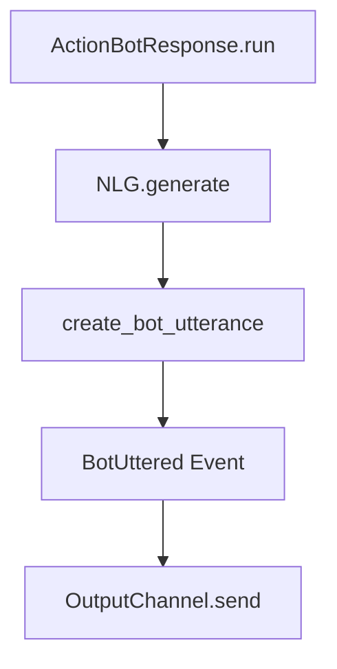

### RemoteAction

The `RemoteAction` class enables integration with external action servers, allowing developers to implement custom business logic outside of Rasa Core. This is the primary mechanism for connecting Rasa to external APIs and databases.

**Communication Flow:**
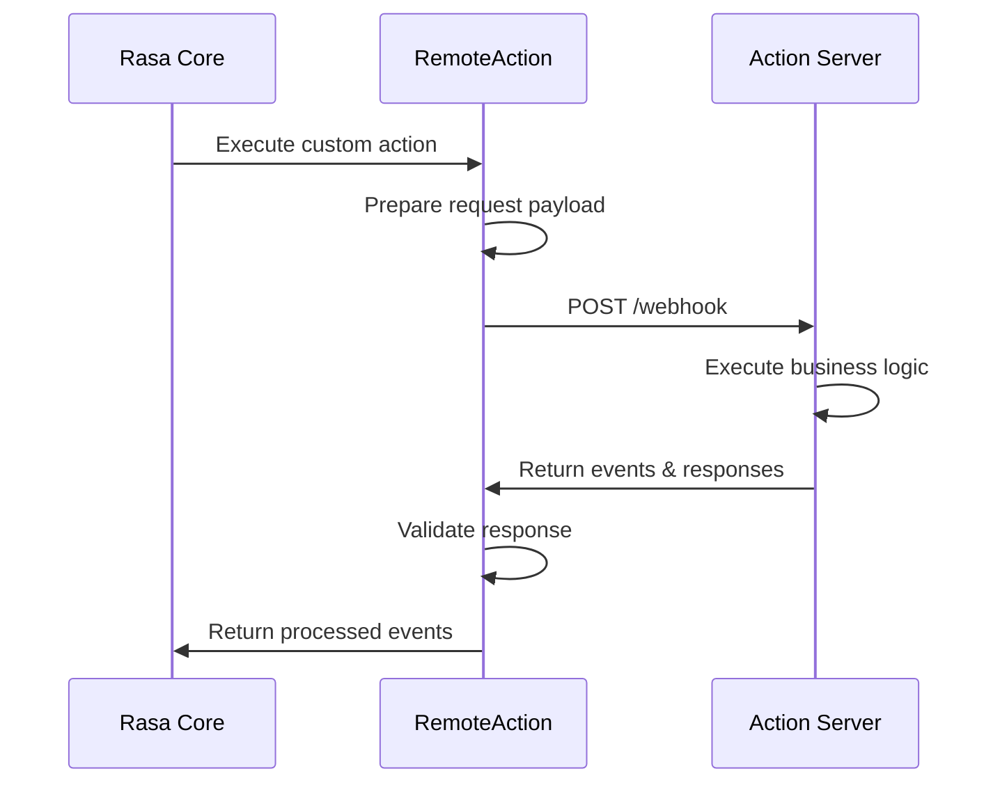

**Request Format:**
- `next_action`: Name of the action to execute
- `sender_id`: User identifier
- `tracker`: Complete conversation state
- `domain`: Bot domain configuration (optional)
- `version`: Rasa version information

**Response Handling:**
- Validates response against JSON schema
- Processes returned events and responses
- Handles error conditions and connection issues
- Supports response compression for large payloads

### ActionRetrieveResponse

This specialized action works with Rasa's Response Selector to provide contextually appropriate responses based on the user's intent and the conversation history.

**Selection Process:**
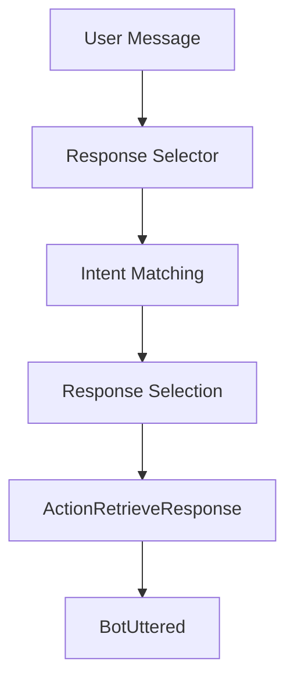

### Default Actions

The module provides a comprehensive set of default actions that handle common conversation management tasks:

#### ActionListen
- **Purpose**: Wait for user input
- **Usage**: Pauses the conversation flow until the user provides input
- **Events**: None (action completion only)

#### ActionRestart
- **Purpose**: Reset conversation state
- **Usage**: Clear conversation history and start fresh
- **Events**: `Restarted()`, optional `BotUttered`

#### ActionSessionStart
- **Purpose**: Initialize new conversation session
- **Usage**: Handle session management and slot carryover
- **Events**: `SessionStarted()`, `SlotSet` (if carryover enabled), `ActionExecuted(ACTION_LISTEN_NAME)`

#### ActionDefaultFallback
- **Purpose**: Handle unrecognized user input
- **Usage**: Provide fallback response when NLU confidence is low
- **Events**: `BotUttered`, `UserUtteranceReverted`

#### ActionExtractSlots
- **Purpose**: Extract slot values from user messages
- **Usage**: Automatically populate slots based on mappings
- **Events**: Multiple `SlotSet` events

**Slot Extraction Process:**
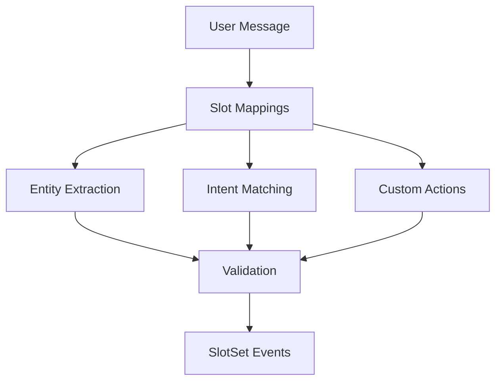

## Data Flow

### Action Execution Pipeline

The action execution follows a well-defined pipeline that ensures proper integration with Rasa's dialogue management system:

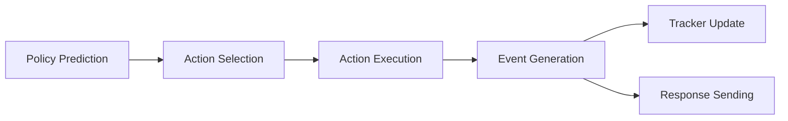

### Event Processing

Actions generate events that update the conversation state and trigger subsequent processing:

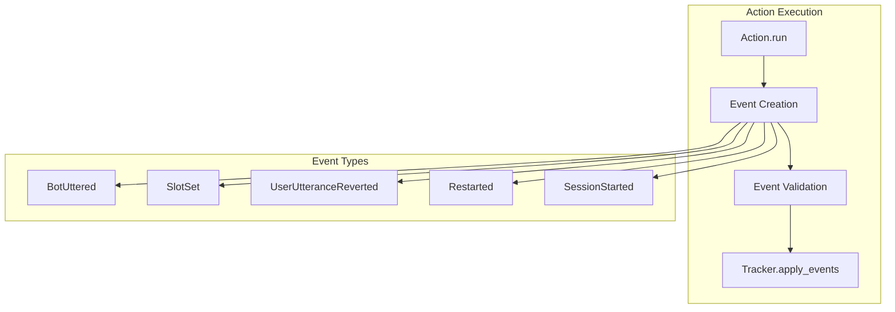

## Integration with Other Modules

### Policy Framework Integration

The action_base module works closely with the [policy_framework](policy_framework.md) to translate policy predictions into executable actions:

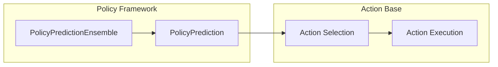

### Message Processing Integration

Actions are executed within the context of [message_processing](dialogue_orchestration.md#message-processing), ensuring proper coordination with the overall dialogue flow:

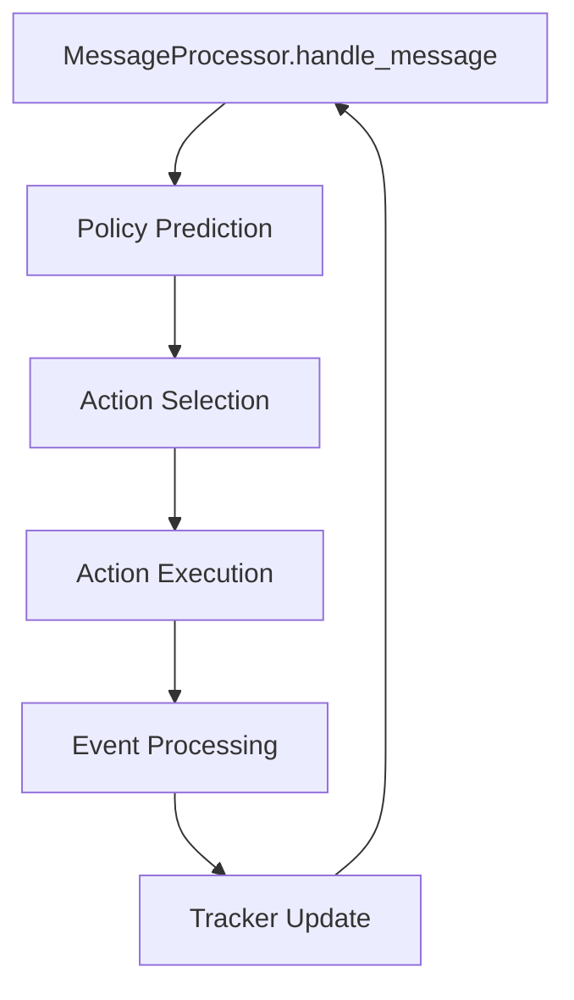

### Channel Integration

The module integrates with [channels](channels.md) to ensure actions can send responses through the appropriate communication channels:

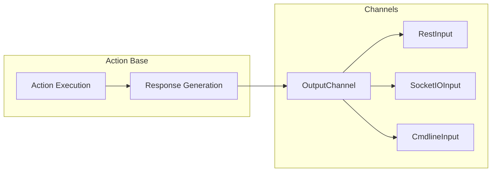

## Error Handling

The action_base module implements comprehensive error handling to ensure robust operation:

### Action Execution Errors

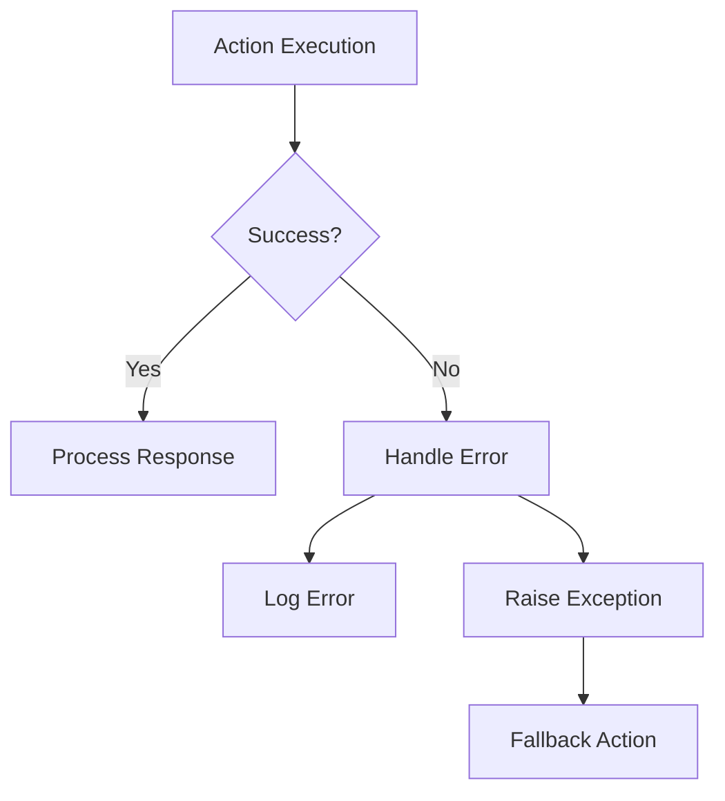

### Validation and Schema Checking

All action responses are validated against predefined schemas to ensure data integrity:

- **Event Schema**: Validates event structure and required fields
- **Response Schema**: Ensures response format compliance
- **Custom Action Validation**: Validates custom action responses
- **Error Message Propagation**: Provides meaningful error messages for debugging

## Configuration and Customization

### Action Endpoint Configuration

Remote actions require proper endpoint configuration:

```yaml
action_endpoint:
  url: "http://localhost:5055/webhook"
  token: "your_token"
  retry: 3
  timeout: 30
```

### Selective Domain Support

The module supports selective domain passing to optimize performance:

- **Default Behavior**: Domain is included in all requests
- **Selective Mode**: Domain only included when explicitly required
- **Configuration**: Controlled via `SELECTIVE_DOMAIN` parameter

### Response Compression

Large action requests can be compressed to improve performance:

- **Environment Variable**: `COMPRESS_ACTION_SERVER_REQUEST`
- **Default**: Enabled for better performance
- **Compression**: Uses gzip compression for JSON payloads

## Best Practices

### Action Implementation

1. **Keep Actions Focused**: Each action should have a single, well-defined purpose
2. **Handle Errors Gracefully**: Implement proper error handling and user feedback
3. **Use Appropriate Events**: Choose the right event types for state changes
4. **Validate Inputs**: Ensure all inputs are properly validated before processing
5. **Log Appropriately**: Use appropriate logging levels for debugging and monitoring

### Performance Optimization

1. **Minimize External Calls**: Reduce dependencies on external services
2. **Cache Responses**: Cache frequently used data when appropriate
3. **Use Selective Domain**: Enable selective domain passing to reduce payload size
4. **Implement Timeouts**: Set appropriate timeouts for external service calls
5. **Monitor Performance**: Track action execution times and optimize bottlenecks

### Security Considerations

1. **Validate All Inputs**: Sanitize all user inputs before processing
2. **Secure Endpoints**: Use authentication and encryption for action servers
3. **Limit Exposure**: Only expose necessary data in action requests
4. **Audit Logging**: Implement comprehensive audit logging for security events
5. **Error Handling**: Avoid exposing sensitive information in error messages

## Testing and Debugging

### Unit Testing

The module provides comprehensive testing capabilities:

```python
# Example test structure
async def test_action_execution():
    action = ActionBotResponse("utter_greet")
    events = await action.run(
        output_channel=MockOutputChannel(),
        nlg=MockNLG(),
        tracker=MockTracker(),
        domain=MockDomain()
    )
    assert len(events) == 1
    assert isinstance(events[0], BotUttered)
```

### Debugging Tools

- **Action Logging**: Comprehensive logging of action execution
- **Event Tracking**: Detailed event generation and processing logs
- **Error Reporting**: Detailed error messages with context
- **Performance Metrics**: Execution time tracking and reporting

## Future Enhancements

The action_base module is designed to be extensible and supports future enhancements:

1. **Plugin Architecture**: Support for custom action plugins
2. **Async Improvements**: Enhanced async/await support for better performance
3. **Streaming Support**: Support for streaming responses
4. **Multi-modal Actions**: Support for rich media and multi-modal interactions
5. **AI-powered Actions**: Integration with ML models for dynamic action generation

## References

- [Dialogue Orchestration](dialogue_orchestration.md) - Message processing and agent management
- [Policy Framework](policy_framework.md) - Policy prediction and ensemble management
- [Shared Core](shared_core.md) - Events, trackers, and domain management
- [Channels](channels.md) - Input/output channel implementations
- [NLU Processing](nlu_processing.md) - Intent recognition and entity extraction