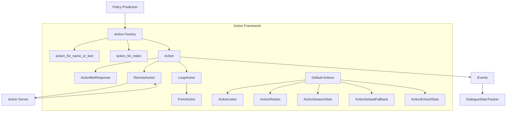
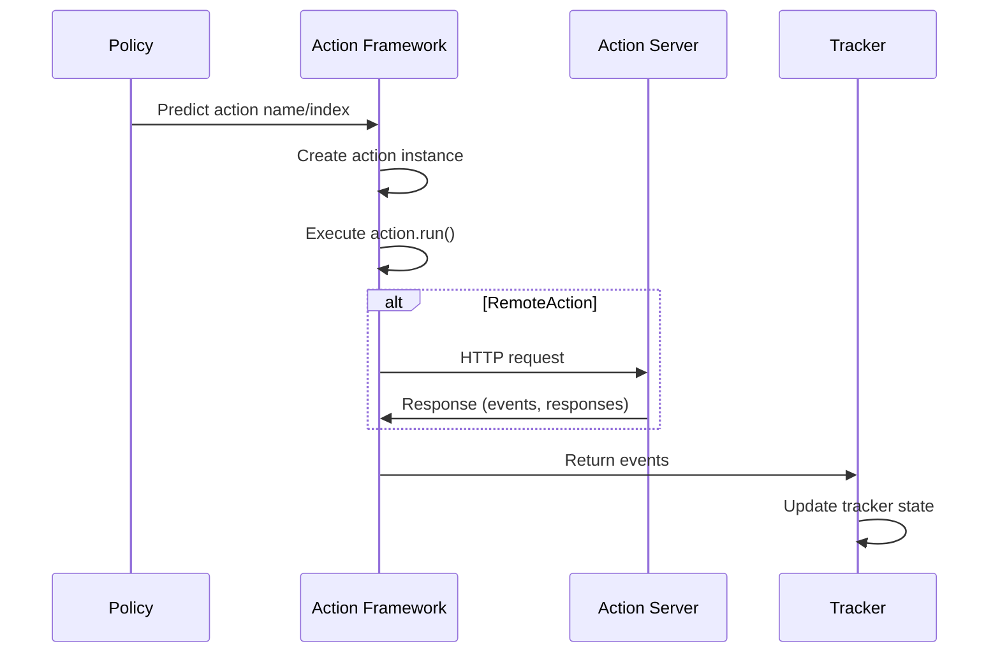

# Action Framework Documentation

## Overview

The Action Framework is a core component of the Rasa Core dialogue system responsible for executing actions in response to dialogue states. It provides a flexible and extensible architecture for handling various types of actions, from simple bot responses to complex form-based interactions and custom business logic.

## Purpose

The Action Framework serves as the execution layer of the Rasa dialogue system, bridging the gap between policy decisions (what action to take) and actual system behavior (how to execute that action). It handles:

- **Action Execution**: Running different types of actions based on policy predictions
- **Event Generation**: Creating appropriate events that update the dialogue state
- **Response Generation**: Managing bot responses and user interactions
- **Form Handling**: Orchestrating complex multi-turn form-based conversations
- **Custom Action Integration**: Connecting to external action servers for custom business logic

## Architecture



## Core Components

### 1. Action Base Classes ([action_base.md](action_base.md))
The foundation classes that define the action interface and common functionality:
- **Action**: Abstract base class for all actions
- **ActionBotResponse**: For simple bot utterances  
- **RemoteAction**: For custom actions executed on external servers

### 2. Loop Actions ([loops.md](loops.md))
Base class and utilities for actions that span multiple conversation turns, providing lifecycle management for complex interactions.

### 3. Form Actions ([forms.md](forms.md))
Specialized loop actions for handling complex form-based conversations with slot filling, validation, and dynamic slot requests.

### 4. Default Actions
A set of built-in actions that provide core functionality:
- `action_listen`: Wait for user input
- `action_restart`: Reset the conversation
- `action_session_start`: Start a new session
- `action_default_fallback`: Handle unrecognized input
- `action_extract_slots`: Extract slot values from user messages

### 5. Action Factory
Utility functions for creating appropriate action instances based on action names or indices.

## Data Flow



## Integration with Other Modules

### Dialogue Orchestration
The Action Framework integrates closely with the [dialogue_orchestration](dialogue_orchestration.md) module:
- Receives action predictions from the policy framework
- Executes actions and returns events to update dialogue state
- Works with the MessageProcessor to handle complete conversation turns

### Policy Framework
Actions are selected by the [policy_framework](policy_framework.md) based on dialogue context and trained models. The policy framework determines which action should be executed, and the Action Framework handles the execution.

### Shared Core
Uses [shared_core](shared_core.md) components for:
- Domain validation and action availability
- Event creation and management
- Tracker state updates
- Slot management and validation

## Key Features

### 1. Extensibility
The framework is designed to be easily extensible. Developers can create custom actions by:
- Implementing the Action interface
- Using RemoteAction to connect to external services
- Extending existing action types

### 2. Form Support
Complex multi-turn conversations are handled through [FormAction](forms.md), which provides:
- Slot filling orchestration
- Validation support
- Dynamic slot requests
- Custom validation actions

### 3. Response Generation
Flexible response generation through:
- Template-based responses
- Retrieval-based responses
- End-to-end response generation
- Custom response formatting

### 4. Error Handling
Comprehensive error handling for:
- Action server connectivity issues
- Invalid action responses
- Execution rejections
- Fallback mechanisms

## Usage Examples

### Creating a Custom Action
```python
from rasa.core.actions.action import Action
from rasa.shared.core.events import SlotSet

class CustomAction(Action):
    def name(self):
        return "custom_action_name"
    
    async def run(self, output_channel, nlg, tracker, domain):
        # Custom logic here
        return [SlotSet("slot_name", "value")]
```

### Using Remote Actions
Actions can be executed on external servers by configuring an action endpoint:
```yaml
actions:
- custom_action_name
```

The Action Framework will automatically route these to the configured action server.

## Configuration

The Action Framework is configured through:
- Domain configuration (available actions)
- Endpoint configuration (action server URL)
- Action server configuration (custom action implementations)

## Error Handling

The framework includes several error handling mechanisms:
- **ActionExecutionRejection**: Allows actions to reject execution and let other policies try
- **Fallback actions**: Default actions for handling errors
- **Validation**: Response validation from action servers
- **Connection handling**: Robust handling of action server connectivity issues

## Performance Considerations

- Actions are instantiated on-demand to minimize memory usage
- Remote actions support request compression for large payloads
- Validation is performed to prevent invalid state updates
- Efficient event batching for tracker updates

## Related Documentation

- [Dialogue Orchestration](dialogue_orchestration.md) - For understanding how actions fit into the overall dialogue flow
- [Policy Framework](policy_framework.md) - For understanding how actions are selected
- [Shared Core](shared_core.md) - For understanding events, trackers, and domain concepts
- [Form Actions](forms.md) - Detailed documentation on form-based interactions