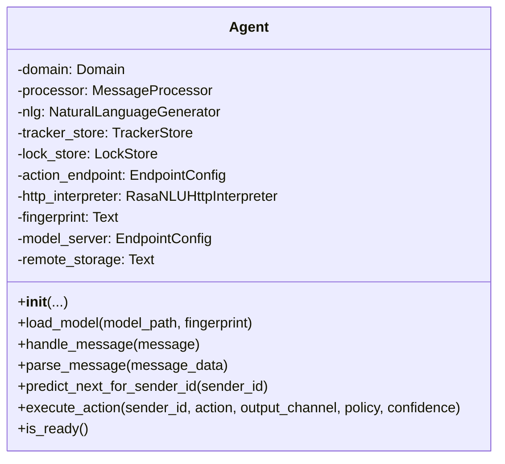
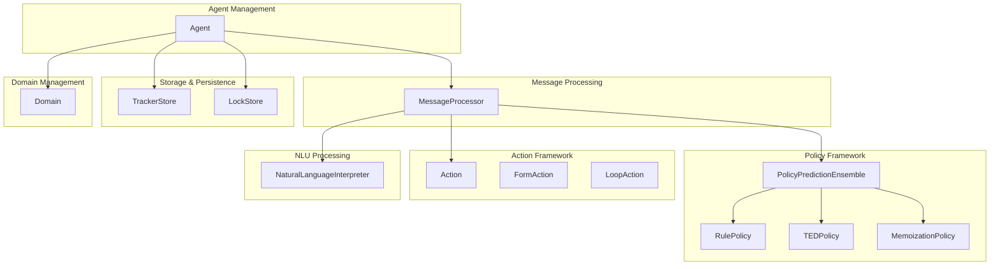
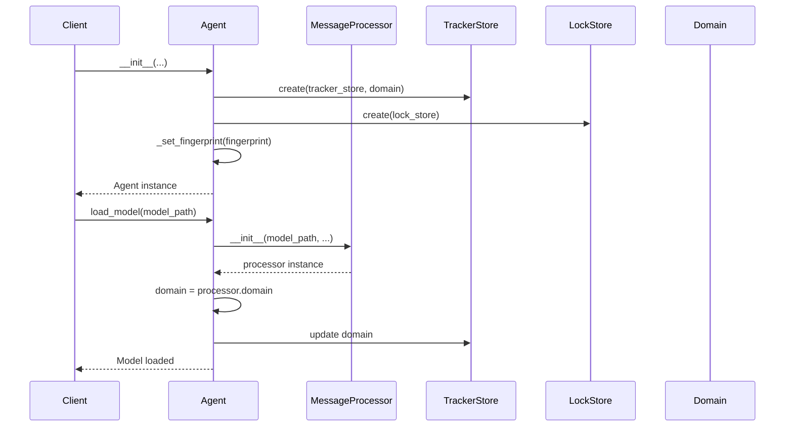
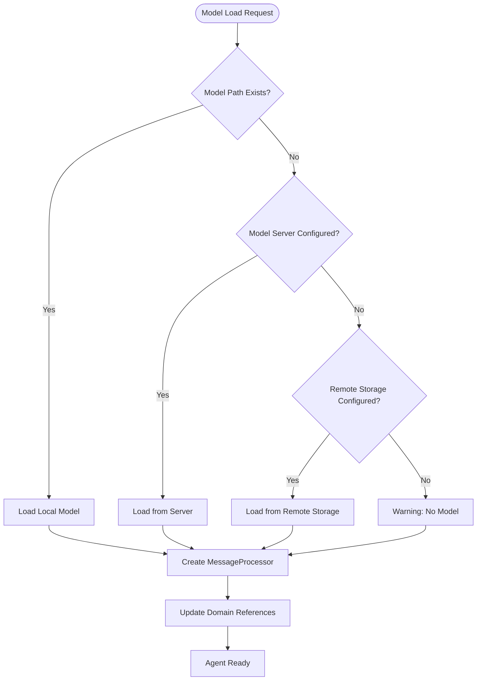
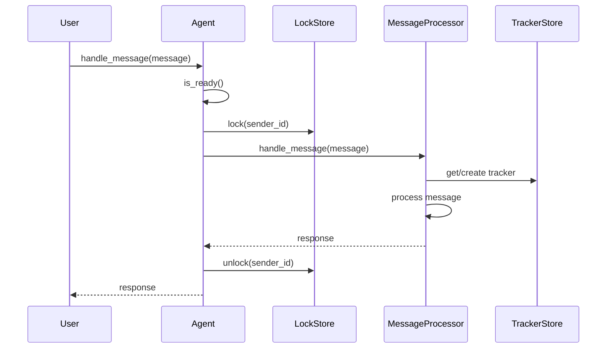
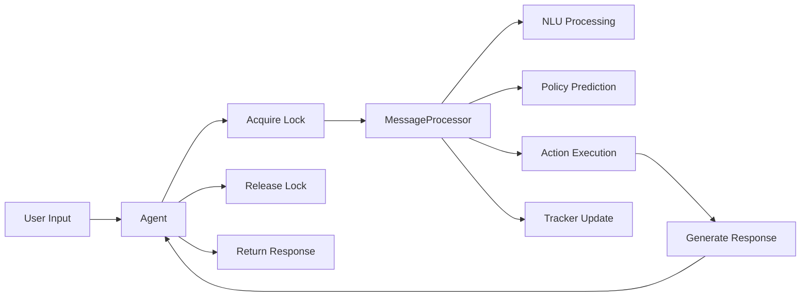
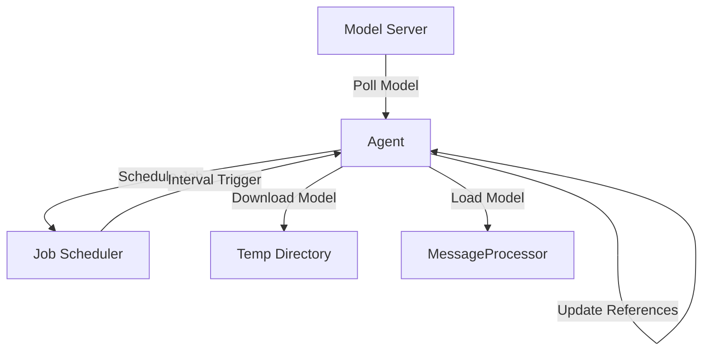
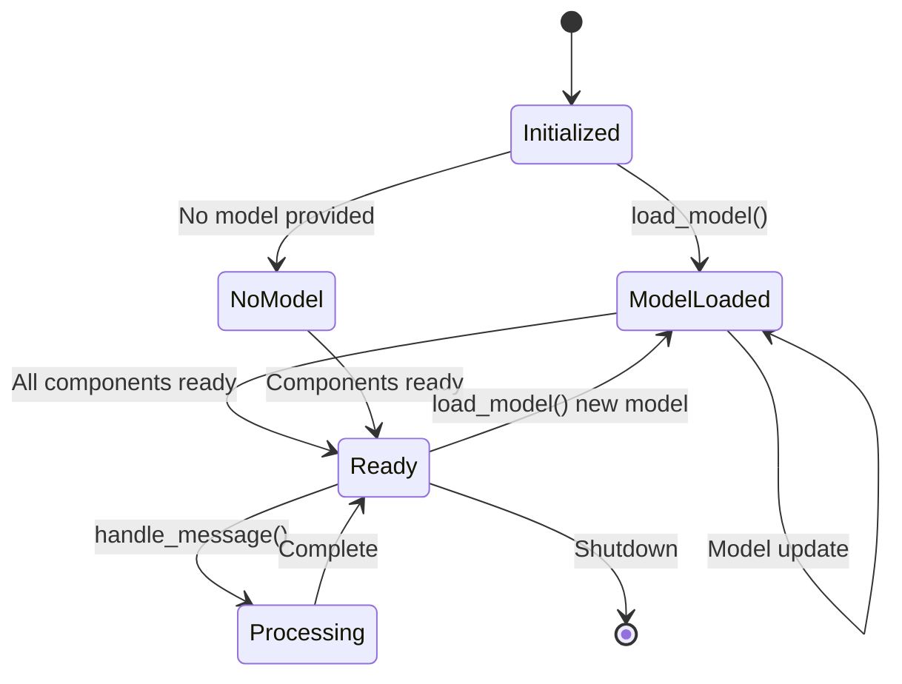

# Agent Management Module

## Introduction

The agent_management module serves as the central orchestrator for Rasa's conversational AI system, providing the primary interface for loading, managing, and interacting with trained dialogue models. This module implements the core `Agent` class that acts as the main entry point for all conversational AI operations, from handling user messages to executing actions and managing model lifecycle.

## Core Architecture

### Agent Class Architecture

The `Agent` class is the cornerstone of the Rasa system, encapsulating all necessary components for conversational AI operations:



### System Integration

The Agent integrates with multiple system components to provide comprehensive conversational AI capabilities:



## Component Relationships

### Agent Initialization and Dependencies



### Model Loading Flow



## Key Functionalities

### 1. Model Management

The Agent provides comprehensive model management capabilities:

- **Local Model Loading**: Load models from local filesystem
- **Remote Model Loading**: Fetch models from remote storage (S3, GCS, etc.)
- **Server-based Model Loading**: Continuously pull models from model servers
- **Model Fingerprinting**: Track model versions and updates

### 2. Message Handling

The Agent serves as the primary interface for message processing:



### 3. Action Execution

The Agent coordinates action execution across the system:

- **Direct Action Execution**: Execute specific actions for users
- **Policy-based Action Selection**: Use policy predictions for next actions
- **External Intent Triggering**: Trigger intents from external events

## Data Flow Architecture

### Message Processing Pipeline



### Model Update Flow



## Integration Points

### With Message Processing Module

The Agent delegates all message processing to the [MessageProcessor](message_processing.md), which handles:
- Natural language understanding
- Dialogue state tracking
- Policy prediction
- Action execution

### With Policy Framework

The Agent integrates with the [policy framework](policy_framework.md) through the MessageProcessor:
- Rule-based policies for predictable behavior
- Machine learning policies for complex scenarios
- Ensemble methods for optimal predictions

### With Action Framework

The Agent coordinates with the [action framework](action_framework.md) to:
- Execute custom actions
- Handle form-based conversations
- Manage conversation loops

### With Storage Systems

The Agent manages persistent storage through:
- [Tracker stores](storage_persistence.md) for conversation history
- Lock stores for concurrent access control
- Model storage for model persistence

## Configuration and Lifecycle

### Agent Configuration

The Agent supports multiple configuration options:

```python
# Core components
domain: Domain                    # Conversation domain
tracker_store: TrackerStore       # Conversation storage
lock_store: LockStore             # Concurrency control
action_endpoint: EndpointConfig   # Custom action server

# Model management
model_server: EndpointConfig      # Model server configuration
remote_storage: Text              # Remote storage identifier
fingerprint: Text                 # Model version tracking

# NLU integration
http_interpreter: RasaNLUHttpInterpreter  # NLU server
```

### Agent States



## Error Handling and Resilience

### Model Loading Failures

The Agent implements robust error handling for model loading:
- Graceful fallback to existing models
- Detailed logging for debugging
- Exception handling for network issues
- Model validation before deployment

### Runtime Error Handling

- **Agent Not Ready**: Decorator pattern ensures agent readiness
- **Lock Acquisition**: Timeout and retry mechanisms
- **Model Updates**: Background updates without service interruption
- **Storage Failures**: Fail-safe tracker store implementation

## Performance Considerations

### Concurrency Management

- **Lock-based Concurrency**: Per-sender ID locking prevents race conditions
- **Async Operations**: Non-blocking I/O for model updates
- **Resource Pooling**: Efficient connection and session management

### Memory Management

- **Lazy Loading**: Components initialized only when needed
- **Model Caching**: Efficient model storage and retrieval
- **Temporary Resources**: Automatic cleanup of temporary directories

## Best Practices

### Model Management

1. **Use Model Servers**: Enable hot model updates without service restart
2. **Implement Health Checks**: Monitor agent readiness status
3. **Version Tracking**: Use fingerprints to track model versions
4. **Backup Models**: Maintain fallback models for resilience

### Performance Optimization

1. **Configure Appropriate Stores**: Choose tracker and lock stores based on scale
2. **Async Operations**: Leverage async methods for better throughput
3. **Resource Limits**: Set appropriate timeouts and retry limits
4. **Monitoring**: Implement comprehensive logging and metrics

## Dependencies

The agent_management module depends on:

- **[message_processing](message_processing.md)**: Core message processing functionality
- **[policy_framework](policy_framework.md)**: Dialogue policy management
- **[action_framework](action_framework.md)**: Action execution framework
- **[storage_persistence](storage_persistence.md)**: Data persistence layer
- **[shared_core](shared_core.md)**: Core domain and event definitions
- **[channels](channels.md)**: Input/output channel management

## Related Documentation

- [Dialogue Orchestration](dialogue_orchestration.md) - Higher-level orchestration
- [Message Processing](message_processing.md) - Detailed message handling
- [Policy Framework](policy_framework.md) - Policy prediction and management
- [Action Framework](action_framework.md) - Action execution details
- [Storage and Persistence](storage_persistence.md) - Data storage options