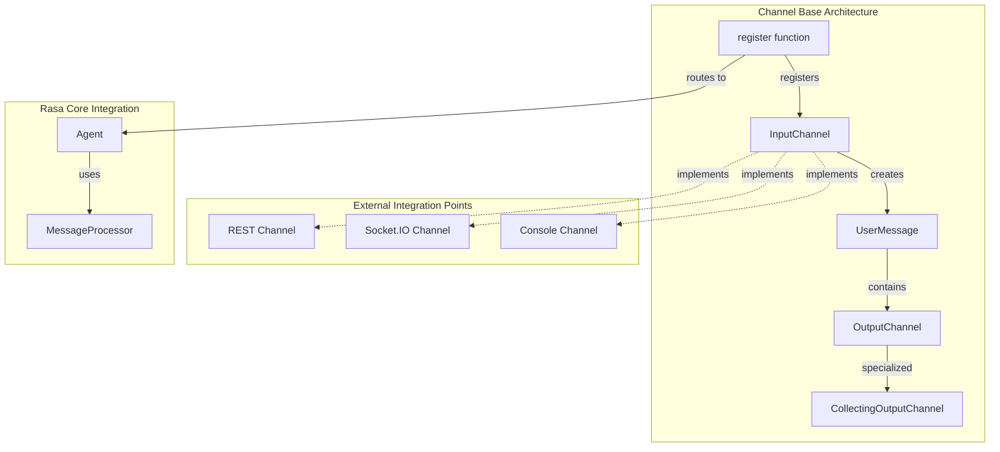
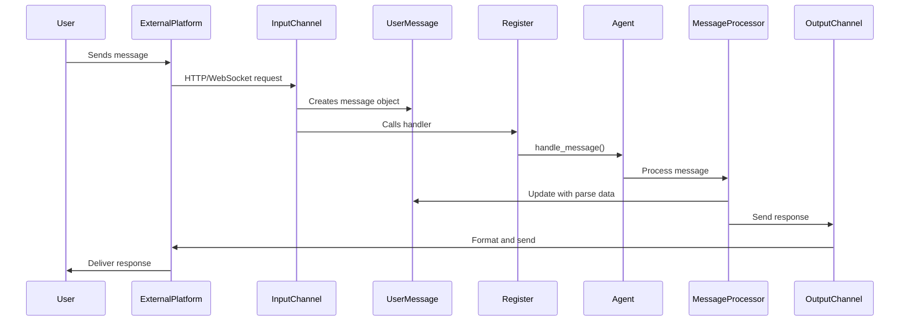
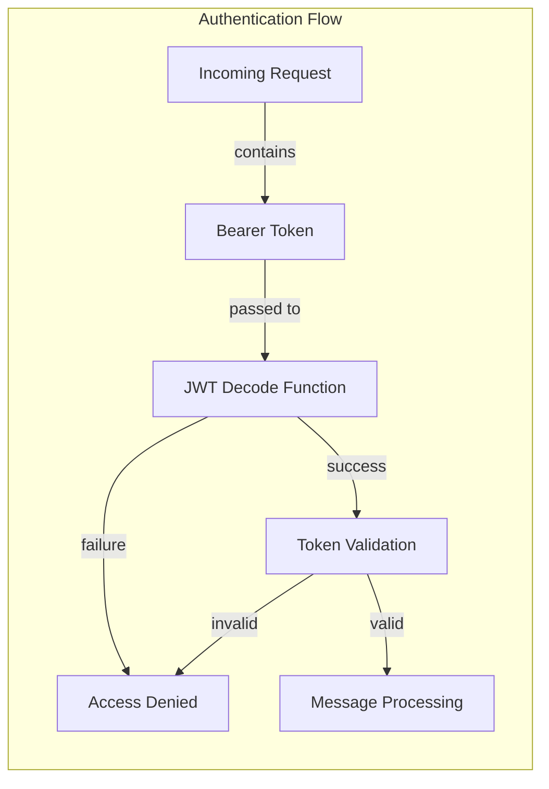
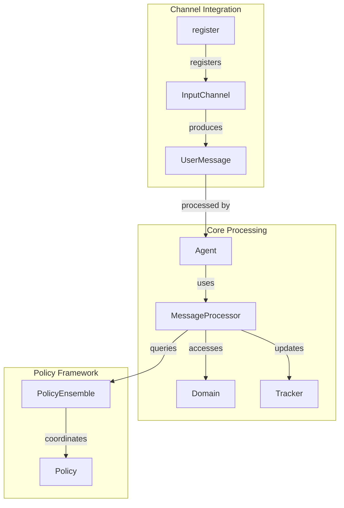

# Channel Base Module Documentation

## Introduction

The `channel_base` module provides the foundational abstractions and implementations for handling communication between Rasa assistants and external messaging platforms. It defines the core interfaces and base classes that enable Rasa to receive messages from various input channels (like REST APIs, WebSocket, console) and send responses back through corresponding output channels.

This module serves as the communication layer that abstracts the complexity of different messaging platforms, providing a unified interface for message handling across the entire Rasa ecosystem.

## Architecture Overview

The channel_base module implements a dual-channel architecture pattern with clear separation of concerns:



## Core Components

### UserMessage

The `UserMessage` class is the central data structure that encapsulates all information about an incoming message from any channel. It acts as the universal message format that bridges external communication protocols with Rasa's internal processing pipeline.

**Key Responsibilities:**
- Normalize message data from different input sources
- Maintain message metadata and context
- Provide output channel reference for responses
- Handle message identification and tracking

**Key Properties:**
- `text`: The actual message content
- `sender_id`: Unique identifier for the message sender
- `output_channel`: Reference to the appropriate output channel
- `input_channel`: Name of the channel that received the message
- `message_id`: Unique identifier for the message
- `parse_data`: NLU parsing results
- `metadata`: Additional channel-specific information

### InputChannel

The `InputChannel` abstract base class defines the contract that all input channels must implement. It provides the framework for receiving messages from external sources and converting them into Rasa's internal message format.

**Key Responsibilities:**
- Define channel identification and configuration
- Provide webhook/endpoint blueprints for message reception
- Extract and validate incoming message data
- Convert external message formats to UserMessage objects
- Handle authentication and security (JWT token validation)

**Core Methods:**
- `name()`: Returns the channel identifier
- `blueprint()`: Defines Sanic routes for message endpoints
- `from_credentials()`: Factory method for channel instantiation
- `get_metadata()`: Extracts additional information from requests
- `get_output_channel()`: Creates appropriate output channel instance

### OutputChannel

The `OutputChannel` abstract base class defines the interface for sending responses from Rasa back to users through various messaging platforms. It provides a rich set of methods for different response types while maintaining a consistent API.

**Key Responsibilities:**
- Abstract message sending operations
- Support multiple response formats (text, buttons, images, etc.)
- Handle platform-specific message formatting
- Provide default implementations for basic response types

**Response Types Supported:**
- Text messages
- Quick replies
- Buttons and interactive elements
- Images and attachments
- Custom JSON payloads
- Rich message elements (cards, carousels)

### CollectingOutputChannel

A specialized output channel implementation that collects messages in memory rather than sending them to an external service. This is primarily used for testing, debugging, and scenarios where message collection is required before processing.

**Key Features:**
- In-memory message storage
- Message history tracking
- Thread-safe message collection
- Support for all standard response types

### Registration System

The `register()` function provides the mechanism for integrating input channels with Rasa's web server framework (Sanic). It handles the routing and setup of channel endpoints.

**Process Flow:**
1. Iterates through configured input channels
2. Creates URL routes based on channel prefixes
3. Attaches message handlers to each route
4. Stores channel references for runtime access

## Data Flow Architecture



## Security and Authentication

The module includes built-in JWT (JSON Web Token) authentication support for securing channel endpoints:



**Security Features:**
- JWT token decoding and validation
- Bearer token extraction from headers
- Configurable JWT algorithms
- Error handling for invalid tokens
- Logging for security events

## Integration with Rasa Core

The channel_base module integrates seamlessly with Rasa's core dialogue processing components:



**Integration Points:**
- **Agent**: Receives UserMessage objects and orchestrates processing
- **MessageProcessor**: Handles NLU parsing and dialogue policy execution
- **DialogueStateTracker**: Maintains conversation state across messages
- **Policy Ensemble**: Determines next actions based on conversation context

## Channel Implementation Patterns

### Creating Custom Input Channels

```python
class CustomInputChannel(InputChannel):
    @classmethod
    def name(cls) -> Text:
        return "custom"
    
    def blueprint(
        self, on_new_message: Callable[[UserMessage], Awaitable[Any]]
    ) -> Blueprint:
        custom_webhook = Blueprint("custom_webhook")
        
        @custom_webhook.route("/webhook", methods=["POST"])
        async def receive(request: Request) -> HTTPResponse:
            # Extract message from request
            # Create UserMessage
            # Call on_new_message
            pass
        
        return custom_webhook
```

### Creating Custom Output Channels

```python
class CustomOutputChannel(OutputChannel):
    @classmethod
    def name(cls) -> Text:
        return "custom"
    
    async def send_text_message(
        self, recipient_id: Text, text: Text, **kwargs: Any
    ) -> None:
        # Implement platform-specific text sending
        pass
```

## Error Handling and Resilience

The module implements comprehensive error handling strategies:

- **Message Validation**: Ensures required fields are present
- **Channel Registration Errors**: Graceful handling of configuration issues
- **Authentication Failures**: Secure token validation with detailed logging
- **Output Channel Failures**: Fallback mechanisms for message delivery
- **Exception Propagation**: Proper error reporting up the call stack

## Testing and Development Support

The `CollectingOutputChannel` provides essential support for testing scenarios:

```python
# Example test pattern
def test_message_handling():
    collector = CollectingOutputChannel()
    message = UserMessage(
        text="Hello",
        output_channel=collector,
        sender_id="test_user"
    )
    
    # Process message
    # ...
    
    # Verify responses
    responses = collector.messages
    assert len(responses) > 0
    assert responses[0]["text"] == "Expected response"
```

## Related Modules

- **[rest_channel](rest_channel.md)**: REST API implementation built on channel_base
- **[socketio_channel](socketio_channel.md)**: WebSocket-based real-time communication
- **[console_channel](console_channel.md)**: Command-line interface implementation
- **[core_dialogue](core_dialogue.md)**: Message processing and dialogue management
- **[dialogue_orchestration](dialogue_orchestration.md)**: Agent and message processor coordination

## Best Practices

1. **Channel Naming**: Use descriptive, unique names for custom channels
2. **Error Handling**: Implement robust error handling in channel implementations
3. **Security**: Always validate authentication tokens for production channels
4. **Metadata Extraction**: Leverage `get_metadata()` for channel-specific information
5. **Testing**: Use `CollectingOutputChannel` for unit testing response generation
6. **Documentation**: Document channel-specific configuration requirements

## Configuration and Deployment

Channels are typically configured through Rasa's credentials file:

```yaml
# credentials.yml
custom_channel:
  webhook_url: "https://api.example.com/webhook"
  jwt_key: "your-secret-key"
  jwt_algorithm: "HS256"
```

The registration system automatically discovers and configures channels based on the credentials provided, making deployment flexible and environment-specific.