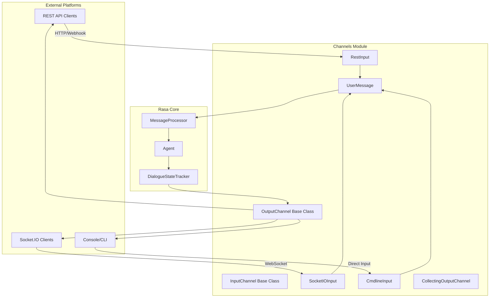
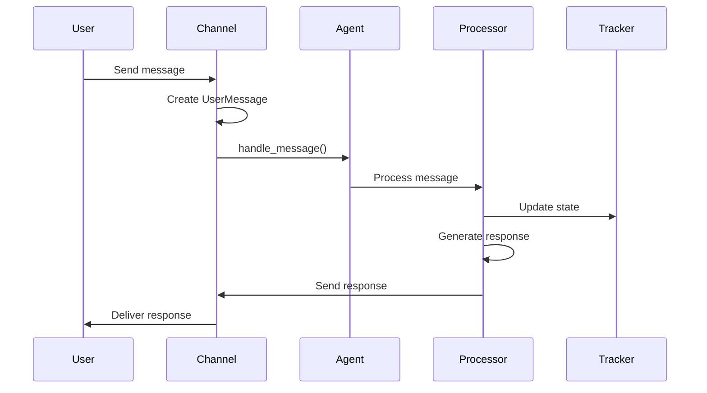

# Channels Module Documentation

## Overview

The **Channels** module in Rasa Open Source provides the communication layer between users and the Rasa assistant. It handles incoming messages from various platforms and sends responses back to users through their preferred messaging channels. This module serves as the bridge between external messaging services and the Rasa Core dialogue engine.

## Purpose

The Channels module enables Rasa assistants to communicate across multiple platforms simultaneously, providing a unified interface for:
- Receiving user messages from different messaging services
- Sending bot responses back to users
- Managing channel-specific features (buttons, quick replies, attachments)
- Handling authentication and security for external integrations

## Architecture



## Core Components

### Base Classes

#### InputChannel
The abstract base class for all input channels. Defines the interface that every channel implementation must follow:
- `name()`: Channel identifier
- `blueprint()`: Sanic blueprint for routing
- `from_credentials()`: Factory method for creating instances
- `get_metadata()`: Extract metadata from requests

#### OutputChannel
The abstract base class for all output channels. Provides methods for sending different types of messages:
- Text messages
- Images and attachments
- Buttons and quick replies
- Custom JSON payloads
- Interactive elements

#### UserMessage
Represents an incoming message with:
- Message text content
- Sender identification
- Output channel reference
- Metadata and parsing data
- Message ID for tracking

### Channel Implementations

#### RestInput
HTTP-based channel for REST API communication:
- Webhook endpoint for receiving messages
- Streaming and non-streaming response modes
- Bearer token authentication support
- Health check endpoints

#### SocketIOInput
WebSocket-based channel for real-time communication:
- Bidirectional communication
- Session persistence
- JWT authentication
- Room-based message routing

#### CmdlineInput
Console-based channel for development and testing:
- Interactive command-line interface
- Local testing without external services
- Integration with Rasa shell commands

## Sub-modules

### [REST Channel](rest_channel.md)
Detailed documentation for HTTP-based communication, including webhook configuration, authentication, and streaming responses.

### [Socket.IO Channel](socketio_channel.md)
Comprehensive guide for WebSocket-based real-time communication, session management, and authentication.

### [Console Channel](console_channel.md)
Documentation for command-line interface implementation and local testing capabilities.

## Channel Base Classes

### [Channel Base Classes](channel_base.md)
Detailed documentation for the abstract base classes that define the channel interface, including InputChannel and OutputChannel implementations.

## Integration with Rasa Core

The Channels module integrates with Rasa Core through the following flow:



## Security Features

### Authentication
- JWT token validation for Socket.IO connections
- Bearer token authentication for REST endpoints
- Configurable authentication methods

### Message Validation
- Input sanitization
- Metadata extraction and validation
- Rate limiting support through external services

## Configuration

Channels are configured through credentials files in YAML format:

```yaml
rest:
  # REST channel configuration
  
socketio:
  user_message_evt: "user_uttered"
  bot_message_evt: "bot_uttered"
  session_persistence: true
  
cmdline:
  # Console channel (typically no configuration needed)
```

## Dependencies

The Channels module depends on:
- **Rasa Core**: For message processing and dialogue management ([core_dialogue.md](core_dialogue.md))
- **Rasa Shared**: For common utilities and data structures ([shared_core.md](shared_core.md))
- **Sanic**: Web framework for handling HTTP requests
- **Socket.IO**: For WebSocket communication

## Best Practices

### Channel Selection
- Use REST for simple HTTP integrations
- Use Socket.IO for real-time applications
- Use Cmdline for development and testing

### Security
- Always configure authentication for production
- Use HTTPS for REST channels
- Validate all incoming data

### Performance
- Implement proper error handling
- Use streaming for long-running operations
- Monitor channel health and performance

## Troubleshooting

### Common Issues
1. **Connection failures**: Check network configuration and authentication
2. **Message delivery issues**: Verify channel configuration and permissions
3. **Authentication errors**: Validate JWT keys and algorithms
4. **Performance problems**: Monitor resource usage and implement rate limiting

### Debug Information
- Enable debug logging for detailed channel activity
- Use health check endpoints to verify channel status
- Monitor message queues for bottlenecks

## Related Documentation
- [Core Dialogue Module](core_dialogue.md) - Message processing and dialogue management
- [Shared Core Module](shared_core.md) - Common data structures and utilities
- [Engine Graph Module](engine_graph.md) - Component execution framework