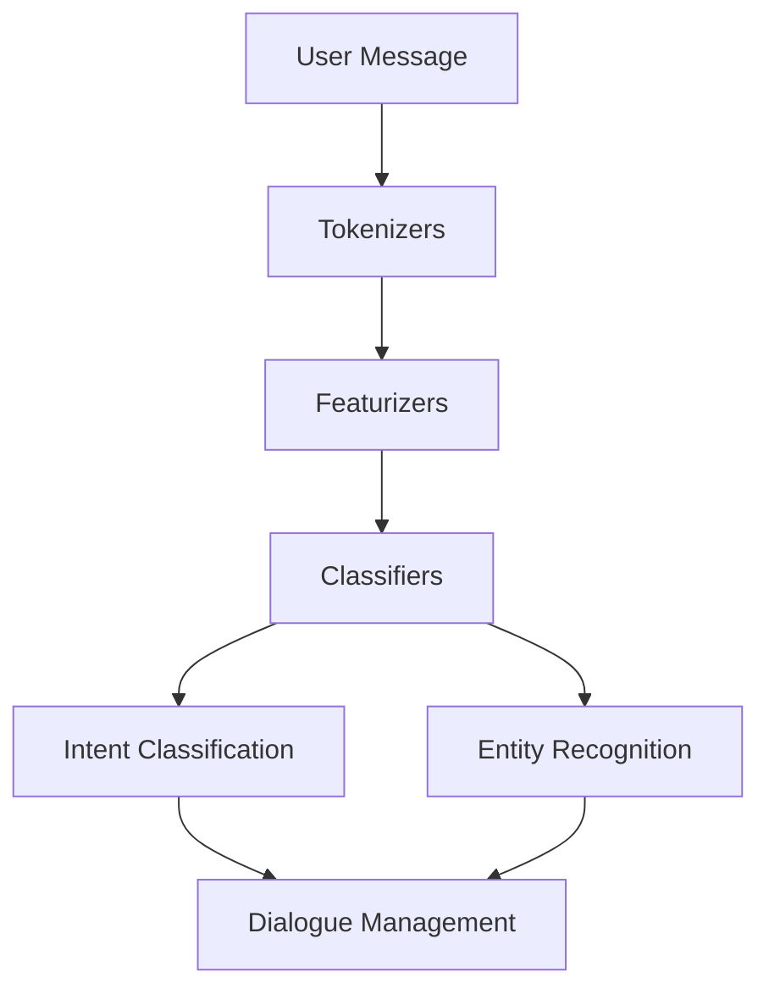
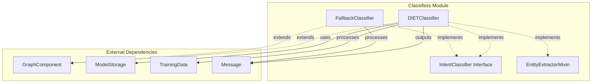
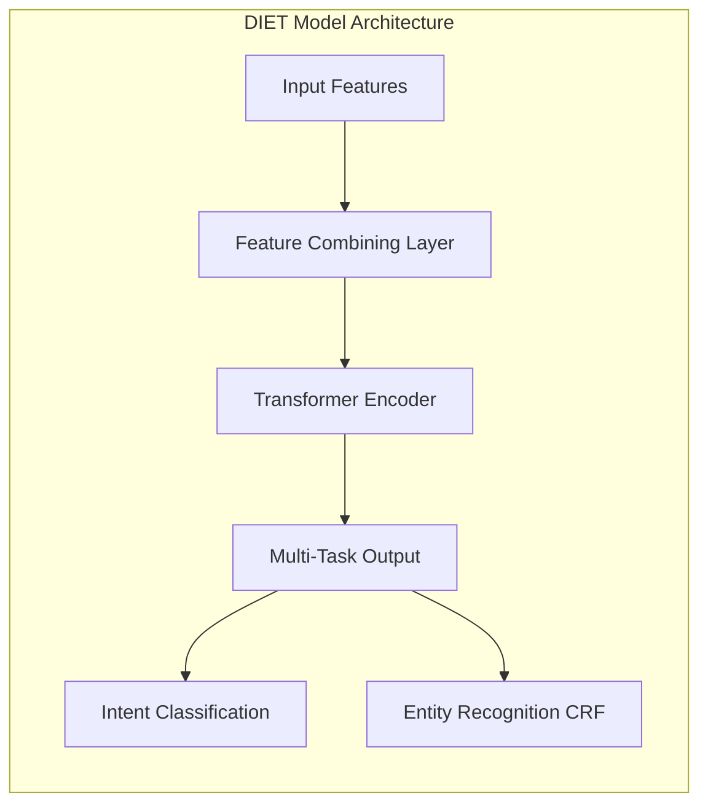
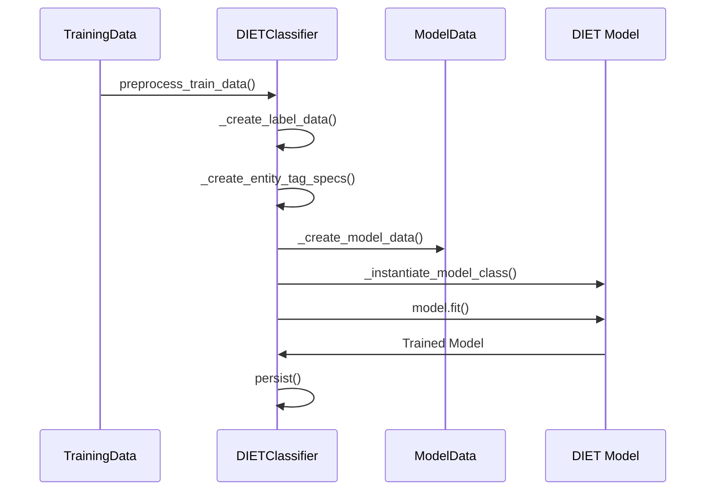
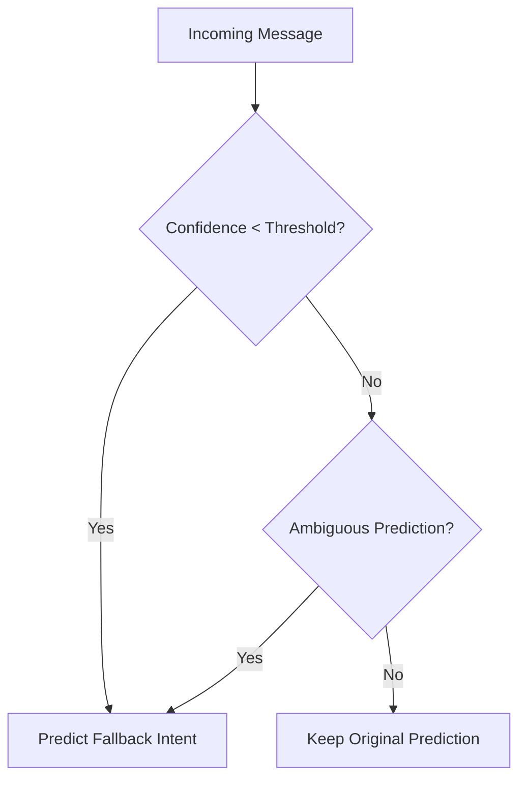
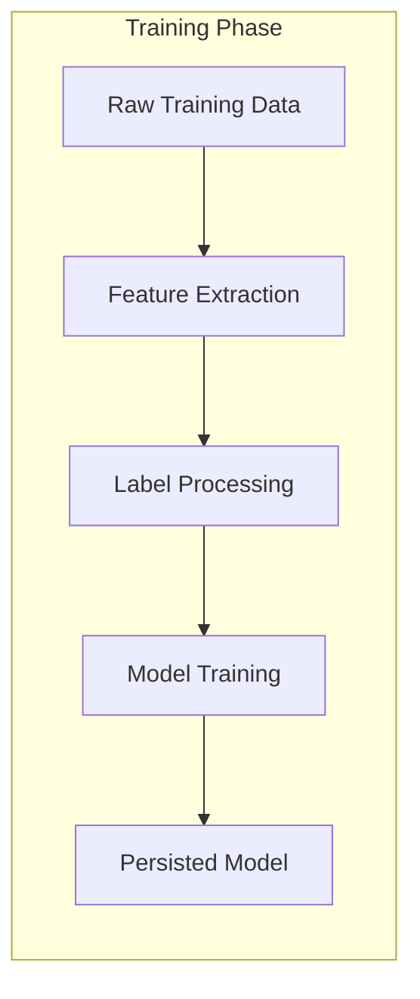
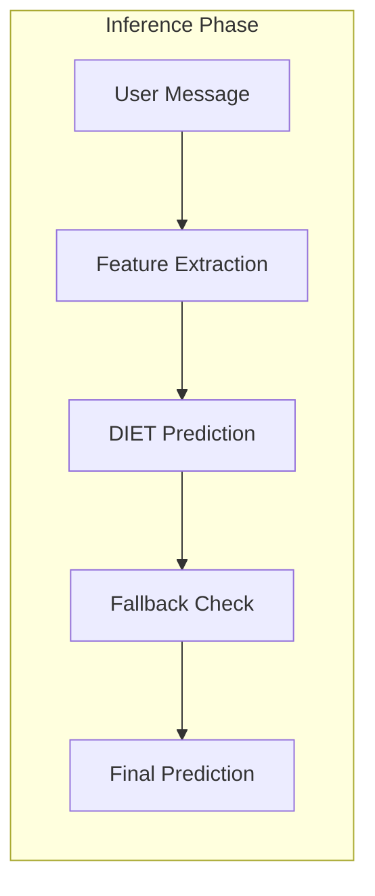

# Classifiers Module Documentation

## Overview

The classifiers module is a core component of Rasa's NLU (Natural Language Understanding) system, responsible for intent classification and entity recognition. This module implements machine learning models that analyze user messages to determine their intent and extract relevant entities.

The module contains two primary classifiers:
- **DIETClassifier**: A state-of-the-art multi-task transformer model for joint intent classification and entity extraction
- **FallbackClassifier**: A rule-based classifier that handles low-confidence predictions and ambiguous intent classifications

## Architecture

### Module Position in NLU Pipeline

The classifiers module operates within the NLU processing pipeline, typically positioned after featurizers and tokenizers have processed the input text. The classifiers consume extracted features and produce intent predictions and entity annotations.



### Core Components Architecture



## Components

### DIETClassifier

The **DIETClassifier** (Dual Intent and Entity Transformer) is Rasa's flagship multi-task model that performs both intent classification and entity recognition using a shared transformer architecture.

#### Key Features
- **Multi-task Learning**: Jointly trains for intent classification and entity recognition
- **Transformer Architecture**: Uses attention mechanisms for contextual understanding
- **CRF Layer**: Applies Conditional Random Fields for entity sequence labeling
- **Flexible Configuration**: Extensive hyperparameter configuration options
- **Feature Integration**: Supports both sparse and dense features from upstream components

#### Architecture Details



#### Training Process



#### Configuration Parameters

The DIETClassifier supports extensive configuration through its `get_default_config()` method:

- **Architecture Parameters**:
  - `hidden_layers_sizes`: Hidden layer configurations
  - `transformer_size`: Number of transformer units
  - `num_transformer_layers`: Depth of transformer
  - `num_heads`: Attention heads in transformer

- **Training Parameters**:
  - `batch_sizes`: Batch size range for training
  - `epochs`: Training iterations
  - `learning_rate`: Optimization learning rate
  - `random_seed`: Reproducibility control

- **Task-Specific Parameters**:
  - `intent_classification`: Enable/disable intent prediction
  - `entity_recognition`: Enable/disable entity extraction
  - `bilou_flag`: Use BILOU tagging scheme

### FallbackClassifier

The **FallbackClassifier** provides robust error handling by detecting low-confidence predictions and ambiguous classifications.

#### Key Features
- **Confidence Thresholding**: Detects predictions below confidence threshold
- **Ambiguity Detection**: Identifies when top intents have similar confidence scores
- **Rule-Based**: No training required, operates on prediction outputs
- **Configurable Thresholds**: Adjustable confidence and ambiguity thresholds

#### Decision Logic



## Data Flow

### Training Data Flow



### Inference Data Flow



## Integration Points

### Dependencies on Other Modules

The classifiers module depends on several other Rasa modules:

- **[featurizers](featurizers.md)**: Provides sparse and dense features for model input
- **[tokenizers](tokenizers.md)**: Tokenizes input text for entity recognition
- **[engine_graph](engine_graph.md)**: Integrates with Rasa's graph execution framework
- **[shared_nlu](shared_nlu.md)**: Uses shared data structures like Message and TrainingData

### Interface Implementations

Both classifiers implement the `IntentClassifier` interface, ensuring consistent behavior:

```python
class IntentClassifier(Component):
    """Base class for intent classifiers."""
    
    def process(self, messages: List[Message]) -> List[Message]:
        """Process messages and add intent predictions."""
        pass
```

The DIETClassifier additionally implements `EntityExtractorMixin` for entity extraction capabilities.

## Usage Patterns

### Pipeline Configuration

```yaml
pipeline:
  - name: WhitespaceTokenizer
  - name: CountVectorsFeaturizer
  - name: DIETClassifier
    epochs: 100
    transformer_size: 256
  - name: FallbackClassifier
    threshold: 0.3
    ambiguity_threshold: 0.1
```

### Model Persistence

Both classifiers support model persistence through the `persist()` and `load()` methods, enabling:
- Model checkpointing during training
- Model serialization to storage
- Model loading for inference
- Fine-tuning from pre-trained models

## Performance Considerations

### DIETClassifier Optimization
- **Feature Selection**: Configure `featurizers` parameter to use specific features
- **Batch Strategy**: Choose between 'sequence' or 'balanced' batch strategies
- **Transformer Configuration**: Adjust transformer size and layers based on dataset size
- **Regularization**: Use dropout and regularization constants to prevent overfitting

### FallbackClassifier Efficiency
- **Minimal Overhead**: Rule-based approach adds negligible inference time
- **Early Detection**: Can short-circuit processing pipeline for fallback cases
- **Configurable Thresholds**: Tune thresholds based on accuracy requirements

## Error Handling

### Training Errors
- **Insufficient Data**: Validates minimum number of intent classes
- **Feature Mismatch**: Checks consistency between text and label features
- **Configuration Validation**: Validates hyperparameter combinations

### Inference Errors
- **Model Not Found**: Graceful handling of missing models
- **Feature Absence**: Handles missing features during prediction
- **Low Confidence**: FallbackClassifier handles uncertain predictions

## Extension Points

### Custom Classifiers
New classifiers can be implemented by:
1. Extending `GraphComponent` and `IntentClassifier`
2. Implementing required methods: `create()`, `process()`, `persist()`, `load()`
3. Registering with `@DefaultV1Recipe.register()`

### Model Architecture Extensions
The DIET architecture can be extended through:
- Custom loss functions in `batch_loss()`
- Additional output heads in `batch_predict()`
- Custom layers in `_prepare_layers()`

## Monitoring and Diagnostics

### Training Metrics
DIETClassifier tracks multiple metrics during training:
- Intent classification accuracy and loss
- Entity recognition F1 scores and losses
- Masked language modeling accuracy (if enabled)

### Diagnostic Data
When enabled, the classifier provides:
- Attention weights from transformer layers
- Intermediate representations
- Confidence scores for all predictions

## References

- [NLU Processing Pipeline](nlu_processing.md) - Overview of NLU components
- [Featurizers](featurizers.md) - Feature extraction components
- [Tokenizers](tokenizers.md) - Text tokenization components
- [Engine Graph](engine_graph.md) - Graph execution framework
- [Shared NLU](shared_nlu.md) - Common NLU data structures