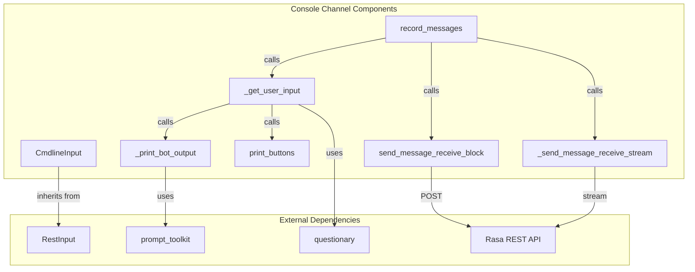
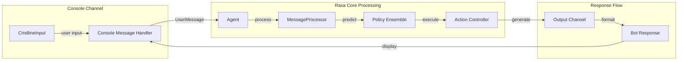
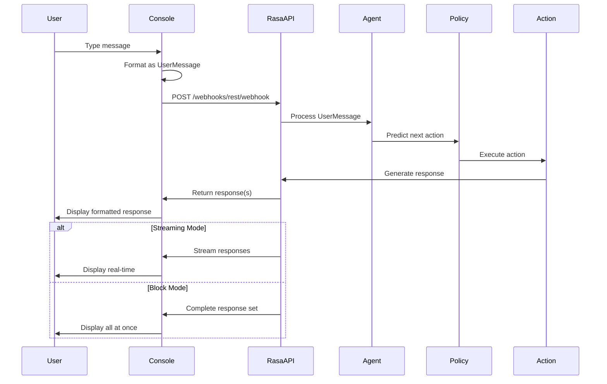
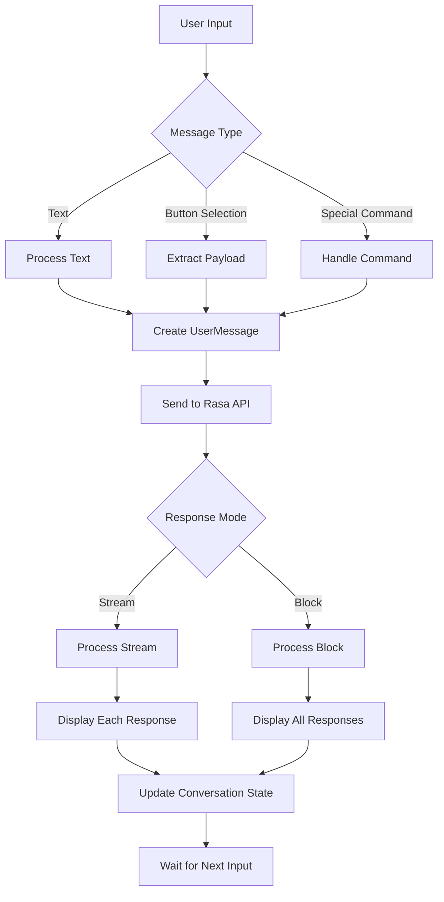
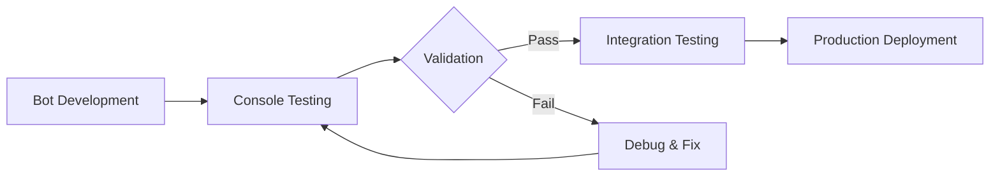

# Console Channel Module

## Introduction

The console channel module provides a command-line interface for interacting with Rasa assistants. It enables developers to test and debug their conversational AI directly from the terminal, offering a simple yet powerful way to validate bot behavior without requiring complex frontend setups or external integrations.

## Module Purpose

The console channel serves as a lightweight development and testing tool that:
- Facilitates rapid prototyping and debugging of conversational flows
- Provides immediate feedback on bot responses
- Supports interactive elements like buttons and quick replies in a text-based format
- Enables streaming responses for real-time conversation simulation
- Integrates seamlessly with the Rasa REST API for message processing

## Architecture Overview

### Component Structure

### Integration with Rasa Core

## Core Components

### CmdlineInput

The `CmdlineInput` class extends `RestInput` to provide console-based interaction capabilities. It serves as the main entry point for the console channel integration.

**Key Features:**
- Inherits REST API functionality from `RestInput`
- Identifies itself with the name "cmdline"
- Uses REST webhook endpoints for message processing
- Supports both blocking and streaming response modes

**Integration Points:**
- Extends [RestInput](rest_channel.md) functionality
- Integrates with [Agent](dialogue_orchestration.md) for message processing
- Connects to [Policy Ensemble](policy_framework.md) for response prediction

### record_messages

The `record_messages` function is the main conversation loop that manages the interactive session between user and bot.

**Functionality:**
- Maintains continuous conversation loop
- Handles user input collection and validation
- Manages bot response processing and display
- Supports both streaming and blocking response modes
- Implements conversation termination logic

**Parameters:**
- `sender_id`: Unique identifier for the conversation session
- `server_url`: Rasa server endpoint (defaults to localhost:5005)
- `auth_token`: Authentication token for secure communication
- `max_message_limit`: Optional message limit for conversation
- `use_response_stream`: Enable streaming responses
- `request_timeout`: Timeout configuration for requests

### _get_user_input

Handles interactive user input collection with support for button-based responses and free text input.

**Features:**
- Displays previous bot responses with interactive elements
- Processes button selections using questionary library
- Falls back to free text input when needed
- Provides visual prompts with styled input fields
- Handles async input operations

### Message Processing Functions

#### send_message_receive_block
Sends user messages to the Rasa server and receives complete responses in a single block.

#### _send_message_receive_stream
Establishes streaming connection for real-time response delivery, enabling more natural conversation flow.

#### _print_bot_output
Formats and displays bot responses in the console, supporting various message types including text, images, buttons, and custom JSON.

## Data Flow

### Conversation Message Flow

### Response Processing Pipeline

## Configuration and Usage

### Environment Variables

- `RASA_SHELL_STREAM_READING_TIMEOUT_IN_SECONDS`: Controls streaming timeout (defaults to `DEFAULT_STREAM_READING_TIMEOUT`)

### Command Line Integration

The console channel integrates with Rasa CLI commands:
- `rasa shell`: Launches interactive console session
- `rasa interactive`: Enables interactive learning mode
- Supports `--request-timeout` parameter for connection configuration

### Authentication

- Optional token-based authentication via `auth_token` parameter
- Integrates with Rasa's security framework
- Supports credential-based access control

## Dependencies

### Internal Dependencies
- [RestInput](rest_channel.md): Base REST API functionality
- [Agent](dialogue_orchestration.md): Message processing and conversation management
- [Policy Framework](policy_framework.md): Response prediction and action selection
- [Action Framework](action_framework.md): Bot response generation

### External Dependencies
- `questionary`: Interactive command-line user interfaces
- `prompt_toolkit`: Advanced terminal input handling
- `aiohttp`: Asynchronous HTTP client for API communication
- `asyncio`: Asynchronous programming support

## Error Handling

### Network Resilience
- Implements timeout mechanisms for API requests
- Handles connection failures gracefully
- Provides user-friendly error messages
- Supports retry logic for transient failures

### Input Validation
- Sanitizes user input before processing
- Handles special characters and formatting
- Validates message structure before API submission
- Provides clear feedback for invalid inputs

## Testing and Development

### Testing Capabilities
- Enables rapid iteration during bot development
- Supports debugging of conversation flows
- Facilitates validation of NLU and Core components
- Provides immediate feedback on policy decisions

### Development Workflow

## Best Practices

### Development Usage
- Use console channel for initial bot validation
- Test edge cases and error scenarios
- Validate conversation flow logic
- Debug policy and action behavior

### Production Considerations
- Console channel is primarily for development
- Consider rate limiting for extended sessions
- Monitor resource usage during long conversations
- Implement proper logging for debugging

## Extension Points

### Custom Formatting
- Override `_print_bot_output` for custom display logic
- Extend message type support
- Implement custom styling and themes

### Enhanced Interaction
- Add support for additional input methods
- Implement conversation history tracking
- Create custom validation logic

## Related Documentation

- [REST Channel](rest_channel.md) - Base REST API implementation
- [Dialogue Orchestration](dialogue_orchestration.md) - Message processing and conversation management
- [Policy Framework](policy_framework.md) - Response prediction and action selection
- [Action Framework](action_framework.md) - Bot response generation and execution