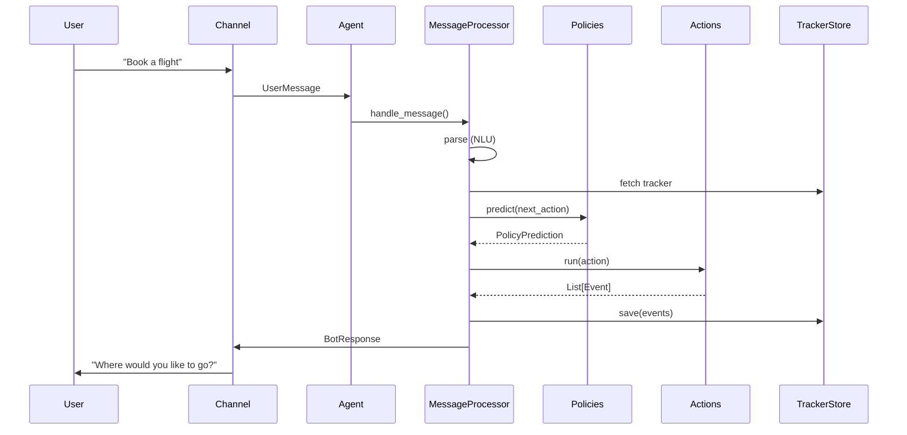

# Core Dialogue Module Overview

## Purpose

The `core_dialogue` module is the central nervous system of Rasa's conversational AI engine. It orchestrates the complete dialogue lifecycle—from the moment a user message arrives until the assistant's response is sent back—by coordinating policy-based decision making, action execution, and conversation state management. In short, it turns raw user input into coherent, context-aware dialogue.

## High-Level Architecture

```mermaid
graph LR
    User([User]) -->|message| Chan[Channel]
    Chan -->|UserMessage| A[Agent]
    A --> MP[MessageProcessor]
    MP -->|parse| NLU[NLU Pipeline]
    MP -->|predict| PF[Policy Framework]
    MP -->|execute| AF[Action Framework]
    MP <>|read/write| TS[Tracker Store]
    AF -->|events| MP
    MP -->|BotMessage| Chan
    Chan -->|response| User
    style A fill:#e1f5fe
    style MP fill:#e1f5fe
    style PF fill:#fff3e0
    style AF fill:#f3e5f5
```

## Core Components

| Component | Path | Role |
|-----------|------|------|
| **Agent** | `rasa.core.agent.Agent` | Main entry-point; loads models, handles messages, manages external endpoints |
| **MessageProcessor** | `rasa.core.processor.MessageProcessor` | Runs the dialogue loop: parse → predict → execute → respond |
| **Policy Framework** | `rasa.core.policies.*` | Decides next action given dialogue history (TED, rules, memoization, ensemble) |
| **Action Framework** | `rasa.core.actions.*` | Executes actions (bot utterances, forms, custom web-hooks) and emits events |

## Module Breakdown

1. **Dialogue Orchestration** (`dialogue_orchestration/`)
   - Coordinates the end-to-end message flow
   - Manages session lifecycle, tracker persistence, and channel I/O
   - See [dialogue_orchestration.md](dialogue_orchestration.md) for detailed docs

2. **Policy Framework** (`policy_framework/`)
   - Houses all decision-making policies and the ensemble that arbitrates between them
   - Reference: [policy_framework.md](policy_framework.md)

3. **Action Framework** (`action_framework/`)
   - Provides base classes, default actions, forms, loops, and remote-action client
   - Reference: [action_framework.md](action_framework.md)

## Typical Message Flow



## Integration Points

- **NLU Processing** – supplies intent/entities to the tracker  
- **Channels** – pluggable I/O (REST, Socket.IO, CLI, etc.)  
- **Shared Core** – domain, events, slots, trackers  
- **Storage / Persistence** – SQL/Redis/memory tracker stores  
- **Engine Graph** – model loading and caching  
- **Model Training** – supplies trained policy & NLU artifacts  

## Key Design Highlights

- **Policy Ensemble** combines ML (TED), rules, and memory-based strategies with configurable priorities  
- **Event-driven** architecture: every action returns events that update the dialogue state  
- **Extensible Actions**: custom logic via Python classes or external action servers  
- **Built-in Safety**: circuit breakers, action limits, fallback handling, and conversation locks  
- **Session Management**: automatic session start/restart with metadata preservation  

For component-level details, consult the linked sub-module documentation above.