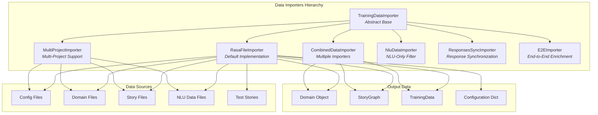
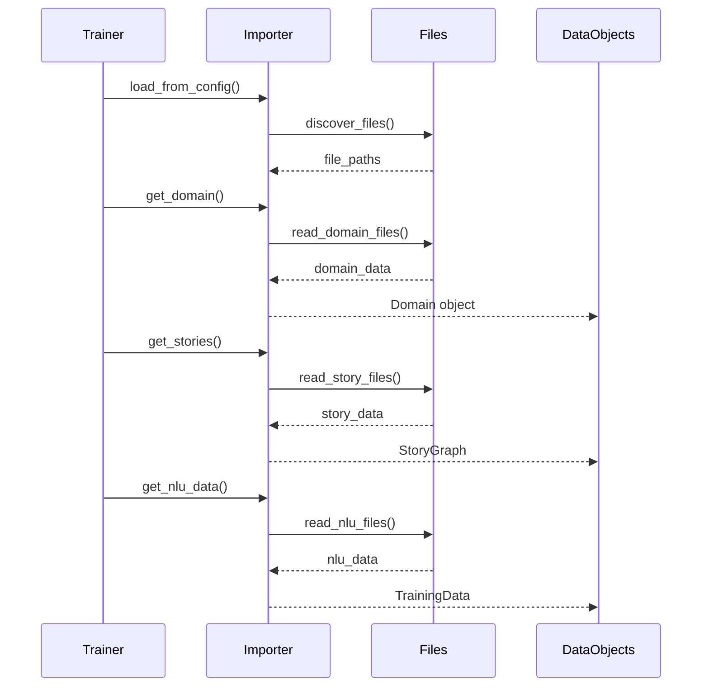

# Data Importers Module

## Overview

The `data_importers` module provides a flexible and extensible framework for loading and importing training data into Rasa. It serves as the primary entry point for accessing training data, domain configurations, and stories from various sources and formats. The module implements a sophisticated importer hierarchy that supports multiple data sources, project structures, and data synchronization mechanisms.

## Purpose

The data importers module is designed to:
- Provide a unified interface for loading training data from different sources
- Support complex project structures with multiple imported projects
- Enable data synchronization between different components (NLU, Core, Domain)
- Facilitate end-to-end training by enriching data across components
- Handle various file formats and directory structures

## Architecture



## Core Components

### TrainingDataImporter (Abstract Base)
The foundational abstract class that defines the interface for all data importers. It specifies methods for loading:
- Domain configurations
- Training stories and rules  
- NLU training data
- Model configuration
- Conversation test data

### RasaFileImporter
The default implementation that loads data from standard Rasa project files. See [Rasa File Importer Documentation](rasa_file_importer.md) for detailed information.

**Key Features:**
- Domain files (`domain.yml`)
- NLU training data (`nlu.yml`, `nlu.md`)
- Story files (`stories.yml`, `rules.yml`)
- Configuration files (`config.yml`)
- Test conversation files

### MultiProjectImporter
Enables importing data from multiple projects with a hierarchical structure. See [Multi-Project Importer Documentation](multi_project_importer.md) for detailed information.

**Key Features:**
- Supports project imports via configuration
- Recursively processes imported projects
- Handles cross-project dependencies
- Manages file discovery across project boundaries

### Data Synchronization Importers

#### ResponsesSyncImporter
Synchronizes responses between Domain and NLU training data. See [Data Synchronization Documentation](data_synchronization.md) for detailed information.

**Key Features:**
- Merges retrieval intents from NLU data into the domain
- Adds automatic `utter_` prefixed actions for retrieval intents
- Ensures consistency between domain responses and NLU training data

#### E2EImporter
Enriches training data for end-to-end learning. See [Data Synchronization Documentation](data_synchronization.md) for detailed information.

**Key Features:**
- Extracts user messages and actions from stories
- Adds them to NLU training data
- Creates additional training examples from story events
- Supports end-to-end bot message actions

### Utility Importers

#### CombinedDataImporter
Combines multiple importers into a single interface. See [Utility Importers Documentation](utility_importers.md) for detailed information.

**Key Features:**
- Merges domains from multiple sources
- Combines story graphs
- Aggregates NLU training data
- Reduces configuration dictionaries

#### NluDataImporter
Filters data to provide NLU-only training. See [Utility Importers Documentation](utility_importers.md) for detailed information.

**Key Features:**
- Returns empty domain and stories
- Provides only NLU training data
- Useful for NLU-only training scenarios

## Data Flow



## Key Features

### 1. Flexible Data Loading
- Support for multiple file formats (YAML, Markdown)
- Automatic file discovery and validation
- Configurable data source paths
- Language-specific NLU data loading

### 2. Multi-Project Support
- Hierarchical project imports
- Cross-project data sharing
- Selective file inclusion/exclusion
- Project boundary management

### 3. Data Synchronization
- Automatic response synchronization
- Retrieval intent handling
- End-to-end data enrichment
- Cross-component consistency

### 4. Extensibility
- Plugin architecture for custom importers
- Decorator pattern for importer chaining
- Abstract base for custom implementations
- Configuration-driven importer selection

## Usage Patterns

### Basic Usage
```python
# Load from configuration
importer = TrainingDataImporter.load_from_config(
    config_path="config.yml",
    domain_path="domain.yml", 
    training_data_paths=["data/"]
)

# Access training data
domain = importer.get_domain()
stories = importer.get_stories()
nlu_data = importer.get_nlu_data()
config = importer.get_config()
```

### Multi-Project Setup
```python
# Configuration with imports
config = {
    "imports": ["../skill-1", "../skill-2"],
    "pipeline": [...],
    "policies": [...]
}

importer = TrainingDataImporter.load_from_dict(config)
```

## Integration with Other Modules

The data importers module integrates closely with:

- **[shared_core](shared_core.md)**: Provides domain objects, story graphs, and training data structures
- **[shared_nlu](shared_nlu.md)**: Supplies NLU training data and message formats
- **[core_dialogue](core_dialogue.md)**: Delivers story data for dialogue training
- **[nlu_processing](nlu_processing.md)**: Processes NLU training data for model training
- **[engine_graph](engine_graph.md)**: Supplies training data to the graph execution engine

## Error Handling

The module implements comprehensive error handling:
- Domain validation and error reporting
- File discovery with graceful degradation
- Invalid configuration handling
- Missing file warnings and fallbacks

## Performance Considerations

- **Caching**: Uses `@cached_method` decorators for expensive operations
- **Lazy Loading**: Data loaded only when requested
- **Incremental Loading**: Support for partial data exclusion
- **Memory Efficiency**: Streaming data loading for large datasets

## Configuration

Importers can be configured through:
- Configuration files (`config.yml`)
- Constructor parameters
- Environment variables
- Runtime arguments

The configuration system supports:
- Multiple importer chaining
- Custom importer classes
- Import path resolution
- Auto-configuration hints