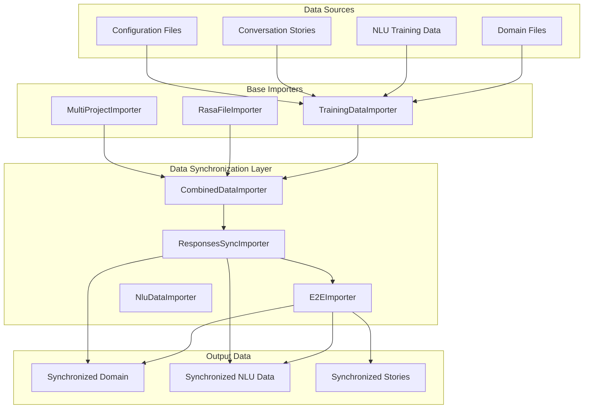
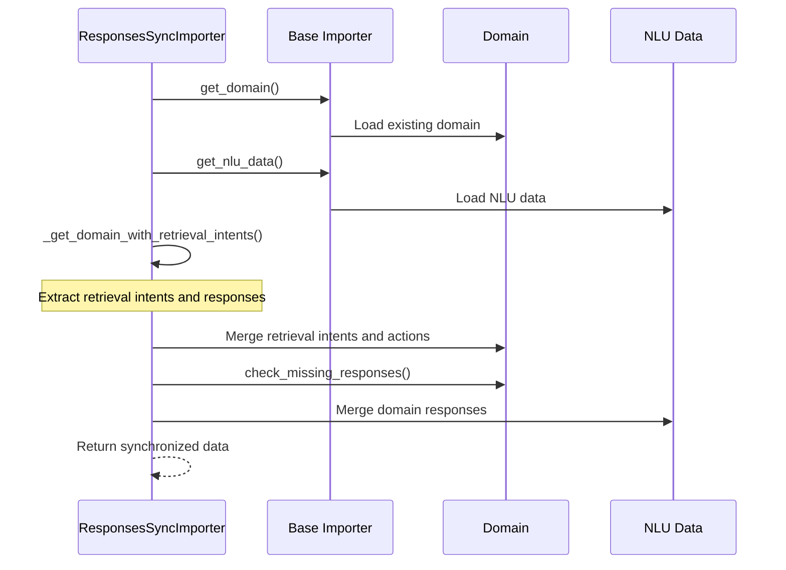
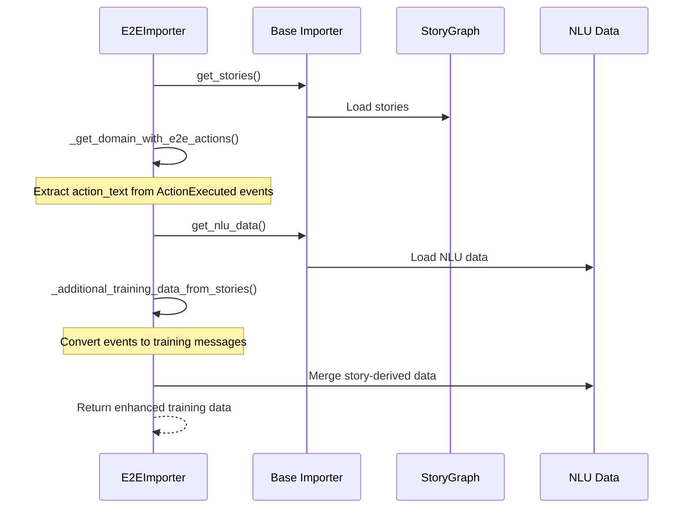
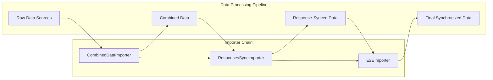
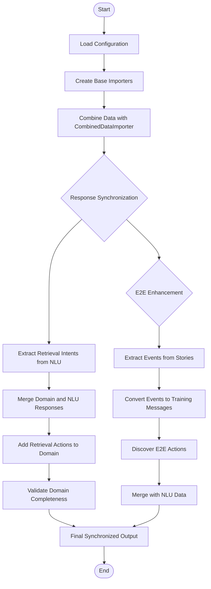
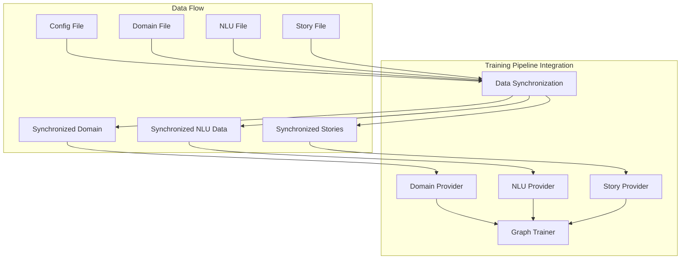

# Data Synchronization Module

## Introduction

The data_synchronization module is a critical component of the Rasa framework that ensures consistency and synchronization between different types of training data sources. It provides specialized importers that handle the complex relationships between NLU training data, domain definitions, and conversation stories, ensuring that all components work together seamlessly during model training.

## Core Purpose

This module addresses two key synchronization challenges:

1. **Response Synchronization**: Ensures that responses defined in NLU training data are properly synchronized with the domain configuration, particularly for retrieval intents
2. **End-to-End Data Enhancement**: Enriches NLU training data with actions and user messages extracted from conversation stories, enabling end-to-end training capabilities

## Architecture Overview

## Core Components

### ResponsesSyncImporter

The `ResponsesSyncImporter` is responsible for synchronizing responses between the domain and NLU training data. It ensures that retrieval intents defined in NLU data are properly reflected in the domain configuration.

#### Key Responsibilities:
- **Response Synchronization**: Merges responses from NLU data with responses in the domain
- **Retrieval Intent Handling**: Automatically adds corresponding retrieval actions with `utter_` prefix for retrieval intents
- **Domain Validation**: Ensures the final domain has all required responses

#### Data Flow:

### E2EImporter

The `E2EImporter` enhances NLU training data by extracting actions and user messages from conversation stories, enabling end-to-end training capabilities.

#### Key Responsibilities:
- **Story Data Extraction**: Extracts user utterances and action executions from stories
- **E2E Action Discovery**: Identifies end-to-end bot messages from stories and adds them as actions to the domain
- **Training Data Enhancement**: Combines original NLU data with story-derived training examples

#### Data Flow:

## Component Interactions

### Importer Chain Architecture

The data synchronization module uses a decorator pattern to chain multiple importers together:

### Data Synchronization Process

## Integration with Other Modules

### Dependencies

The data_synchronization module integrates with several other Rasa modules:

- **[shared_core](shared_core.md)**: Uses Domain, StoryGraph, and Event classes for data representation
- **[shared_nlu](shared_nlu.md)**: Works with TrainingData and Message classes for NLU data manipulation
- **[data_importers](data_importers.md)**: Extends the base TrainingDataImporter interface and works with other importers like RasaFileImporter and MultiProjectImporter

### Usage in Training Pipeline

## Key Features

### 1. Automatic Response Management
- Automatically synchronizes responses between domain and NLU training data
- Handles retrieval intents by creating corresponding actions
- Validates that all required responses are present

### 2. End-to-End Training Support
- Extracts training examples from conversation stories
- Discovers end-to-end actions from story data
- Enhances NLU training data with story-derived examples

### 3. Flexible Importer Architecture
- Supports chaining of multiple importers
- Provides specialized importers for different data types
- Maintains backward compatibility with existing importers

## Error Handling and Validation

The module includes several validation mechanisms:

- **Domain Validation**: Ensures all required responses are present after synchronization
- **Data Consistency**: Checks for conflicts between different data sources
- **Retrieval Intent Validation**: Verifies that retrieval intents have corresponding actions

## Performance Considerations

- **Caching**: Uses `@cached_method` decorators to avoid redundant data loading
- **Lazy Loading**: Data is loaded only when needed through the importer chain
- **Memory Efficiency**: Processes data incrementally through the importer chain

## Configuration

The data synchronization module is typically configured through the main Rasa configuration file. The importer chain is automatically constructed based on the configuration, with `ResponsesSyncImporter` and `E2EImporter` being applied as decorators around the base importers.

## Summary

The data_synchronization module plays a crucial role in the Rasa training pipeline by ensuring that all training data sources are properly synchronized and consistent. It handles the complex relationships between NLU data, domain configuration, and conversation stories, enabling both traditional NLU training and end-to-end conversation modeling. Through its flexible importer architecture, it provides a robust foundation for the Rasa training process while maintaining extensibility for custom data sources and synchronization requirements.