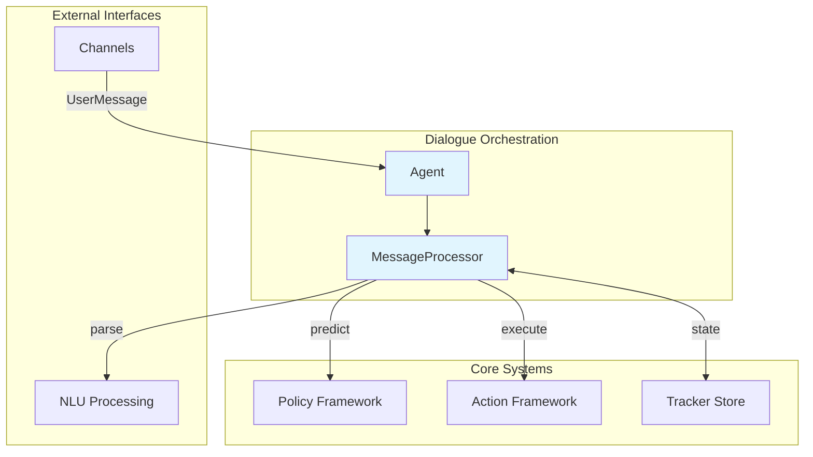
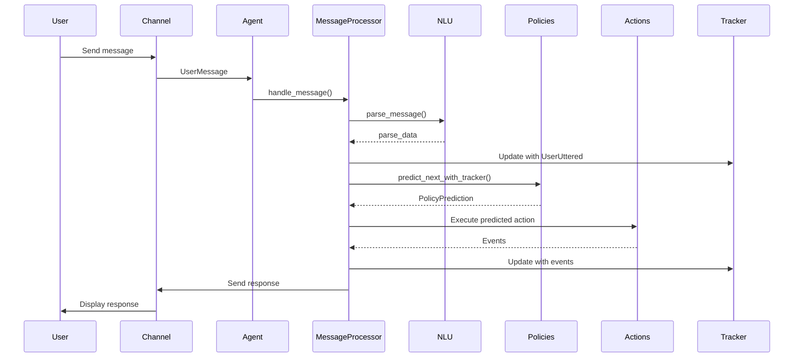

# Dialogue Orchestration Module

## Overview

The dialogue orchestration module serves as the central coordination layer for conversational AI in Rasa, managing the flow of dialogue between users and the system. It provides the core infrastructure for handling messages, predicting actions, and maintaining conversation state throughout interactions.

This module acts as the primary interface between external communication channels and the underlying policy framework, action execution system, and natural language understanding components. It ensures smooth conversation flow by coordinating message processing, action prediction, and response generation.

## Architecture

## Core Components

### Agent
The `Agent` class is the main entry point for dialogue orchestration, providing a high-level interface for model management, message handling, and conversation coordination. For detailed information about agent management capabilities, see [agent_management](agent_management.md).

Key responsibilities:
- **Model Management**: Loading models from disk, remote servers, or storage
- **Message Processing**: Coordinating the processing of incoming user messages
- **Action Execution**: Managing the execution of predicted actions
- **State Persistence**: Handling conversation state storage and retrieval
- **External Integrations**: Managing model servers and remote storage connections

### MessageProcessor
The `MessageProcessor` handles the core message processing pipeline, managing the complete conversation flow from message reception to response generation. For detailed information about message processing capabilities, see [message_processing](message_processing.md).

Key responsibilities:
- **Message Parsing**: Converting raw messages into structured data
- **Tracker Management**: Maintaining conversation history and state
- **Action Prediction**: Coordinating with policy framework for action selection
- **Event Processing**: Handling conversation events and side effects
- **Response Generation**: Managing bot responses and channel communications

## Integration Points

### Policy Framework Integration
The dialogue orchestration module integrates with the [policy_framework](policy_framework.md) to:
- Request action predictions based on conversation state
- Process policy decisions and confidence scores
- Handle policy ensemble predictions
- Manage end-to-end prediction scenarios

### Action Framework Integration
Integration with the [action_framework](action_framework.md) enables:
- Action execution based on predictions
- Form handling and slot extraction
- Loop action management
- Custom action server communication

### Channel Integration
The module works with [channels](channels.md) to:
- Receive user messages through various input channels
- Send responses through appropriate output channels
- Handle channel-specific formatting and protocols
- Manage multi-channel conversation contexts

### NLU Processing Integration
Integration with [nlu_processing](nlu_processing.md) provides:
- Intent classification and entity extraction
- Message parsing and understanding
- Fallback handling for low-confidence predictions
- Response selection for retrieval intents

## Data Flow

## Key Features

### Conversation Session Management
- Automatic session initialization with `action_session_start`
- Session expiration handling based on configuration
- Metadata preservation across sessions
- Conversation restart capabilities

### Action Prediction Loop
- Continuous action prediction until `action_listen`
- Circuit breaker mechanism to prevent infinite loops
- Action limit enforcement for safety
- End-to-end prediction support

### Event Processing
- Comprehensive event handling (bot messages, reminders, slot sets)
- Side effect management (reminders, anonymization)
- Event validation and domain checking
- Tracker state synchronization

### Error Handling and Recovery
- Model loading error handling with fallback mechanisms
- Action execution error recovery
- Network timeout and retry logic
- Graceful degradation for missing components

## Configuration and Usage

The dialogue orchestration module is typically configured through:
- **Domain Configuration**: Defines intents, entities, actions, and responses
- **Policy Configuration**: Specifies which policies to use for action prediction
- **Endpoint Configuration**: Sets up external services (action servers, NLU interpreters)
- **Tracker Store Configuration**: Configures conversation persistence

## Dependencies

The module relies on several other Rasa components:
- [shared_core](shared_core.md) for domain, events, and tracker definitions
- [storage_persistence](storage_persistence.md) for conversation state management
- [engine_graph](engine_graph.md) for model loading and execution
- [model_training](model_training.md) for model metadata and training information

## Performance Considerations

- **Tracker Management**: Efficient tracker serialization and storage
- **Action Prediction**: Optimized policy prediction pipelines
- **Message Processing**: Streamlined parsing and event handling
- **Memory Management**: Proper cleanup of temporary resources

## Security and Safety

- **Input Validation**: Domain checking for intents and entities
- **Action Limits**: Circuit breaker to prevent runaway predictions
- **Lock Management**: Conversation-level locking for concurrent access
- **Error Isolation**: Proper exception handling to prevent system crashes