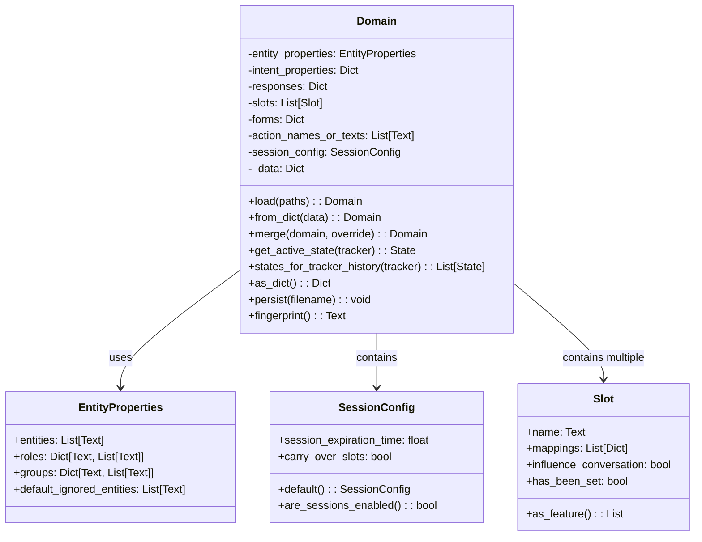
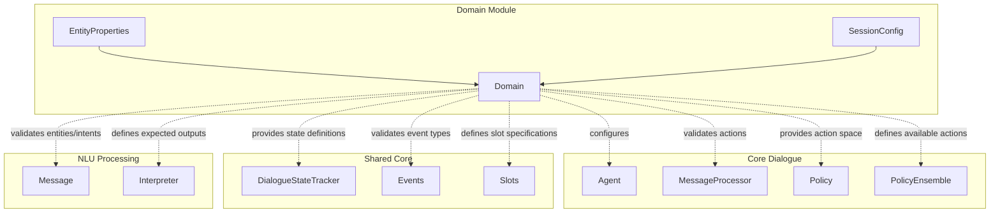
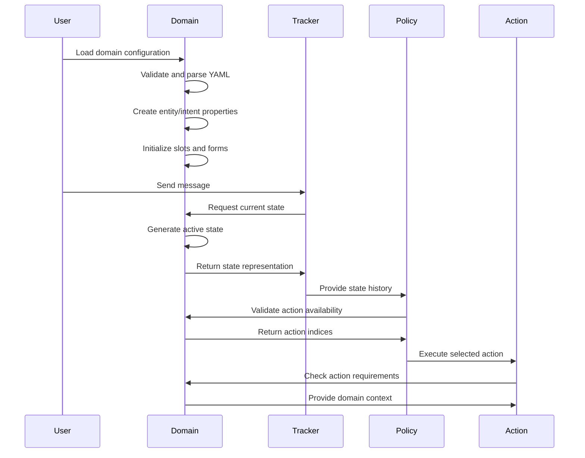
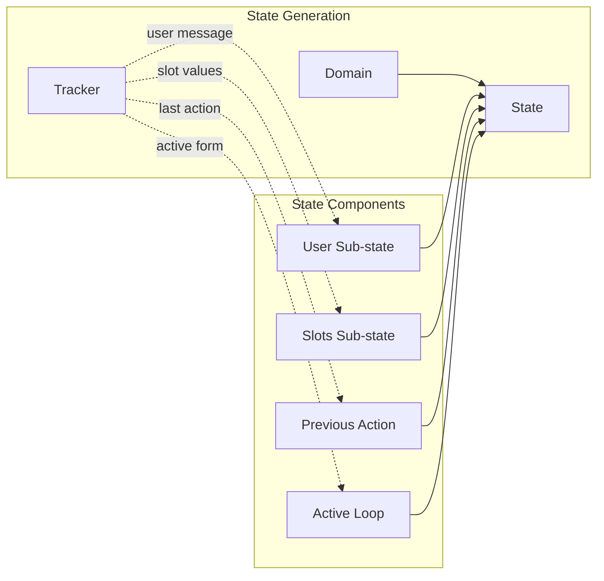

# Domain Module Documentation

## Introduction

The Domain module is a fundamental component of the Rasa Core system that defines the universe in which a conversational AI bot operates. It serves as the central configuration hub that specifies all the elements the bot can understand and act upon, including intents, entities, slots, actions, forms, and responses. The Domain acts as a contract between the NLU (Natural Language Understanding) and Core components, ensuring consistency across the entire conversational system.

## Core Architecture

### Domain Class Overview

The `Domain` class is the primary component of this module, providing a comprehensive interface for managing all aspects of a bot's operational universe. It handles the loading, validation, merging, and serialization of domain configurations while maintaining consistency across all components.



## Component Relationships

### Domain Integration with Core System

The Domain module serves as the central hub that connects various components of the Rasa system:



### Data Flow Architecture



## Key Features and Functionality

### 1. Domain Loading and Validation

The Domain module provides multiple methods for loading domain configurations:

- **File-based loading**: Load from single YAML files or directories
- **Dictionary-based creation**: Create from programmatically built dictionaries
- **Merging capabilities**: Combine multiple domain files with conflict resolution
- **Validation**: Comprehensive validation of domain structure and content

### 2. State Management

The Domain is responsible for creating state representations of conversations:



### 3. Entity and Intent Processing

The module handles complex entity and intent configurations:

- **Entity roles and groups**: Support for entity sub-labeling
- **Intent-entity relationships**: Define which entities are used/ignored per intent
- **Retrieval intents**: Special handling for FAQ-style intents
- **Default intent management**: Automatic inclusion of system intents

### 4. Form and Slot Management

Advanced slot and form handling capabilities:

- **Slot mappings**: Define how slots are filled from entities, intents, or custom methods
- **Form validation**: Ensure forms are properly configured
- **Required slots**: Manage which slots are needed for form completion
- **Conditional mappings**: Support for context-dependent slot filling

## Integration Points

### With [Dialogue Orchestration](core_dialogue.md)

The Domain module provides the configuration foundation for dialogue management:

- **Action validation**: Ensures all referenced actions are defined
- **State representation**: Provides consistent state format for policy decisions
- **Intent/entity validation**: Validates NLU outputs against domain definitions

### With [Policy Framework](policy_framework.md)

Domain defines the action space and state representation used by policies:

- **Action indices**: Maps action names to indices for policy prediction
- **State features**: Defines available state features for featurization
- **Action availability**: Validates which actions can be predicted

### With [Action Framework](action_framework.md)

Domain provides action definitions and validation:

- **Action names**: Lists all available actions
- **Response templates**: Defines bot responses for utterance actions
- **Form actions**: Configures form-based conversations
- **Custom action validation**: Ensures custom actions are properly defined

### With [NLU Processing](nlu_processing.md)

Domain validates and configures expected NLU outputs:

- **Intent definitions**: Specifies which intents the bot should recognize
- **Entity definitions**: Defines expected entity types and properties
- **Validation**: Ensures NLU outputs match domain expectations

## Configuration Management

### Domain File Structure

```yaml
version: "3.1"

intents:
  - greet
  - goodbye
  - inform:
      use_entities: [location, time]

entities:
  - location
  - time
  - person:
      roles: [sender, recipient]

slots:
  location:
    type: text
    mappings:
    - type: from_entity
      entity: location

responses:
  utter_greet:
  - text: "Hello! How can I help you?"

actions:
  - action_check_weather

forms:
  weather_form:
    required_slots:
      - location
      - time
```

### Session Configuration

The Domain module manages conversation session settings:

- **Session expiration**: Configurable timeout for conversation sessions
- **Slot carryover**: Determines whether slots persist across sessions
- **Session metadata**: Special slots for session management

## Error Handling and Validation

### Domain Validation

The module performs comprehensive validation:

- **Duplicate detection**: Identifies duplicate intents, entities, actions, or slots
- **Mapping validation**: Ensures intent-action mappings reference valid actions
- **Form validation**: Validates form configurations and required slots
- **Response validation**: Checks that utterance actions have corresponding responses

### Exception Types

- **InvalidDomain**: Raised when domain configuration is invalid
- **ActionNotFoundException**: Raised when referencing undefined actions
- **YamlException**: Raised during YAML parsing errors

## Performance Considerations

### Lazy Properties

The Domain uses lazy property evaluation for expensive computations:

- **State caching**: Caches computed states for repeated access
- **Property memoization**: Avoids recomputing expensive properties
- **Fingerprint caching**: Maintains stable hash values for domain comparison

### Memory Optimization

- **Deep copy optimization**: Efficient copying for domain merging
- **State representation**: Optimized state structures for policy consumption
- **Entity filtering**: Efficient entity filtering based on intent configuration

## Best Practices

### Domain Design

1. **Modular organization**: Split large domains into multiple files
2. **Consistent naming**: Use clear, consistent naming conventions
3. **Entity design**: Carefully design entity roles and groups
4. **Intent configuration**: Properly configure use_entities and ignore_entities

### Performance Optimization

1. **Minimize state size**: Keep state representations compact
2. **Efficient slot design**: Design slots with appropriate influence_conversation settings
3. **Response management**: Organize responses for easy maintenance
4. **Form design**: Keep forms focused and well-structured

### Error Prevention

1. **Validation testing**: Regularly validate domain configurations
2. **Consistent updates**: Keep domain synchronized with training data
3. **Version control**: Track domain changes and migrations
4. **Documentation**: Document complex domain configurations

## Migration and Compatibility

### Version Management

The Domain module supports version migration:

- **Format version tracking**: Maintains training data format version
- **Backward compatibility**: Supports older domain formats
- **Migration warnings**: Provides guidance for format updates

### Domain Comparison

- **Fingerprinting**: Generates unique identifiers for domain versions
- **Specification comparison**: Compares domain specifications for compatibility
- **Change detection**: Identifies when retraining is required

This comprehensive domain management ensures that conversational AI bots operate within well-defined boundaries while maintaining flexibility for complex dialogue scenarios.