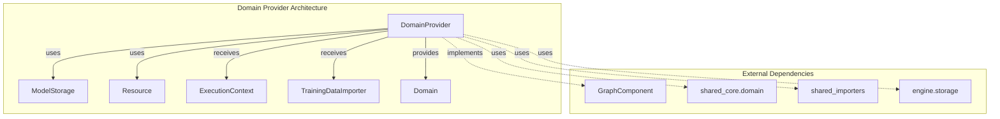
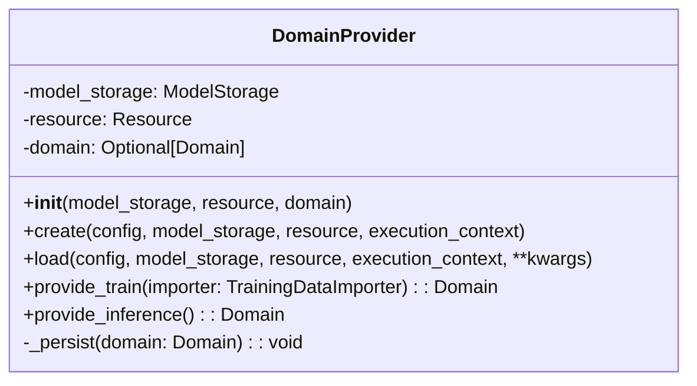
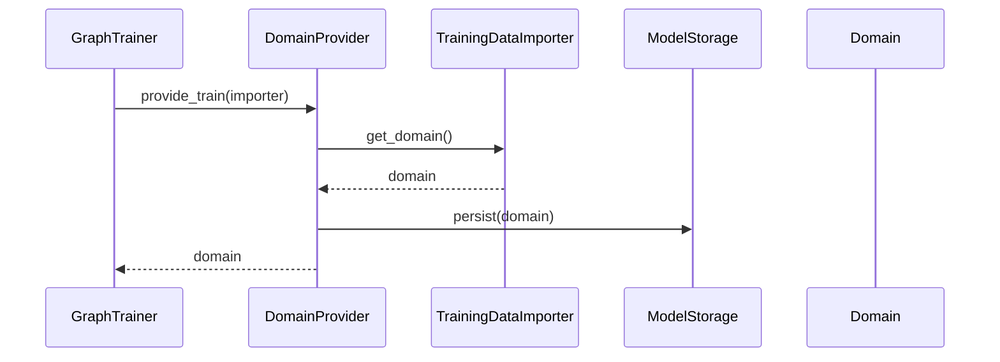
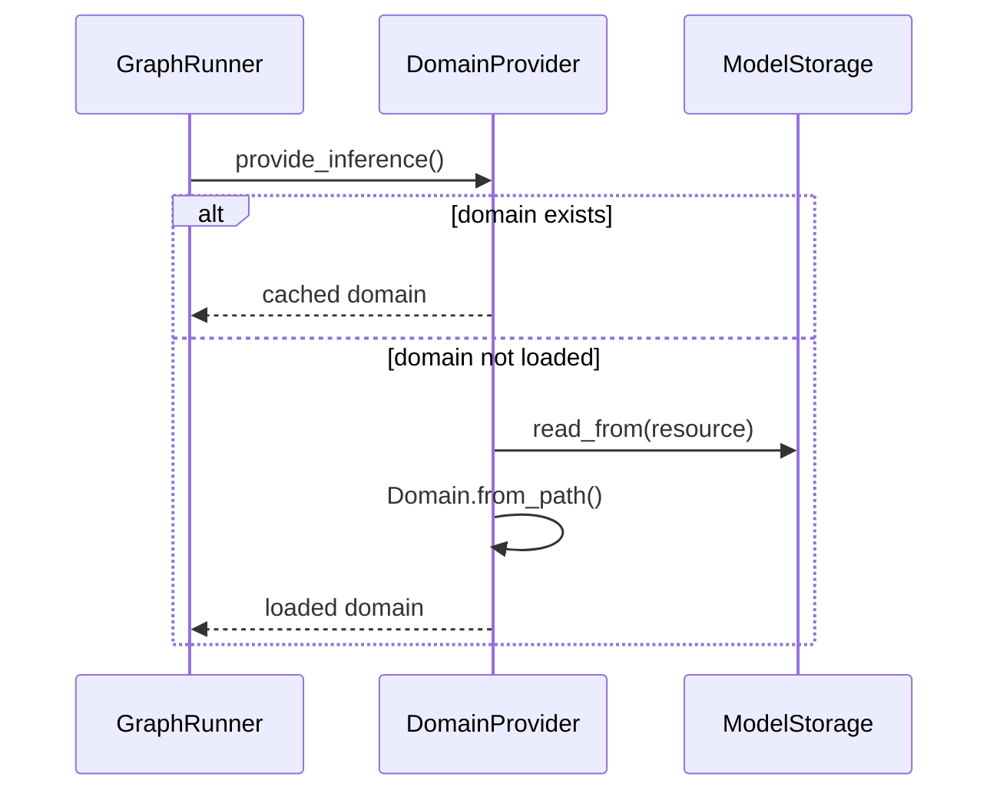
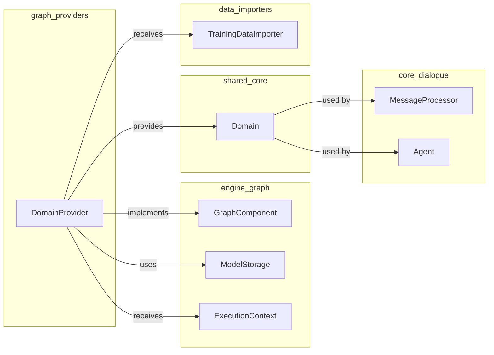

# Domain Provider Module

## Introduction

The Domain Provider module is a critical component of the Rasa graph-based architecture that manages the lifecycle and provisioning of the conversational AI domain. It serves as the central source of truth for domain information during both training and inference phases, ensuring consistent access to intents, entities, slots, actions, and response templates across the entire system.

## Architecture Overview

The Domain Provider operates within the graph execution framework, implementing the `GraphComponent` interface to integrate seamlessly with Rasa's engine architecture. It acts as a data provider node that supplies domain information to other components during graph execution.

## Component Details

### DomainProvider Class

The `DomainProvider` is the core component that implements the `GraphComponent` interface. It manages domain persistence and provisioning throughout the model lifecycle.

#### Key Responsibilities:
- **Domain Loading**: Loads domain from training data during the training phase
- **Domain Persistence**: Persists domain to model storage for later retrieval
- **Domain Provisioning**: Provides domain instances during both training and inference
- **Resource Management**: Handles model storage resources for domain data

#### Class Structure:

## Data Flow

### Training Flow

### Inference Flow

## Integration with Rasa Architecture

The Domain Provider integrates with multiple Rasa subsystems:

## Key Methods

### `create()`
Factory method that creates a new DomainProvider instance during graph construction. Initializes the provider with model storage and resource references.

### `load()`
Factory method that creates a DomainProvider instance from persisted state. Loads the domain from model storage and caches it for inference.

### `provide_train()`
Provides domain during training by extracting it from the TrainingDataImporter and persisting it to model storage for future use.

### `provide_inference()`
Provides domain during inference by returning the cached domain instance. Validates that domain is available before proceeding.

## Error Handling

The Domain Provider implements robust error handling:

- **InvalidConfigException**: Raised when no domain is available during inference, ensuring early failure detection
- **Resource Management**: Proper handling of model storage resources with context managers
- **Domain Validation**: Implicit validation through Domain class methods during loading/persistence

## Dependencies

### Direct Dependencies
- [engine_graph.md](engine_graph.md): Provides `GraphComponent`, `ModelStorage`, and `ExecutionContext`
- [shared_core.md](shared_core.md): Provides `Domain` class for domain representation
- [data_importers.md](data_importers.md): Provides `TrainingDataImporter` for training data access

### Indirect Dependencies
- [core_dialogue.md](core_dialogue.md): Uses domain for dialogue processing
- [nlu_processing.md](nlu_processing.md): May reference domain for intent/entity definitions
- [action_framework.md](action_framework.md): Uses domain for action validation

## Usage Patterns

### Training Time
During training, the Domain Provider acts as a source node in the execution graph, providing domain information to downstream components like policies and NLU components that need to understand the conversational scope.

### Inference Time
During inference, the Domain Provider supplies the cached domain to components that need to validate actions, check slot mappings, or access response templates.

## Performance Considerations

- **Caching**: Domain is cached in memory during inference to avoid repeated disk I/O
- **Lazy Loading**: Domain is only loaded from storage when needed during inference
- **Resource Efficiency**: Uses model storage abstraction for efficient resource management

## Extension Points

The Domain Provider can be extended or replaced in custom graph configurations:

- Custom domain providers can implement different persistence strategies
- Domain validation can be enhanced by extending the provider
- Resource management can be customized for different storage backends

This modular design allows the Domain Provider to adapt to various deployment scenarios while maintaining a consistent interface for domain provisioning across the Rasa ecosystem.