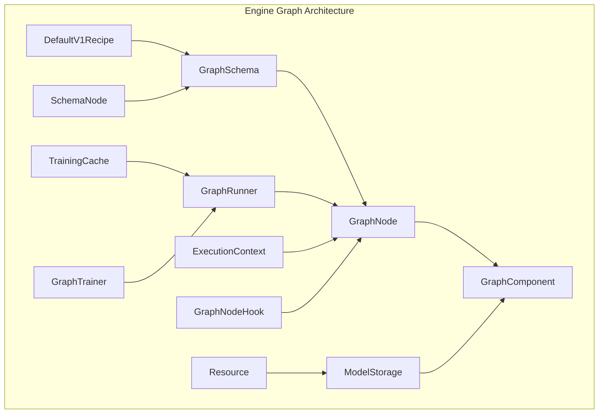
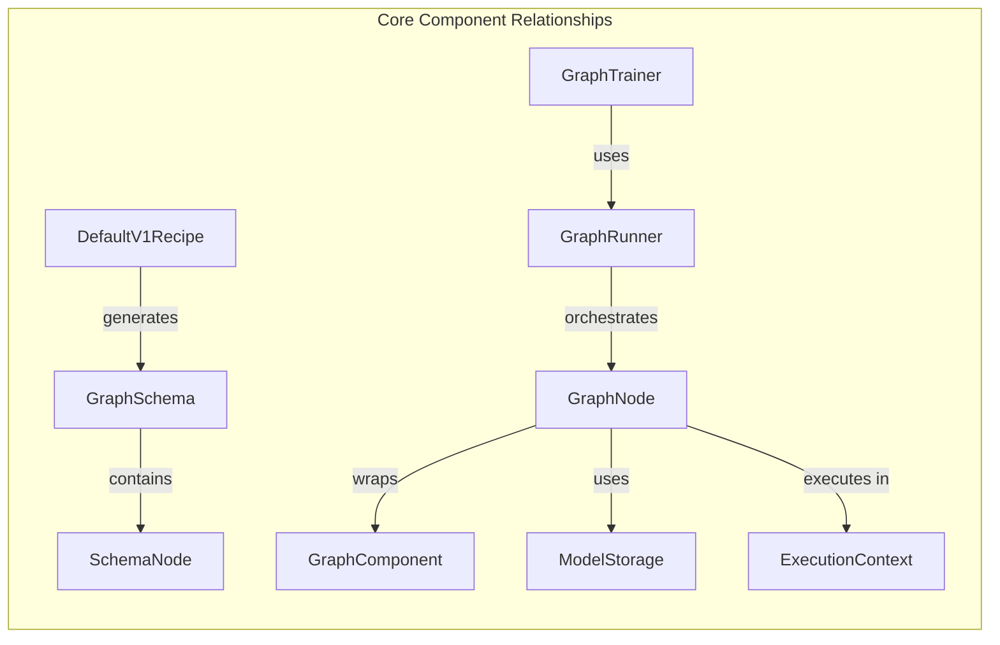
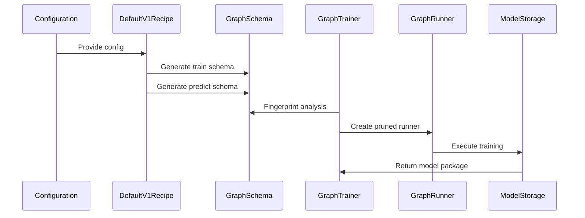
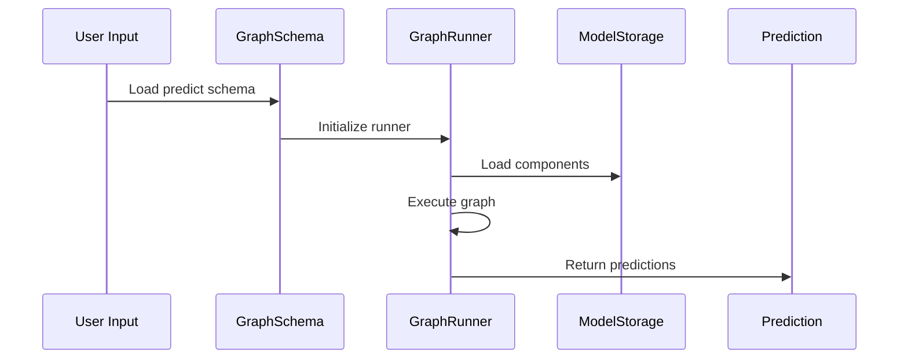

# Engine Graph Module Documentation

## Overview

The `engine_graph` module is the core execution framework of Rasa, providing a graph-based architecture for training and running conversational AI models. It implements a sophisticated dependency injection system that manages the lifecycle of components, handles data flow between them, and enables efficient caching and fingerprinting for optimized training.

## Purpose and Core Functionality

The engine graph module serves as the backbone of Rasa's training and inference pipeline by:

1. **Graph-Based Execution**: Orchestrating complex ML pipelines as directed acyclic graphs (DAGs) where nodes represent components and edges represent data dependencies
2. **Component Lifecycle Management**: Handling instantiation, configuration, and execution of graph components
3. **Intelligent Caching**: Implementing fingerprint-based caching to avoid redundant computations during training
4. **Model Persistence**: Managing storage and retrieval of trained components
5. **Training Optimization**: Supporting incremental training and fine-tuning through sophisticated dependency tracking

## Architecture Overview

### Core Components Architecture

## Module Structure

The engine_graph module is organized into several key sub-modules:

### 1. Graph Core (`rasa.engine.graph`)
Contains the fundamental graph abstractions and component interfaces.

**Key Components:**
- **[GraphComponent](graph_core.md#graphcomponent)**: Abstract base class for all graph components
- **[GraphNode](graph_core.md#graphnode)**: Wrapper that manages component lifecycle and execution
- **[GraphSchema](graph_core.md#graphschema)**: Defines the structure and dependencies of the execution graph
- **[SchemaNode](graph_core.md#schemanode)**: Configuration for individual graph nodes
- **[ExecutionContext](graph_core.md#executioncontext)**: Runtime context for graph execution

[Detailed Graph Core Documentation](graph_core.md)

### 2. Recipe System (`rasa.engine.recipes`)
Converts high-level configuration into executable graph schemas.

**Key Components:**
- **[DefaultV1Recipe](recipe_system.md#defaultv1recipe)**: Main recipe implementation that transforms configs to graphs
- **Component Registration**: Decorator-based system for registering components with the recipe
- **Graph Generation**: Logic for creating training and prediction graphs from configurations

[Detailed Recipe System Documentation](recipe_system.md)

### 3. Training Framework (`rasa.engine.training`)
Implements the training orchestration and optimization logic.

**Key Components:**
- **[GraphTrainer](training_framework.md#graphtrainer)**: Main training orchestrator with fingerprinting and caching
- **Fingerprinting System**: Determines which components need retraining
- **Caching Mechanism**: Stores and retrieves intermediate results
- **Pruning Logic**: Optimizes graphs by removing unnecessary nodes

[Detailed Training Framework Documentation](training_framework.md)

### 4. Storage Layer (`rasa.engine.storage`)
Manages persistence of trained components and model artifacts.

**Key Components:**
- **[ModelStorage](storage_layer.md#modelstorage)**: Abstract interface for model persistence
- **[ModelMetadata](storage_layer.md#modelmetadata)**: Metadata describing trained models
- **Resource Management**: Handles component-specific storage needs

[Detailed Storage Layer Documentation](storage_layer.md)

### 5. Execution Engine (`rasa.engine.runner`)
Provides the runtime execution environment for graphs.

**Key Components:**
- **[GraphRunner](execution_engine.md#graphrunner)**: Abstract interface for graph execution
- **Hook System**: Enables pre/post execution hooks for monitoring and debugging

[Detailed Execution Engine Documentation](execution_engine.md)

## Data Flow Architecture

### Training Flow

### Prediction Flow

## Key Features

### 1. Intelligent Caching and Fingerprinting
The engine implements sophisticated caching mechanisms to optimize training:
- **Component Fingerprinting**: Each component's fingerprint is calculated based on its configuration, inputs, and dependencies
- **Cache Hits**: Components with matching fingerprints can reuse cached results
- **Graph Pruning**: Unnecessary nodes are removed from the training graph based on fingerprint analysis

### 2. Flexible Component Architecture
- **Abstract Base Classes**: All components inherit from `GraphComponent` with standardized interfaces
- **Lifecycle Management**: Components can be instantiated eagerly or lazily based on configuration
- **Resource Management**: Components can persist and load state through the storage layer

### 3. Dependency Injection
- **Automatic Resolution**: The graph automatically resolves component dependencies
- **Configuration Merging**: Default and user configurations are merged intelligently
- **Runtime Context**: Execution context provides runtime information to components

### 4. Training Type Support
The engine supports different training modes:
- **NLU Training**: Natural language understanding components
- **Core Training**: Dialogue management and policy training
- **End-to-End Training**: Combined NLU and core training
- **Fine-tuning**: Incremental training on existing models

## Integration with Other Modules

The engine_graph module integrates closely with:

- **[core_dialogue](core_dialogue.md)**: Provides the dialogue management components that execute within the graph
- **[nlu_processing](nlu_processing.md)**: Supplies NLU components for natural language understanding
- **[shared_core](shared_core.md)**: Uses shared data structures like Domain and Events
- **[shared_nlu](shared_nlu.md)**: Leverages shared NLU data structures and training data
- **[graph_providers](graph_providers.md)**: Data providers that supply training data to the graph

## Configuration and Usage

The engine is typically configured through:
1. **Configuration Files**: YAML configuration specifying pipeline and policies
2. **Recipe Registration**: Components register themselves with the recipe system
3. **Graph Generation**: The recipe converts configuration to executable graphs
4. **Training Execution**: GraphTrainer orchestrates the training process

## Performance Considerations

- **Lazy Instantiation**: Components are instantiated only when needed
- **Parallel Execution**: Graph structure enables parallel component execution
- **Memory Management**: Caching and pruning optimize memory usage
- **Incremental Training**: Fingerprinting minimizes redundant computations

This architecture provides a robust, scalable foundation for building and training conversational AI models while maintaining flexibility for customization and extension.