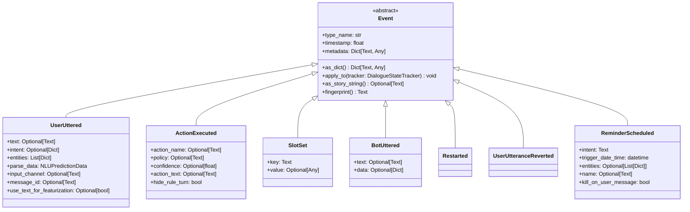
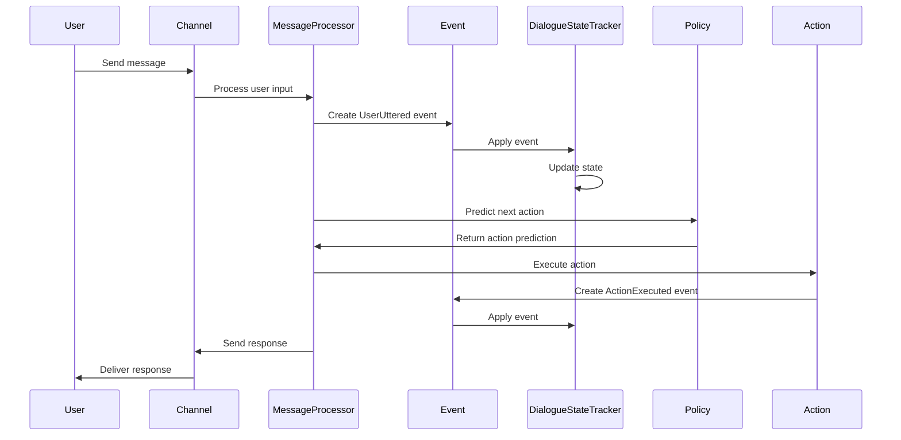
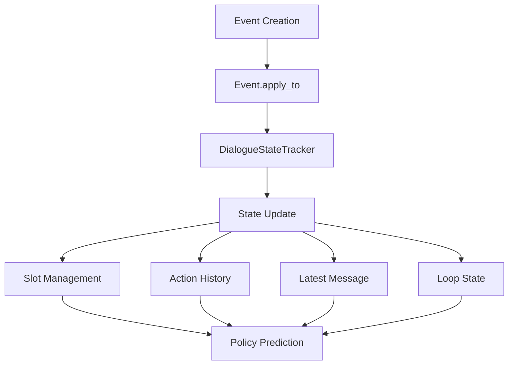
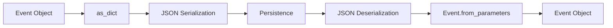

# Events Module Documentation

## Overview

The events module is a fundamental component of Rasa's conversation tracking system, providing an immutable representation of everything that happens during a conversation between a user and an assistant. Events serve as the primary mechanism for updating the conversation state and maintaining a complete history of all interactions.

## Purpose and Core Functionality

The events module implements a comprehensive event-driven architecture that:

- **Records Conversation History**: Captures every user message, bot response, action execution, and state change
- **Enables State Management**: Provides the mechanism for updating the `DialogueStateTracker` with new information
- **Supports Training and Inference**: Facilitates both conversation tracking during runtime and training data preparation
- **Enables Conversation Control**: Allows for sophisticated conversation flow management through specialized events

## Architecture

### Core Event Hierarchy

### Event Processing Flow

## Key Components

### Event Base Class

The `Event` abstract base class provides the foundation for all event types:

- **Serialization Support**: Converts events to dictionaries for persistence
- **Story String Generation**: Creates human-readable representations for training data
- **State Application**: Updates the conversation tracker with new information
- **Fingerprinting**: Generates unique identifiers for event deduplication

### Core Event Types

#### UserUttered
Represents user input with comprehensive NLU information:
- **Text Processing**: Stores original user message text
- **Intent Recognition**: Captures predicted intent with confidence scores
- **Entity Extraction**: Maintains extracted entities with metadata
- **Featurization Control**: Determines whether to use text or intent for policy prediction

#### ActionExecuted
Documents action execution with prediction context:
- **Action Identification**: Records which action was executed
- **Policy Attribution**: Tracks which policy made the prediction
- **Confidence Scoring**: Stores prediction confidence levels
- **End-to-End Support**: Handles both named actions and text predictions

#### SlotSet
Manages conversation state through slot updates:
- **Key-Value Storage**: Simple interface for setting slot values
- **Type Safety**: Supports any JSON-serializable value type
- **State Synchronization**: Automatically updates tracker state

#### BotUttered
Captures bot responses for conversation history:
- **Response Content**: Stores text and structured response data
- **Metadata Preservation**: Maintains response metadata for analytics
- **Channel Agnostic**: Works across different output channels

### Specialized Events

#### Conversation Control Events
- **Restarted**: Resets conversation state completely
- **UserUtteranceReverted**: Rolls back to before last user message
- **ActionReverted**: Undoes the last action and its effects
- **ConversationPaused/Resumed**: Controls human handover scenarios

#### Reminder System Events
- **ReminderScheduled**: Sets up timed intent triggers
- **ReminderCancelled**: Removes scheduled reminders
- **SessionStarted**: Marks new conversation sessions

#### Form and Loop Events
- **ActiveLoop**: Manages form and loop activation
- **LoopInterrupted**: Controls form validation behavior
- **EntitiesAdded**: Adds entities to existing user messages

## Integration with Core System

### Tracker Integration

### Policy Framework Integration

Events integrate with the policy framework through:
- **State Representation**: Events provide features for policy prediction
- **Training Data**: Event sequences form the basis of training stories
- **Action Validation**: Events track action execution and outcomes

### NLU Processing Integration

The `UserUttered` event serves as the bridge between NLU and dialogue management:
- **Parse Data Integration**: Stores complete NLU pipeline results
- **Entity Management**: Maintains extracted entities with full metadata
- **Intent Handling**: Preserves intent predictions and confidence scores

## Data Flow and Serialization

### Event Serialization

### Story Format Generation

Events support conversion to training story formats:
- **Markdown Format**: Human-readable story representation
- **YAML Format**: Structured training data format
- **End-to-End Support**: Handles text-based predictions

## Error Handling and Validation

### Event Validation
- **Type Checking**: Validates event parameters during construction
- **Consistency Checks**: Ensures event relationships are valid
- **Serialization Safety**: Handles complex data types safely

### Error Recovery
- **Graceful Degradation**: Continues operation with partial event data
- **Logging Integration**: Comprehensive event logging for debugging
- **Fallback Mechanisms**: Provides default behaviors for edge cases

## Performance Considerations

### Memory Management
- **Immutable Design**: Events are immutable once created
- **Efficient Serialization**: Optimized dictionary representations
- **Fingerprint Caching**: Cached hash values for deduplication

### Processing Optimization
- **Batch Operations**: Supports event batching for efficiency
- **Lazy Evaluation**: Defers expensive operations until needed
- **State Minimization**: Only updates changed tracker components

## Extension Points

### Custom Event Types

The event system supports extension through:
- **Subclassing**: Create new event types by extending the base `Event` class
- **Type Registration**: Register new event types with the resolution system
- **Custom Serialization**: Implement specialized serialization logic

### Event Hooks

Integration points for custom behavior:
- **Pre-application Hooks**: Process events before tracker updates
- **Post-application Hooks**: React to state changes after event application
- **Serialization Hooks**: Customize event persistence behavior

## Testing and Debugging

### Event Inspection
- **String Representation**: Human-readable event descriptions
- **Dictionary Access**: Complete event data exposure
- **Metadata Support**: Attach debugging information to events

### Conversation Replay
- **Event Sequences**: Complete conversation reconstruction
- **State Verification**: Validate tracker state after event application
- **Debugging Support**: Comprehensive event logging and tracing

## Related Modules

- **[DialogueStateTracker](trackers.md)**: The primary consumer of events for state management
- **[PolicyFramework](policy_framework.md)**: Uses events for prediction and training
- **[ActionFramework](action_framework.md)**: Generates events through action execution
- **[NLUProcessing](nlu_processing.md)**: Provides parse data for UserUttered events

## Best Practices

### Event Creation
- Always provide complete context when creating events
- Use appropriate event types for specific scenarios
- Include meaningful metadata for debugging and analytics

### Event Processing
- Handle events in the correct order to maintain state consistency
- Validate event data before application when possible
- Use event fingerprints for deduplication and comparison

### Custom Events
- Follow the established patterns for new event types
- Implement all required abstract methods
- Consider serialization requirements during design