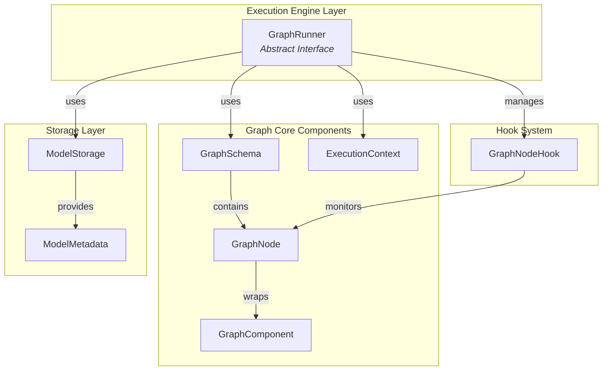
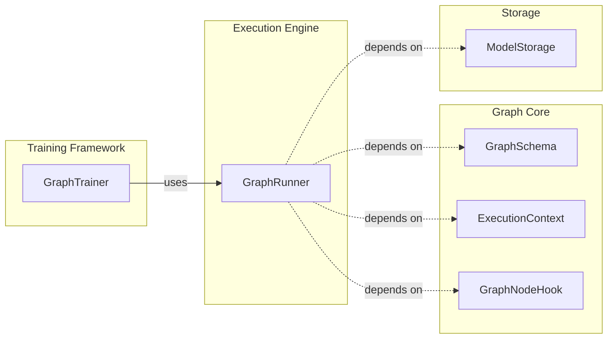
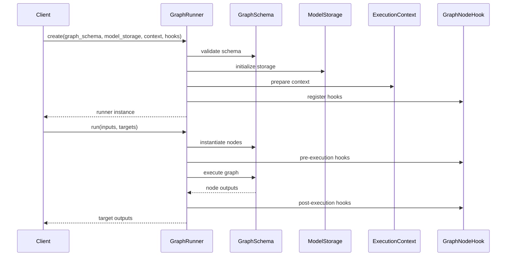

# Execution Engine Module

## Introduction

The Execution Engine module provides the core runtime infrastructure for Rasa's graph-based architecture. It serves as the execution layer that orchestrates the running of graph schemas, managing the flow of data between components and ensuring proper lifecycle management of graph nodes. This module is fundamental to Rasa's ability to process conversations, train models, and execute complex workflows in a modular and extensible manner.

## Architecture Overview

The Execution Engine operates as the runtime coordinator within Rasa's graph architecture, sitting at the heart of the system's execution model. It provides the abstract foundation for running graph schemas while delegating specific execution strategies to concrete implementations.



## Core Components

### GraphRunner Interface

The `GraphRunner` is the central abstraction that defines how graph schemas are executed within the Rasa system. It provides a contract for running instantiated graphs with specific inputs and targets, ensuring consistent execution behavior across different implementations.

#### Key Responsibilities

- **Graph Instantiation**: Creates runnable instances from graph schemas
- **Execution Orchestration**: Manages the flow of data between graph nodes
- **Lifecycle Management**: Handles the creation, execution, and cleanup of graph components
- **Hook Integration**: Provides extension points for monitoring and modifying execution
- **Input/Output Management**: Handles the mapping of inputs to appropriate nodes and collection of target outputs

#### Interface Definition

```python
class GraphRunner(ABC):
    """A `GraphRunner` is responsible for running a `GraphSchema`."""
    
    @classmethod
    @abstractmethod
    def create(
        cls,
        graph_schema: GraphSchema,
        model_storage: ModelStorage,
        execution_context: ExecutionContext,
        hooks: Optional[List[GraphNodeHook]] = None,
    ) -> GraphRunner:
        """Creates a new instance of a `GraphRunner`."""
        ...
    
    @abstractmethod
    def run(
        self,
        inputs: Optional[Dict[Text, Any]] = None,
        targets: Optional[List[Text]] = None,
    ) -> Dict[Text, Any]:
        """Runs the instantiated graph with the given inputs and targets."""
        ...
```

## Component Relationships

### Dependency Graph



### Integration Points

The Execution Engine integrates with several key modules within the Rasa architecture:

1. **[Graph Core](graph_core.md)**: Provides the fundamental graph abstractions and node management
2. **[Storage Layer](storage_layer.md)**: Offers persistent storage for model artifacts and component state
3. **[Training Framework](training_framework.md)**: Utilizes the execution engine for training workflows
4. **[Recipe System](recipe_system.md)**: Defines the graph schemas that the execution engine runs

## Data Flow Architecture

### Execution Flow



### Input/Output Processing

The execution engine processes inputs and outputs through a sophisticated mapping system:

- **Input Mapping**: Inputs are mapped to specific nodes within the graph schema based on node names
- **Dependency Resolution**: The engine resolves dependencies between nodes to determine execution order
- **Target Collection**: Only specified target nodes are included in the final output
- **Error Handling**: The engine manages errors and exceptions during graph execution

## Execution Strategies

### Synchronous Execution

The default execution strategy processes nodes in dependency order, ensuring that all prerequisites are satisfied before a node executes. This approach provides:

- **Deterministic Behavior**: Predictable execution order and results
- **Error Propagation**: Clear error handling and propagation mechanisms
- **Resource Management**: Efficient use of system resources

### Hook Integration

The execution engine supports a comprehensive hook system that allows for:

- **Pre-execution Hooks**: Code that runs before each node executes
- **Post-execution Hooks**: Code that runs after each node completes
- **Error Hooks**: Code that runs when nodes fail
- **Monitoring**: Integration with external monitoring systems

## Usage Patterns

### Basic Usage

```python
# Create a graph runner
runner = GraphRunner.create(
    graph_schema=my_schema,
    model_storage=my_storage,
    execution_context=my_context
)

# Execute the graph
results = runner.run(
    inputs={"input_node": input_data},
    targets=["output_node"]
)
```

### Advanced Usage with Hooks

```python
# Define custom hooks
hooks = [MyCustomHook(), MonitoringHook()]

# Create runner with hooks
runner = GraphRunner.create(
    graph_schema=my_schema,
    model_storage=my_storage,
    execution_context=my_context,
    hooks=hooks
)

# Execute with monitoring
results = runner.run(inputs=inputs, targets=targets)
```

## Extension Points

### Custom GraphRunner Implementations

The abstract `GraphRunner` interface allows for custom implementations that can:

- **Optimize Execution**: Implement parallel or distributed execution strategies
- **Add Monitoring**: Integrate with external monitoring and logging systems
- **Customize Error Handling**: Implement domain-specific error handling strategies
- **Extend Functionality**: Add features like caching, checkpointing, or profiling

### Hook Development

Custom hooks can be developed to:

- **Monitor Performance**: Track execution times and resource usage
- **Validate Data**: Ensure data integrity between nodes
- **Log Activity**: Provide detailed execution logs
- **Integrate Systems**: Connect with external systems and services

## Performance Considerations

### Scalability

The execution engine is designed to handle graphs of varying complexity:

- **Memory Management**: Efficient handling of large graphs and datasets
- **Resource Optimization**: Minimal overhead for node execution
- **Parallel Execution**: Support for concurrent node execution where dependencies allow

### Optimization Strategies

- **Graph Pruning**: Removal of unnecessary nodes and edges
- **Caching**: Reuse of intermediate results where appropriate
- **Lazy Evaluation**: Deferred execution of non-essential nodes
- **Resource Pooling**: Reuse of expensive resources across nodes

## Error Handling

### Exception Management

The execution engine provides comprehensive error handling:

- **Node-level Errors**: Individual node failures are isolated and reported
- **Dependency Failures**: Proper handling of failed dependencies
- **Recovery Mechanisms**: Options for retry and recovery strategies
- **Error Propagation**: Clear error reporting to calling code

### Validation

- **Schema Validation**: Ensures graph schemas are valid before execution
- **Input Validation**: Validates inputs against expected types and formats
- **Dependency Validation**: Checks for circular dependencies and missing requirements
- **Resource Validation**: Ensures required resources are available

## Testing and Quality Assurance

### Testability

The execution engine is designed for testability:

- **Mock Support**: Easy mocking of dependencies for unit testing
- **Isolation**: Clear separation of concerns for focused testing
- **Observability**: Comprehensive logging and monitoring capabilities
- **Reproducibility**: Deterministic execution for consistent test results

### Quality Metrics

Key quality indicators for the execution engine:

- **Performance**: Execution time and resource utilization
- **Reliability**: Success rate and error handling effectiveness
- **Scalability**: Performance with increasing graph complexity
- **Maintainability**: Code complexity and extension ease

## Future Considerations

### Potential Enhancements

- **Distributed Execution**: Support for executing graphs across multiple machines
- **Dynamic Graphs**: Runtime modification of graph structure
- **Streaming Support**: Processing of continuous data streams
- **Advanced Scheduling**: Sophisticated node scheduling algorithms

### Integration Opportunities

- **Cloud Platforms**: Native integration with cloud execution environments
- **Container Orchestration**: Support for Kubernetes and similar platforms
- **Workflow Engines**: Integration with external workflow management systems
- **Monitoring Tools**: Enhanced integration with APM and monitoring solutions

## Related Documentation

- [Graph Core Components](graph_core.md) - Core graph abstractions and node management
- [Storage Layer](storage_layer.md) - Model storage and persistence mechanisms
- [Training Framework](training_framework.md) - Training workflows and graph execution
- [Recipe System](recipe_system.md) - Graph schema definition and configuration