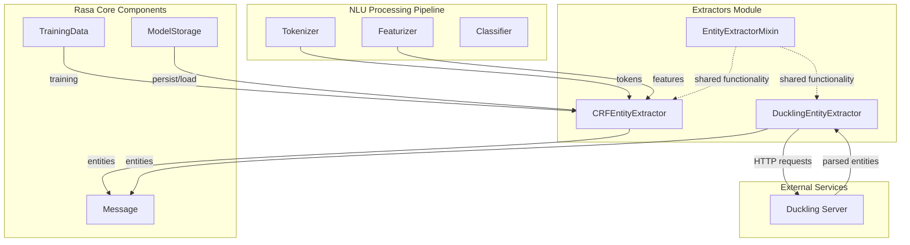
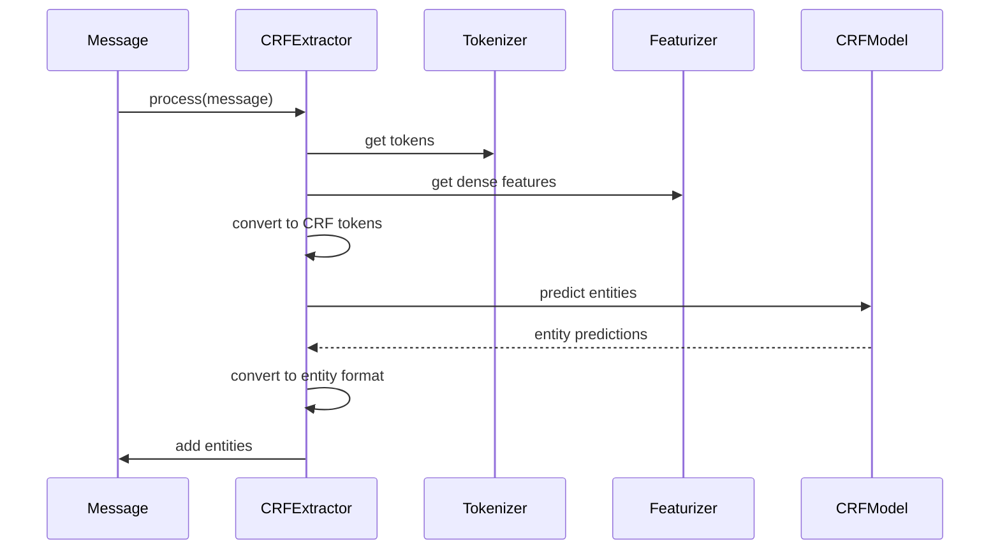
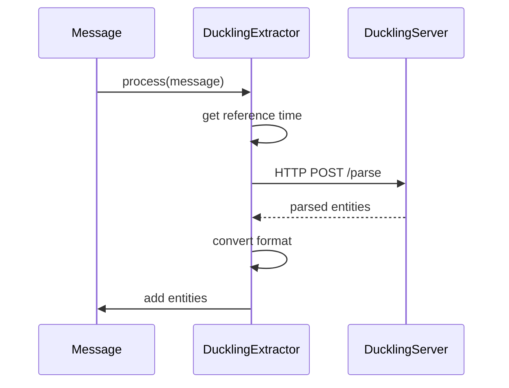
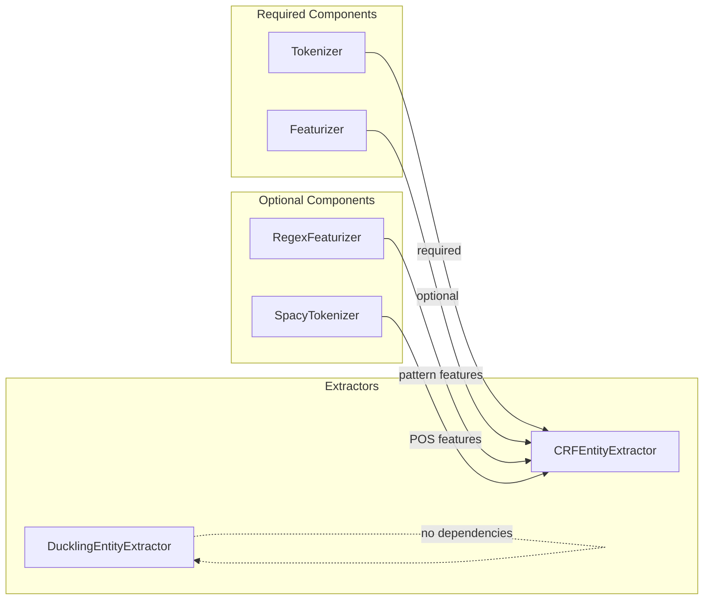
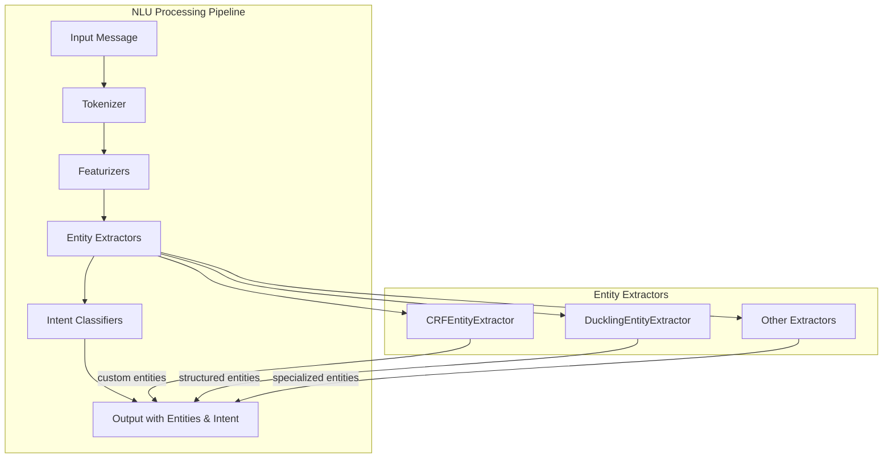
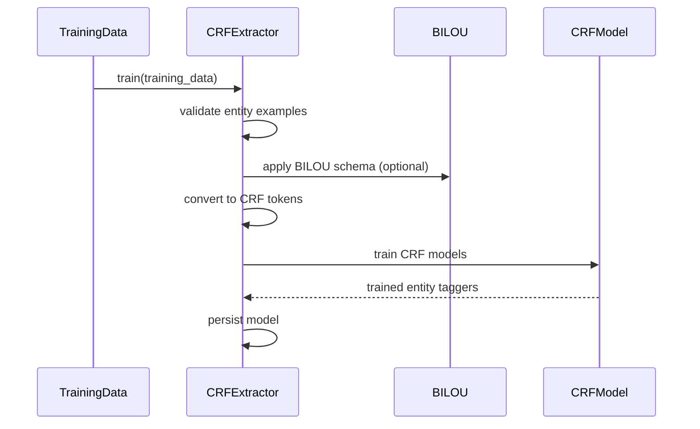
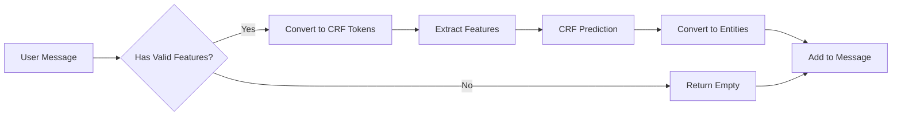

# Extractors Module Documentation

## Introduction

The extractors module is a core component of Rasa's NLU (Natural Language Understanding) system, responsible for identifying and extracting structured information from user messages. This module provides specialized entity extraction capabilities that complement the intent classification functionality, enabling conversational AI systems to understand not just what users want to do, but also the specific details they provide.

The module implements two primary extraction strategies: pattern-based extraction using Conditional Random Fields (CRF) for custom entities, and rule-based extraction using Duckling for common structured entities like dates, numbers, and locations.

## Architecture Overview



## Core Components

### CRFEntityExtractor

The `CRFEntityExtractor` is a trainable component that uses Conditional Random Fields to identify custom entities in text. It supports complex entity recognition including entity types, roles, and groups, and can leverage various linguistic features to improve extraction accuracy.

#### Key Features
- **Multi-level extraction**: Supports entity types, roles, and groups
- **Feature engineering**: Configurable feature sets including linguistic patterns, POS tags, and dense features
- **BILOU tagging**: Optional BILOU (Begin, Inside, Last, Outside, Unit) schema for improved sequence labeling
- **Context awareness**: Uses surrounding tokens as context for entity prediction

#### Configuration Options
```yaml
features:
  - ["low", "title", "upper"]  # before token features
  - ["low", "bias", "prefix5", "prefix2", "suffix5", "suffix3", "suffix2", "upper", "title", "digit", "pattern"]  # current token features
  - ["low", "title", "upper"]  # after token features
BILOU_flag: true
max_iterations: 50
L1_c: 0.1
L2_c: 0.1
```

#### Processing Flow


### DucklingEntityExtractor

The `DucklingEntityExtractor` is a rule-based component that interfaces with Facebook's Duckling server to extract common structured entities such as dates, times, numbers, temperatures, and locations. This extractor requires an external Duckling server to be running.

#### Supported Dimensions
- **Time**: dates, times, durations, intervals
- **Numbers**: integers, decimals, ordinals
- **Temperature**: temperature values with units
- **Volume**: volume measurements
- **Amount of Money**: currency values
- **Distance**: distance measurements
- **Quantity**: quantities with units

#### Configuration Options
```yaml
url: "http://localhost:8000"  # Duckling server URL
dimensions: ["time", "number", "temperature"]
locale: "en_US"
timezone: "UTC"
timeout: 3
```

#### Processing Flow


## Component Relationships

### Dependencies


### Integration with NLU Pipeline


## Data Flow

### Training Data Processing


### Message Processing


## Configuration Examples

### Basic CRF Configuration
```yaml
pipeline:
- name: WhitespaceTokenizer
- name: RegexFeaturizer
- name: CRFEntityExtractor
  features:
    - ["low", "title"]
    - ["low", "bias", "prefix5", "suffix5"]
    - ["low", "title"]
```

### Advanced CRF with Dense Features
```yaml
pipeline:
- name: SpacyTokenizer
- name: SpacyFeaturizer
- name: RegexFeaturizer
- name: CRFEntityExtractor
  features:
    - ["low", "pos", "text_dense_features"]
    - ["low", "bias", "prefix5", "suffix5", "pos", "pattern", "text_dense_features"]
    - ["low", "pos", "text_dense_features"]
  featurizers: ["SpacyFeaturizer"]
  BILOU_flag: true
```

### Duckling Configuration
```yaml
pipeline:
- name: DucklingEntityExtractor
  url: "http://localhost:8000"
  dimensions: ["time", "number", "temperature"]
  locale: "en_US"
  timezone: "America/New_York"
```

### Combined Extractors
```yaml
pipeline:
- name: WhitespaceTokenizer
- name: RegexFeaturizer
- name: CRFEntityExtractor
  features:
    - ["low", "title"]
    - ["low", "bias", "prefix5", "suffix5", "pattern"]
    - ["low", "title"]
- name: DucklingEntityExtractor
  url: "http://localhost:8000"
  dimensions: ["time", "number"]
```

## Best Practices

### CRFEntityExtractor
1. **Training Data**: Ensure sufficient examples per entity type (minimum 100 for BILOU)
2. **Feature Selection**: Start with basic features and add complexity gradually
3. **Context Window**: Use odd number of feature groups for symmetric context
4. **Regularization**: Tune L1 and L2 parameters to prevent overfitting
5. **Evaluation**: Use cross-validation to assess entity extraction performance

### DucklingEntityExtractor
1. **Server Setup**: Ensure Duckling server is running and accessible
2. **Dimension Selection**: Only specify needed dimensions to improve performance
3. **Locale Configuration**: Set appropriate locale for language-specific parsing
4. **Timezone Handling**: Configure timezone for accurate time entity extraction
5. **Error Handling**: Monitor connection issues and server health

### General Guidelines
1. **Pipeline Order**: Place extractors after tokenizers and featurizers
2. **Entity Overlap**: Be aware of potential conflicts between extractors
3. **Performance**: Consider computational cost for real-time applications
4. **Maintenance**: Regularly retrain CRF models with new training data
5. **Monitoring**: Track extraction accuracy and entity coverage in production

## Integration with Other Modules

### [Classifiers Module](classifiers.md)
The extractors work closely with intent classifiers, providing entity information that can be used for more accurate intent prediction and slot filling.

### [Tokenizers Module](tokenizers.md)
Tokenizers are required dependencies for CRFEntityExtractor, providing the tokenization necessary for sequence labeling.

### [Featurizers Module](featurizers.md)
Featurizers provide dense features that can enhance CRF entity extraction performance, particularly when using pre-trained embeddings.

### [Engine Graph](engine_graph.md)
Both extractors integrate with the Rasa engine graph system, supporting the training and inference pipeline architecture.

## Troubleshooting

### Common Issues
1. **CRF Training Failures**: Check for sufficient training examples and valid feature configuration
2. **Duckling Connection Errors**: Verify server status and network connectivity
3. **Poor Extraction Performance**: Review feature selection and training data quality
4. **Entity Conflicts**: Analyze overlapping entities from multiple extractors
5. **Memory Issues**: Consider reducing feature complexity for large datasets

### Performance Optimization
1. **Feature Selection**: Use only relevant features to reduce computational overhead
2. **Dimension Filtering**: Limit Duckling dimensions to needed entities only
3. **Model Persistence**: Ensure proper model loading to avoid retraining
4. **Batch Processing**: Process multiple messages together when possible
5. **Resource Monitoring**: Track memory and CPU usage in production

## References

- [CRFEntityExtractor API Documentation](https://rasa.com/docs/rasa/components#crfentityextractor)
- [DucklingEntityExtractor API Documentation](https://rasa.com/docs/rasa/components#ducklingentityextractor)
- [Duckling Server Repository](https://github.com/facebook/duckling)
- [Conditional Random Fields](https://en.wikipedia.org/wiki/Conditional_random_field)
- [BILOU Tagging Scheme](https://en.wikipedia.org/wiki/Inside%E2%80%93outside%E2%80%93beginning_(tagging))