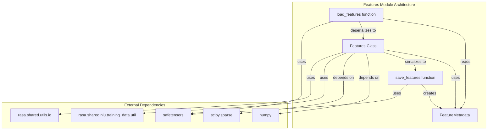
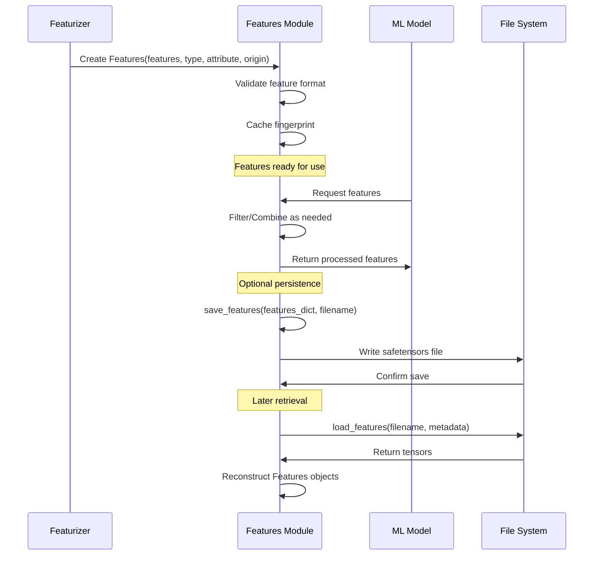
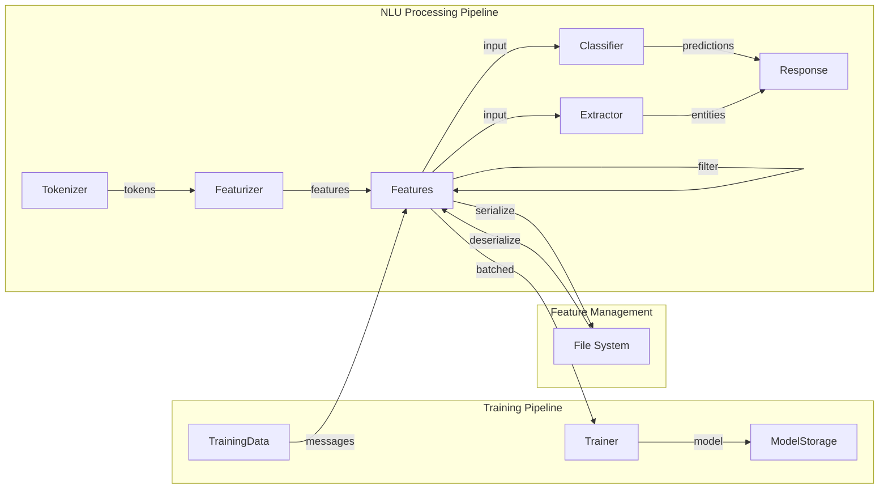
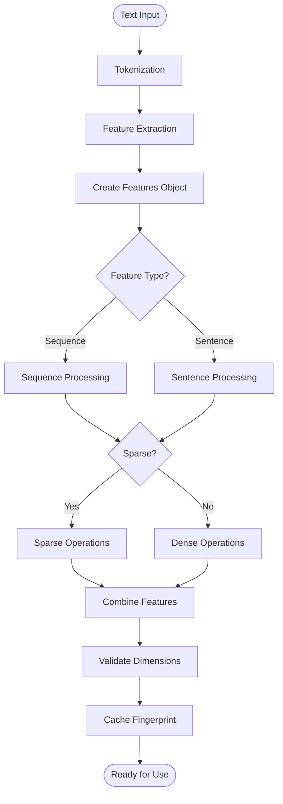
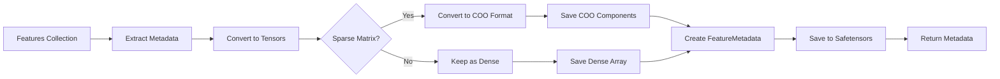

# Features Module Documentation

## Introduction

The features module is a core component of Rasa's NLU (Natural Language Understanding) system that handles the storage, manipulation, and serialization of feature representations extracted from text data. This module provides the foundational data structures and utilities for managing features that are used by various NLU components such as classifiers, extractors, and featurizers.

The `Features` class serves as the primary container for numerical representations of text data, supporting both dense (numpy arrays) and sparse (scipy matrices) feature formats. These features are essential for machine learning models to understand and process natural language input effectively.

## Architecture Overview



## Core Components

### Features Class

The `Features` class is the central component that encapsulates feature data with associated metadata. It provides a unified interface for handling both dense and sparse feature representations.

**Key Properties:**
- `features`: The actual feature data (numpy array or scipy sparse matrix)
- `type`: Feature type (sequence or sentence level)
- `attribute`: Message attribute (TEXT, INTENT, etc.)
- `origin`: Component that created the features
- `_cached_fingerprint`: Cached fingerprint for efficient comparison

**Core Methods:**
- `is_sparse()` / `is_dense()`: Determine feature sparsity
- `combine_with_features()`: Merge features from different sources
- `fingerprint()`: Generate stable hash for comparison
- `filter()`: Static method for filtering feature collections
- `combine()`: Static method for combining multiple features
- `reduce()`: Static method for optimizing feature collections

### FeatureMetadata Dataclass

A structured container for feature serialization metadata, enabling safe storage and retrieval of features to/from disk.

**Fields:**
- `data_type`: Type of feature data
- `attribute`: Message attribute
- `origin`: Source component(s)
- `is_sparse`: Sparsity indicator
- `shape`: Feature matrix dimensions
- `safetensors_key`: Unique key for tensor storage

### Serialization Functions

**`save_features()`**: Serializes feature dictionaries to disk using safetensors format
- Handles both dense and sparse matrices
- Preserves metadata for reconstruction
- Uses COO format for sparse matrix storage

**`load_features()`**: Deserializes features from disk
- Reconstructs original feature objects
- Handles sparse matrix reconstruction from COO format
- Validates feature integrity

## Data Flow



## Component Interactions



## Feature Types and Attributes

The module supports different feature types and attributes that correspond to various aspects of natural language processing:

**Feature Types:**
- `FEATURE_TYPE_SEQUENCE`: Token-level features for sequence processing
- `FEATURE_TYPE_SENTENCE`: Utterance-level features for classification

**Common Attributes:**
- `TEXT`: Raw text content features
- `INTENT`: Intent classification features
- `RESPONSE`: Response selection features
- `ACTION_NAME`: Action prediction features

## Process Flows

### Feature Creation and Combination



### Feature Serialization Workflow



## Integration with Other Modules

The features module integrates closely with several other Rasa modules:

### [shared_nlu Module](shared_nlu.md)
- Provides the `Message` class that contains feature collections
- Shares training data structures and utilities
- Coordinates with the interpreter system

### [nlu_processing Module](nlu_processing.md)
- Featurizers create `Features` objects during text processing
- Classifiers and extractors consume features for predictions
- Tokenizers provide the foundation for sequence features

### [engine_graph Module](engine_graph.md)
- Features are passed between graph components
- Graph nodes may create, transform, or consume features
- Training pipeline uses features for model optimization

## Key Design Patterns

### 1. Immutable Feature Data
Feature matrices are treated as immutable once created. Combination operations create new feature objects rather than modifying existing ones.

### 2. Type Safety
Strict validation ensures only compatible features can be combined (same sparsity, dimensions, and attributes).

### 3. Efficient Serialization
Uses safetensors format for efficient, safe storage of numerical data with metadata preservation.

### 4. Fingerprinting
Stable fingerprinting enables efficient caching and comparison of feature sets across training runs.

## Error Handling

The module implements comprehensive error handling for:
- **Incompatible feature combinations**: Sparse/dense mixing, dimension mismatches
- **Invalid feature formats**: Non-numpy/scipy data types
- **Serialization errors**: File I/O and tensor format issues
- **Metadata inconsistencies**: Missing or corrupted feature metadata

## Performance Considerations

- **Memory Efficiency**: Sparse matrix support for high-dimensional features
- **Caching**: Fingerprint caching avoids redundant computations
- **Vectorized Operations**: NumPy/scipy operations for batch processing
- **Lazy Loading**: Features can be loaded on-demand from disk

## Usage Examples

### Creating Features
```python
# Dense features
import numpy as np
from rasa.shared.nlu.training_data.features import Features

dense_features = Features(
    features=np.array([[1.0, 2.0, 3.0]]),
    feature_type="sentence",
    attribute="text",
    origin="CountVectorsFeaturizer"
)

# Sparse features
import scipy.sparse
sparse_matrix = scipy.sparse.csr_matrix([[1, 0, 1], [0, 1, 0]])
sparse_features = Features(
    features=sparse_matrix,
    feature_type="sequence",
    attribute="text",
    origin="RegexFeaturizer"
)
```

### Combining Features
```python
# Combine compatible features
features1.combine_with_features(features2)

# Combine multiple features statically
combined = Features.combine([features1, features2, features3])
```

### Filtering Features
```python
# Filter by attribute
text_features = Features.filter(all_features, attributes=["text"])

# Filter by type and sparsity
sequence_sparse = Features.filter(
    all_features, 
    type="sequence", 
    is_sparse=True
)
```

This comprehensive feature management system enables Rasa to efficiently handle the complex feature requirements of modern NLP pipelines while maintaining flexibility and performance across different use cases and deployment scenarios.