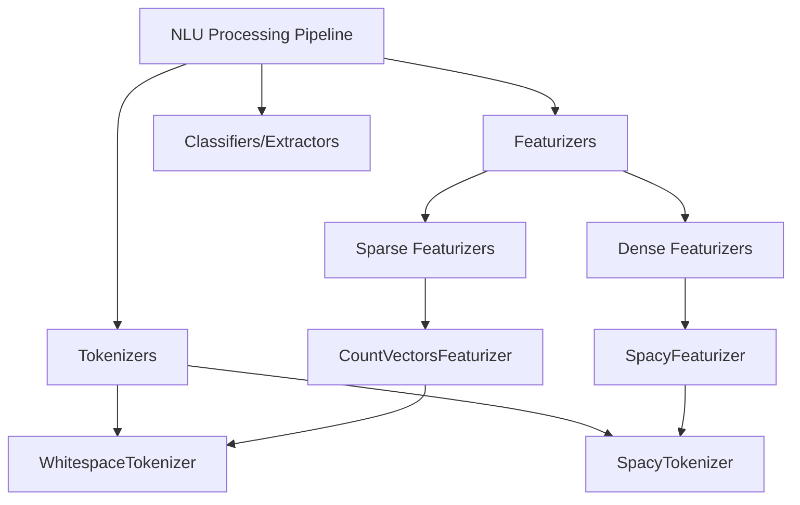
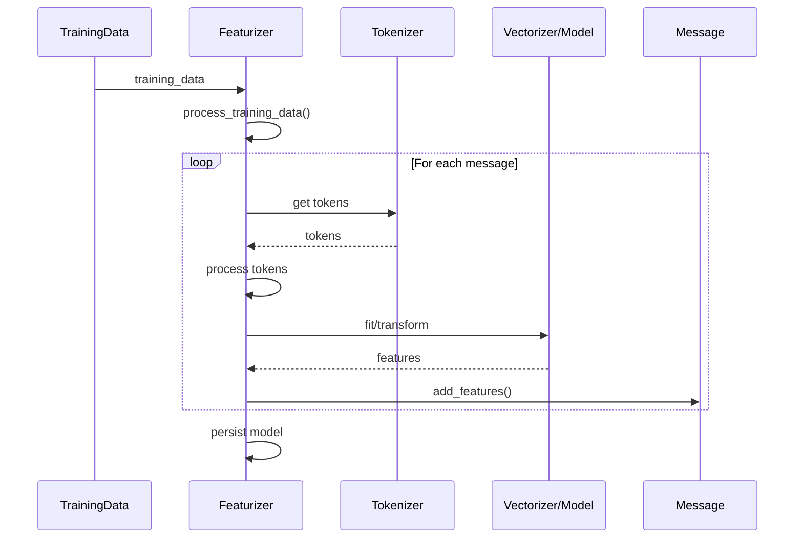
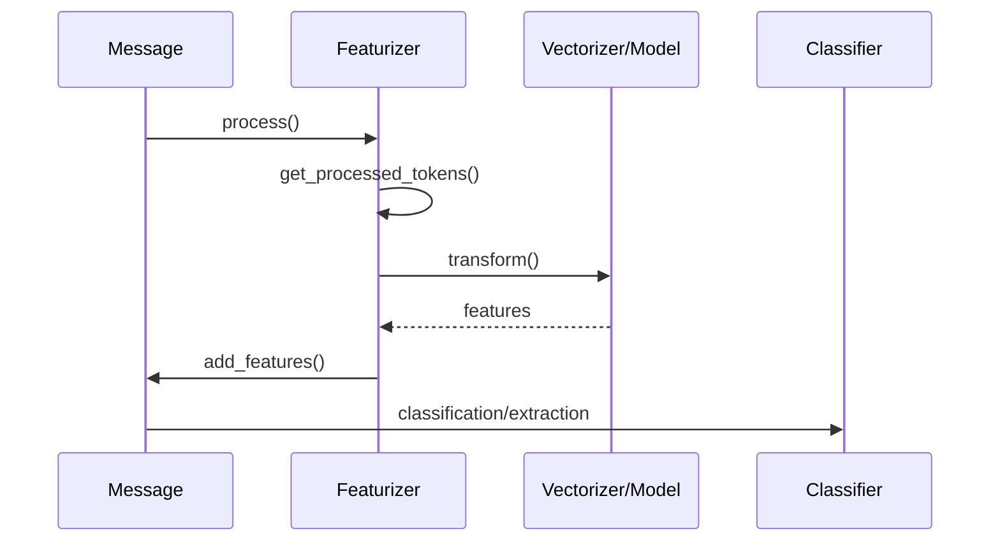
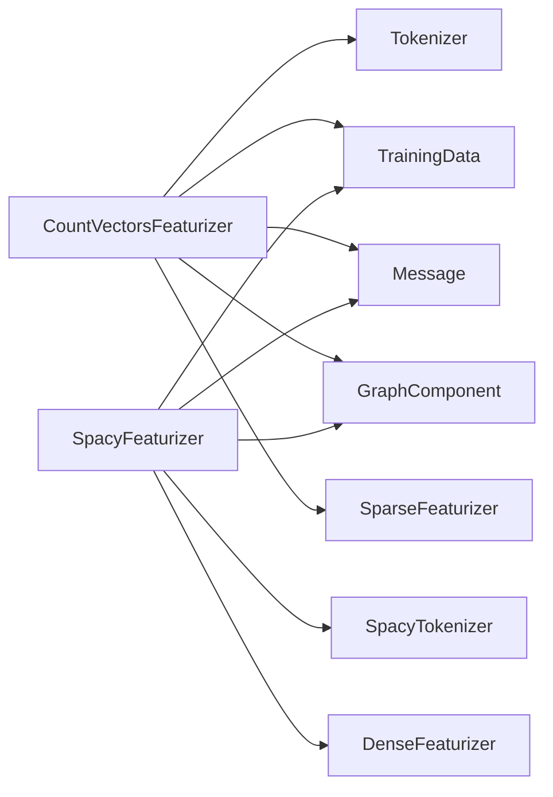
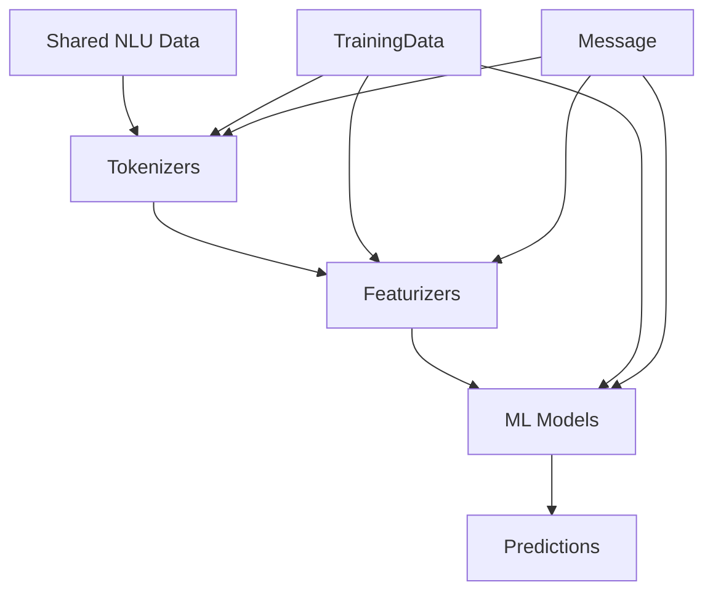

# Featurizers Module Documentation

## Introduction

The featurizers module is a core component of Rasa's NLU processing pipeline, responsible for converting natural language text into numerical feature representations that machine learning models can process. This module provides both sparse and dense featurization capabilities, enabling flexible text representation strategies for different NLP tasks such as intent classification, entity recognition, and response selection.

## Module Overview

The featurizers module sits within the NLU processing hierarchy and provides two main types of featurization:

1. **Sparse Featurization**: Uses the CountVectorsFeaturizer to create bag-of-words representations
2. **Dense Featurization**: Uses pre-trained embeddings like spaCy to create semantic vector representations

## Architecture

### Component Hierarchy



### Core Components

#### CountVectorsFeaturizer
The `CountVectorsFeaturizer` creates sparse feature representations using sklearn's CountVectorizer. It supports:
- Word and character n-grams
- Shared or independent vocabularies across attributes
- Out-of-vocabulary (OOV) token handling
- Configurable preprocessing options

#### SpacyFeaturizer
The `SpacyFeaturizer` creates dense feature representations using spaCy's pre-trained word vectors. It provides:
- Semantic embeddings from spaCy models
- Configurable pooling operations (mean/max)
- Integration with spaCy's tokenization pipeline

## Data Flow

### Training Flow



### Inference Flow



## Component Interactions

### Dependencies



### Integration with NLU Pipeline

The featurizers integrate with the broader NLU pipeline as follows:

1. **Tokenization Phase**: Tokenizers process raw text into tokens
2. **Featurization Phase**: Featurizers convert tokens into numerical features
3. **Classification/Extraction Phase**: ML models use features for predictions

## Configuration and Usage

### CountVectorsFeaturizer Configuration

```yaml
pipeline:
- name: CountVectorsFeaturizer
  analyzer: word  # or 'char', 'char_wb'
  min_ngram: 1
  max_ngram: 1
  use_shared_vocab: false
  OOV_token: "<OOV>"
  OOV_words: ["unknown", "outofvocab"]
  lowercase: true
  stop_words: null
  min_df: 1
  max_df: 1.0
  max_features: null
```

### SpacyFeaturizer Configuration

```yaml
pipeline:
- name: SpacyFeaturizer
  pooling: mean  # or 'max'
```

## Feature Types

### Sequence Features
- Represent individual tokens in context
- Used for token-level tasks (entity extraction)
- Shape: `[sequence_length, feature_dimension]`

### Sentence Features
- Represent entire utterances
- Used for sentence-level tasks (intent classification)
- Shape: `[1, feature_dimension]`

## Processing Attributes

Featurizers can process different message attributes:

- **TEXT**: The main text content
- **INTENT**: Intent labels (for intent classification)
- **ACTION_NAME**: Action names (for dialogue policies)
- **INTENT_RESPONSE_KEY**: Response keys (for response selection)

## Advanced Features

### Shared Vocabulary
The CountVectorsFeaturizer supports shared vocabularies across attributes, useful for maintaining consistency between text and label representations.

### Out-of-Vocabulary Handling
- Configurable OOV tokens for unseen words
- Automatic replacement during inference
- Warning system for missing OOV tokens in training data

### Incremental Training
- Support for fine-tuning existing models
- Vocabulary expansion capabilities
- Preservation of existing feature mappings

## Performance Considerations

### Memory Usage
- Sparse features are memory-efficient for large vocabularies
- Dense features require more memory but provide semantic information
- Vocabulary size can be limited using `max_features`

### Processing Speed
- Count vectorization is fast and deterministic
- SpaCy featurization depends on model size and complexity
- Batch processing is supported for efficiency

## Error Handling

### Common Issues
1. **Empty vocabulary**: Occurs when no valid tokens are found
2. **Missing tokenizer**: Featurizers require compatible tokenizers
3. **OOV token warnings**: When configured OOV tokens aren't present in data
4. **Shared vocab conflicts**: During incremental training with shared vocabularies

### Validation
- Configuration validation through `validate_config()`
- Runtime checks for required components
- Warning systems for potential issues

## Integration with Other Modules

### Related Modules
- **[Tokenizers](tokenizers.md)**: Required dependency for text processing
- **[Classifiers](classifiers.md)**: Consume features for classification tasks
- **[Extractors](extractors.md)**: Use features for entity extraction
- **[Engine Graph](engine_graph.md)**: Integration with the training pipeline

### Data Flow Integration


## Best Practices

1. **Choose appropriate featurizer type** based on your use case:
   - Use sparse features for traditional NLP tasks
   - Use dense features for semantic understanding

2. **Configure vocabulary settings** appropriately:
   - Set reasonable `min_df` and `max_df` thresholds
   - Consider `max_features` for large datasets

3. **Handle OOV words** proactively:
   - Define meaningful OOV tokens
   - Include OOV examples in training data

4. **Monitor vocabulary growth** during incremental training

5. **Test feature quality** by examining feature distributions and model performance

## Conclusion

The featurizers module provides the essential bridge between raw text and machine learning models in Rasa's NLU pipeline. By offering both sparse and dense featurization options, it enables flexible and powerful text representation strategies that can be tailored to specific conversational AI requirements.