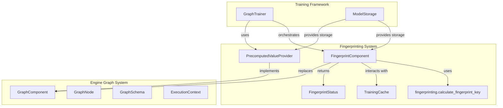
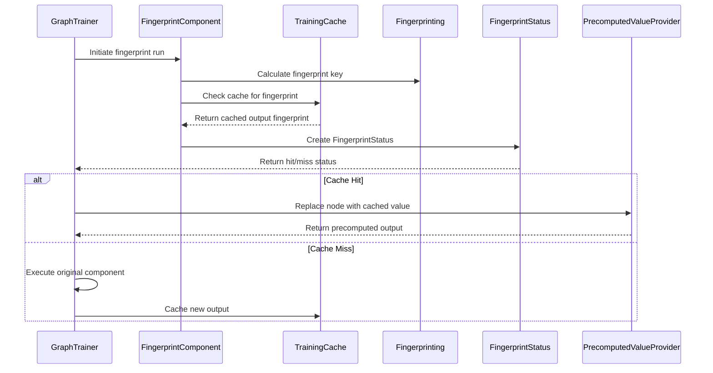
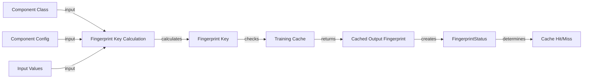
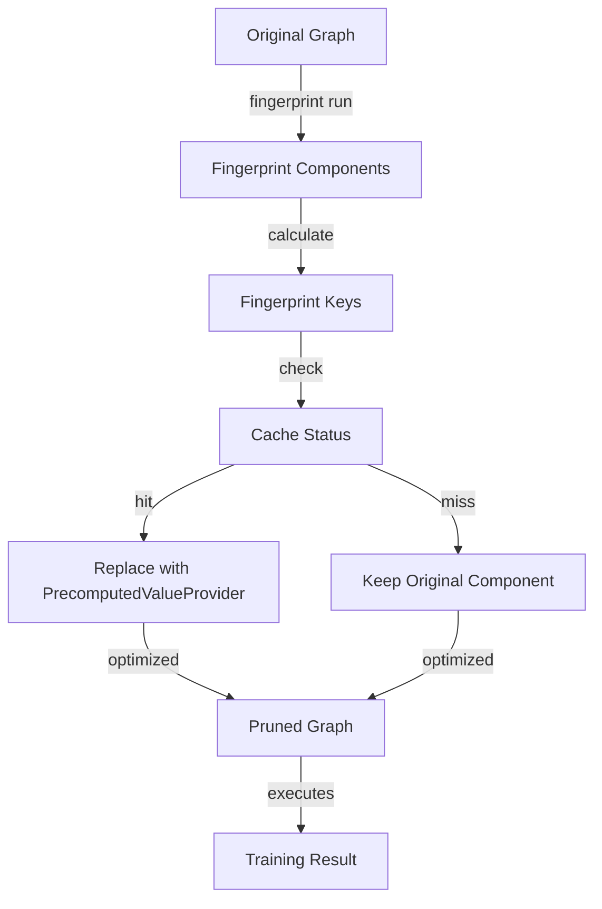
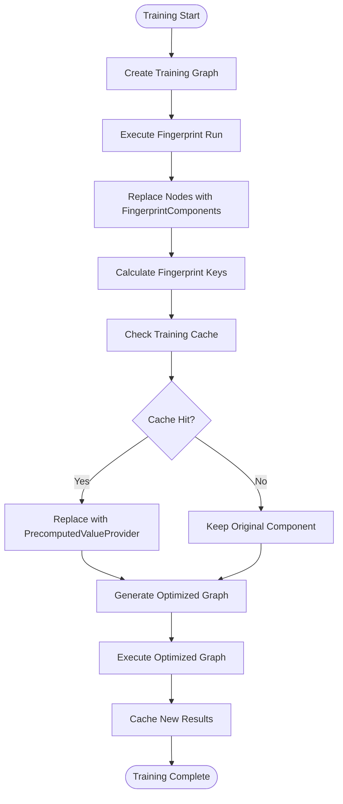
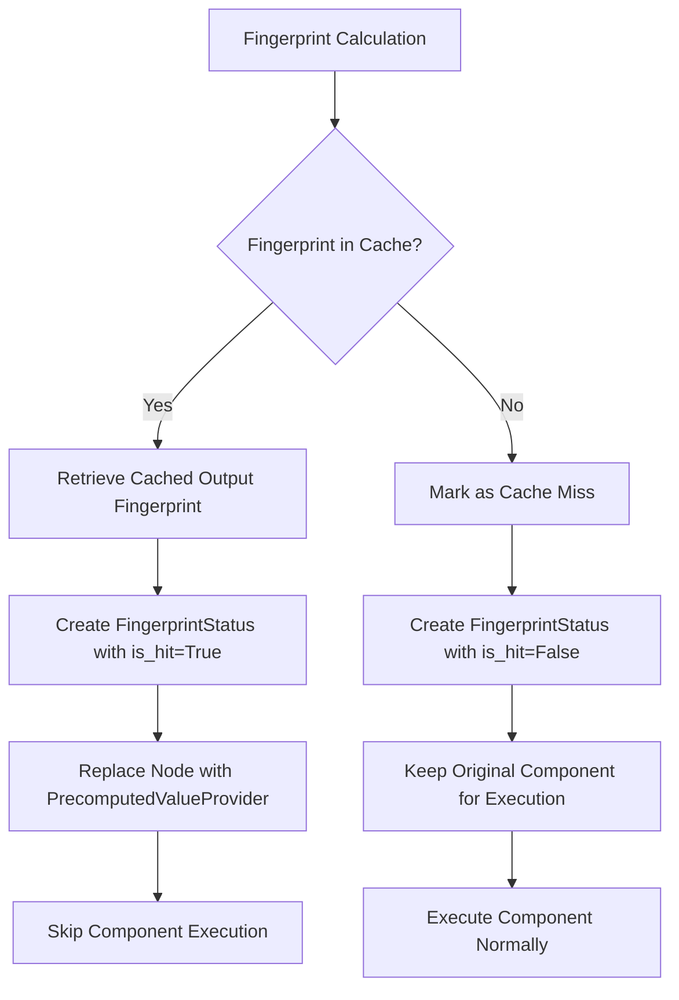

# Fingerprinting System Module

## Introduction

The fingerprinting system module is a critical component of Rasa's training optimization framework that implements intelligent caching and graph pruning mechanisms. This module enables Rasa to avoid redundant computations during model training by identifying when components can reuse previously computed results, significantly improving training performance and efficiency.

## Overview

The fingerprinting system operates at the heart of Rasa's [engine_graph](engine_graph.md) architecture, working in conjunction with the [training_framework](engine_graph.md#training-framework) to optimize the training process. It uses cryptographic fingerprinting techniques to create unique identifiers for component configurations and inputs, enabling precise cache matching and intelligent graph optimization.

## Core Components

### FingerprintComponent

The `FingerprintComponent` is the primary component responsible for determining whether a graph node can be pruned or cached during training. It replaces non-input nodes during fingerprint runs and calculates fingerprint keys based on component class, configuration, and input values.

**Key Responsibilities:**
- Calculates fingerprint keys for graph nodes
- Determines cache hits/misses by comparing against the training cache
- Enables graph pruning by identifying reusable computations
- Replaces actual components during fingerprint runs to avoid unnecessary execution

**Key Methods:**
- `run(**kwargs)`: Calculates fingerprint and determines cache status
- `replace_schema_node()`: Updates schema nodes to use fingerprint components

### FingerprintStatus

`FingerprintStatus` is a data structure that holds the results of fingerprint calculations and determines whether a node can be pruned from the graph or replaced with cached values.

**Attributes:**
- `output_fingerprint`: Fingerprint of the node's output value
- `is_hit`: Boolean indicating if the fingerprint exists in cache

**Key Methods:**
- `fingerprint()`: Returns the internal fingerprint or a random string if none exists

### PrecomputedValueProvider

The `PrecomputedValueProvider` holds and returns precomputed values from previous training runs, enabling efficient reuse of cached results without re-execution.

**Key Responsibilities:**
- Stores precomputed values from cache or previous runs
- Provides cached values during graph execution
- Enables graph node replacement with cached outputs

**Key Methods:**
- `get_value()`: Returns the precomputed output
- `replace_schema_node()`: Updates schema nodes to use precomputed values

## Architecture

### System Architecture

### Component Interaction Flow

## Data Flow

### Fingerprint Calculation Process

### Graph Optimization Flow

## Process Flows

### Training Optimization Process

### Cache Hit Resolution

## Integration with Other Systems

### Engine Graph Integration

The fingerprinting system is deeply integrated with the [engine_graph](engine_graph.md) system:

- **GraphComponent Interface**: All fingerprinting components implement the `GraphComponent` interface
- **GraphNode Replacement**: The system dynamically replaces graph nodes during optimization
- **SchemaNode Modification**: Schema nodes are updated to use fingerprinting components during runs
- **ExecutionContext**: Utilizes execution context for component lifecycle management

### Training Framework Integration

The fingerprinting system works closely with the [training_framework](engine_graph.md#training-framework):

- **GraphTrainer Orchestration**: The `GraphTrainer` initiates and manages fingerprint runs
- **ModelStorage Integration**: Uses model storage for persisting cached results
- **TrainingCache Dependency**: Relies on the training cache for fingerprint lookups and storage

### Caching System Integration

The system integrates with Rasa's caching infrastructure:

- **TrainingCache**: Primary interface for cache operations
- **Cacheable Interface**: Works with cacheable outputs for storage and retrieval
- **Fingerprint Keys**: Uses cryptographic fingerprints for precise cache matching

## Key Features

### Intelligent Graph Pruning

The system can identify and eliminate redundant computations by:
- Comparing component configurations and inputs
- Using cryptographic fingerprints for precise matching
- Maintaining a comprehensive training cache
- Supporting both complete and partial graph optimization

### Efficient Cache Management

- **Fingerprint-based Indexing**: Uses unique fingerprints for cache keys
- **Output Fingerprint Tracking**: Maintains fingerprints of cached outputs
- **Cache Hit Optimization**: Replaces components with precomputed values
- **Cache Miss Handling**: Falls back to normal execution for new computations

### Dynamic Graph Modification

- **Runtime Node Replacement**: Dynamically replaces nodes during execution
- **Schema Node Updates**: Modifies graph schemas for optimization
- **Eager Execution Support**: Ensures all inputs are available for fingerprinting
- **Component Lifecycle Management**: Manages component creation and execution

## Usage Patterns

### Fingerprint Run Execution

1. **Graph Preparation**: Original training graph is created
2. **Node Replacement**: Non-input nodes are replaced with `FingerprintComponent`
3. **Fingerprint Calculation**: Each component calculates its fingerprint key
4. **Cache Lookup**: Fingerprints are checked against the training cache
5. **Graph Optimization**: Nodes are replaced based on cache status
6. **Execution**: Optimized graph is executed with cached/precomputed values

### Cache Utilization

- **Hit Scenario**: When fingerprints match, components are replaced with `PrecomputedValueProvider`
- **Miss Scenario**: When fingerprints don't match, original components are executed
- **New Result Caching**: Newly computed results are added to the cache
- **Cache Invalidation**: Automatic invalidation based on configuration changes

## Best Practices

### Performance Optimization

- Ensure consistent component configurations for optimal cache hits
- Leverage fingerprinting for expensive computational components
- Monitor cache hit rates to identify optimization opportunities
- Use appropriate cache storage backends for your deployment

### Configuration Management

- Maintain stable component configurations when possible
- Version configuration changes to enable cache invalidation
- Document configuration dependencies for cache behavior
- Test fingerprinting behavior with configuration changes

### Debugging and Monitoring

- Monitor fingerprint calculation performance
- Track cache hit/miss ratios for optimization insights
- Log fingerprint keys for debugging cache behavior
- Validate precomputed values for correctness

## Dependencies

The fingerprinting system depends on several key Rasa modules:

- **[engine_graph](engine_graph.md)**: Core graph execution framework
- **[training_framework](engine_graph.md#training-framework)**: Training orchestration
- **[storage_layer](engine_graph.md#storage-layer)**: Model storage and persistence
- **fingerprinting**: Fingerprint calculation utilities
- **caching**: Training cache implementation

## Conclusion

The fingerprinting system module represents a sophisticated approach to training optimization in Rasa, enabling significant performance improvements through intelligent caching and graph pruning. By leveraging cryptographic fingerprinting techniques and dynamic graph modification, the system ensures that redundant computations are eliminated while maintaining training accuracy and consistency. This module is essential for scaling Rasa training operations and improving development workflow efficiency.