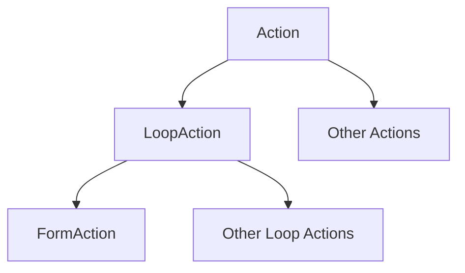
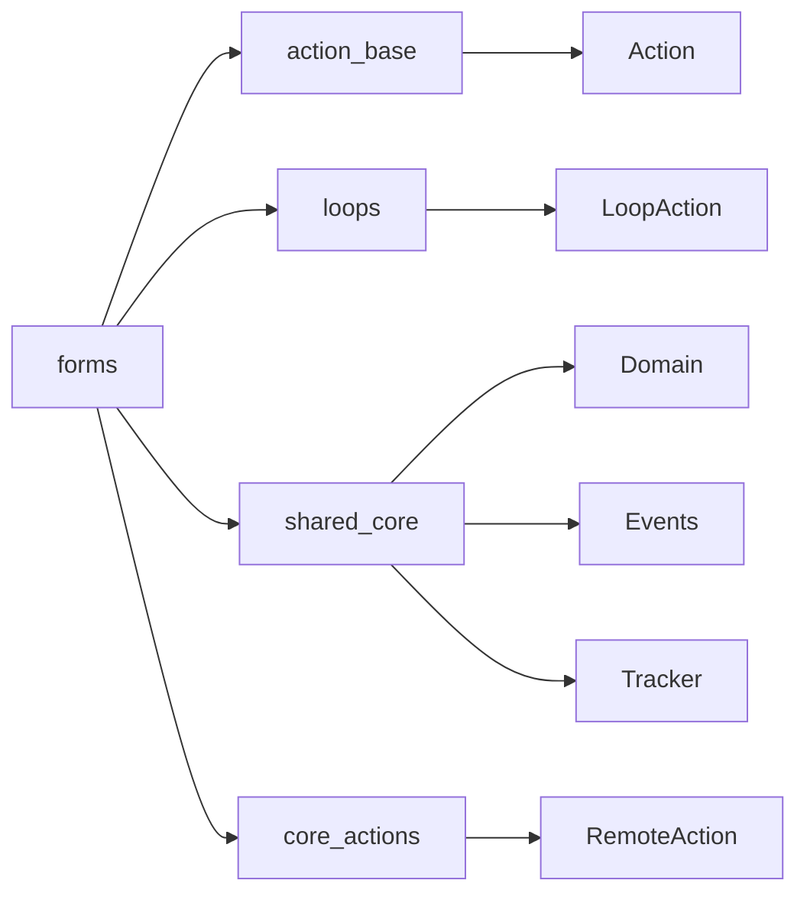
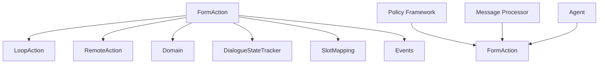
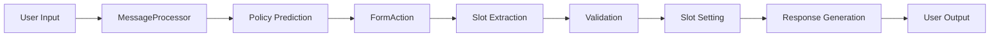
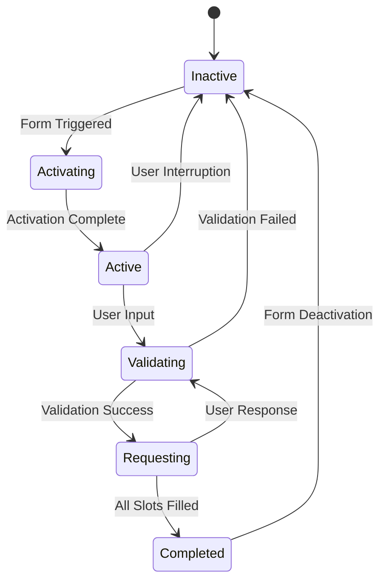
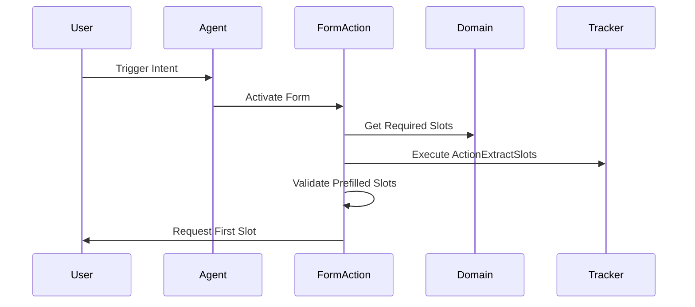
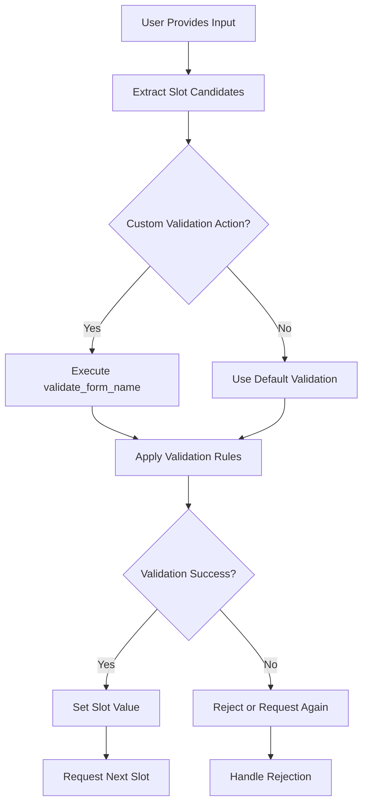
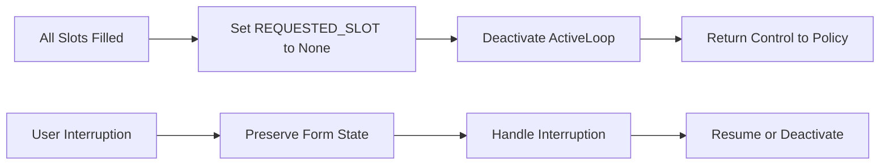

# Forms Module Documentation

## Overview

The Forms module is a core component of Rasa's action framework that implements structured data collection through conversational forms. It provides a systematic way to gather multiple pieces of information from users through natural dialogue, handling slot filling, validation, and conversation flow management.

## Purpose and Core Functionality

The Forms module enables developers to create conversational forms that:
- Collect multiple pieces of information (slots) from users in a structured manner
- Handle slot extraction from user messages using various mapping strategies
- Validate collected information through custom validation actions
- Manage conversation flow during data collection
- Support conditional slot requests based on business logic
- Handle interruptions and resume form execution

## Architecture

### Core Components

#### FormAction Class
The `FormAction` class is the central component that inherits from `LoopAction` and implements the complete form lifecycle:

```python
class FormAction(LoopAction):
    """Action which implements and executes the form logic."""
```

### Inheritance Hierarchy



### Module Dependencies



## Component Relationships

### FormAction Integration



### Data Flow Architecture



## Key Features and Capabilities

### 1. Slot Mapping and Extraction

The module supports multiple slot mapping types:
- **From Entity**: Extract slots from recognized entities
- **From Intent**: Set slots based on user intent
- **From Text**: Extract slots from raw text input
- **From Trigger Intent**: Set slots when specific intents trigger form activation

### 2. Form Lifecycle Management



### 3. Validation Framework

The module provides a comprehensive validation system:
- **Automatic Validation**: Built-in validation based on slot mappings
- **Custom Validation**: Support for custom validation actions (`validate_{form_name}`)
- **Cross-slot Validation**: Ability to validate relationships between slots
- **Rejection Handling**: Graceful handling of validation failures

### 4. Dynamic Slot Requests

Forms can dynamically determine which slot to request next based on:
- Current conversation state
- Previously filled slots
- Business logic conditions
- External data sources

## Process Flows

### Form Activation Process



### Slot Validation Process



### Form Deactivation Process



## Integration Points

### With Policy Framework
The Forms module integrates with the policy framework through:
- [PolicyPredictionEnsemble](policy_ensemble.md) for action selection
- [RulePolicy](rule_policy.md) for form-specific rules
- [TEDPolicy](ted_policy.md) for contextual predictions

### With Action Framework
Forms work within the broader action framework:
- [Action Base Classes](action_base.md) for common functionality
- [Loop Actions](loops.md) for iterative behavior
- Custom actions for validation and slot requests

### With Core Components
Integration with core dialogue management:
- [Agent Management](agent_management.md) for overall control
- [Message Processing](message_processing.md) for input handling
- [Tracker Management](shared_core.md) for state persistence

## Configuration and Usage

### Domain Configuration
Forms are defined in the domain file with:
- Required slots and their mappings
- Validation actions
- Utterance templates for slot requests

### Slot Mapping Definition
```yaml
forms:
  restaurant_form:
    required_slots:
      - cuisine
      - num_people
      - outdoor_seating
    cuisine:
      - type: from_entity
        entity: cuisine
    num_people:
      - type: from_entity
        entity: number
    outdoor_seating:
      - type: from_intent
        intent: affirm
        value: true
      - type: from_intent
        intent: deny
        value: false
```

### Validation Action
Custom validation actions follow the naming convention `validate_{form_name}` and can:
- Validate individual slots
- Perform cross-slot validation
- Set additional slots
- Return bot responses

## Error Handling and Edge Cases

### Validation Failures
- Graceful rejection of invalid inputs
- Opportunity for other policies to take over
- Preservation of valid slot values

### Interruptions
- Handling of user interruptions during form execution
- Ability to resume forms after interruptions
- Context preservation across interruptions

### Entity Ambiguity
- Handling of entities that could fill multiple slots
- Unique entity mapping detection
- Conflict resolution strategies

## Best Practices

1. **Slot Design**: Design slots to be independent and clearly defined
2. **Validation Logic**: Keep validation logic focused and specific
3. **Error Messages**: Provide clear guidance when validation fails
4. **Interruption Handling**: Plan for common interruption patterns
5. **Testing**: Test forms with various input sequences and edge cases

## Related Documentation

- [Action Framework](action_base.md) - Base action classes and interfaces
- [Loop Actions](loops.md) - Iterative action patterns
- [Policy Framework](policy_framework.md) - Action selection and prediction
- [Dialogue Orchestration](dialogue_orchestration.md) - Overall conversation management
- [Shared Core](shared_core.md) - Domain, events, and tracker components