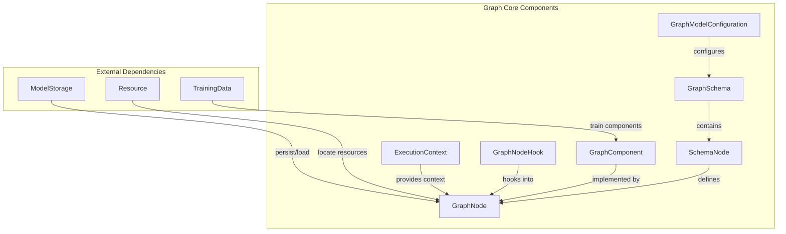
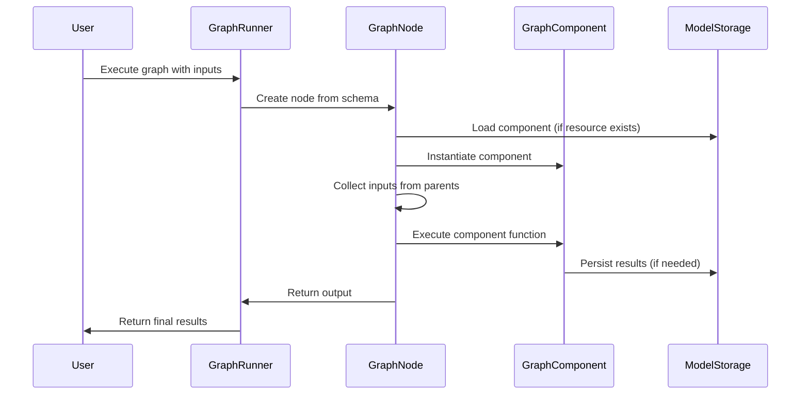
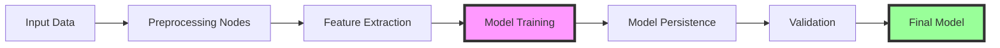
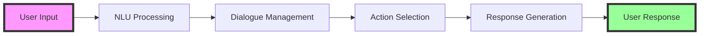

# Graph Core Module Documentation

## Introduction

The graph_core module is the foundational component of Rasa's execution engine, providing a flexible and extensible graph-based architecture for building, training, and deploying conversational AI models. This module implements a directed acyclic graph (DAG) system where each node represents a computational component that can process data, train models, or perform inference.

The graph architecture enables Rasa to:
- Define complex ML pipelines as interconnected components
- Optimize execution through dependency resolution and caching
- Support both training and inference workflows within the same framework
- Enable modular component development and reuse
- Provide fine-grained control over model persistence and resource management

## Core Architecture

### GraphComponent Interface

The `GraphComponent` abstract base class defines the contract for all components that can execute within the graph. It provides:

- **Lifecycle Management**: Standardized creation, loading, and configuration methods
- **Dependency Declaration**: Components can specify required dependencies
- **Resource Management**: Integration with model storage for persistence
- **Configuration Handling**: Default configuration with user override support
- **Language Support**: Optional language-specific capabilities

### GraphNode Execution Wrapper

`GraphNode` serves as the execution wrapper for GraphComponents, handling:

- **Component Instantiation**: Lazy or eager instantiation based on configuration
- **Input Collection**: Gathering inputs from parent nodes
- **Hook Execution**: Before/after execution hooks for monitoring and debugging
- **Error Handling**: Consistent exception handling and logging
- **Resource Management**: Coordination with model storage for loading/saving

### GraphSchema Definition

`GraphSchema` defines the structure and dependencies of the computation graph:

- **Node Specification**: Each node defines its inputs, outputs, and dependencies
- **Dependency Resolution**: Automatic resolution of execution order
- **Target Identification**: Marking nodes that produce final outputs
- **Schema Serialization**: Support for saving and loading graph configurations
- **Minimal Schema Generation**: Pruning unnecessary nodes for optimization

## Component Relationships



## Data Flow Architecture



## Execution Flow

### Training Workflow



### Inference Workflow



## Key Features

### 1. Flexible Component Model

The GraphComponent interface allows for:
- **Custom Components**: Easy implementation of new ML components
- **Configuration Management**: Hierarchical configuration with defaults and overrides
- **Resource Awareness**: Automatic handling of model persistence
- **Dependency Management**: Declaration of required components

### 2. Schema-Driven Execution

GraphSchema provides:
- **Declarative Definition**: Graph structure defined through configuration
- **Dependency Resolution**: Automatic ordering of component execution
- **Target-Based Optimization**: Focus computation on required outputs
- **Serialization Support**: Save and load graph configurations

### 3. Execution Context Management

ExecutionContext enables:
- **Runtime Information**: Access to graph schema and execution state
- **Model Identification**: Tracking of model versions and IDs
- **Diagnostic Support**: Optional collection of diagnostic data
- **Fine-tuning Mode**: Special handling for fine-tuning workflows

### 4. Hook System

GraphNodeHook provides:
- **Pre-execution Hooks**: Validation, logging, or input modification
- **Post-execution Hooks**: Output processing, metrics collection
- **Error Handling**: Consistent error handling across hooks
- **Extensibility**: Custom monitoring and debugging capabilities

## Integration with Other Modules

### Core Dialogue Integration

The graph_core module integrates with [core_dialogue](core_dialogue.md) components:
- **Agent Management**: GraphRunner executes dialogue processing graphs
- **Policy Framework**: Policies are implemented as GraphComponents
- **Action Framework**: Actions execute within the graph context

### NLU Processing Integration

Integration with [nlu_processing](nlu_processing.md) components:
- **Classifier Components**: NLU classifiers as GraphComponents
- **Feature Extraction**: Featurizers process data within the graph
- **Training Data Flow**: TrainingData flows through NLU components

### Storage Layer Integration

Works with [storage_layer](storage_layer.md) for:
- **Model Persistence**: Components save/load through ModelStorage
- **Resource Management**: Resource objects locate persisted models
- **Training Artifacts**: Storage of training results and metadata

## Configuration and Usage

### Basic GraphComponent Implementation

```python
from rasa.engine.graph import GraphComponent, ExecutionContext
from rasa.engine.storage.storage import ModelStorage
from rasa.engine.storage.resource import Resource

class MyComponent(GraphComponent):
    
    @staticmethod
    def get_default_config() -> Dict[Text, Any]:
        return {"param1": "default_value"}
    
    @classmethod
    def create(
        cls,
        config: Dict[Text, Any],
        model_storage: ModelStorage,
        resource: Resource,
        execution_context: ExecutionContext,
    ) -> MyComponent:
        return cls(config)
    
    def process(self, input_data: Any) -> Any:
        # Component logic here
        return processed_data
```

### Schema Definition

```python
from rasa.engine.graph import GraphSchema, SchemaNode

schema = GraphSchema({
    "preprocessor": SchemaNode(
        needs={},
        uses=PreprocessorComponent,
        constructor_name="create",
        fn="process",
        config={"param": "value"}
    ),
    "classifier": SchemaNode(
        needs={"data": "preprocessor"},
        uses=ClassifierComponent,
        constructor_name="create",
        fn="train",
        config={"epochs": 100},
        is_target=True
    )
})
```

## Error Handling

The graph_core module implements comprehensive error handling:

- **GraphComponentException**: Wraps component initialization and execution errors
- **GraphRunError**: Handles missing inputs and execution failures
- **GraphSchemaException**: Manages schema validation and loading errors
- **InvalidConfigException**: Handles configuration validation errors

## Performance Considerations

### Optimization Strategies

1. **Lazy Instantiation**: Components instantiated only when needed
2. **Minimal Schema**: Prune unnecessary nodes for faster execution
3. **Resource Caching**: Reuse loaded components across executions
4. **Target-Based Execution**: Focus computation on required outputs

### Scalability Features

1. **Parallel Execution**: Graph structure enables parallel node execution
2. **Memory Management**: Efficient handling of large models and datasets
3. **Incremental Updates**: Support for fine-tuning and incremental training
4. **Resource Sharing**: Shared model storage across components

## Best Practices

### Component Development

1. **Implement Required Methods**: Always implement `create` and define `get_default_config`
2. **Handle Resources**: Properly use Resource for model persistence
3. **Validate Configuration**: Validate config in `create` method
4. **Document Dependencies**: Clearly document required components

### Schema Design

1. **Minimize Dependencies**: Keep graph structure as simple as possible
2. **Use Target Nodes**: Mark final outputs as targets for optimization
3. **Handle Failures**: Design graphs to handle component failures gracefully
4. **Version Compatibility**: Ensure schema compatibility across versions

### Performance Optimization

1. **Profile Execution**: Use hooks to monitor performance
2. **Optimize Data Flow**: Minimize data transfer between nodes
3. **Cache Results**: Use appropriate caching strategies
4. **Resource Management**: Clean up resources properly

## Future Enhancements

The graph_core module is designed to support:

- **Distributed Execution**: Future support for distributed graph execution
- **Dynamic Graphs**: Runtime modification of graph structure
- **Advanced Caching**: More sophisticated caching strategies
- **Monitoring Integration**: Built-in metrics and monitoring capabilities

This architecture provides the foundation for Rasa's modular, scalable, and maintainable conversational AI platform.