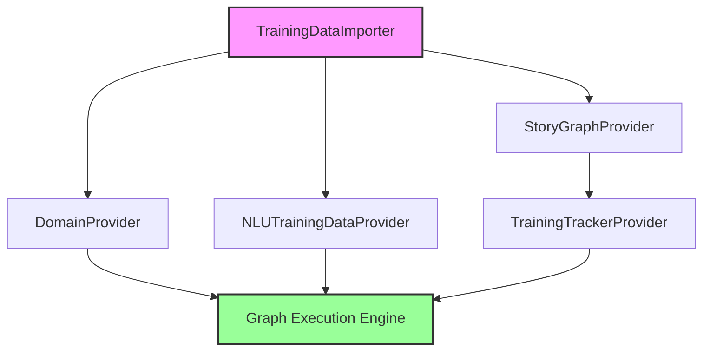
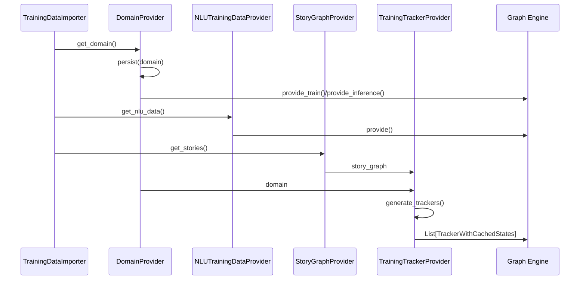

# Graph Providers Module Documentation

## Overview

The `graph_providers` module is a critical component of the Rasa architecture that serves as the data provisioning layer for the Rasa Engine's graph-based training and inference system. This module implements a set of specialized providers that supply essential training data and configuration components to various parts of the Rasa pipeline during both training and inference phases.

## Purpose and Role

Graph providers act as the bridge between raw training data sources and the Rasa Engine's graph execution framework. They are responsible for:

- **Data Abstraction**: Providing a consistent interface for accessing different types of training data
- **Data Transformation**: Converting raw training data into formats suitable for consumption by graph components
- **Data Persistence**: Managing the storage and retrieval of training artifacts within the model storage system
- **Lifecycle Management**: Handling the creation, loading, and caching of data components throughout the training and inference pipeline

## Architecture Overview

The graph_providers module follows a provider pattern where each provider specializes in supplying a specific type of data or configuration to the graph execution engine:

### Core Components

The module consists of four main providers, each serving a distinct purpose in the data provisioning pipeline:

#### 1. DomainProvider
- **Purpose**: Supplies the Rasa domain configuration during training and inference
- **Key Responsibilities**: Domain loading, validation, and persistence
- **Dependencies**: [TrainingDataImporter](data_importers.md), [ModelStorage](engine_graph.md)
- **Documentation**: [DomainProvider Details](domain_provider.md)

#### 2. NLUTrainingDataProvider
- **Purpose**: Provides Natural Language Understanding training data
- **Key Responsibilities**: NLU data extraction, language-specific filtering, and optional persistence
- **Dependencies**: [TrainingDataImporter](data_importers.md), [TrainingData](shared_nlu.md)
- **Documentation**: [NLUTrainingDataProvider Details](nlu_training_data_provider.md)

#### 3. StoryGraphProvider
- **Purpose**: Supplies conversation training data in the form of story graphs
- **Key Responsibilities**: Story and rule extraction from training data
- **Dependencies**: [TrainingDataImporter](data_importers.md), [StoryGraph](shared_core.md)
- **Documentation**: [StoryGraphProvider Details](story_graph_provider.md)

#### 4. TrainingTrackerProvider
- **Purpose**: Generates training trackers for dialogue policy training
- **Key Responsibilities**: Tracker generation, data augmentation, and state caching
- **Dependencies**: [StoryGraph](shared_core.md), [Domain](shared_core.md)
- **Documentation**: [TrainingTrackerProvider Details](training_tracker_provider.md)

## Data Flow Architecture

## Integration with Rasa Engine

Graph providers integrate seamlessly with the [Rasa Engine](engine_graph.md) through the `GraphComponent` interface. This integration enables:

- **Lazy Loading**: Providers are instantiated only when their data is required
- **Caching**: Computed data can be cached and reused across graph executions
- **Dependency Injection**: Providers automatically receive their dependencies through the graph framework
- **Lifecycle Management**: Proper initialization, execution, and cleanup of data provisioning operations

## Key Design Patterns

### Provider Pattern
Each provider implements a consistent interface for data provisioning, allowing the graph engine to interact with different data sources uniformly.

### Factory Pattern
Providers use factory methods (`create`, `load`) to instantiate themselves, enabling flexible configuration and dependency injection.

### Template Method Pattern
The base `GraphComponent` interface defines the structure for provider lifecycle management while allowing specific implementations to override behavior as needed.

## Error Handling and Validation

Graph providers implement comprehensive error handling:

- **Domain Validation**: Ensures domain configurations are valid and complete
- **Data Consistency**: Validates that training data is consistent with the domain
- **Graceful Degradation**: Provides meaningful error messages when data is unavailable or invalid
- **Early Failure**: Fails fast when critical data components are missing

## Performance Considerations

- **Lazy Initialization**: Providers are created only when needed
- **Optional Persistence**: Data persistence can be enabled/disabled based on performance requirements
- **Caching**: Loaded data is cached to avoid repeated I/O operations
- **Memory Management**: Large datasets are streamed rather than loaded entirely into memory

## Usage Examples

### Training Phase
During training, providers work together to supply all necessary data to the training pipeline:

1. **DomainProvider** loads and validates the domain configuration
2. **NLUTrainingDataProvider** extracts NLU training examples
3. **StoryGraphProvider** compiles conversation training data
4. **TrainingTrackerProvider** generates augmented training trackers for policy training

### Inference Phase
During inference, providers supply pre-computed data to the model:

1. **DomainProvider** provides the domain configuration
2. Other providers may supply cached training artifacts for model initialization

## Related Modules

- [Engine Graph](engine_graph.md) - The execution framework that consumes provider data
- [Data Importers](data_importers.md) - Source of training data for providers
- [Shared Core](shared_core.md) - Core data structures used by providers
- [Shared NLU](shared_nlu.md) - NLU-specific data structures

## Future Enhancements

Potential areas for future development include:

- **Streaming Providers**: Support for streaming large datasets
- **Incremental Updates**: Ability to update providers with new data without full retraining
- **Provider Composition**: Combining multiple providers for complex data scenarios
- **Performance Monitoring**: Built-in metrics for provider performance and data quality