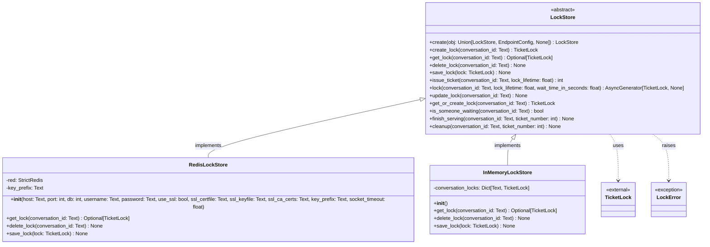
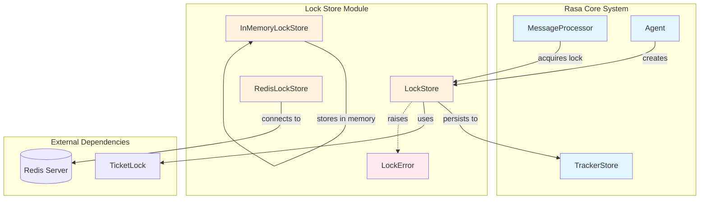
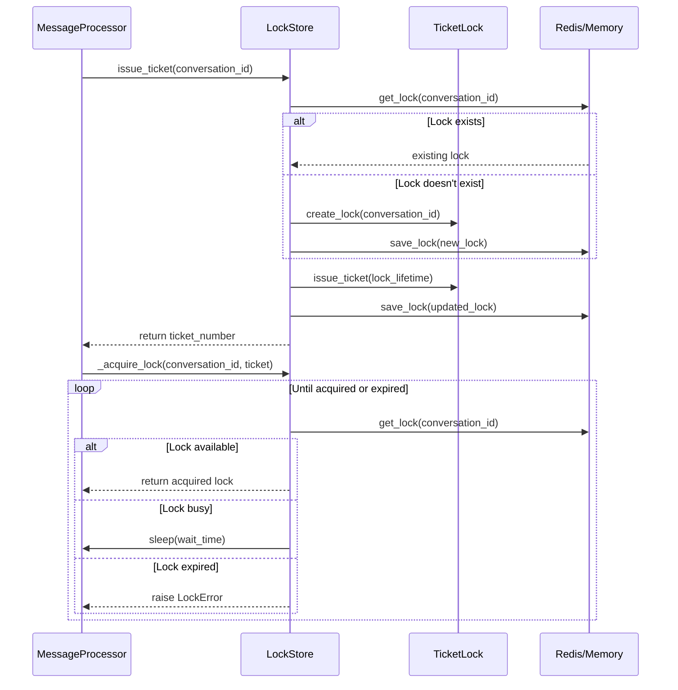
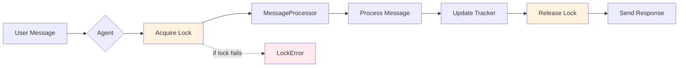

# Lock Store Module Documentation

## Introduction

The lock_store module provides a distributed locking mechanism for Rasa Open Source to ensure conversation consistency in multi-instance deployments. It implements a ticket-based locking system that prevents race conditions when multiple Rasa instances process messages for the same conversation simultaneously.

## Overview

The lock store is a critical component for maintaining conversation state integrity in production environments where multiple Rasa instances may be running concurrently. It uses a ticket-based queuing system to ensure that messages for the same conversation are processed sequentially, preventing conflicts and maintaining consistent dialogue state.

## Architecture

### Core Components



### System Integration



## Component Details

### LockStore (Abstract Base Class)

The `LockStore` abstract class defines the interface for all lock store implementations. It provides the core functionality for managing conversation locks using a ticket-based system.

**Key Responsibilities:**
- Lock lifecycle management (creation, acquisition, release, cleanup)
- Ticket issuance and management
- Conversation-level concurrency control
- Asynchronous lock acquisition with retry logic

**Core Methods:**

- `create()`: Factory method for creating lock store instances from configuration
- `issue_ticket()`: Issues a new ticket for a conversation, creating locks as needed
- `lock()`: Async context manager for acquiring and automatically releasing locks
- `_acquire_lock()`: Implements the ticket-based queuing logic with retry mechanism
- `cleanup()`: Removes completed tickets and deletes locks when no longer needed

### RedisLockStore

Implements distributed locking using Redis as the persistence layer. Suitable for production deployments with multiple Rasa instances.

**Features:**
- Redis connection pooling and SSL support
- Configurable key prefixes for multi-tenant deployments
- Automatic serialization/deserialization of TicketLock objects
- Connection timeout and error handling

**Configuration Options:**
- Host, port, database selection
- Authentication (username/password)
- SSL/TLS encryption
- Custom key prefixes
- Socket timeout settings

### InMemoryLockStore

Provides in-memory locking for single-instance deployments or development environments.

**Characteristics:**
- Fast access with no network overhead
- Not suitable for multi-instance deployments
- Conversation locks stored in Python dictionary
- Automatic cleanup when tickets are completed

## Data Flow

### Lock Acquisition Process



### Conversation Processing Flow



## Configuration

### Environment Variables

- `TICKET_LOCK_LIFETIME`: Override default lock lifetime (seconds)
- Redis connection parameters (when using RedisLockStore)

### Endpoint Configuration

```yaml
lock_store:
  type: redis
  url: localhost
  port: 6379
  db: 1
  password: your_password
  use_ssl: true
  key_prefix: rasa
  socket_timeout: 10
```

### Default Behavior

When no lock store configuration is provided, Rasa defaults to `InMemoryLockStore`, which is suitable only for single-instance deployments.

## Error Handling

### LockError Exception

Raised when:
- Lock cannot be acquired within lifetime
- Connection to lock store fails
- Lock store operations encounter errors

The exception includes the conversation ID and detailed error information for debugging.

### Connection Handling

- Automatic retry logic for lock acquisition
- Connection timeout configuration for Redis
- Graceful fallback to in-memory store if Redis unavailable during startup

## Dependencies

### Internal Dependencies

- [TicketLock](ticket_lock.md): Core locking mechanism implementation
- [EndpointConfig](shared_utils.md): Configuration parsing
- [RasaException](shared_exceptions.md): Base exception handling

### External Dependencies

- **Redis** (optional): For distributed locking in production
- **asyncio**: For asynchronous lock acquisition
- **json**: For lock serialization

## Best Practices

### Production Deployment

1. **Use RedisLockStore** for multi-instance deployments
2. **Configure appropriate lock lifetime** based on expected processing times
3. **Set up Redis monitoring** for lock store health
4. **Use SSL/TLS** for secure Redis connections
5. **Configure connection timeouts** to handle network issues

### Development

1. **InMemoryLockStore** is sufficient for single-instance development
2. **Monitor lock contention** during load testing
3. **Test lock store failover** scenarios

### Performance Considerations

1. **Lock lifetime** should balance between processing time and resource cleanup
2. **Wait time** between lock attempts affects CPU usage and latency
3. **Redis connection pooling** improves performance under load
4. **Key prefixing** enables multi-tenant deployments

## Integration with Rasa Core

The lock store integrates with the [MessageProcessor](message_processing.md) and [Agent](agent_management.md) components to ensure conversation consistency:

- **MessageProcessor**: Acquires locks before processing messages
- **Agent**: Creates and manages lock store instances
- **TrackerStore**: Works in conjunction with lock store for state persistence

## Monitoring and Debugging

### Logging

The lock store provides detailed debug logging for:
- Lock acquisition and release
- Ticket issuance and completion
- Connection status and errors
- Cleanup operations

### Metrics

Monitor these key metrics:
- Lock acquisition time
- Lock contention rate
- Redis connection health
- Lock store operation latency

## Security Considerations

1. **Authentication**: Use Redis authentication in production
2. **Encryption**: Enable SSL/TLS for Redis connections
3. **Network isolation**: Place Redis on private network
4. **Access control**: Limit Redis access to Rasa instances only

## Troubleshooting

### Common Issues

1. **Lock acquisition timeouts**: Increase lock lifetime or optimize processing
2. **Redis connection failures**: Check network and authentication
3. **High lock contention**: Review conversation design and processing logic
4. **Memory leaks**: Ensure proper lock cleanup in error scenarios

### Debug Steps

1. Enable debug logging for `rasa.core.lock_store`
2. Monitor Redis connection health
3. Check lock store configuration
4. Verify network connectivity between Rasa and Redis