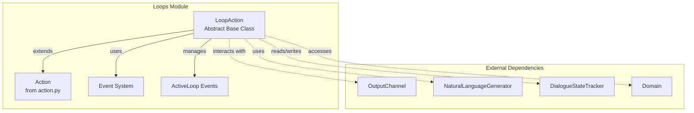
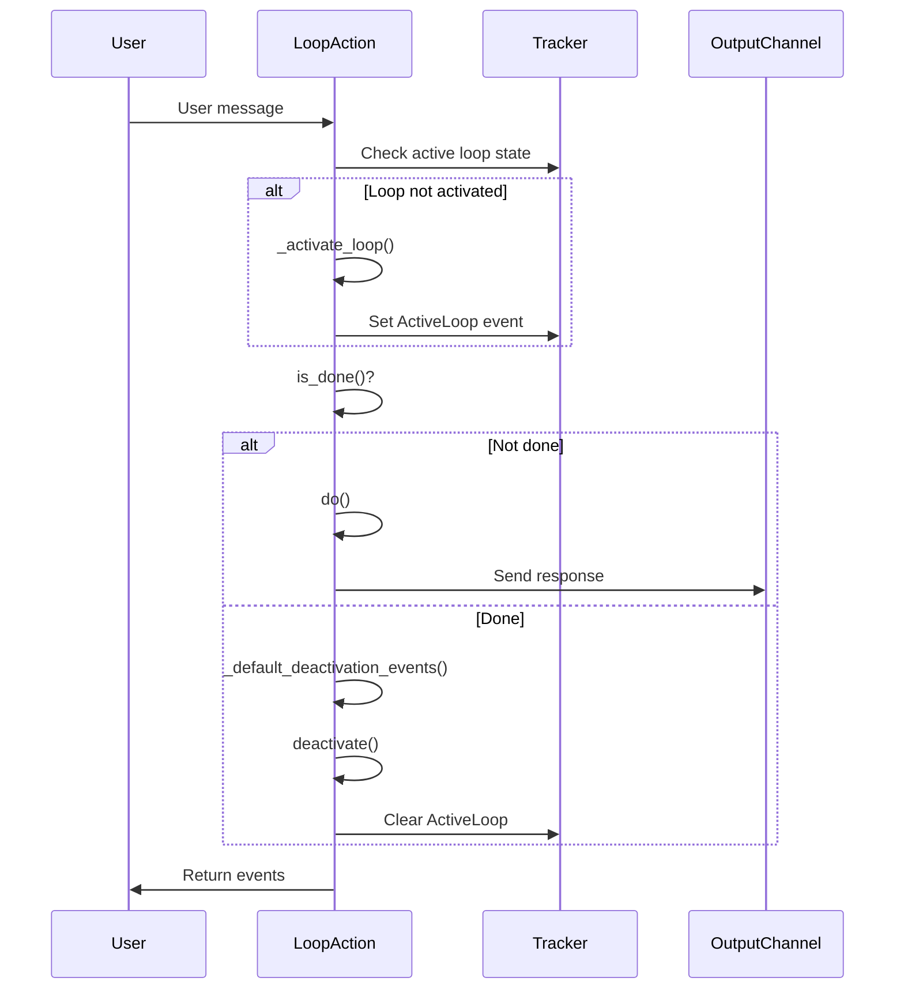
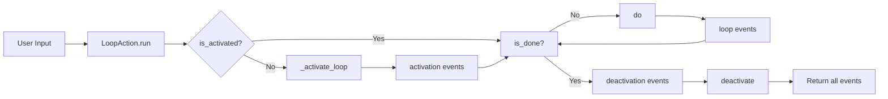
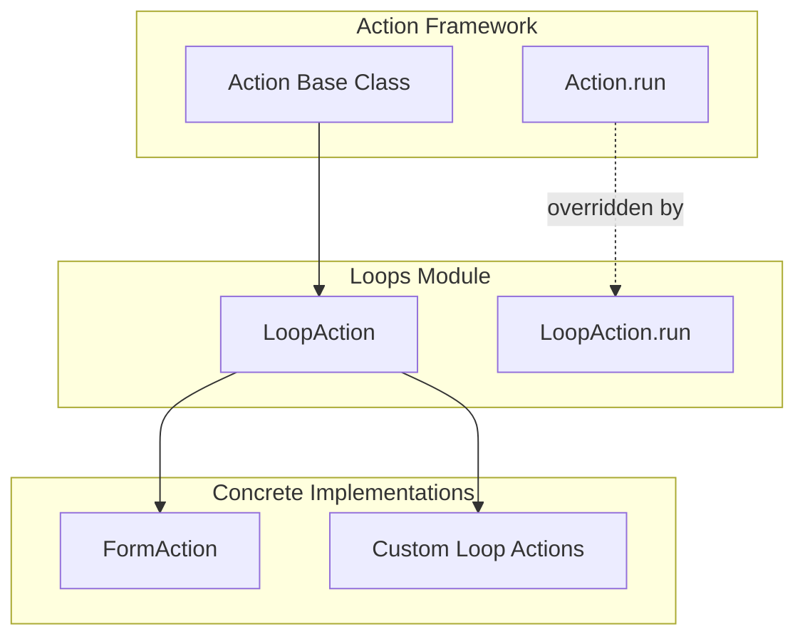

# Loops Module Documentation

## Overview

The loops module provides the foundational framework for implementing conversational loops in Rasa Core. Loops are essential components that enable multi-turn interactions where the bot needs to collect specific information from users through repeated questioning until certain conditions are met. This module defines the abstract `LoopAction` class that serves as the base for all loop-based actions in the Rasa dialogue system.

## Purpose and Core Functionality

The primary purpose of the loops module is to:

1. **Define Loop Lifecycle Management**: Provide a structured approach to handle the activation, execution, and deactivation of conversational loops
2. **Standardize Loop Behavior**: Establish consistent patterns for implementing different types of loops across the system
3. **Enable Multi-turn Conversations**: Support complex dialogue flows that require multiple interactions to complete a task
4. **Integrate with Action Framework**: Seamlessly connect loop actions with Rasa's broader action execution system

## Architecture

### Component Structure

### Loop Lifecycle Flow

## Core Components

### LoopAction Class

The `LoopAction` class is an abstract base class that extends the base `Action` class. It provides the framework for implementing conversational loops with the following key characteristics:

- **Abstract Methods**: `do()` and `is_done()` must be implemented by subclasses
- **Lifecycle Hooks**: `activate()` and `deactivate()` can be overridden for custom behavior
- **State Management**: Automatically handles `ActiveLoop` events to track loop state
- **Event-Driven**: Returns lists of events that modify the dialogue state

#### Key Methods

| Method | Purpose | Type |
|--------|---------|------|
| `run()` | Main entry point orchestrating the loop lifecycle | Concrete |
| `is_activated()` | Checks if the loop is currently active | Concrete |
| `do()` | Executes the loop's main logic | Abstract |
| `is_done()` | Determines if the loop should terminate | Abstract |
| `activate()` | Custom logic when loop activates | Virtual |
| `deactivate()` | Custom logic when loop deactivates | Virtual |

## Data Flow

### Event Processing Pipeline

### Event Types and Management

The loop system works with specific event types to manage its state:

- **ActiveLoop**: Tracks which loop is currently active in the conversation
- **UserUttered**: Represents user input that may trigger or continue loops
- **ActionExecuted**: Records when loop actions are executed
- **SlotSet**: Updates slot values collected during loops

## Integration with Action Framework

The loops module integrates seamlessly with Rasa's action framework:

## Dependencies and Relationships

### Internal Dependencies

- **[action.py](action_base.md)**: Extends the base `Action` class for integration with the action framework
- **[events.py](shared_core.md)**: Uses `ActiveLoop` and other event types for state management

### External Dependencies

- **DialogueStateTracker**: Tracks conversation state and active loops
- **Domain**: Accesses domain configuration and slot definitions
- **OutputChannel**: Sends responses back to users
- **NaturalLanguageGenerator**: Generates response texts

## Usage Patterns

### Typical Loop Implementation

Concrete loop implementations follow this pattern:

1. **Extend LoopAction**: Create a subclass of `LoopAction`
2. **Implement do()**: Define the loop's main execution logic
3. **Implement is_done()**: Specify completion conditions
4. **Override hooks**: Optionally customize activation/deactivation behavior

### Integration Points

Loops integrate with the broader Rasa system through:

- **Policy Framework**: Policies can predict loop actions based on conversation state
- **Tracker Stores**: Loop state persists across conversation turns
- **NLU Pipeline**: User input is processed before reaching loop actions
- **Channel Connectors**: Loop responses are sent through appropriate channels

## Best Practices

### When to Use Loops

- Collecting multiple pieces of information from users
- Implementing multi-step processes or wizards
- Handling complex form-filling scenarios
- Managing conversation contexts that span multiple turns

### Design Considerations

- **State Management**: Ensure proper cleanup in `deactivate()`
- **Error Handling**: Implement robust validation in `do()`
- **User Experience**: Provide clear guidance on loop completion criteria
- **Performance**: Minimize expensive operations in frequently called methods

## Related Documentation

- [Action Framework](action_base.md) - Base action system that loops extend
- [Forms Module](forms.md) - Concrete implementation of form-based loops
- [Shared Core Events](shared_core.md) - Event system used by loops
- [Policy Framework](policy_framework.md) - How loops are predicted and selected
- [Dialogue Orchestration](dialogue_orchestration.md) - Overall conversation flow management