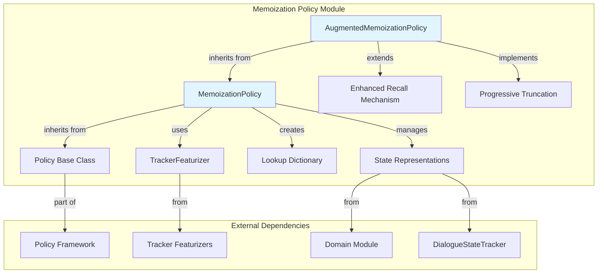
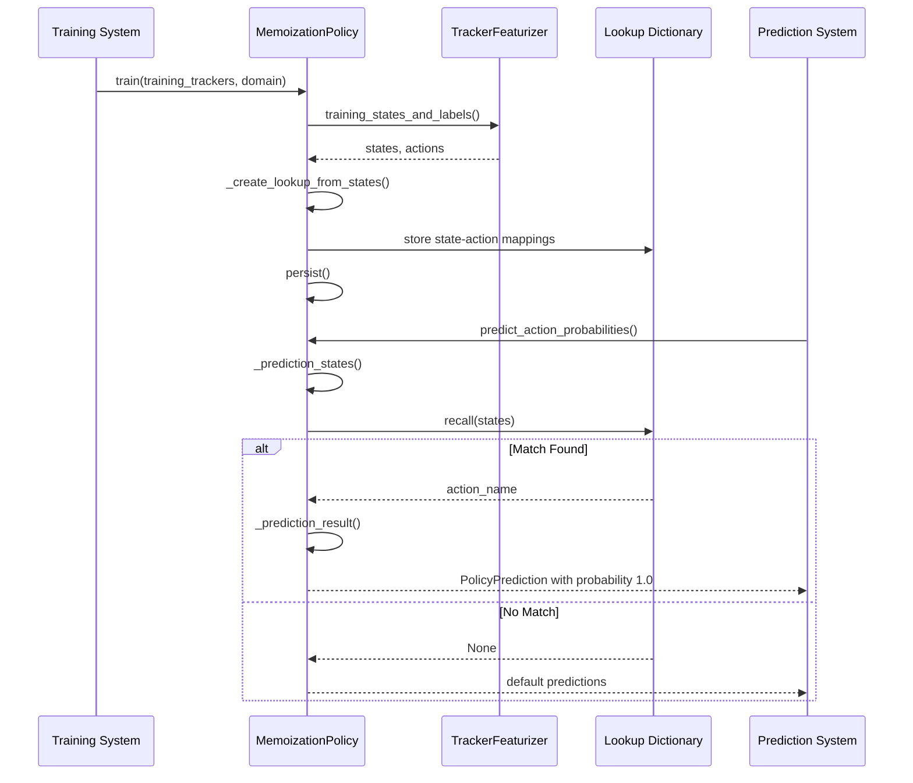
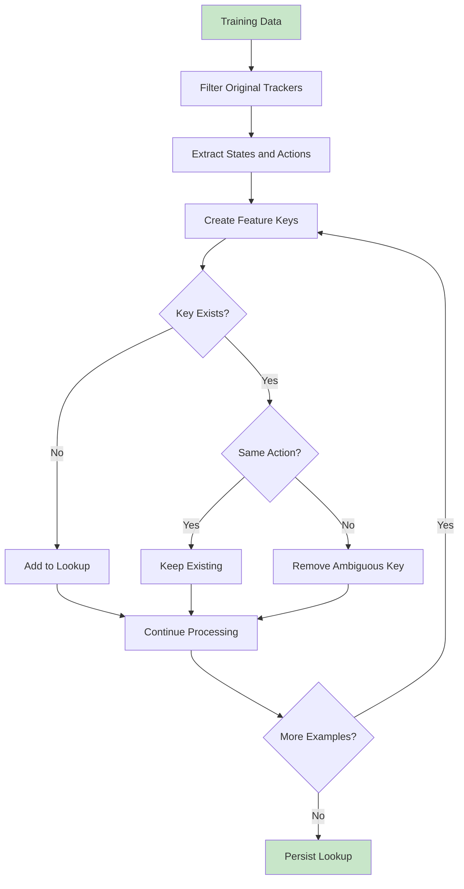
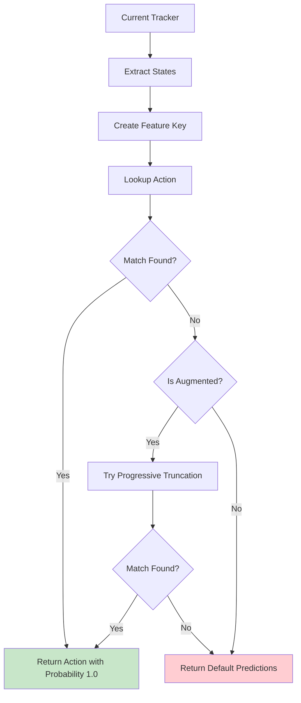
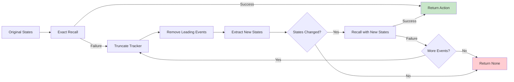
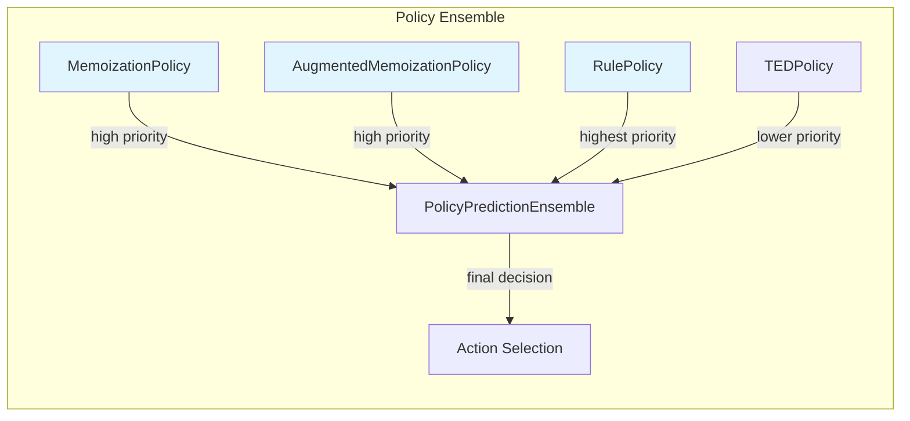

# Memoization Policy Module

## Introduction

The memoization_policy module implements deterministic dialogue management policies that memorize and recall exact conversation patterns from training data. It provides two main implementations: `MemoizationPolicy` for exact pattern matching and `AugmentedMemoizationPolicy` for enhanced recall with progressive truncation capabilities.

This module is part of Rasa's policy framework and serves as a high-precision, low-recall component that ensures predictable behavior for known conversation flows while working in conjunction with other policies in the ensemble.

## Architecture Overview



## Core Components

### MemoizationPolicy

The base memoization policy that memorizes exact conversation patterns from training stories. It creates a lookup dictionary mapping state sequences to actions, enabling deterministic prediction for previously seen dialogue flows.

**Key Characteristics:**
- **Precision-focused**: Achieves 100% precision on memorized patterns
- **Deterministic**: Returns probability of 1.0 for matched actions
- **Max history-based**: Considers only the last N turns (configurable)
- **State compression**: Optional compression of state representations

**Configuration Parameters:**
```python
{
    "enable_feature_string_compression": True,  # Compress state keys
    "use_nlu_confidence_as_score": False,       # Use NLU confidence as action score
    POLICY_PRIORITY: MEMOIZATION_POLICY_PRIORITY, # Priority in ensemble
    POLICY_MAX_HISTORY: DEFAULT_MAX_HISTORY,    # Number of turns to consider
}
```

### AugmentedMemoizationPolicy

An enhanced version that extends the base memoization policy with progressive truncation capabilities. It can recall actions even when the current dialogue state doesn't exactly match memorized patterns by progressively removing older events.

**Key Enhancement:**
- **Progressive truncation**: Iteratively removes oldest events to find matches
- **Back-to-the-future approach**: Modifies dialogue history to find memorized patterns
- **Fallback mechanism**: Falls back to truncation when exact recall fails

## Data Flow and Processing



## Training Process



## Prediction Process



## Progressive Truncation Algorithm

The AugmentedMemoizationPolicy implements a sophisticated fallback mechanism:



## Integration with Policy Ensemble



## Key Features and Benefits

### 1. **Deterministic Behavior**
- Provides 100% confidence for memorized patterns
- Ensures consistent responses for known dialogue flows
- Eliminates uncertainty in predictable scenarios

### 2. **Efficient Storage**
- Optional compression of state representations
- Compact lookup table structure
- Fast retrieval with O(1) complexity

### 3. **Flexible Configuration**
- Configurable max history length
- Optional NLU confidence integration
- Priority-based ensemble integration

### 4. **Enhanced Recall (Augmented Version)**
- Handles partial state matches
- Progressive dialogue truncation
- Maintains context awareness

## Usage Patterns

### Basic Memoization
```python
# Standard memoization for exact matches
policy = MemoizationPolicy(
    config={
        "max_history": 5,
        "enable_feature_string_compression": True
    }
)
```

### Augmented Memoization
```python
# Enhanced memoization with truncation fallback
policy = AugmentedMemoizationPolicy(
    config={
        "max_history": 5,
        "enable_feature_string_compression": True
    }
)
```

## Performance Considerations

### Memory Usage
- Lookup table size grows with unique state sequences
- Compression reduces memory footprint
- Linear growth with training data complexity

### Prediction Speed
- O(1) lookup time for exact matches
- O(n) truncation attempts for augmented version
- Minimal overhead in ensemble predictions

### Training Time
- Linear processing of training trackers
- State extraction and key generation overhead
- Compression adds computational cost

## Error Handling and Edge Cases

### Ambiguous Patterns
- Automatically removes conflicting examples
- Maintains precision over recall
- Logs ambiguous state-action mappings

### Missing Data
- Graceful fallback to default predictions
- Handles empty state sequences
- Manages incomplete tracker information

### State Compression
- Robust encoding/decoding mechanisms
- Handles special characters in state strings
- Fallback to uncompressed representation

## Relationship to Other Modules

### Policy Framework Integration
- Inherits from [policy](policy.md) base class
- Integrates with [policy_ensemble](policy_ensemble.md) for final predictions
- Complements [ted_policy](ted_policy.md) and [rule_policy](rule_policy.md)

### Tracker Processing
- Works with [DialogueStateTracker](shared_core.md) for state extraction
- Uses [TrackerFeaturizer](tracker_featurizers.md) for state representation
- Integrates with [Domain](shared_core.md) for action validation

### Training Pipeline
- Participates in [model_training](model_training.md) process
- Stores models via [ModelStorage](engine_graph.md)
- Registered in [DefaultV1Recipe](engine_graph.md) system

## Best Practices

### When to Use Memoization Policies
1. **Predictable flows**: Standard conversation patterns
2. **High precision requirements**: Critical decision points
3. **Known edge cases**: Well-defined exception handling
4. **Rule-based behavior**: Deterministic business logic

### Configuration Guidelines
1. **Max history**: Balance between context and generalization
2. **Compression**: Enable for large training datasets
3. **Priority**: Set appropriately in policy ensemble
4. **Augmentation**: Use when partial matches are expected

### Training Considerations
1. **Data quality**: Ensure consistent training stories
2. **Coverage**: Include representative dialogue flows
3. **Ambiguity**: Minimize conflicting state-action pairs
4. **Validation**: Test memorization coverage thoroughly

## Conclusion

The memoization_policy module provides a robust foundation for deterministic dialogue management in Rasa. By memorizing exact conversation patterns and providing high-confidence predictions, it ensures predictable behavior for known scenarios while working seamlessly with other policies in the ensemble. The augmented version extends this capability with intelligent fallback mechanisms, making it suitable for more complex dialogue scenarios where exact matches may not always be available.