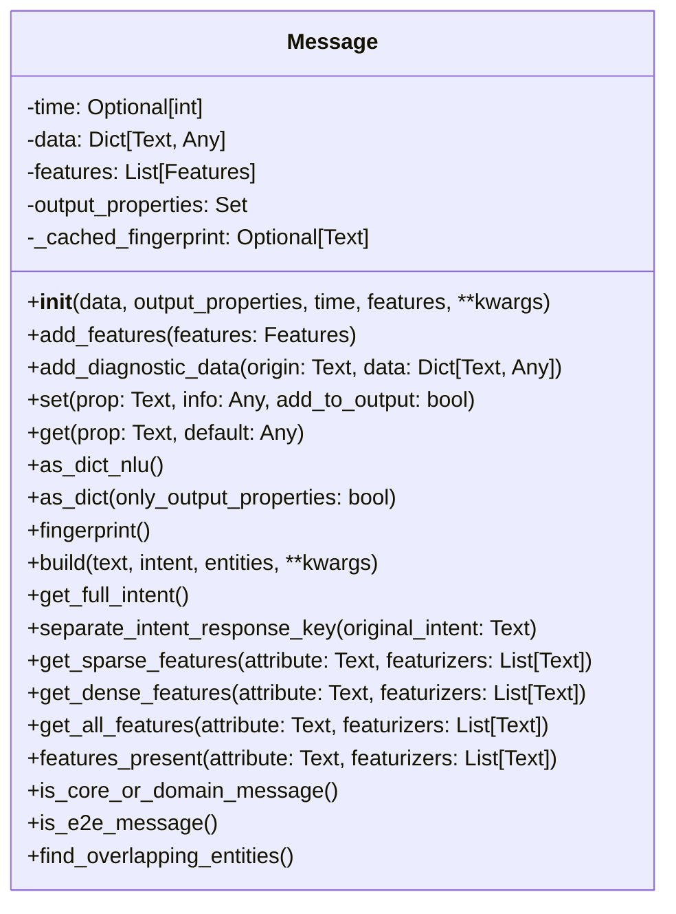
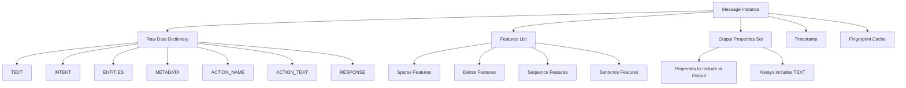
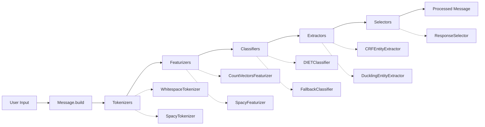
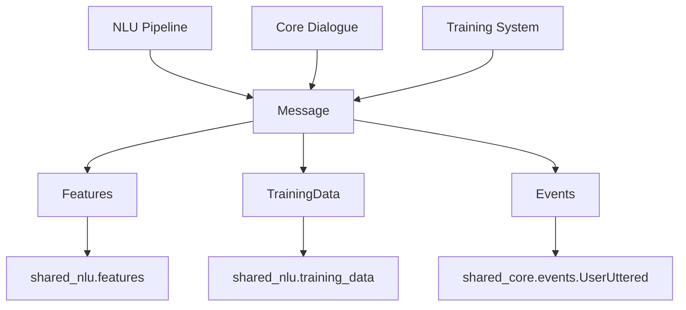
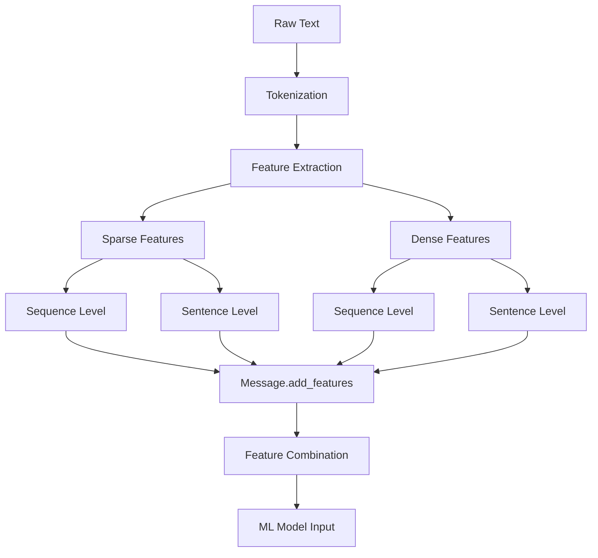
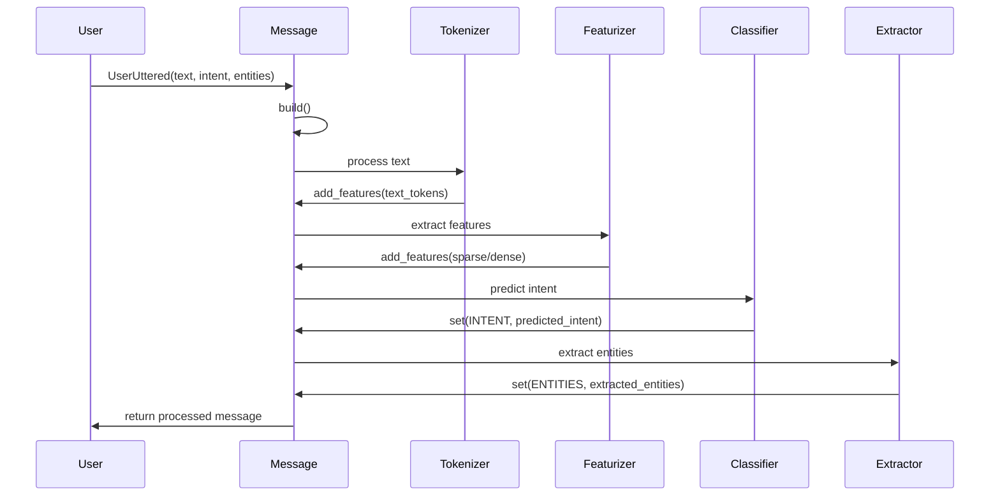
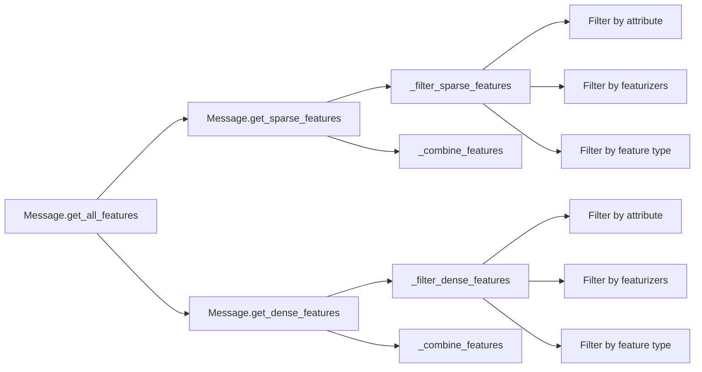

# Message Module Documentation

## Introduction

The Message module is a fundamental component of the Rasa NLU system that serves as a container for conversation data. It provides a unified interface for handling user utterances, bot actions, and their associated features throughout the natural language understanding pipeline. The Message class acts as the primary data structure that flows through the entire NLU processing chain, carrying text, intents, entities, and extracted features.

## Core Architecture

### Message Class Overview

The `Message` class is the central component of this module, designed to encapsulate all data related to a conversation turn. It maintains both raw data and processed features, making it a versatile container for NLU processing.



### Data Structure and Properties

The Message class maintains several key data structures:



## Component Relationships

### Integration with NLU Pipeline

The Message module serves as the primary data carrier throughout the NLU processing pipeline:



### Dependencies and Interactions

The Message module interacts with several key components:



## Key Functionality

### Message Creation and Building

The Message class provides flexible construction methods:

1. **Direct Initialization**: Create messages with custom data and features
2. **Build Method**: Construct messages from user utterance data
3. **Factory Methods**: Support for different message types (NLU, Core, E2E)

### Feature Management

The module provides comprehensive feature handling capabilities:



### Message Type Detection

The module includes methods to identify different message types:

- **Core/Domain Messages**: Messages from stories or domain actions
- **E2E Messages**: End-to-end story messages
- **NLU Messages**: Standard natural language understanding messages

### Entity Processing

Advanced entity handling capabilities:

- **Entity Overlap Detection**: Identifies overlapping entity annotations
- **Entity Position Tracking**: Maintains start/end positions for entities
- **Entity Metadata**: Supports additional entity information

## Data Flow Architecture

### Message Processing Pipeline



### Feature Extraction Flow



## Integration Points

### NLU Training Data Integration

The Message module works closely with the [TrainingData](shared_nlu.md) module to provide comprehensive training data management:

- Messages are the fundamental units of training examples
- Support for intent and entity annotation
- Metadata preservation for training examples
- Integration with story-based training data

### Core Dialogue Integration

Messages bridge NLU and Core components:

- Conversion between `UserUttered` events and Message objects
- Support for action-related message types
- Integration with dialogue state tracking
- End-to-end conversation processing

### Feature System Integration

Deep integration with the [Features](shared_nlu.md) module:

- Support for both sparse and dense feature types
- Sequence and sentence-level feature handling
- Feature combination and filtering
- Origin tracking for debugging and analysis

## Error Handling and Validation

### Intent Validation

- Intent name format validation
- Response key separation logic
- Error handling for malformed intent names

### Entity Validation

- Overlapping entity detection
- Position validation for entities
- Metadata consistency checks

### Feature Validation

- Feature type validation
- Attribute consistency checks
- Featurizer origin validation

## Performance Considerations

### Fingerprinting and Caching

- Efficient message fingerprinting for comparison
- Cached fingerprint calculation
- Deep container fingerprinting for complex data structures

### Memory Management

- Feature combination optimization
- Data structure reuse where possible
- Efficient filtering algorithms

### Feature Processing

- Optimized feature filtering
- Efficient feature combination
- Support for partial feature processing

## Usage Patterns

### Basic Message Creation

```python
# Create a simple message
message = Message.build(
    text="Hello, how are you?",
    intent="greet",
    entities=[]
)

# Add features
message.add_features(sparse_features)
message.add_features(dense_features)
```

### Advanced Feature Processing

```python
# Get specific features
sparse_seq, sparse_sent = message.get_sparse_features("text", ["CountVectorsFeaturizer"])
dense_seq, dense_sent = message.get_dense_features("text", ["SpacyFeaturizer"])

# Check feature presence
if message.features_present("text"):
    features = message.get_all_features("text")
```

### Message Type Checking

```python
# Check message type
if message.is_core_or_domain_message():
    # Handle core message
elif message.is_e2e_message():
    # Handle end-to-end message
```

## Extension Points

The Message module is designed for extensibility:

- **Custom Properties**: Support for arbitrary data properties
- **Feature Types**: Extensible feature system
- **Metadata Support**: Rich metadata handling
- **Diagnostic Data**: Support for pipeline debugging information

## Related Documentation

- [TrainingData Module](shared_nlu.md) - Comprehensive training data management
- [Features Module](shared_nlu.md) - Feature extraction and management
- [NLU Processing](nlu_processing.md) - Natural language understanding pipeline
- [Core Dialogue](core_dialogue.md) - Dialogue management system