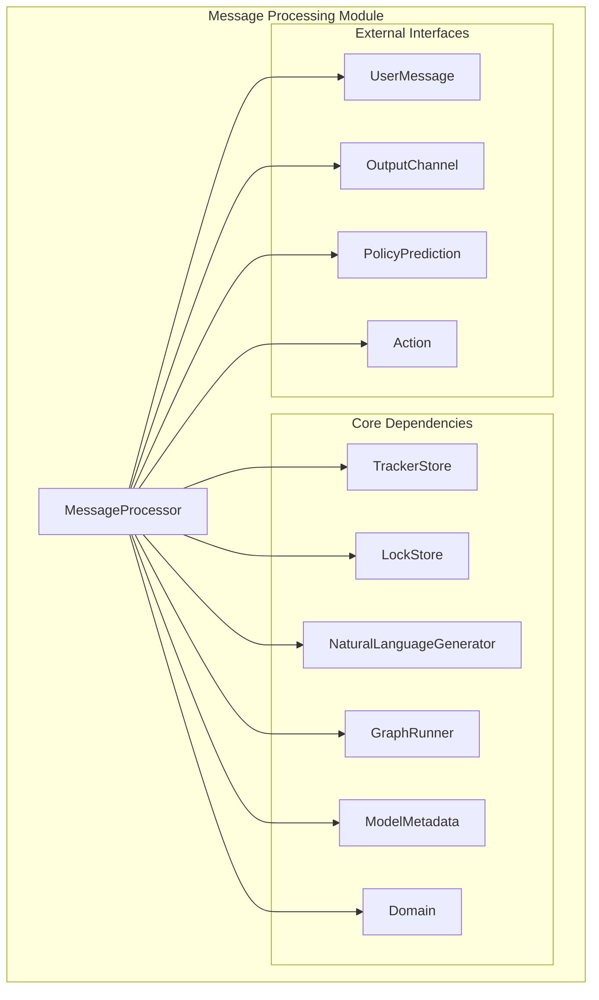
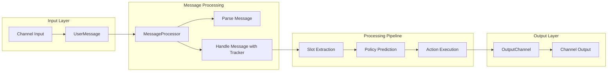
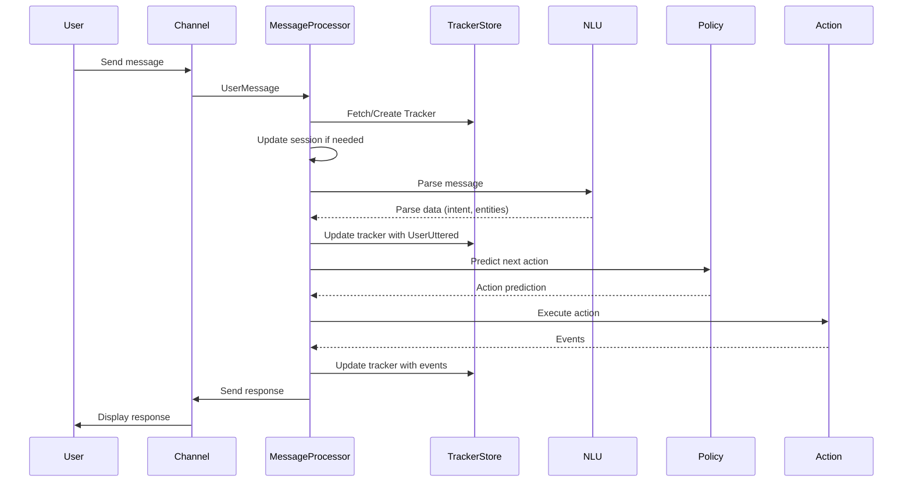
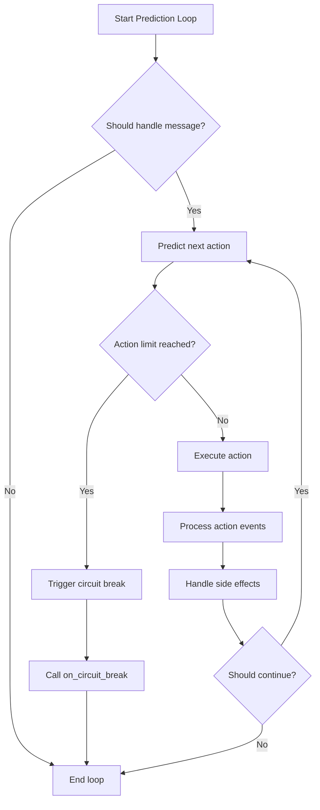

# Message Processing Module

## Introduction

The message_processing module is a core component of Rasa's dialogue orchestration system, responsible for handling incoming user messages and coordinating the conversation flow. It serves as the central processing unit that bridges natural language understanding (NLU) with dialogue management, ensuring seamless interaction between users and the conversational AI system.

This module contains the `MessageProcessor` class, which acts as the primary interface for processing user messages, managing conversation state, executing actions, and maintaining the dialogue flow according to trained policies and defined domain rules.

## Architecture Overview

### Core Component Structure

### System Integration

## Component Details

### MessageProcessor Class

The `MessageProcessor` class is the central component that orchestrates the entire message processing workflow. It manages the conversation lifecycle from message reception to response generation and state persistence.

#### Key Responsibilities:
- **Message Parsing**: Convert raw user input into structured NLU data
- **Tracker Management**: Maintain conversation state and history
- **Action Prediction**: Coordinate with policy ensemble to determine next actions
- **Action Execution**: Run selected actions and handle their outcomes
- **Session Management**: Handle conversation sessions and their lifecycle
- **Side Effect Management**: Process reminders, bot messages, and other events

#### Constructor Parameters:
- `model_path`: Path to the trained model
- `tracker_store`: Storage backend for conversation trackers
- `lock_store`: Concurrency control mechanism
- `generator`: Natural language response generator
- `action_endpoint`: Optional endpoint for custom actions
- `max_number_of_predictions`: Safety limit for prediction loops
- `on_circuit_break`: Callback for handling prediction limits
- `http_interpreter`: Optional HTTP-based NLU interpreter

## Data Flow Architecture

### Message Processing Pipeline

### Prediction Loop Flow

## Key Methods and Functionality

### Message Handling

#### `handle_message(message: UserMessage)`
The primary entry point for processing incoming messages. This method orchestrates the entire message processing workflow:

1. **Preprocessing**: Fetch or create conversation tracker
2. **Message Logging**: Parse and log the message to the tracker
3. **Slot Extraction**: Run slot extraction actions if needed
4. **Prediction Loop**: Execute the action prediction and execution cycle
5. **Anonymization**: Apply privacy filters if configured
6. **Persistence**: Save the updated tracker state

#### `parse_message(message, tracker, only_output_properties)`
Converts raw user input into structured NLU data using either:
- HTTP interpreter (if configured)
- Graph-based NLU pipeline (default)

The method handles intent recognition, entity extraction, and validation against the domain configuration.

### Tracker Management

#### `fetch_tracker_and_update_session(sender_id, output_channel, metadata)`
Retrieves the conversation tracker and ensures the session is valid. Creates new sessions when:
- No previous tracker exists
- The current session has expired
- Session configuration requires a new session

#### `get_tracker(conversation_id)`
Basic tracker retrieval without session management. Used when session updates are not required.

### Action Processing

#### `_run_prediction_loop(output_channel, tracker)`
The core action selection and execution loop that:
1. Predicts the next action using policy ensemble
2. Executes the selected action
3. Processes resulting events
4. Continues until an action_listen is predicted or limits are reached

#### `_run_action(action, tracker, output_channel, nlg, prediction)`
Executes individual actions with proper error handling and event processing. Manages:
- Action execution with temporary tracker
- Event rejection handling
- Side effect processing (reminders, bot messages)
- Tracker updates

### Session Management

#### `_update_tracker_session(tracker, output_channel, metadata)`
Manages conversation sessions by:
- Checking session expiration based on configuration
- Running action_session_start when needed
- Handling session metadata

#### `_has_session_expired(tracker)`
Determines if a session has expired based on:
- Session configuration settings
- Time since last user interaction
- Domain session policies

## Dependencies and Integration

### Internal Dependencies

The MessageProcessor integrates with several core Rasa modules:

- **[shared_core](shared_core.md)**: Uses `DialogueStateTracker`, `Event` types, and `Domain` for conversation management
- **[policy_framework](policy_framework.md)**: Leverages `PolicyPrediction` and policy ensemble for action selection
- **[action_framework](action_framework.md)**: Executes `Action` instances and handles action lifecycle
- **[storage_persistence](storage_persistence.md)**: Persists tracker state via `TrackerStore` and manages concurrency with `LockStore`
- **[nlu_processing](nlu_processing.md)**: Processes messages through NLU pipeline for intent/entity extraction

### External Interfaces

- **Input Channels**: Receives `UserMessage` instances from various channel implementations
- **Output Channels**: Sends responses through configured output channels
- **Action Server**: Communicates with external action servers for custom actions
- **NLU Services**: Optionally uses HTTP-based NLU interpreters

## Error Handling and Safety

### Circuit Breaker Pattern
The processor implements a circuit breaker to prevent infinite prediction loops:
- Configurable maximum number of predictions (default: 10)
- Callback mechanism for handling limit breaches
- Graceful degradation when limits are reached

### Action Execution Protection
- Temporary tracker usage to allow rollback on rejections
- Comprehensive exception handling for action failures
- Event validation and domain compliance checking

### Session Safety
- Session expiration checks to prevent stale conversations
- Automatic session initialization for new conversations
- Metadata preservation across session boundaries

## Performance Considerations

### Optimization Strategies
- **Lazy Loading**: Model components loaded on-demand
- **Caching**: Tracker state cached to minimize database operations
- **Batch Processing**: Events processed in batches where possible
- **Async Operations**: Non-blocking I/O for external services

### Resource Management
- Temporary directory usage for model extraction
- Tracker copying to prevent state corruption
- Memory-efficient event processing

## Configuration and Customization

### Model Configuration
The processor adapts to different model types:
- **NLU-only models**: Skips action prediction, focuses on parsing
- **Core models**: Full conversation management capabilities
- **End-to-end models**: Supports end-to-end action predictions

### Session Configuration
Session behavior controlled through domain configuration:
- Session expiration times
- Session start actions
- Metadata handling

### Extension Points
- Custom action endpoints for external integrations
- HTTP interpreters for remote NLU processing
- Circuit break callbacks for custom limit handling
- Anonymization pipelines for privacy compliance

## Monitoring and Debugging

### Logging and Observability
The processor provides comprehensive logging:
- Structured logging for key operations
- Debug information for message parsing
- Action execution tracking
- Session lifecycle events

### State Inspection
- Tracker state access for debugging
- Prediction confidence reporting
- Event history analysis
- Slot value logging

This documentation provides a comprehensive overview of the message_processing module's architecture, functionality, and integration within the Rasa ecosystem. The module serves as the central hub for conversational AI processing, ensuring reliable and efficient message handling across all supported channels and configurations.