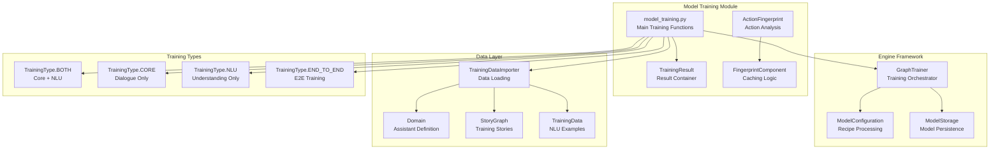
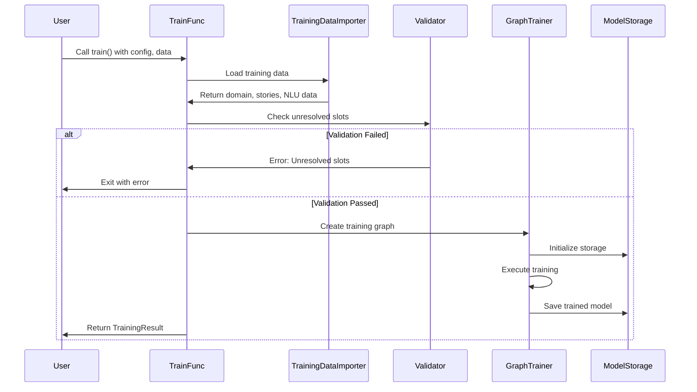
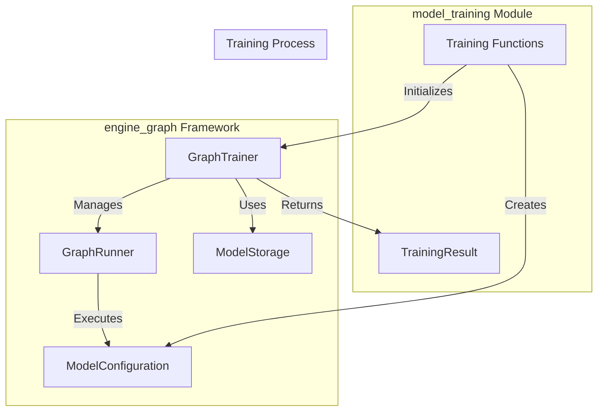

# Model Training Module

## Overview

The `model_training` module is the central orchestrator for training Rasa models, handling both Core (dialogue management) and NLU (natural language understanding) components. It provides a unified interface for training complete Rasa assistants, individual NLU models, or Core models separately.

## Purpose

This module serves as the entry point for model training in Rasa, offering:
- **Unified Training Pipeline**: Train complete Rasa models with both Core and NLU components
- **Incremental Training**: Support for fine-tuning existing models
- **Training Optimization**: Intelligent caching and fingerprinting to avoid unnecessary retraining
- **Flexible Training Modes**: Support for Core-only, NLU-only, or end-to-end training
- **Validation and Error Handling**: Comprehensive checks for training data consistency

## Architecture



## Core Components

### 1. Training Orchestration ([training_orchestration.md](training_orchestration.md))

The main entry points for model training that coordinate the entire training pipeline:

- **`train()`**: Unified training for both Core and NLU
- **`train_core()`**: Core-only training  
- **`train_nlu()`**: NLU-only training
- **`_train_graph()`**: Internal graph-based training orchestration

This sub-module handles training type detection, data validation, and coordinates with the graph-based training framework.

### 2. TrainingResult

A `NamedTuple` that encapsulates training outcomes:
- `model`: Path to the trained model file
- `code`: Training status code (0 for success, flags for specific conditions)
- `dry_run_results`: Fingerprinting results for cache validation

### 3. Fingerprinting System ([fingerprinting_system.md](fingerprinting_system.md))

Implements intelligent caching mechanisms to optimize training:

- **`FingerprintComponent`**: Calculates fingerprints for training components
- **`FingerprintStatus`**: Tracks cache hit/miss status
- **`PrecomputedValueProvider`**: Provides cached values for pruned nodes

This system determines if cached results can be reused, avoiding redundant computations and significantly speeding up iterative training.

### 4. Action Analysis ([action_analysis.md](action_analysis.md))

Captures and analyzes action behavior patterns during training:

- **`ActionFingerprint`**: Records what slots each action sets and active loops
- **`create_action_fingerprints()`**: Generates fingerprints from training trackers

Used for validation and warning generation when actions behave differently than observed during training.

## Training Pipeline Flow



## Training Types

The module supports four distinct training modes:

1. **BOTH** (Core + NLU): Complete assistant training
2. **CORE**: Dialogue management only
3. **NLU**: Natural language understanding only  
4. **END_TO_END**: End-to-end training with conversation examples

## Key Features

### Intelligent Caching
- Fingerprint-based component caching
- Avoids retraining unchanged components
- Significant speedup for iterative development

### Data Validation
- Unresolved slot detection
- Training data consistency checks
- Domain-story alignment validation

### Flexible Configuration
- Recipe-based configuration system
- Support for custom training parameters
- Fine-tuning capabilities

### Model Management
- Automatic model naming with timestamps
- Support for fixed model names
- Model persistence and versioning

## Integration with Graph Training Framework

The model_training module serves as the high-level interface to the [engine_graph](engine_graph.md) framework. Here's how they work together:



### Key Integration Points:

1. **GraphTrainer**: The core training orchestrator from engine_graph that executes the training graph
2. **ModelConfiguration**: Generated from recipes to define the training pipeline
3. **GraphRunner**: Executes the pruned training graph with actual component execution
4. **ModelStorage**: Handles persistence of trained components and model packaging

The model_training module handles the high-level concerns (data loading, validation, training type detection) while delegating the actual training execution to the engine_graph framework.

## Dependencies

The model_training module integrates with several key Rasa modules:

- **[engine_graph](engine_graph.md)**: Graph-based training execution framework (detailed integration above)
- **[data_importers](data_importers.md)**: Training data loading and validation
- **[shared_core](shared_core.md)**: Core domain and training data structures
- **[shared_nlu](shared_nlu.md)**: NLU training data and message structures

## Usage Examples

### Complete Model Training
```python
from rasa.model_training import train

result = train(
    domain="domain.yml",
    config="config.yml", 
    training_files=["data/nlu.yml", "data/stories.yml"],
    output="models"
)
```

### NLU-Only Training
```python
from rasa.model_training import train_nlu

model_path = train_nlu(
    config="config.yml",
    nlu_data="data/nlu.yml",
    output="models"
)
```

### Dry Run for Cache Validation
```python
result = train(
    domain="domain.yml",
    config="config.yml",
    training_files=["data/"],
    dry_run=True
)
# Check result.code and result.dry_run_results
```

## Error Handling

The module implements comprehensive error handling:
- **Unresolved Slots**: Detects slots referenced in stories but not defined in domain
- **Missing Data**: Validates presence of required training data
- **Configuration Errors**: Checks for valid configuration files
- **Training Failures**: Provides detailed error messages and suggestions

## Performance Optimization

- **Fingerprinting**: Avoids redundant training through intelligent caching
- **Parallel Execution**: Leverages Dask for distributed training
- **Memory Management**: Efficient handling of large training datasets
- **Incremental Training**: Support for fine-tuning existing models

This module serves as the foundation for all model training operations in Rasa, providing a robust, efficient, and user-friendly interface for creating conversational AI models.