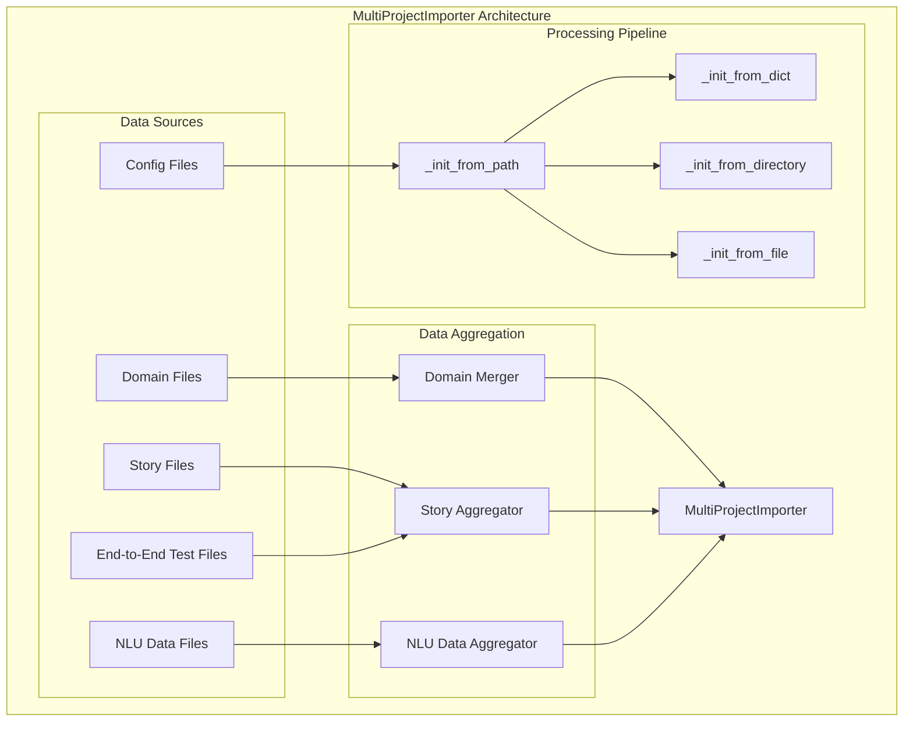
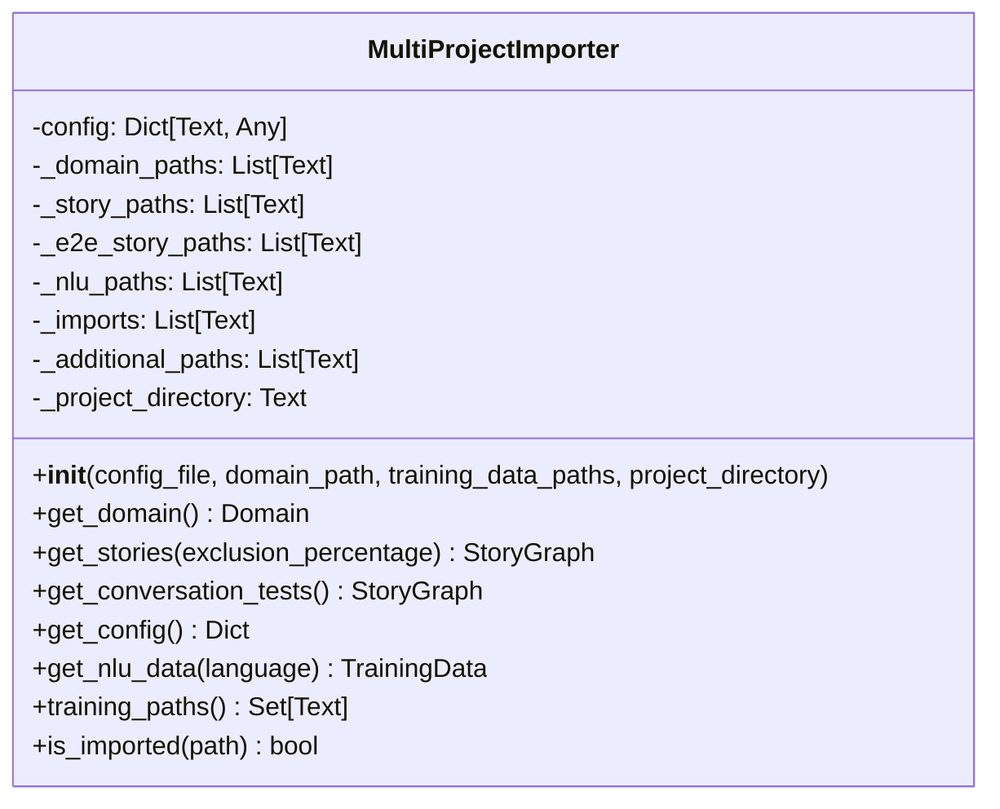
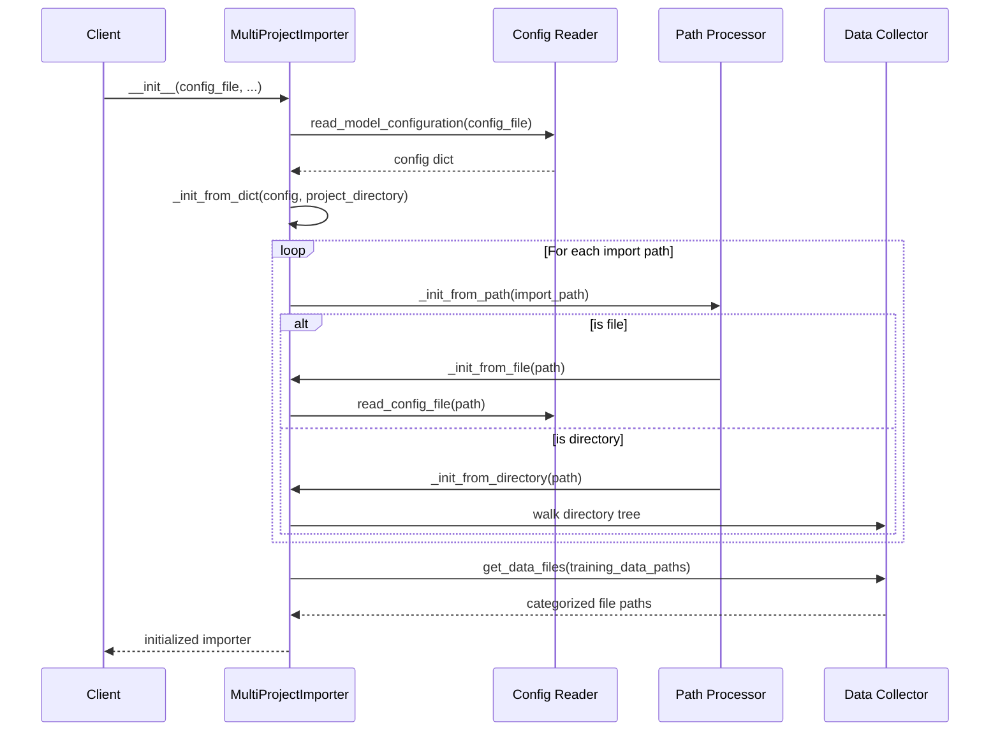
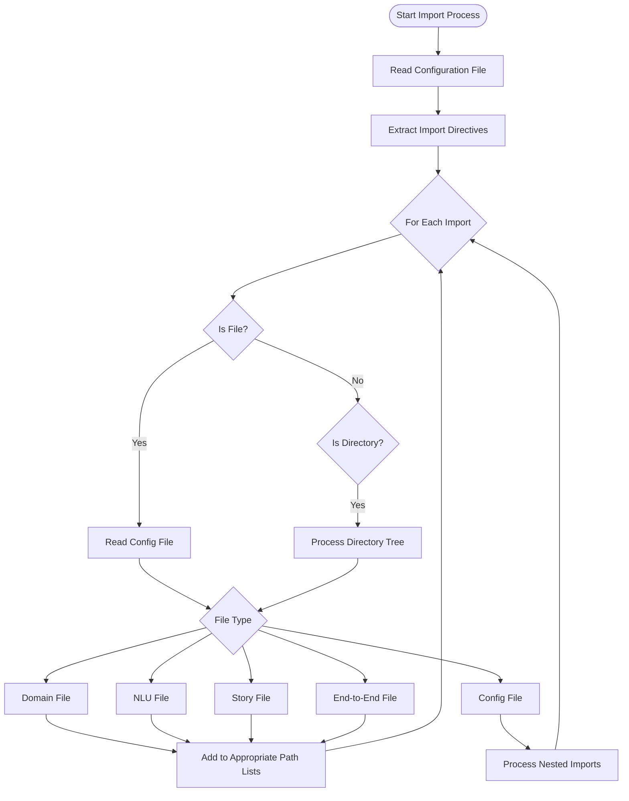
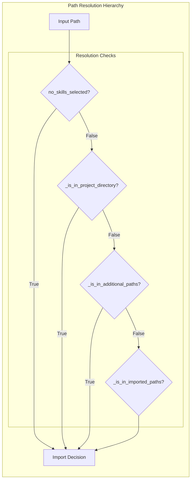
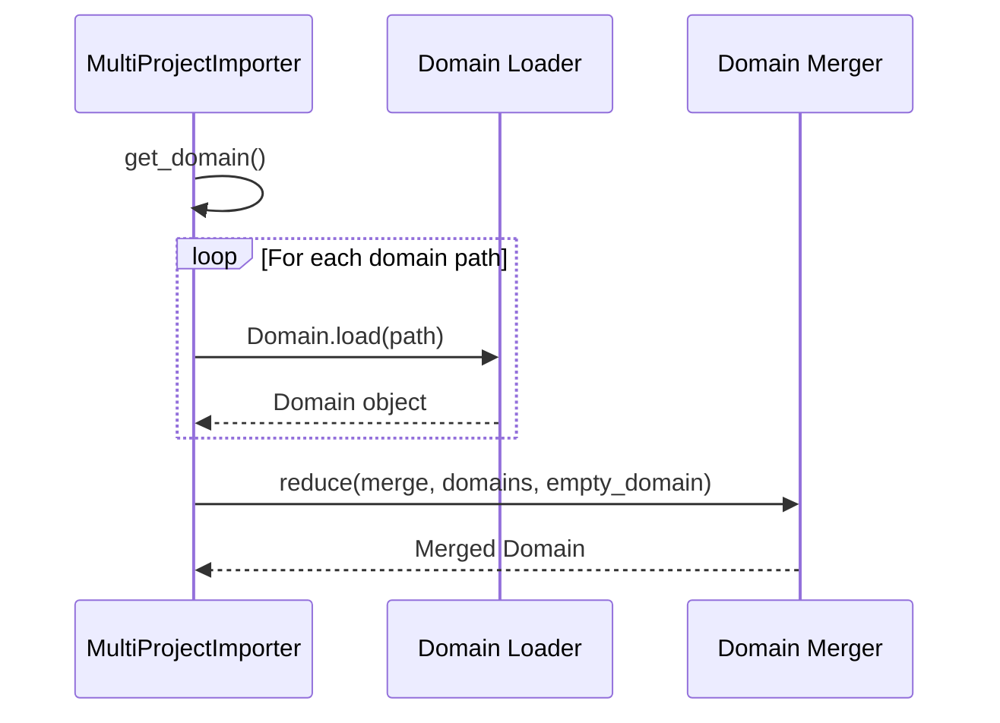
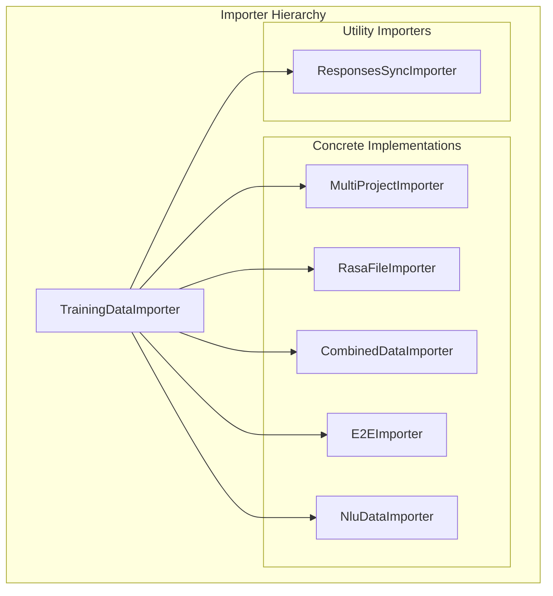

# Multi-Project Importer Module

## Introduction

The Multi-Project Importer module provides a sophisticated data aggregation system for Rasa that enables importing and merging training data from multiple projects or directories. This module is particularly useful for organizations managing multiple conversational AI projects that need to share common training data, domain definitions, or configuration settings.

## Core Purpose

The `MultiProjectImporter` serves as a centralized data aggregation mechanism that:
- Imports training data from multiple project directories
- Merges domain definitions across projects
- Aggregates NLU training data and conversation stories
- Supports hierarchical project structures with import dependencies
- Enables code reuse and modular training data organization

## Architecture Overview



## Component Details

### MultiProjectImporter Class

The `MultiProjectImporter` extends `TrainingDataImporter` and implements a recursive import mechanism that processes project hierarchies through configuration-based imports.

#### Key Attributes



#### Initialization Process



## Data Import Flow

### Import Resolution Algorithm



### Path Resolution Logic



## Data Aggregation Methods

### Domain Merging



### Story and NLU Data Aggregation

The module uses utility functions from `rasa.shared.importers.utils` to aggregate story graphs and NLU training data from multiple file paths:

- **Stories**: `utils.story_graph_from_paths()` merges story files while handling exclusions
- **NLU Data**: `utils.training_data_from_paths()` combines NLU training data from multiple sources
- **Conversation Tests**: Separate aggregation for end-to-end test stories

## Integration with Rasa Ecosystem

### Relationship to Other Importers



### Dependencies on Core Components

The MultiProjectImporter integrates with several core Rasa modules:

- **[shared_core](shared_core.md)**: Uses `Domain`, `StoryGraph`, and event structures
- **[shared_nlu](shared_nlu.md)**: Handles `TrainingData` and `Message` objects
- **[data_importers](data_importers.md)**: Extends base `TrainingDataImporter` interface

## Configuration Format

### Import Configuration Structure

```yaml
# config.yml
imports:
  - ../common_project
  - ./sub_project
  - /absolute/path/to/shared/data

# Other Rasa configuration...
pipeline:
  # NLU pipeline configuration
  
policies:
  # Core policies configuration
```

### Project Structure Example

```
main_project/
├── config.yml          # Main configuration with imports
├── domain.yml          # Main domain definition
├── data/
│   ├── nlu.yml        # Main NLU data
│   └── stories.yml    # Main stories
└── imports/
    ├── common/        # Imported common project
    │   ├── config.yml
    │   ├── domain.yml
    │   └── data/
    └── shared/        # Another imported project
        ├── domain.yml
        └── data/
```

## Usage Patterns

### Basic Multi-Project Setup

```python
from rasa.shared.importers.multi_project import MultiProjectImporter

# Initialize importer with main config
importer = MultiProjectImporter(
    config_file="config.yml",
    domain_path="domain.yml",
    training_data_paths=["data/"],
    project_directory="."
)

# Get aggregated data
domain = importer.get_domain()
stories = importer.get_stories()
nlu_data = importer.get_nlu_data()
config = importer.get_config()
```

### Advanced Configuration with Nested Imports

The importer supports deeply nested project structures where imported projects can themselves import other projects, creating a dependency graph of training data sources.

## Error Handling and Validation

### Import Validation

The module includes several validation mechanisms:

- **File Existence**: Validates that imported paths exist
- **Config File Validation**: Ensures imported files are valid Rasa configuration files
- **Circular Import Prevention**: Prevents infinite recursion through import tracking
- **Path Resolution**: Handles relative and absolute path resolution correctly

### Warning System

The module uses Rasa's warning system to alert users about:
- Missing import paths
- Invalid configuration files
- Experimental feature usage (marked with `@mark_as_experimental_feature`)

## Performance Considerations

### File System Operations

- Uses `os.walk()` with `followlinks=True` for directory traversal
- Implements path caching to avoid redundant file system checks
- Processes imports recursively but with cycle detection

### Memory Management

- Loads domain files on-demand during `get_domain()` calls
- Aggregates data incrementally rather than loading everything upfront
- Uses generator patterns where possible for large datasets

## Extension Points

### Custom Importers

Developers can extend the multi-project import functionality by:

1. **Subclassing MultiProjectImporter**: Override specific methods for custom behavior
2. **Implementing TrainingDataImporter**: Create completely custom importers
3. **Using CombinedDataImporter**: Chain multiple importers together

### Integration with Training Pipeline

The importer integrates seamlessly with Rasa's training pipeline through the [engine_graph](engine_graph.md) module, where it can be used as a data provider component.

## Best Practices

### Project Organization

1. **Hierarchical Structure**: Organize projects in a clear hierarchy
2. **Common Data Separation**: Keep shared data in separate, imported projects
3. **Configuration Management**: Use consistent configuration across projects
4. **Version Control**: Track imported projects as dependencies

### Performance Optimization

1. **Selective Imports**: Only import necessary projects to reduce loading time
2. **Data Caching**: Consider caching aggregated results for large projects
3. **Incremental Updates**: Use file modification tracking for efficient updates

## Troubleshooting

### Common Issues

1. **Import Loops**: Check for circular import dependencies
2. **Path Resolution**: Verify relative vs absolute path usage
3. **File Permissions**: Ensure read access to all imported paths
4. **Configuration Validation**: Validate YAML syntax in config files

### Debugging

Enable debug logging to trace import resolution:

```python
import logging
logging.getLogger('rasa.shared.importers.multi_project').setLevel(logging.DEBUG)
```

This provides detailed information about:
- Selected projects and import paths
- File discovery and categorization
- Domain merging process
- Path resolution decisions