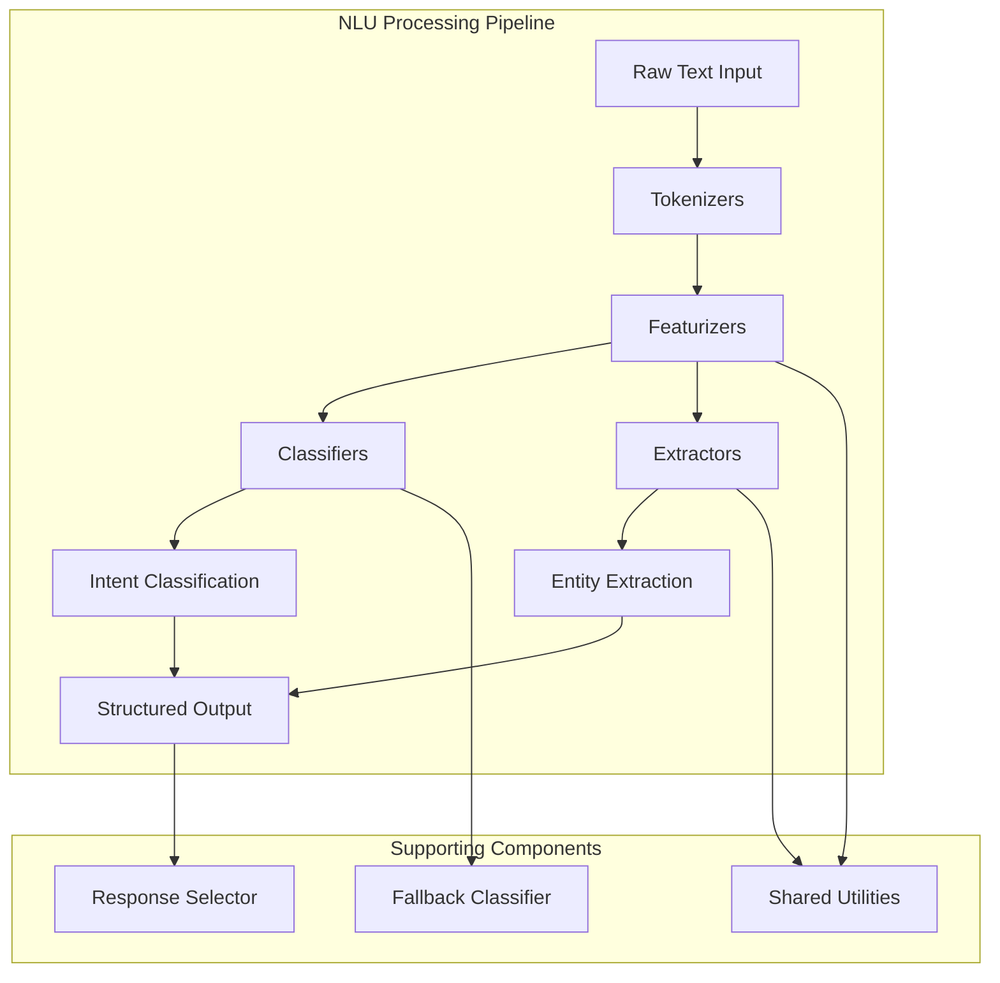
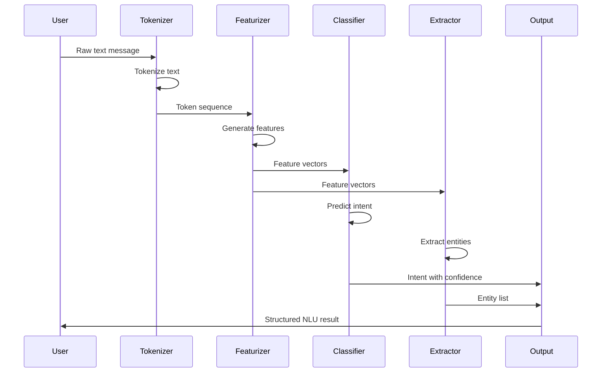

# NLU Processing Module

## Overview

The NLU (Natural Language Understanding) Processing module is a core component of the Rasa framework responsible for extracting meaning and structure from user messages. This module transforms raw text into structured data that can be understood by the dialogue management system, enabling conversational AI applications to comprehend user intent and extract relevant entities.

## Purpose and Core Functionality

The NLU Processing module serves as the intelligence layer that bridges human language and machine understanding. It performs three primary functions:

1. **Intent Classification**: Determines what the user wants to achieve with their message
2. **Entity Extraction**: Identifies and extracts specific pieces of information from the text
3. **Feature Engineering**: Converts text into numerical representations that machine learning models can process

## Architecture Overview

The module follows a pipeline architecture where text flows through sequential processing stages:

1. **Tokenization**: Breaks text into meaningful units (tokens)
2. **Featurization**: Converts tokens into numerical features
3. **Classification/Extraction**: Applies machine learning models to extract intents and entities
4. **Post-processing**: Applies business logic and confidence thresholds

## Sub-modules and Components

### 1. Classifiers Sub-module
The classifiers sub-module contains machine learning models for intent classification and fallback handling.

**Key Components:**
- **DIETClassifier**: A multi-task transformer model that performs both intent classification and entity extraction
- **FallbackClassifier**: Handles low-confidence predictions by providing fallback responses

**Features:**
- Dual Intent and Entity Transformer (DIET) architecture
- Configurable confidence thresholds
- Support for multi-intent classification
- Fallback mechanism for uncertain predictions

### 1. Classifiers Sub-module
The classifiers sub-module contains machine learning models for intent classification and fallback handling.

**Key Components:**
- **DIETClassifier**: A multi-task transformer model that performs both intent classification and entity extraction
- **FallbackClassifier**: Handles low-confidence predictions by providing fallback responses

**Features:**
- Dual Intent and Entity Transformer (DIET) architecture
- Configurable confidence thresholds
- Support for multi-intent classification
- Fallback mechanism for uncertain predictions

[Detailed Documentation](classifiers.md)

### 2. Extractors Sub-module  
The extractors sub-module focuses on identifying and extracting structured information from text.

**Key Components:**
- **CRFEntityExtractor**: Uses Conditional Random Fields for entity recognition
- **DucklingEntityExtractor**: Extracts structured entities like dates, numbers, and time expressions

**Features:**
- Support for multiple entity types (person, location, organization, etc.)
- BILOU tagging scheme for entity boundaries
- Integration with external services (Duckling)
- Configurable entity recognition patterns

[Detailed Documentation](extractors.md)

### 3. Tokenizers Sub-module
The tokenizers sub-module breaks down text into meaningful units for further processing.

**Key Components:**
- **WhitespaceTokenizer**: Simple whitespace-based tokenization
- **SpacyTokenizer**: Advanced tokenization using spaCy NLP library

**Features:**
- Language-specific tokenization rules
- Support for emojis and special characters
- Configurable token patterns
- Integration with spaCy for advanced linguistic features

[Detailed Documentation](tokenizers.md)

### 4. Featurizers Sub-module
The featurizers sub-module converts text into numerical representations that machine learning models can process.

**Key Components:**
- **CountVectorsFeaturizer**: Creates sparse feature vectors using bag-of-words approach
- **SpacyFeaturizer**: Generates dense feature vectors using pre-trained word embeddings

**Features:**
- Sparse and dense feature representations
- Configurable n-gram ranges
- Out-of-vocabulary handling
- Support for multiple languages

[Detailed Documentation](featurizers.md)

### 5. Selectors Sub-module
The selectors sub-module handles response selection for retrieval-based conversational patterns.

**Key Components:**
- **ResponseSelector**: Selects appropriate responses from a predefined set based on user input

**Features:**
- Supervised embedding-based response matching
- Support for retrieval intents
- Configurable similarity metrics
- Response ranking and confidence scoring

[Detailed Documentation](selectors.md)

## Data Flow and Processing Pipeline

## Integration with Other Modules

The NLU Processing module integrates closely with other Rasa modules:

- **[shared_nlu](shared_nlu.md)**: Shared data structures and utilities for NLU processing
- **[core_dialogue](core_dialogue.md)**: Provides structured input for dialogue management
- **[engine_graph](engine_graph.md)**: Executes NLU components within the processing graph

## Configuration and Customization

The module supports extensive configuration options:

- **Pipeline Configuration**: Define the sequence of processing components
- **Model Parameters**: Tune hyperparameters for each component
- **Feature Engineering**: Configure feature extraction methods
- **Threshold Settings**: Set confidence thresholds for predictions

## Performance Considerations

- **Model Selection**: Choose appropriate models based on data size and complexity
- **Feature Optimization**: Balance between feature richness and computational cost
- **Caching**: Leverage caching for frequently processed patterns
- **Batch Processing**: Process multiple messages efficiently

## Error Handling and Fallbacks

The module implements comprehensive error handling:

- **Confidence-based Fallbacks**: Handle low-confidence predictions
- **Model Failure Recovery**: Graceful degradation when models fail
- **Validation**: Input validation and sanitization
- **Logging**: Comprehensive logging for debugging and monitoring

## Extensibility

The modular architecture allows for easy extension:

- **Custom Components**: Implement new classifiers, extractors, or featurizers
- **Plugin Architecture**: Add new processing capabilities
- **Model Integration**: Integrate external NLP models and services
- **Language Support**: Add support for new languages and domains