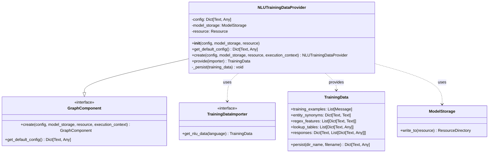
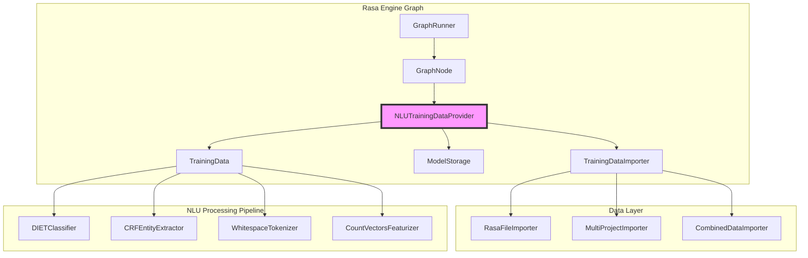
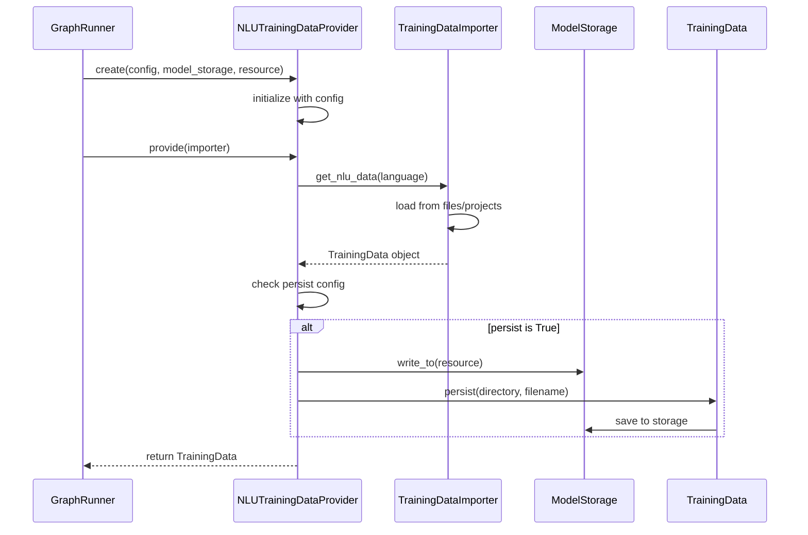
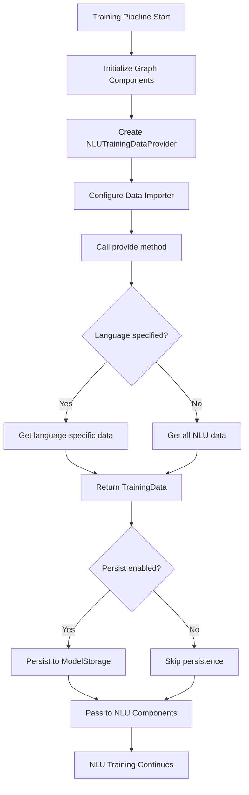

# NLU Training Data Provider Module

## Introduction

The `nlu_training_data_provider` module is a critical component in the Rasa training pipeline that serves as a bridge between data importers and NLU training components. It provides a standardized way to retrieve, process, and optionally persist NLU training data during the model training process. This module ensures that NLU components receive properly formatted training data while maintaining consistency across different data sources and training scenarios.

## Module Overview

The NLU Training Data Provider acts as a data access layer within the Rasa engine graph system, responsible for:

- **Data Retrieval**: Fetching NLU training data from various sources through the TrainingDataImporter interface
- **Language Filtering**: Supporting language-specific data loading for multilingual bots
- **Data Persistence**: Optionally persisting processed training data to model storage
- **Integration**: Seamlessly integrating with the Rasa engine graph execution framework

## Architecture

### Component Structure



### System Integration



## Core Components

### NLUTrainingDataProvider

The `NLUTrainingDataProvider` is the main component of this module, implementing the `GraphComponent` interface to integrate with Rasa's engine graph system.

#### Key Responsibilities:

1. **Data Acquisition**: Retrieves NLU training data from configured importers
2. **Language Support**: Handles language-specific data loading
3. **Data Persistence**: Optionally persists training data to model storage
4. **Configuration Management**: Manages provider-specific configuration options

#### Configuration Options:

```python
{
    "persist": False,      # Whether to persist training data to storage
    "language": None       # Specific language to load data for
}
```

#### Methods:

- **`provide(importer: TrainingDataImporter) -> TrainingData`**: Main method that retrieves NLU training data from the importer
- **`_persist(training_data: TrainingData) -> None`**: Internal method for persisting data to model storage
- **`get_default_config() -> Dict[Text, Any]`**: Returns default configuration values
- **`create(...)`**: Factory method for creating provider instances

## Data Flow

### Training Data Retrieval Process



### Integration with Training Pipeline



## Dependencies and Relationships

### Upstream Dependencies

The NLU Training Data Provider depends on several key components:

1. **[TrainingDataImporter](data_importers.md)**: Interface for loading training data from various sources
2. **[ModelStorage](engine_graph.md)**: Storage system for persisting training data
3. **[TrainingData](shared_nlu.md)**: Data structure containing NLU training examples
4. **[GraphComponent](engine_graph.md)**: Base interface for engine graph integration

### Downstream Consumers

The training data provided by this module is consumed by:

1. **[NLU Classifiers](nlu_processing.md)**: DIETClassifier, FallbackClassifier
2. **[Entity Extractors](nlu_processing.md)**: CRFEntityExtractor, DucklingEntityExtractor
3. **[Tokenizers](nlu_processing.md)**: WhitespaceTokenizer, SpacyTokenizer
4. **[Featurizers](nlu_processing.md)**: CountVectorsFeaturizer, SpacyFeaturizer

### Related Modules

- **[data_importers](data_importers.md)**: Provides the TrainingDataImporter interface
- **[shared_nlu](shared_nlu.md)**: Contains the TrainingData data structure
- **[engine_graph](engine_graph.md)**: Provides the graph execution framework
- **[nlu_processing](nlu_processing.md)**: Consumers of the training data

## Configuration and Usage

### Basic Configuration

```yaml
# config.yml
graph_components:
  - name: "nlu_training_data_provider.NLUTrainingDataProvider"
    config:
      persist: true
      language: "en"
```

### Advanced Configuration

```yaml
# config.yml
graph_components:
  - name: "nlu_training_data_provider.NLUTrainingDataProvider"
    config:
      persist: true
      # Language can be dynamically set based on training context
      # language: null  # Will load all available languages
```

### Integration with Data Importers

The provider works seamlessly with different data importer configurations:

```yaml
# config.yml
importers:
- name: "RasaFileImporter"
  config:
    training_data_paths:
      - "data/nlu.yml"
      - "data/responses.yml"
- name: "MultiProjectImporter"
  config:
    project_directory: "projects"
```

## Process Flow

### Training Data Loading Process


### Error Handling and Validation

The provider includes several validation and error handling mechanisms:

1. **Language Validation**: Ensures requested language exists in training data
2. **Data Integrity**: Validates training data structure and content
3. **Storage Errors**: Handles model storage access issues gracefully
4. **Configuration Validation**: Validates provider configuration parameters

## Best Practices

### Performance Optimization

1. **Language Filtering**: Use language-specific loading for multilingual bots to reduce memory usage
2. **Persistence Strategy**: Enable persistence for large datasets to avoid repeated loading
3. **Importer Selection**: Choose appropriate importers based on data organization structure

### Data Organization

1. **File Structure**: Organize NLU data files logically (e.g., by intent, by language)
2. **Naming Conventions**: Use consistent naming for intents, entities, and files
3. **Version Control**: Track training data changes alongside code changes

### Integration Guidelines

1. **Graph Configuration**: Ensure proper node ordering in the engine graph
2. **Resource Management**: Configure appropriate resource allocation for large datasets
3. **Monitoring**: Implement logging and monitoring for data loading performance

## Troubleshooting

### Common Issues

1. **Missing Language Data**: Ensure training data files contain the requested language
2. **Importer Configuration**: Verify importer settings match data file locations
3. **Storage Permissions**: Check model storage access permissions when persistence is enabled

### Debug Information

The provider logs key information during execution:
- Data source locations
- Language filtering parameters
- Persistence operations
- Data validation results

## Extension Points

### Custom Data Importers

Implement custom `TrainingDataImporter` interfaces for specialized data sources:

```python
class CustomDataImporter(TrainingDataImporter):
    def get_nlu_data(self, language: Optional[Text] = None) -> TrainingData:
        # Custom data loading logic
        pass
```

### Enhanced Providers

Extend the NLUTrainingDataProvider for additional functionality:

```python
class EnhancedNLUTrainingDataProvider(NLUTrainingDataProvider):
    def provide(self, importer: TrainingDataImporter) -> TrainingData:
        # Add preprocessing or validation
        data = super().provide(importer)
        # Custom enhancements
        return data
```

## Conclusion

The NLU Training Data Provider module serves as a crucial intermediary in the Rasa training pipeline, ensuring that NLU components receive properly formatted and accessible training data. Its integration with the engine graph system, support for multiple data sources, and flexible configuration options make it an essential component for building robust conversational AI systems. By understanding its architecture, dependencies, and usage patterns, developers can effectively leverage this module to create efficient and maintainable training pipelines.