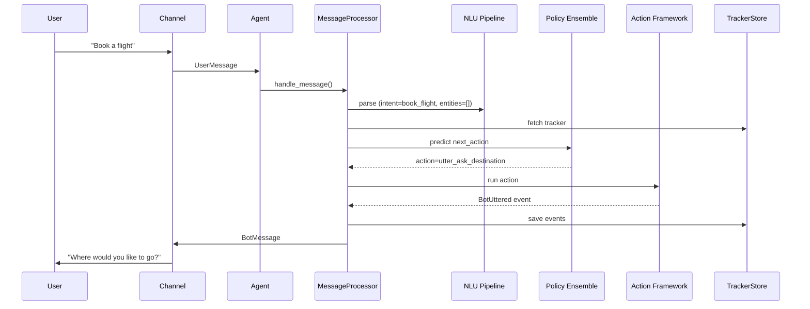
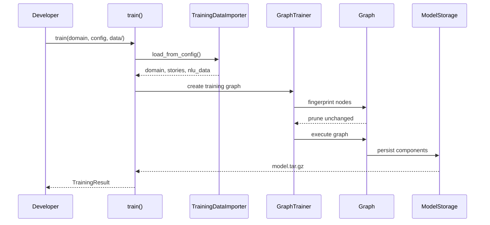

# RasaHQ–rasa Repository Overview

Rasa Open Source is a Python framework for building production-grade conversational AI assistants.  
It combines rule-based dialogue management, transformer-based NLU, and a pluggable architecture that lets teams train, evaluate, and deploy assistants entirely in code.

---

## 1. Purpose

*“Turn raw text into coherent, context-aware dialogue.”*

The repository delivers an end-to-end stack:

* **NLU** – intent classification & entity extraction  
* **Core** – dialogue policies & action execution  
* **Channels** – one assistant, many front-ends (REST, Socket.IO, Slack, Telegram, …)  
* **Training** – graph-based, fingerprint-cached, incremental  
* **Storage** – Redis, SQL, Dynamo, Mongo, in-memory  

Everything is configurable through YAML, extensible through Python, and runnable anywhere (laptop → K8s).

---

## 2. High-Level Architecture

```mermaid
graph TD
    User([User]) -->|text| C[Channel<br/>REST / Socket.IO / CLI]
    C -->|UserMessage| A[Agent<br/>entry point]
    A --> P[MessageProcessor]
    P --> N[NLU Pipeline<br/>DIET, CRF, …]
    P --> Pol[Policy Ensemble<br/>TED, Rule, Memo]
    P --> Act[Action Server<br/>custom code / forms]
    P <> TS[Tracker Store<br/>Redis / SQL / Dynamo]
    P --> C
    C -->|BotMessage| User

    subgraph Training
        T[train()] --> GI[GraphTrainer]
        GI --> R[Recipe]
        R --> G[Graph<br/>Nodes = Components]
        G --> M[.tar.gz model]
    end

    M -.-> A
```

---

## 3. Core Modules (quick map)

| Module | Path | What it gives you |
|--------|------|-------------------|
| **core_dialogue** | `rasa/core` | Dialogue loop, policies, actions, forms |
| **nlu_processing** | `rasa/nlu` | Intent classifiers, entity extractors, featurizers |
| **engine_graph** | `rasa/engine` | Graph runner, fingerprinting, caching, training orchestration |
| **channels** | `rasa/core/channels` | Input/Output adapters (REST, Socket.IO, console, …) |
| **shared_core** | `rasa/shared/core` | Domain, Events, Trackers, Slots – the *lingua franca* of dialogue |
| **shared_nlu** | `rasa/shared/nlu` | TrainingData, Message, Features – the *lingua franca* of NLU |
| **data_importers** | `rasa/shared/importers` | Load stories, NLU, domain from files or multi-project trees |
| **storage_persistence** | `rasa/core/tracker_store` | Where conversation memory lives (Redis, SQL, Dynamo, …) |
| **graph_providers** | `rasa/graph_components/providers` | Data suppliers to the training graph |
| **model_training** | `rasa/model_training` | High-level `train()` API that wires everything together |

---

## 4. End-to-End Flow (one picture)



---

## 5. Training Flow (one picture)



---

## 6. Where to dive next

* **Extend NLU** → read `nlu_processing/` docs  
* **Custom actions** → read `core_dialogue/action_framework/` docs  
* **New channel** → read `channels/` docs  
* **Speed up training** → read `engine_graph/` fingerprinting docs  
* **Persistent memory** → read `storage_persistence/` docs  

All sub-modules contain their own README-like pages linked from the structure above.