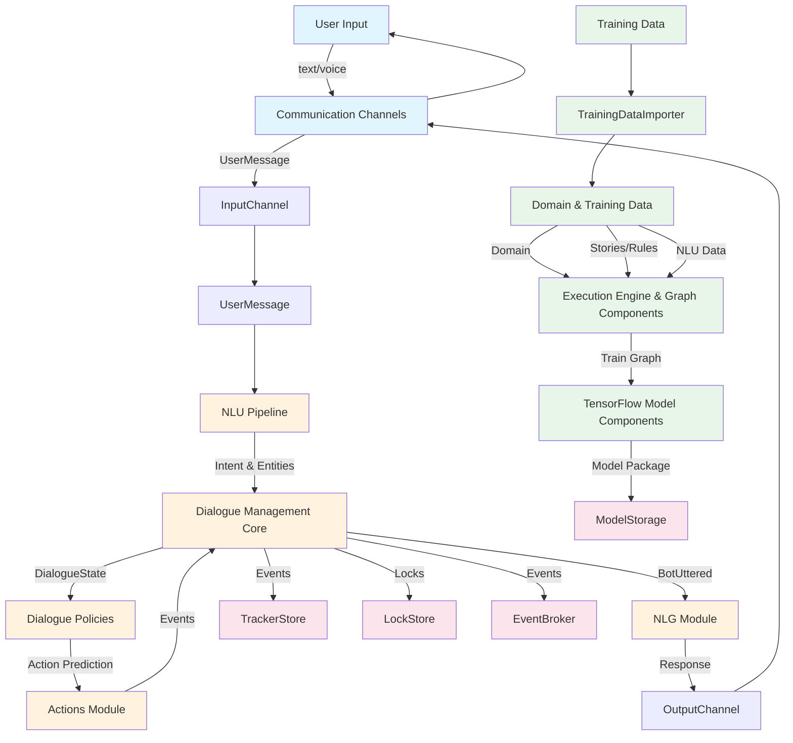

# RasaHQ--rasa Repository Overview

## Purpose

RasaHQ--rasa is the flagship open-source conversational AI framework that enables developers to build, train, and deploy contextual assistants and chatbots. The repository provides an end-to-end platform combining natural language understanding (NLU), dialogue management, and action execution into a unified, production-ready system. Its modular, graph-based architecture supports both rule-based and machine-learning approaches, allowing teams to start simple and scale to sophisticated, multi-turn conversations with custom business logic.

## End-to-End Architecture

```mermaid
graph TD
    %% External Users & Systems
    U[User Input] -->|text/voice| CH[Communication Channels]
    CH -->|UserMessage| I[InputChannel]
    I --> UM[UserMessage]

    %% Core Processing Pipeline
    UM --> NLU[NLU Pipeline]
    NLU -->|Intent & Entities| DM[Dialogue Management Core]
    DM -->|DialogueState| DP[Dialogue Policies]
    DP -->|Action Prediction| AM[Actions Module]
    AM -->|Events| DM
    DM -->|BotUttered| NLG[NLG Module]
    NLG -->|Response| OC[OutputChannel]
    OC --> CH
    CH --> U

    %% Training & Execution Engine
    TD[Training Data] --> TDI[TrainingDataImporter]
    TDI --> D[Domain & Training Data]
    D -->|Domain| EE[Execution Engine & Graph Components]
    D -->|Stories/Rules| EE
    D -->|NLU Data| EE
    EE -->|Train Graph| TF[TensorFlow Model Components]
    TF -->|Model Package| MS[ModelStorage]

    %% Storage & Persistence
    DM -->|Events| TS[TrackerStore]
    DM -->|Locks| LS[LockStore]
    DM -->|Events| EB[EventBroker]

    %% Styling
    classDef user fill:#e1f5fe
    classDef core fill:#fff3e0
    classDef train fill:#e8f5e9
    classDef store fill:#fce4ec
    class U,CH user
    class NLU,DM,DP,AM,NLG core
    class TD,TDI,D,EE,TF train
    class TS,LS,EB,MS store
```

## Core Modules Documentation

| Module | Path | Responsibility |
|--------|------|----------------|
| [NLU Pipeline](NLU%20Pipeline.md) | `rasa/nlu/` | Tokenization, featurization, intent classification, entity extraction, response selection |
| [Core Featurization](Core%20Featurization.md) | `rasa/core/featurizers/` | Convert dialogue trackers into numerical features for policy training |
| [Dialogue Management Core](Dialogue%20Management%20Core.md) | `rasa/core/` | Orchestrate conversations, manage state, execute actions, persist trackers |
| [Dialogue Policies](Dialogue%20Policies.md) | `rasa/core/policies/` | Decide next best action (memoization, rules, TED transformer, UnexpecTED) |
| [Actions](Actions.md) | `rasa/core/actions/` | Execute bot responses, forms, loops, fallback handling, custom webhooks |
| [Domain & Training Data](Domain%20&%20Training%20Data.md) | `rasa/shared/` | Define intents, entities, slots, responses, stories, rules; import/export data |
| [Execution Engine & Graph Components](Execution%20Engine%20&%20Graph%20Components.md) | `rasa/engine/` | Graph-based training/inference, caching, incremental training, resource management |
| [Communication Channels](Communication%20Channels.md) | `rasa/core/channels/` | REST, Socket.IO, console, callback adapters for user I/O |
| [Natural Language Generation (NLG)](Natural%20Language%20Generation%20(NLG).md) | `rasa/core/nlg/` | Template-based or callback-driven response text generation |
| [TensorFlow Model Components](TensorFlow%20Model%20Components.md) | `rasa/utils/tensorflow/` | Custom TF/Keras layers, models, data generators for NLU & Core ML |

Each module is self-documented with detailed architecture diagrams, component APIs, configuration examples, and extension guides accessible through the links above.