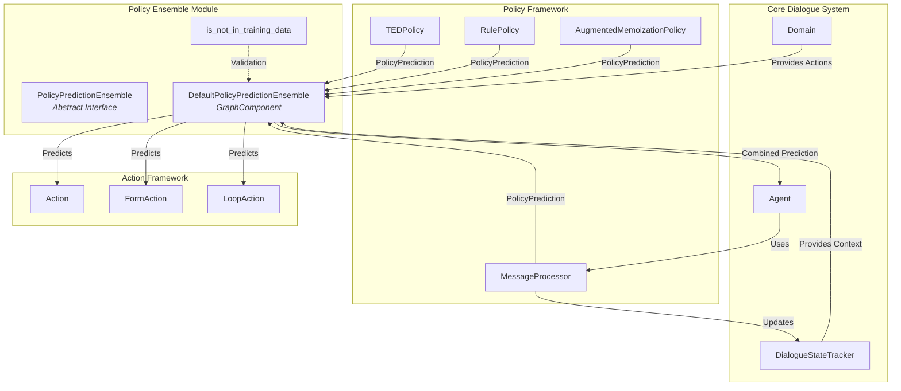
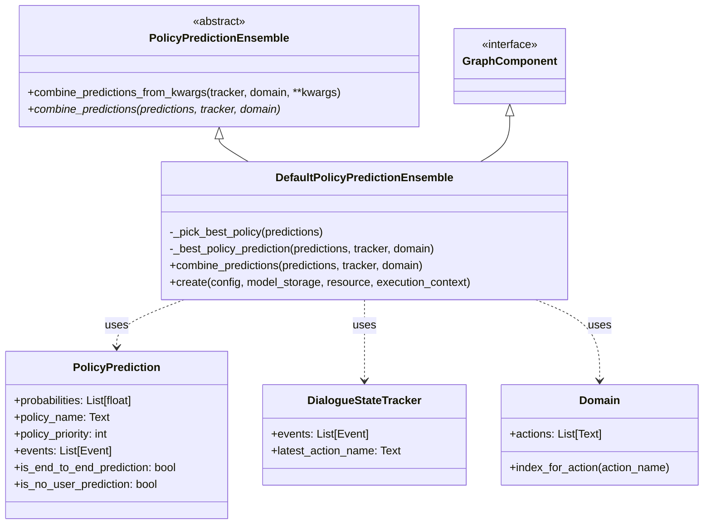
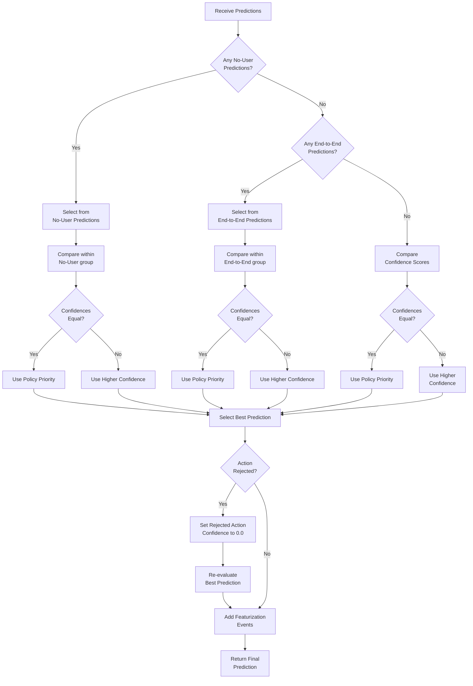
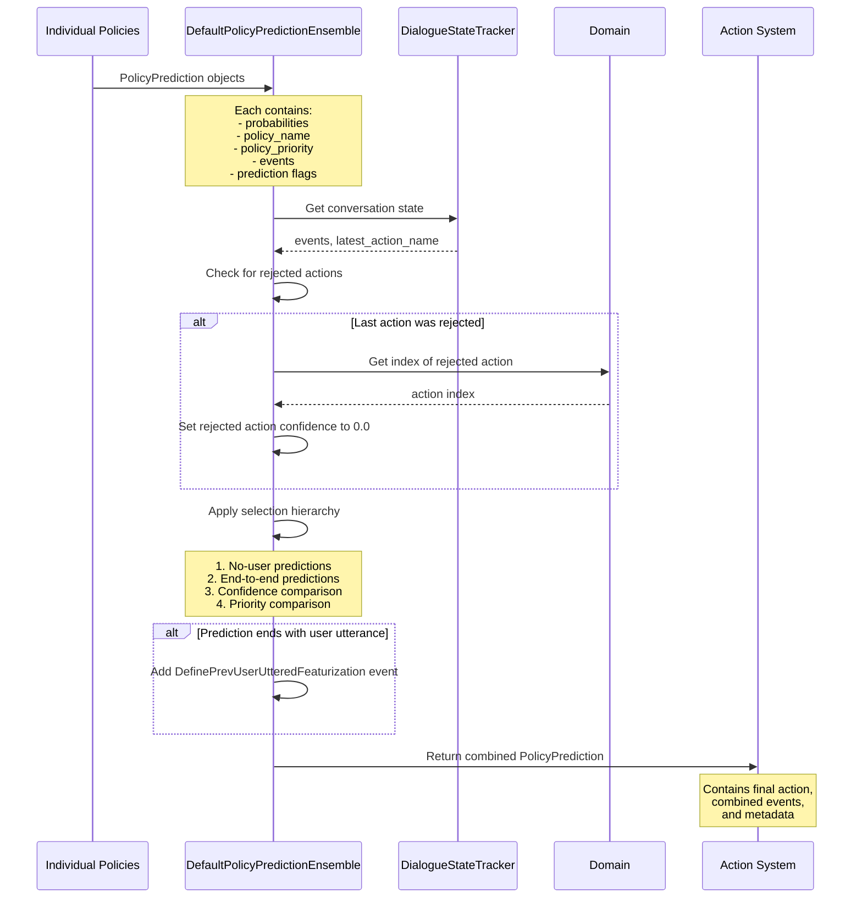

# Policy Ensemble Module Documentation

## Introduction

The policy_ensemble module is a critical component of Rasa's dialogue management system that orchestrates multiple policy predictions to make intelligent decisions about the next action in a conversation. It serves as the decision-making hub that combines predictions from various policies (like TEDPolicy, RulePolicy, and MemoizationPolicy) into a single, coherent action prediction.

This module implements sophisticated logic to handle policy conflicts, prioritize different types of predictions, and ensure robust conversation flow even when individual policies disagree or fail. The ensemble mechanism is essential for creating reliable conversational AI that can handle both rule-based scenarios and machine learning-based predictions seamlessly.

## Architecture Overview

### Core Components

The policy_ensemble module consists of two primary components:

1. **PolicyPredictionEnsemble** - Abstract base class defining the ensemble interface
2. **DefaultPolicyPredictionEnsemble** - Concrete implementation providing the default ensemble logic

### System Architecture



### Component Relationships



## Detailed Component Documentation

### PolicyPredictionEnsemble (Abstract Base Class)

The `PolicyPredictionEnsemble` abstract class defines the contract for all policy ensemble implementations. It provides the fundamental interface for combining multiple policy predictions into a single, unified prediction.

**Key Responsibilities:**
- Define the ensemble interface for combining predictions
- Handle prediction combination from both direct method calls and keyword arguments
- Ensure consistent prediction format across different ensemble implementations

**Core Methods:**
- `combine_predictions_from_kwargs()` - Extracts predictions from keyword arguments and delegates to `combine_predictions()`
- `combine_predictions()` - Abstract method that must be implemented by concrete classes to define the ensemble logic

### DefaultPolicyPredictionEnsemble

The `DefaultPolicyPredictionEnsemble` is the primary implementation of the ensemble interface. It implements a sophisticated priority-based system for selecting the best prediction from multiple policies.

**Key Features:**
- **GraphComponent Integration**: Implements the GraphComponent interface for integration with Rasa's execution graph
- **Priority-based Selection**: Uses confidence scores and policy priorities to determine the best prediction
- **Action Rejection Handling**: Automatically handles cases where actions are rejected during execution
- **Event Management**: Combines mandatory and optional events from different policies
- **User Utterance Featurization**: Adds appropriate featurization events based on prediction type

**Prediction Selection Logic:**



## Data Flow and Processing

### Prediction Combination Flow



### Event Processing and Combination

The ensemble carefully manages events from different policies:

1. **Mandatory Events**: All mandatory events from all predictions are included in the final prediction
2. **Optional Events**: Only optional events from the winning prediction are included
3. **Featurization Events**: Added based on whether the prediction used end-to-end or intent-based processing
4. **Action Metadata**: Preserved from the winning prediction for action execution

## Integration with Other Modules

### Policy Framework Integration

The policy_ensemble module sits at the heart of the policy framework, coordinating between different policy types:

- **[TED Policy](ted_policy.md)**: Provides machine learning-based predictions using transformer architecture
- **[Rule Policy](rule_policy.md)**: Supplies rule-based predictions for deterministic scenarios
- **[Memoization Policy](memoization_policy.md)**: Offers memorized predictions from training data

### Core Dialogue System Integration

The ensemble integrates with the broader dialogue system through:

- **[Agent Management](agent_management.md)**: The Agent uses the ensemble to make final action decisions
- **[Message Processing](message_processing.md)**: MessageProcessor coordinates policy predictions through the ensemble
- **[Action Framework](action_framework.md)**: The ensemble's output directly feeds into action selection and execution

### Event System Integration

The ensemble works closely with Rasa's event system to maintain conversation state:

- **ActionExecutionRejected**: Triggers confidence adjustment for rejected actions
- **ActionExecuted**: Provides context for action rejection handling
- **DefinePrevUserUtteredFeaturization**: Added to indicate prediction basis

## Error Handling and Validation

### Configuration Validation

The ensemble includes robust validation to ensure proper configuration:

- **Empty Predictions**: Raises `InvalidConfigException` if no predictions are provided
- **Best Prediction Failure**: Raises `InvalidConfigException` if no valid prediction can be selected
- **Action Index Validation**: Validates action indices when handling rejected actions

### Exception Handling

- **InvalidPolicyEnsembleConfig**: Custom exception for ensemble-specific configuration issues
- **RasaException**: Base exception class for Rasa-specific errors
- **InvalidConfigException**: Used for configuration-related errors

## Usage Examples

### Basic Ensemble Usage

```python
# The ensemble is typically used internally by the Agent
# but can be instantiated directly for testing

from rasa.core.policies.ensemble import DefaultPolicyPredictionEnsemble
from rasa.shared.core.trackers import DialogueStateTracker
from rasa.shared.core.domain import Domain

# Create ensemble
ensemble = DefaultPolicyPredictionEnsemble()

# Combine predictions (typically done automatically)
final_prediction = ensemble.combine_predictions(
    predictions=[prediction1, prediction2, prediction3],
    tracker=tracker,
    domain=domain
)
```

### Custom Ensemble Implementation

```python
from rasa.core.policies.ensemble import PolicyPredictionEnsemble
from rasa.core.policies.policy import PolicyPrediction

class CustomEnsemble(PolicyPredictionEnsemble):
    def combine_predictions(
        self,
        predictions: List[PolicyPrediction],
        tracker: DialogueStateTracker,
        domain: Domain,
    ) -> PolicyPrediction:
        # Custom logic for combining predictions
        # Must return a single PolicyPrediction
        pass
```

## Best Practices and Considerations

### Policy Priority Configuration

- Ensure policy priorities are properly configured to avoid ambiguous selections
- Higher priority values indicate higher priority (contrary to some priority systems)
- Consider the interaction between confidence scores and priorities

### Prediction Type Handling

- Understand the hierarchy: No-user > End-to-end > Confidence-based > Priority-based
- Be aware that end-to-end predictions require specific model configuration
- Consider the impact of featurization events on downstream processing

### Error Recovery

- Monitor for action rejection patterns that might indicate policy conflicts
- Use appropriate logging to debug ensemble decisions
- Consider custom ensemble implementations for specific use cases

### Performance Considerations

- The ensemble operates on every turn, so efficiency is important
- Minimize complex computations in the selection logic
- Consider caching strategies for repeated prediction scenarios

## Testing and Debugging

### Debugging Ensemble Decisions

The ensemble provides detailed logging for debugging:

- Policy selection rationale based on confidence and priority
- Action rejection handling and confidence adjustment
- Featurization event addition based on prediction type

### Unit Testing

When testing ensemble behavior:

- Test with single policy predictions
- Test with conflicting predictions (same confidence, different priorities)
- Test action rejection scenarios
- Test edge cases (empty predictions, invalid configurations)

## Future Considerations

The policy_ensemble module is designed to be extensible, allowing for:

- Custom ensemble implementations with different selection logic
- Integration with new policy types as they are developed
- Enhanced debugging and monitoring capabilities
- Performance optimizations for large-scale deployments