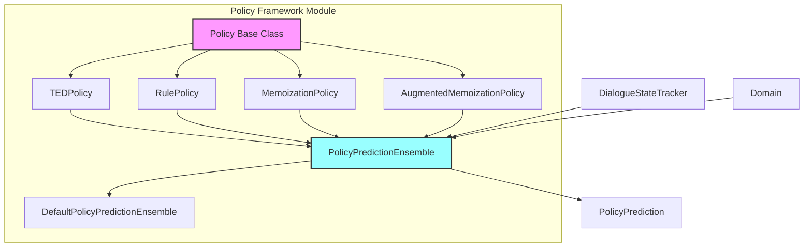
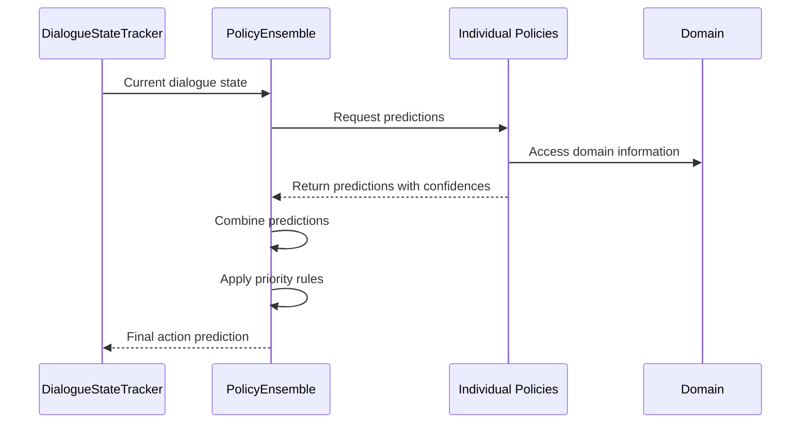
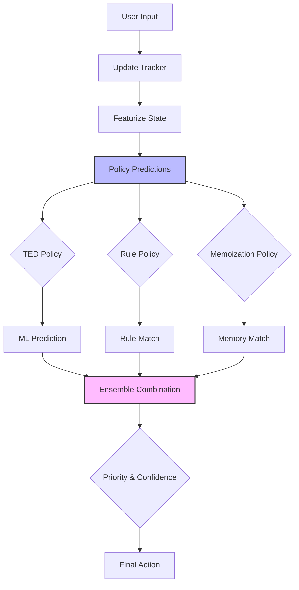

# Policy Framework Module Documentation

## Overview

The Policy Framework module is the core decision-making engine of the Rasa dialogue system. It implements various machine learning and rule-based policies that determine the next action a conversational AI assistant should take based on the current dialogue context. This module serves as the brain of the dialogue management system, combining different prediction strategies to provide robust and contextually appropriate responses.

## Purpose and Core Functionality

The Policy Framework module is responsible for:

- **Action Prediction**: Determining the next best action based on dialogue history and current context
- **Policy Orchestration**: Managing multiple policies with different prediction strategies
- **Context Understanding**: Processing dialogue states, user intents, entities, and system actions
- **Learning and Adaptation**: Training machine learning models on conversation data
- **Rule Enforcement**: Implementing deterministic business logic through rule-based policies

## Architecture Overview

## Key Components

### 1. Policy Base Class (`policy.py`)
The abstract foundation for all policies, providing:
- Common interface for training and prediction
- Featurization pipeline integration
- Configuration management
- Data type support specification (ML vs Rule-based)

### 2. TED Policy (`ted_policy.py`)
Transformer-based policy using state-of-the-art deep learning:
- **Architecture**: Transformer encoder with embedding layers
- **Training**: End-to-end learning from dialogue data
- **Features**: Supports both intent-based and text-based predictions
- **Entity Recognition**: Integrated entity extraction capabilities

### 3. Rule Policy (`rule_policy.py`)
Deterministic policy for business logic enforcement:
- **Rule Matching**: Exact pattern matching for dialogue states
- **Loop Handling**: Special handling for form loops and unhappy paths
- **Contradiction Detection**: Validates rule consistency
- **Fallback Management**: Provides fallback actions when no rules match

### 4. Memoization Policies (`memoization.py`)
Memory-based policies for exact pattern matching:
- **Standard Memoization**: Remembers exact dialogue sequences
- **Augmented Memoization**: Handles partial matches with truncation
- **History Management**: Configurable maximum history length

### 5. Policy Ensemble (`ensemble.py`)
Orchestrates multiple policies to make final predictions:
- **Prediction Combination**: Merges predictions from different policies
- **Priority Management**: Handles policy priorities and conflicts
- **Event Management**: Combines events from multiple policies
- **Rejection Handling**: Manages action execution rejections

## Data Flow Architecture

## Policy Decision Process

## Integration with Other Modules

### Dialogue Orchestration
The Policy Framework integrates closely with the [dialogue_orchestration](dialogue_orchestration.md) module:
- Receives processed dialogue states from `MessageProcessor`
- Works within the `Agent` orchestration layer
- Provides action predictions back to the dialogue system

### Action Framework
Coordinates with the [action_framework](action_framework.md) module:
- Predicts action names that the Action Framework executes
- Handles action execution feedback and rejections
- Manages special actions like forms and loops

### Shared Core Components
Leverages shared components for:
- **Domain**: Action and intent definitions
- **Trackers**: Dialogue state management
- **Events**: Conversation history tracking

## Configuration and Customization

### Policy Configuration
Each policy supports extensive configuration:
- **Priority**: Policy precedence in ensemble decisions
- **Max History**: Number of dialogue turns to consider
- **Training Parameters**: Learning rates, batch sizes, epochs
- **Architecture**: Neural network layers, dimensions, dropout

### Ensemble Configuration
The ensemble supports:
- **Policy Selection**: Which policies to include
- **Combination Rules**: How to merge predictions
- **Fallback Behavior**: Default actions when no policy predicts

## Training and Learning

### Training Process
1. **Data Preparation**: Convert dialogue stories to training format
2. **Featurization**: Transform dialogue states to feature vectors
3. **Model Training**: Train individual policies on prepared data
4. **Validation**: Check for contradictions and consistency
5. **Persistence**: Save trained models and configurations

### Learning Capabilities
- **Supervised Learning**: From labeled dialogue examples
- **Online Learning**: Adaptation during conversations
- **Transfer Learning**: Leverage pre-trained models
- **Multi-task Learning**: Joint training for multiple objectives

## Performance and Scalability

### Optimization Features
- **Caching**: Memoization of frequent predictions
- **Batching**: Efficient processing of multiple predictions
- **Vectorization**: Optimized tensor operations
- **Lazy Loading**: On-demand model loading

### Scalability Considerations
- **Memory Management**: Efficient storage of learned patterns
- **Computation**: GPU acceleration for neural policies
- **Storage**: Compressed model persistence
- **Inference**: Fast prediction serving

## Error Handling and Robustness

### Error Recovery
- **Fallback Actions**: Default behavior when predictions fail
- **Contradiction Resolution**: Handling conflicting predictions
- **Validation**: Input validation and sanitization
- **Graceful Degradation**: Continued operation with partial failures

### Robustness Features
- **Uncertainty Handling**: Confidence-based decision making
- **Out-of-domain Detection**: Handling unseen inputs
- **Contradiction Detection**: Identifying inconsistent rules
- **Validation**: Comprehensive training data validation

## Monitoring and Debugging

### Diagnostic Capabilities
- **Prediction Logging**: Detailed prediction traces
- **Confidence Scores**: Action prediction confidences
- **Policy Attribution**: Which policy made each prediction
- **State Inspection**: Dialogue state visualization

### Debugging Tools
- **State Formatting**: Human-readable state representations
- **Rule Analysis**: Contradiction and coverage analysis
- **Performance Metrics**: Training and inference statistics
- **Visualization**: Policy decision trees and patterns

## Best Practices

### Policy Selection
- Use **TED Policy** for complex, context-dependent decisions
- Use **Rule Policy** for deterministic business logic
- Use **Memoization Policy** for exact pattern matching
- Combine policies for comprehensive coverage

### Training Guidelines
- Provide diverse training examples
- Balance rule-based and ML approaches
- Validate for contradictions
- Test with realistic conversation flows

### Configuration Tips
- Set appropriate policy priorities
- Configure max history based on context needs
- Tune confidence thresholds for your use case
- Enable appropriate debugging and logging

## Sub-module Documentation

For detailed information about specific policy implementations, refer to:

- **[TED Policy](ted_policy.md)**: Deep learning policy with transformer architecture
- **[Rule Policy](rule_policy.md)**: Deterministic policy for business logic
- **[Memoization Policy](memoization_policy.md)**: Memory-based pattern matching policies
- **[Policy Ensemble](policy_ensemble.md)**: Prediction combination and orchestration

## References

- [Dialogue Orchestration Module](dialogue_orchestration.md)
- [Action Framework Module](action_framework.md)
- [Shared Core Components](shared_core.md)