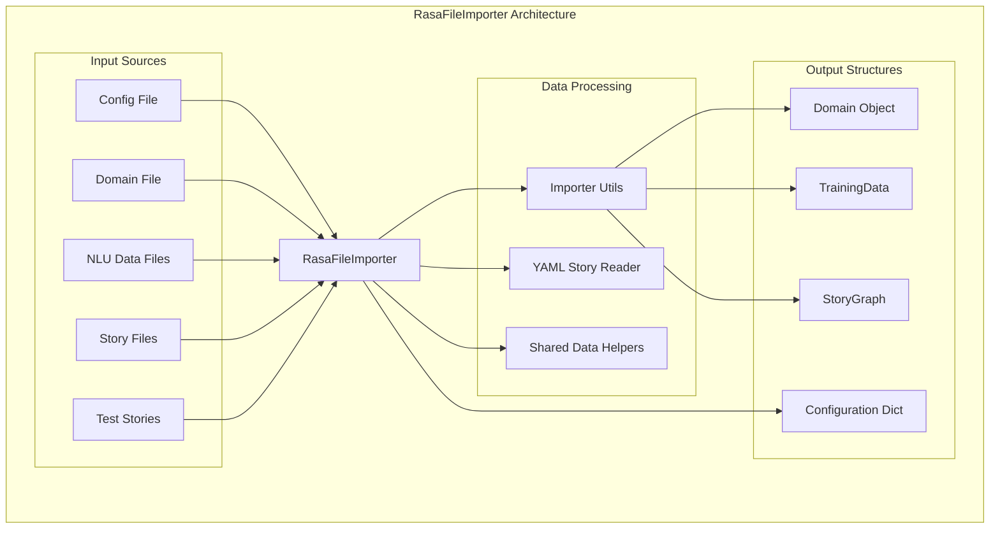
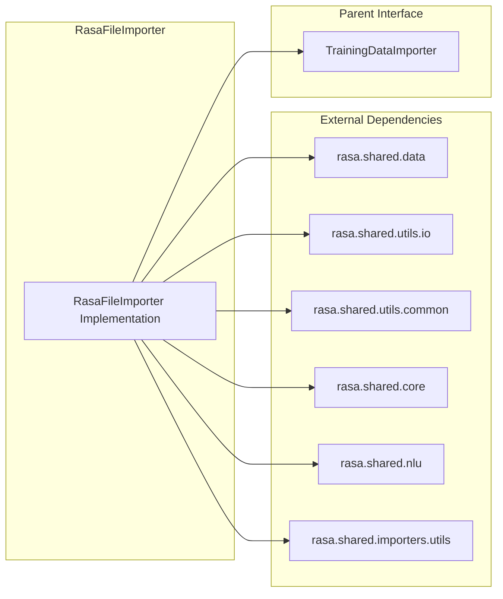
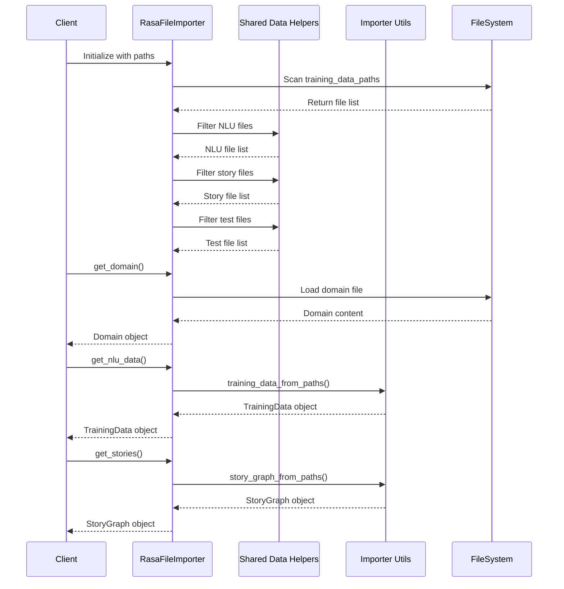
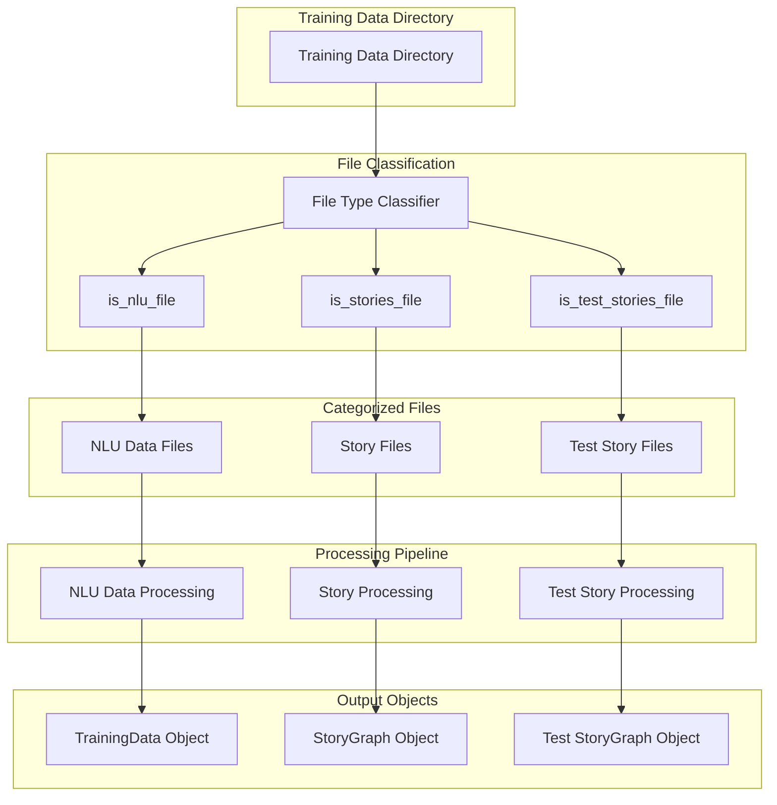
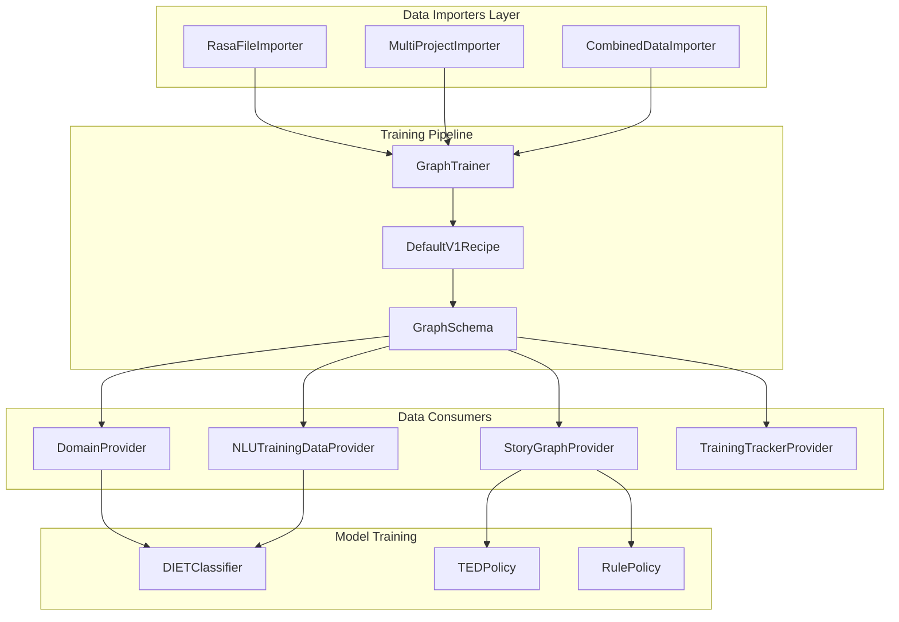

# Rasa File Importer Module Documentation

## Introduction

The `rasa_file_importer` module provides the default implementation for importing and loading Rasa training data files. It serves as the primary data ingestion layer for Rasa's training pipeline, responsible for reading configuration files, domain definitions, NLU training data, and conversation stories from various file formats.

This module acts as a bridge between raw training data files and Rasa's internal data structures, ensuring that all training components receive properly formatted and validated data for model training and evaluation.

## Architecture Overview

### Core Component Structure



### Module Dependencies



## Component Details

### RasaFileImporter Class

The `RasaFileImporter` class is the main implementation of the `TrainingDataImporter` interface. It provides a standardized way to load and validate training data from various file sources.

#### Key Responsibilities:

1. **File Discovery**: Automatically identifies and categorizes training data files based on their content and naming conventions
2. **Data Loading**: Reads and parses configuration, domain, NLU data, and story files
3. **Data Validation**: Ensures loaded data conforms to expected formats and structures
4. **Caching**: Implements caching mechanisms to improve performance for repeated data access

#### Constructor Parameters:

- `config_file`: Path to the model configuration file (optional)
- `domain_path`: Path to the domain definition file (optional)
- `training_data_paths`: List of paths or single path containing training data files (optional)

### Data Loading Process



## Data Flow Architecture

### File Classification and Processing



## Integration with Training Pipeline

### Relationship to Other Modules



## Error Handling and Validation

### Domain Loading Error Handling

The `RasaFileImporter` implements robust error handling for domain loading:

1. **Invalid Domain Files**: If a domain file contains invalid syntax or structure, the importer logs a warning and returns an empty domain instead of failing completely
2. **Missing Domain Files**: When no domain path is provided, the importer gracefully returns an empty domain
3. **File System Errors**: Handles cases where files are inaccessible or don't exist

### Configuration File Handling

- **Missing Config Files**: Returns an empty configuration dictionary when no config file is provided or found
- **Invalid Config Files**: Relies on `rasa.shared.utils.io.read_model_configuration()` for validation and error handling

## Performance Optimizations

### Caching Strategy

The `RasaFileImporter` uses the `@rasa.shared.utils.common.cached_method` decorator for the `get_config_file_for_auto_config()` method, providing:

- **Reduced I/O Operations**: Avoids repeated file system access for the same configuration
- **Improved Performance**: Especially beneficial during training pipelines that may query configuration multiple times
- **Memory Efficiency**: Caches only essential metadata rather than full file contents

## Usage Patterns

### Basic Usage

```python
from rasa.shared.importers.rasa import RasaFileImporter

# Initialize importer with training data paths
importer = RasaFileImporter(
    config_file="config.yml",
    domain_path="domain.yml",
    training_data_paths=["data/"]
)

# Load different types of training data
domain = importer.get_domain()
nlu_data = importer.get_nlu_data()
stories = importer.get_stories()
conversation_tests = importer.get_conversation_tests()
config = importer.get_config()
```

### Integration with Training Pipeline

The `RasaFileImporter` is typically used as the default data importer in Rasa's training pipeline:

1. **Model Training**: Automatically instantiated by the training commands to load training data
2. **Data Validation**: Used by data validation tools to check training data integrity
3. **Interactive Learning**: Provides data loading capabilities for interactive training sessions

## Extension Points

### Custom Importers

Developers can extend the `TrainingDataImporter` interface to create custom data loading logic:

1. **Override Methods**: Implement custom behavior for any of the data loading methods
2. **Preprocessing**: Add data preprocessing or transformation steps
3. **External Data Sources**: Load data from databases, APIs, or other non-file sources

### Integration with MultiProjectImporter

The `RasaFileImporter` can be combined with [`MultiProjectImporter`](multi_project_importer.md) to handle complex project structures with multiple training data sources.

## Best Practices

### File Organization

1. **Structured Directory Layout**: Organize training data in clearly separated directories
2. **Consistent Naming Conventions**: Use standard file extensions and naming patterns
3. **Version Control**: Keep training data files under version control for reproducibility

### Performance Considerations

1. **File System Access**: Minimize the number of file system operations during training
2. **Data Caching**: Leverage built-in caching mechanisms for frequently accessed data
3. **Batch Processing**: Process multiple files together when possible to reduce overhead

### Error Prevention

1. **Data Validation**: Regularly validate training data using Rasa's validation tools
2. **Backup Strategies**: Maintain backups of training data and configuration files
3. **Incremental Updates**: Use incremental training approaches for large datasets

## Related Documentation

- [Training Data Importer Interface](data_importers.md) - Base interface and common functionality
- [MultiProject Importer](multi_project_importer.md) - Advanced importer for multi-project setups
- [Domain Management](shared_core.md#domain) - Domain structure and validation
- [NLU Training Data](shared_nlu.md#training-data) - NLU data formats and processing
- [Story Graph](shared_core.md#training-data-structures) - Conversation story representation