# Recipe System Module Documentation

## Introduction

The recipe_system module is a core component of the Rasa engine that provides the framework for converting traditional Rasa configuration files into executable graph-based training and prediction pipelines. It serves as the bridge between declarative configuration and the underlying graph execution engine, enabling flexible and extensible conversational AI model training and inference.

The module's primary responsibility is to transform user-defined NLU pipelines and Core policies into optimized graph schemas that can be executed by the [graph execution engine](execution_engine.md). This transformation process involves component registration, dependency resolution, and automatic configuration management.

## Architecture Overview

### Core Components

The recipe_system module is built around several key components that work together to provide a comprehensive configuration-to-graph transformation system:

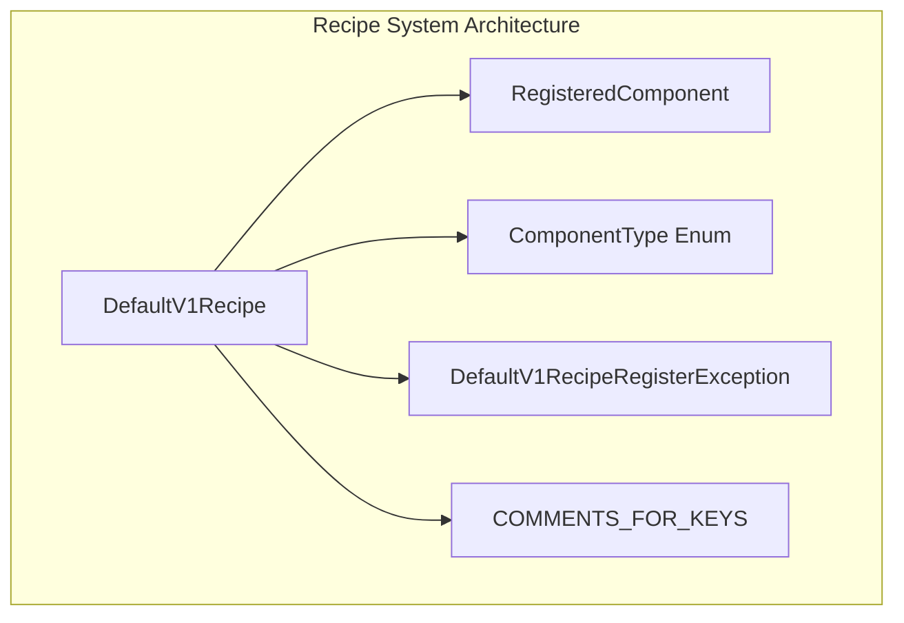

### Component Registration System

The module implements a sophisticated component registration system that allows different parts of Rasa to register their components for automatic graph construction:

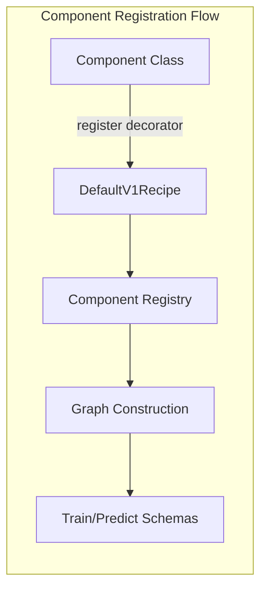

## Detailed Component Analysis

### DefaultV1Recipe

The `DefaultV1Recipe` class is the central orchestrator of the recipe system. It implements the `Recipe` interface and provides the main entry point for converting configurations into executable graphs.

**Key Responsibilities:**
- Configuration validation and normalization
- Graph schema generation for both training and prediction
- Component lifecycle management
- End-to-end training support coordination
- Automatic configuration completion

**Core Methods:**

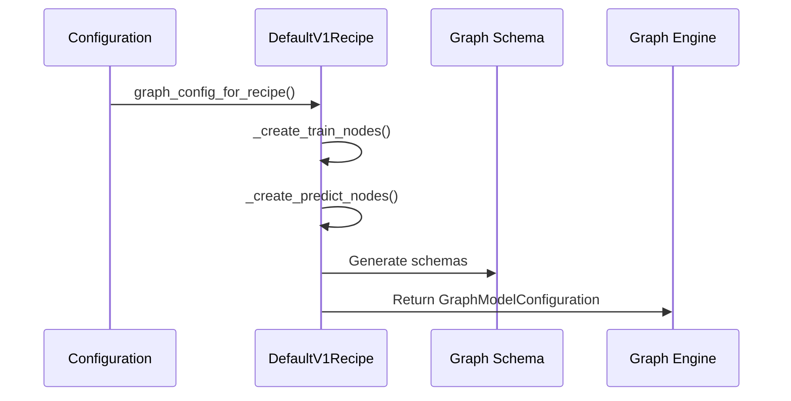

### ComponentType Enumeration

The `ComponentType` enum categorizes components to ensure proper placement within the graph structure:

- **MESSAGE_TOKENIZER**: Text tokenization components
- **MESSAGE_FEATURIZER**: Feature extraction components  
- **INTENT_CLASSIFIER**: Intent classification components
- **ENTITY_EXTRACTOR**: Entity extraction components
- **POLICY_WITHOUT_END_TO_END_SUPPORT**: Core policies without E2E support
- **POLICY_WITH_END_TO_END_SUPPORT**: Core policies with E2E support
- **MODEL_LOADER**: Components that provide pre-trained models

### Registration System

The registration system uses a decorator pattern to automatically register components:

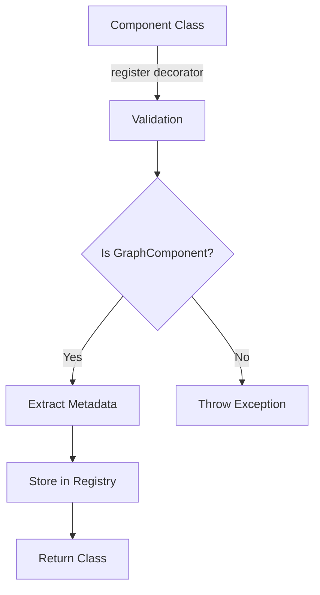

## Graph Construction Process

### Training Graph Construction

The training graph construction process involves several phases:

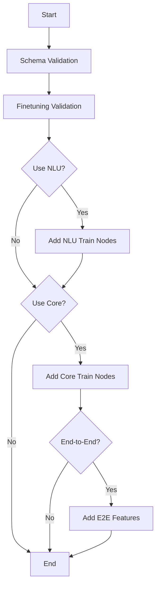

### Prediction Graph Construction

The prediction graph follows a similar but simplified pattern:

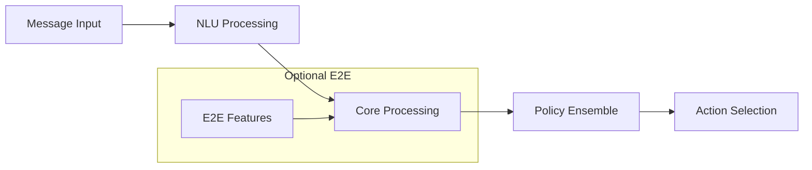

## Integration with Other Modules

### Graph Engine Integration

The recipe system works closely with the [graph engine](execution_engine.md) to execute the generated schemas:

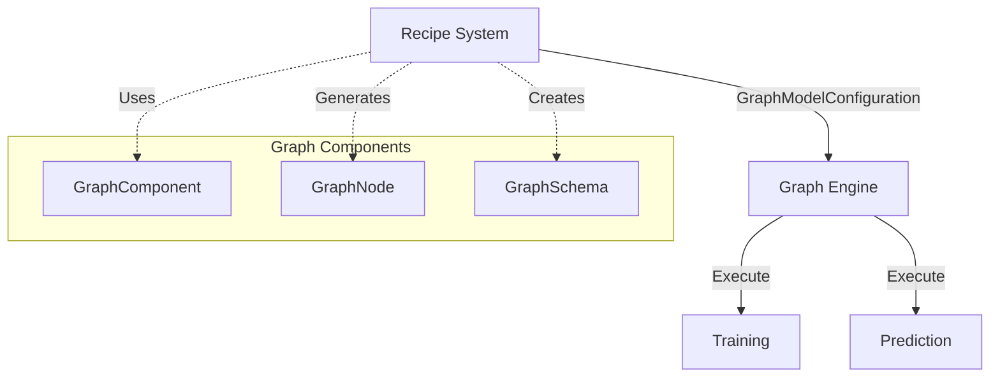

### NLU Processing Integration

The recipe system coordinates with [NLU processing components](nlu_processing.md) for natural language understanding:

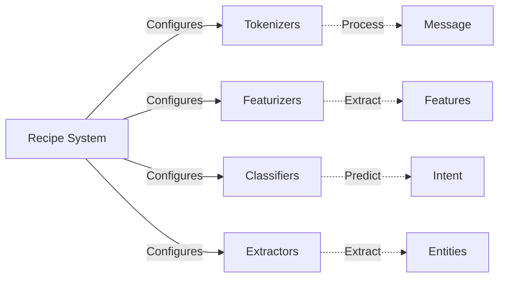

### Core Dialogue Integration

Integration with [core dialogue components](core_dialogue.md) for conversation management:

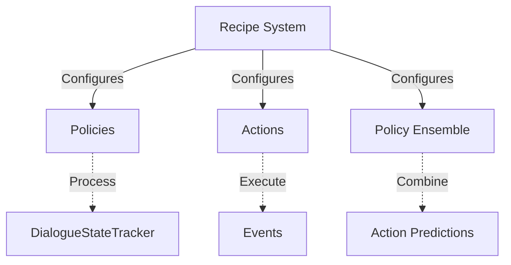

## Data Flow Architecture

### Training Data Flow

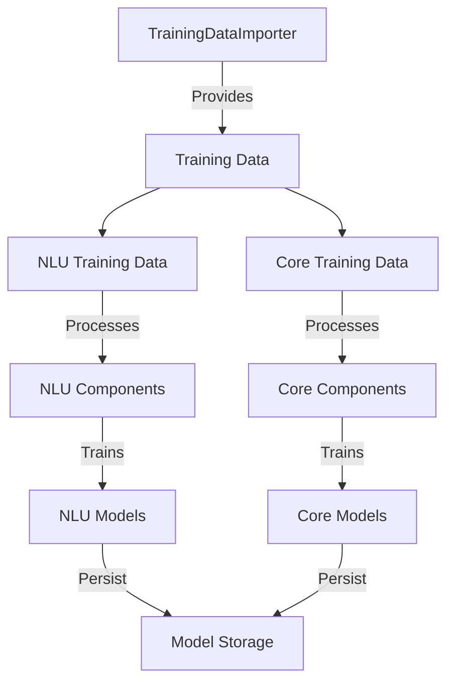

### Prediction Data Flow

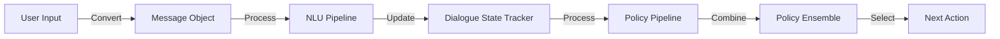

## Configuration Management

### Automatic Configuration

The recipe system provides sophisticated automatic configuration capabilities:

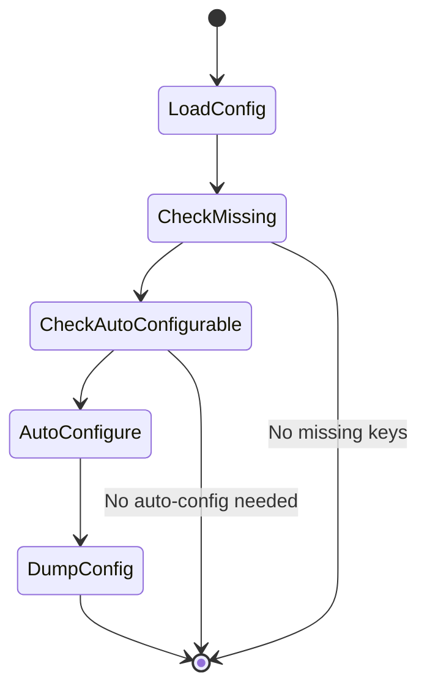

### Configuration Validation

The system validates configurations against component requirements:

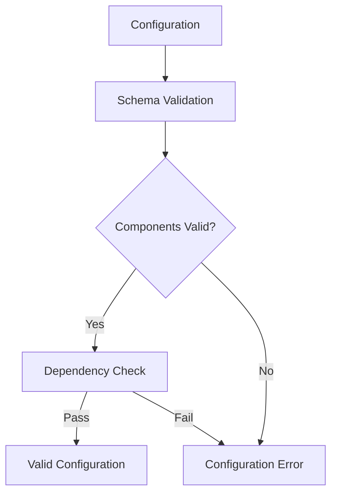

## End-to-End Training Support

The recipe system provides comprehensive support for end-to-end training:

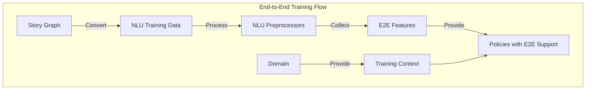

## Error Handling and Validation

### Component Registration Validation

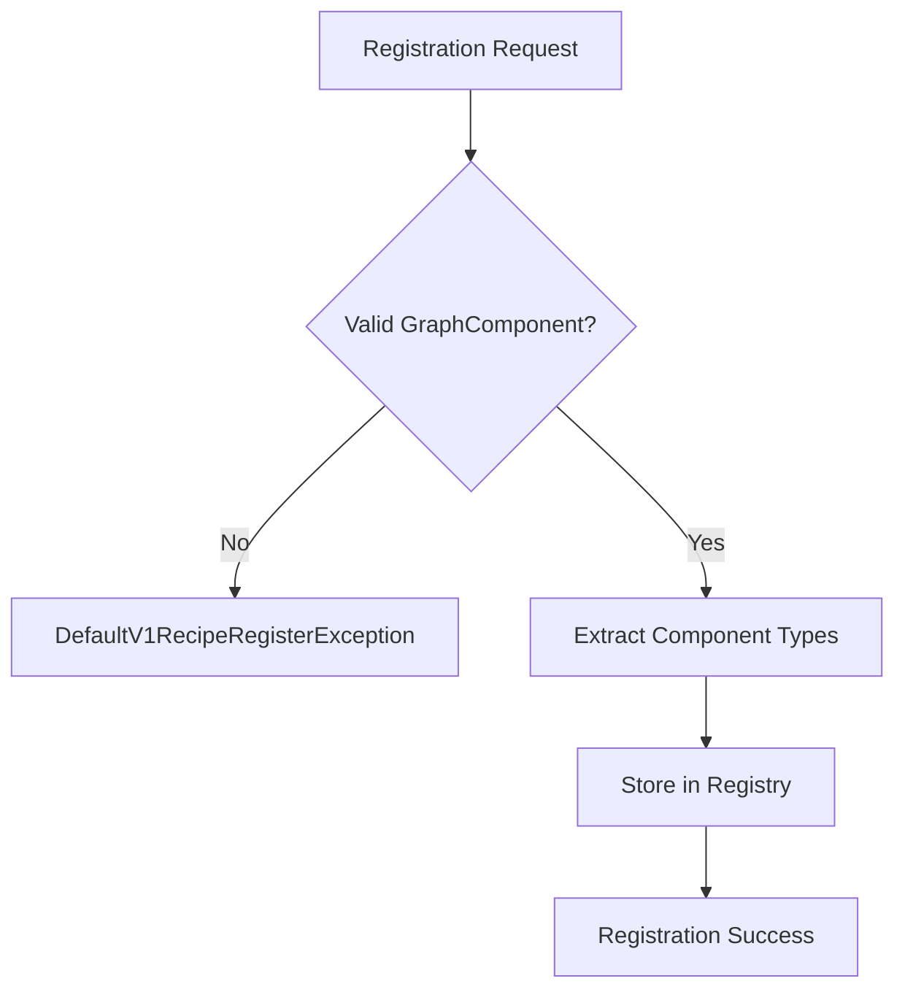

### Configuration Validation

The system performs multiple levels of validation:

1. **Schema Validation**: Ensures configuration structure is valid
2. **Component Validation**: Verifies all components are registered
3. **Dependency Validation**: Checks component dependencies can be resolved
4. **Training Type Validation**: Ensures configuration matches training requirements

## Extension Points

### Plugin Integration

The recipe system supports plugin-based extensions:

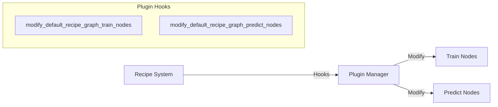

### Custom Component Registration

Developers can register custom components using the decorator pattern:

```python
@DefaultV1Recipe.register(
    component_types=[DefaultV1Recipe.ComponentType.INTENT_CLASSIFIER],
    is_trainable=True
)
class MyCustomClassifier(GraphComponent):
    # Component implementation
    pass
```

## Performance Considerations

### Graph Optimization

The recipe system optimizes graph construction for performance:

- **Lazy Loading**: Components are loaded only when needed
- **Resource Sharing**: Shared resources are reused across components
- **Parallel Execution**: Independent components can run in parallel
- **Caching**: Intermediate results are cached when appropriate

### Memory Management

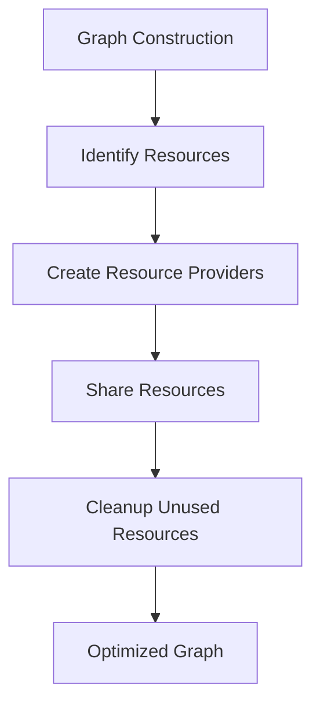

## Best Practices

### Configuration Management

1. **Use Explicit Configuration**: Define components explicitly when possible
2. **Leverage Auto-Configuration**: Use auto-configuration for standard setups
3. **Validate Early**: Validate configurations during development
4. **Document Custom Components**: Provide clear documentation for custom components

### Component Development

1. **Follow GraphComponent Interface**: Ensure all components implement the required interface
2. **Register Properly**: Use appropriate component types during registration
3. **Handle Dependencies**: Clearly define component dependencies
4. **Support Both Training and Prediction**: Implement both train and process methods

## Troubleshooting

### Common Issues

1. **Component Not Found**: Ensure components are properly registered
2. **Dependency Resolution Failed**: Check component dependencies are available
3. **Configuration Validation Error**: Verify configuration structure and values
4. **Training Type Mismatch**: Ensure configuration matches intended training type

### Debug Information

The recipe system provides detailed logging for troubleshooting:

- Component registration logs
- Graph construction logs
- Configuration validation logs
- Dependency resolution logs

## Future Enhancements

### Planned Improvements

1. **Dynamic Graph Optimization**: Runtime graph optimization based on data characteristics
2. **Advanced Caching**: More sophisticated caching strategies
3. **Component Versioning**: Support for component version management
4. **Performance Monitoring**: Built-in performance monitoring and profiling

### Extension Opportunities

1. **Custom Recipe Types**: Support for additional recipe implementations
2. **Advanced Auto-Configuration**: Machine learning-based configuration optimization
3. **Component Marketplace**: Integration with external component repositories
4. **Visual Graph Editor**: Graphical interface for graph construction and modification

## Conclusion

The recipe_system module is a foundational component of the Rasa architecture that enables flexible, extensible, and efficient conversational AI model training and inference. By providing a robust framework for configuration-to-graph transformation, it serves as the critical link between user-defined configurations and the powerful graph execution engine that powers Rasa's conversational AI capabilities.

The module's design emphasizes extensibility, performance, and ease of use, making it possible for both novice users and advanced developers to create sophisticated conversational AI systems. Through its comprehensive registration system, automatic configuration capabilities, and seamless integration with other Rasa modules, the recipe system provides the foundation for building production-ready conversational AI applications.