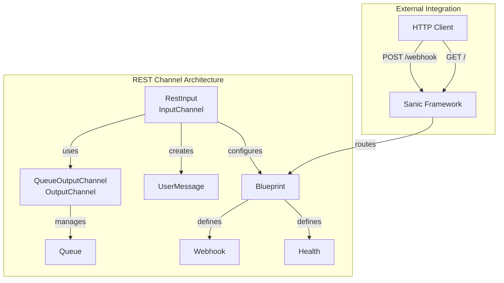
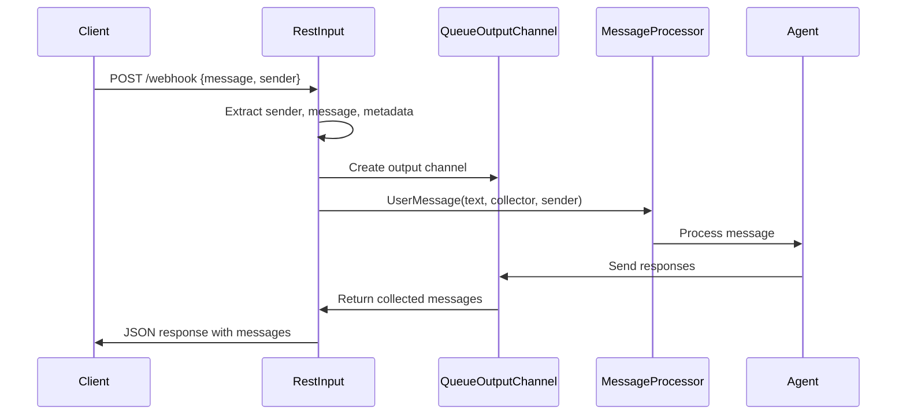
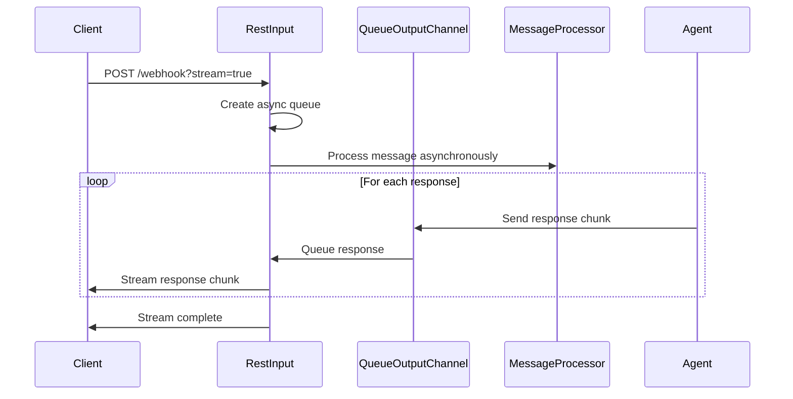
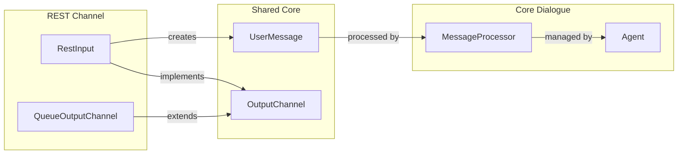

# REST Channel Module Documentation

## Introduction

The REST Channel module provides HTTP-based communication capabilities for Rasa, enabling external applications to interact with the Rasa assistant through RESTful endpoints. This module implements a flexible webhook interface that supports both traditional request-response patterns and real-time streaming responses, making it suitable for various integration scenarios including web applications, mobile apps, and third-party services.

## Architecture Overview

The REST Channel module is built around two primary components that work together to handle incoming messages and manage outgoing responses:



## Core Components

### RestInput

The `RestInput` class serves as the primary entry point for HTTP-based communication. It extends the base `InputChannel` class and provides a complete REST API implementation with the following key responsibilities:

- **Message Reception**: Handles incoming HTTP POST requests to the `/webhook` endpoint
- **Sender Identification**: Extracts sender information from request payloads
- **Metadata Processing**: Captures and processes additional context from incoming requests
- **Response Streaming**: Supports both traditional JSON responses and server-sent events for real-time communication
- **Health Monitoring**: Provides a health check endpoint at the root path

#### Key Methods:

- `on_message_wrapper()`: Processes individual messages asynchronously
- `stream_response()`: Handles streaming responses for real-time communication
- `blueprint()`: Configures Sanic routes and endpoints
- `get_metadata()`: Extracts additional context from requests

### QueueOutputChannel

The `QueueOutputChannel` class manages the collection and queuing of outgoing messages. It extends `CollectingOutputChannel` and provides asynchronous message handling capabilities:

- **Message Queuing**: Uses asyncio.Queue for thread-safe message management
- **Asynchronous Processing**: Supports non-blocking message persistence
- **Stream Integration**: Works seamlessly with the streaming response mechanism

## Data Flow

### Standard Request-Response Flow



### Streaming Response Flow



## API Endpoints

### Health Check
- **Endpoint**: `GET /`
- **Purpose**: Verify service availability
- **Response**: `{"status": "ok"}`

### Webhook
- **Endpoint**: `POST /webhook`
- **Purpose**: Submit messages to the Rasa assistant
- **Request Body**:
  ```json
  {
    "sender": "user_id",
    "message": "user input",
    "metadata": {}
  }
  ```
- **Query Parameters**:
  - `stream` (boolean): Enable streaming responses
- **Response**: JSON array of bot responses or server-sent event stream

## Integration with Core System

The REST Channel module integrates with several core Rasa components:



### Dependencies

- **InputChannel**: Base class providing channel interface ([channels.md](channels.md))
- **UserMessage**: Standard message format ([shared_core.md](shared_core.md))
- **MessageProcessor**: Handles message processing ([dialogue_orchestration.md](dialogue_orchestration.md))
- **Agent**: Core dialogue management ([agent_management.md](agent_management.md))

## Configuration

The REST channel is typically configured in the `credentials.yml` file:

```yaml
rest:
  # Basic configuration
  url: "http://localhost:5005"
  
  # Optional: Custom webhook path
  webhook_path: "/webhook"
  
  # Optional: Enable CORS
  cors:
    origins:
      - "*"
```

## Error Handling

The module implements comprehensive error handling:

- **Timeout Handling**: Catches `CancelledError` for long-running operations
- **Exception Logging**: Uses structured logging for debugging
- **Graceful Degradation**: Returns appropriate HTTP status codes

## Use Cases

### Web Application Integration
Perfect for integrating Rasa with web applications that can make HTTP requests and handle JSON responses.

### Mobile App Backend
Ideal for mobile applications that need to communicate with Rasa through a RESTful API.

### Third-party Service Integration
Enables integration with external services and platforms that support webhook communication.

### Real-time Applications
The streaming capability makes it suitable for applications requiring real-time response delivery.

## Best Practices

1. **Sender Identification**: Always include a unique sender ID to maintain conversation context
2. **Metadata Usage**: Leverage metadata to pass additional context (user preferences, session data)
3. **Streaming for Real-time**: Use streaming for applications requiring immediate response delivery
4. **Error Handling**: Implement proper error handling on the client side for network issues
5. **Security**: Implement appropriate authentication and authorization mechanisms

## Performance Considerations

- **Async Processing**: The module uses asyncio for non-blocking operations
- **Queue Management**: Proper queue sizing prevents memory issues with streaming
- **Connection Pooling**: Sanic framework provides efficient connection handling
- **Response Caching**: Consider implementing response caching for frequently requested data

## Testing

The REST channel can be tested using standard HTTP tools:

```bash
# Health check
curl http://localhost:5005/

# Send message
curl -X POST http://localhost:5005/webhook \
  -H "Content-Type: application/json" \
  -d '{"sender": "test_user", "message": "Hello"}'

# Streaming response
curl -X POST "http://localhost:5005/webhook?stream=true" \
  -H "Content-Type: application/json" \
  -d '{"sender": "test_user", "message": "Hello"}'
```

## Future Enhancements

Potential improvements for the REST channel module:

1. **WebSocket Support**: Add WebSocket capability for bidirectional communication
2. **Rate Limiting**: Implement rate limiting to prevent abuse
3. **Request Validation**: Add JSON schema validation for incoming requests
4. **Metrics Collection**: Integrate with monitoring systems for performance tracking
5. **Batch Processing**: Support for processing multiple messages in a single request