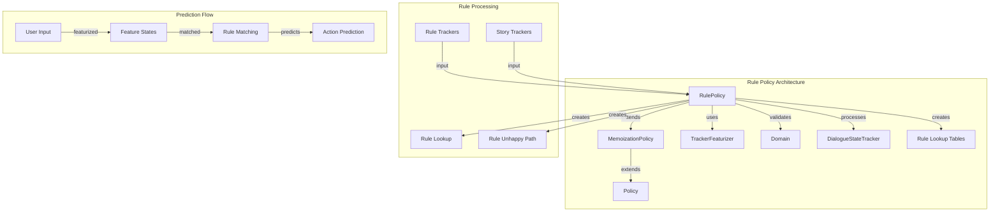
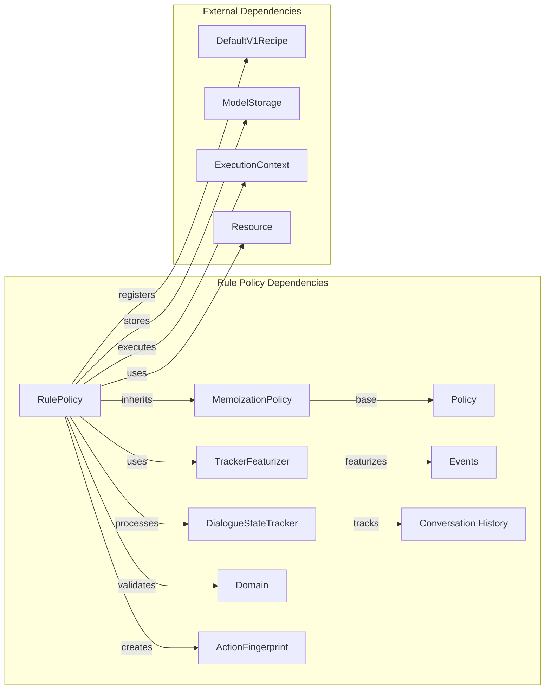
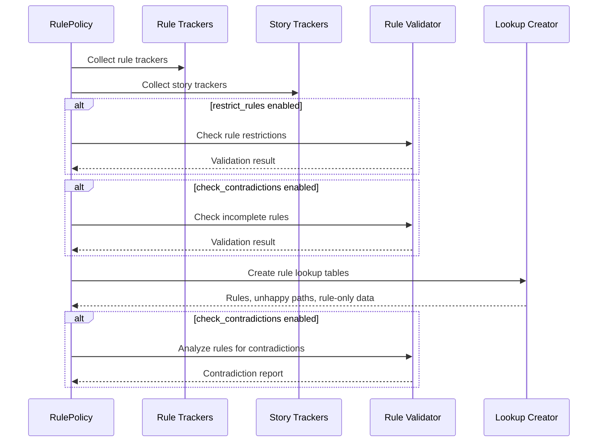
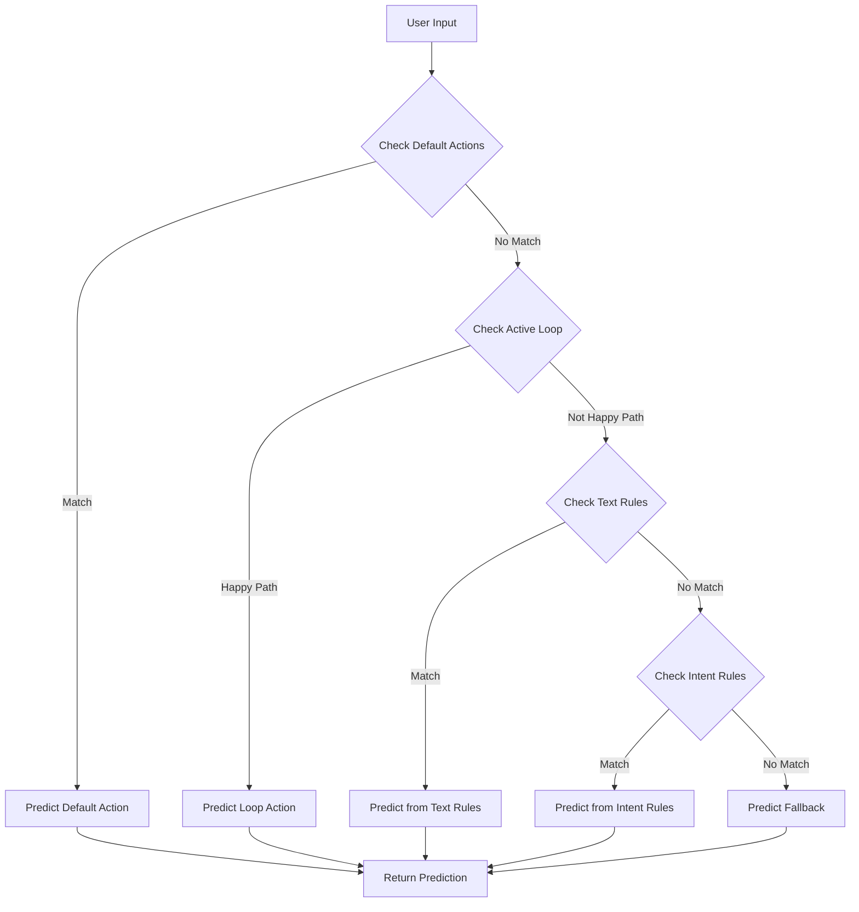
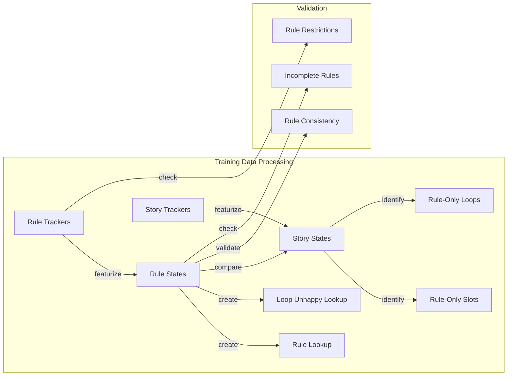
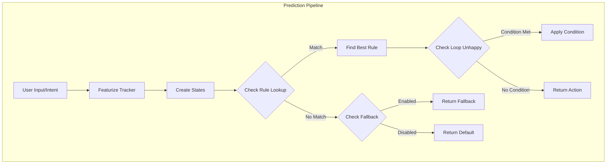
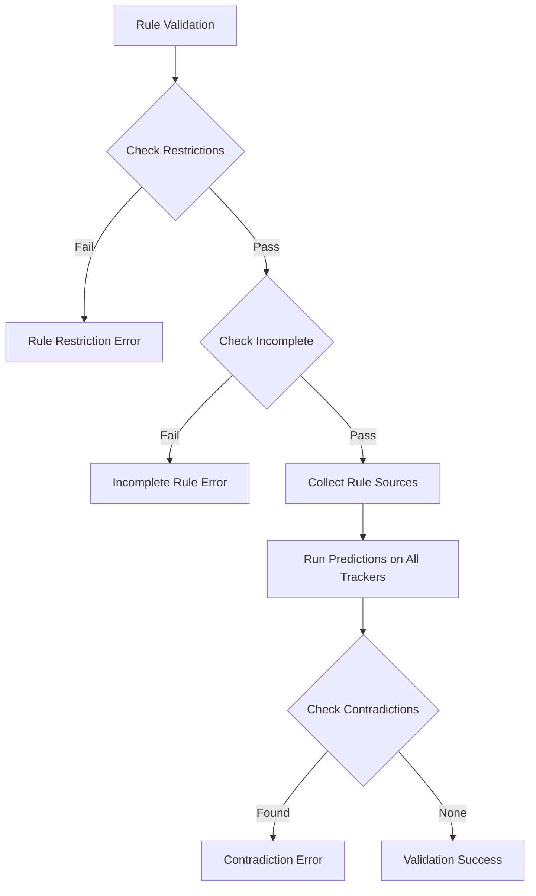

# Rule Policy Module Documentation

## Introduction

The Rule Policy module is a core component of Rasa's dialogue management system that implements deterministic rule-based conversation handling. It provides a way to define and enforce specific conversation flows through explicit rules, ensuring predictable behavior in scenarios where machine learning policies might be insufficient or unreliable.

The RulePolicy class extends MemoizationPolicy and serves as the authoritative source for handling rules in Rasa conversations. It processes rule-based training data, validates rule consistency, and makes predictions based on memorized rule patterns during conversation execution.

## Architecture Overview

### Core Components



### Module Dependencies



## Component Details

### RulePolicy Class

The `RulePolicy` class is the main component that handles rule-based conversation management. It extends `MemoizationPolicy` and implements specific logic for rule processing, validation, and prediction.

#### Key Features:
- **Rule-based prediction**: Memorizes and applies conversation rules
- **Loop handling**: Manages form loops and their unhappy paths
- **Contradiction checking**: Validates rules against stories
- **Fallback support**: Provides configurable fallback actions
- **Default action mapping**: Handles system default actions

#### Configuration Options:
```python
{
    POLICY_PRIORITY: RULE_POLICY_PRIORITY,
    "core_fallback_threshold": DEFAULT_CORE_FALLBACK_THRESHOLD,
    "core_fallback_action_name": ACTION_DEFAULT_FALLBACK_NAME,
    "enable_fallback_prediction": True,
    "restrict_rules": True,
    "check_for_contradictions": True,
    "use_nlu_confidence_as_score": False,
}
```

### Rule Processing Flow



### Prediction Logic



## Data Flow

### Training Data Flow



### Runtime Prediction Flow



## Rule Validation

### Contradiction Detection

The RulePolicy implements comprehensive validation to ensure rules don't contradict each other or stories:

1. **Rule Restrictions**: Ensures rules don't contain more than the allowed number of user inputs
2. **Incomplete Rules**: Checks that actions set consistent slots and active loops across rules
3. **Contradiction Analysis**: Compares rule predictions against story predictions

### Validation Process



## Loop Handling

### Loop Happy Path

The RulePolicy manages form loops by predicting:
1. **Loop Action**: When a loop is active and should continue
2. **Action Listen**: After successful loop execution

### Loop Unhappy Path

For loop interruptions and validations:
1. **Loop Interruption**: Detects when a loop was interrupted
2. **Skip Validation**: Prevents loop validation after unhappy path
3. **Do Not Predict**: Prevents loop prediction in certain conditions

## Integration Points

### Policy Ensemble Integration

The RulePolicy integrates with the [policy ensemble](policy_ensemble.md) system:
- Provides rule-based predictions with high priority
- Returns confidence scores for action selection
- Supports end-to-end and no-user predictions

### Domain Integration

Validates compatibility with the [domain](shared_core.md) configuration:
- Ensures fallback actions exist in domain
- Validates action names and slot configurations
- Checks loop definitions

### Tracker Integration

Works with [DialogueStateTracker](shared_core.md) for:
- State featurization
- Event processing
- Loop state management

## Error Handling

### Exception Types

- **InvalidRule**: Raised when rules are invalid or contradictory
- **InvalidDomain**: Raised when policy configuration conflicts with domain

### Error Messages

The policy provides detailed error messages for:
- Rule contradictions
- Incomplete rules
- Missing slots or active loops
- Domain incompatibilities

## Performance Considerations

### Optimization Strategies

1. **Feature Caching**: Caches rule key to state conversions
2. **Lookup Tables**: Uses efficient dictionary lookups for rule matching
3. **Early Termination**: Stops rule matching when best rule is found
4. **Selective Validation**: Allows disabling contradiction checks for faster training

### Scalability

- Rule lookup tables scale with the number of unique rule patterns
- Validation complexity increases with the number of rules and stories
- Memory usage depends on the complexity of rule states

## Configuration Examples

### Basic Configuration

```yaml
policies:
  - name: RulePolicy
    core_fallback_threshold: 0.3
    core_fallback_action_name: action_default_fallback
    enable_fallback_prediction: true
    restrict_rules: true
    check_for_contradictions: true
```

### Advanced Configuration

```yaml
policies:
  - name: RulePolicy
    core_fallback_threshold: 0.4
    core_fallback_action_name: custom_fallback_action
    enable_fallback_prediction: true
    restrict_rules: false  # Allow longer rules
    check_for_contradictions: false  # Skip validation for faster training
    use_nlu_confidence_as_score: true
```

## Best Practices

### Rule Design

1. **Keep rules simple**: Avoid complex multi-turn rules
2. **Use conversation starters**: Leverage `conversation_start: true` for initial rules
3. **Handle unhappy paths**: Define rules for loop interruptions
4. **Set appropriate slots**: Ensure slots are set consistently

### Validation

1. **Enable contradiction checking** during development
2. **Test rules thoroughly** with different conversation paths
3. **Monitor rule usage** to identify unused rules
4. **Document rule purposes** for maintainability

### Performance

1. **Disable contradiction checks** in production if rules are stable
2. **Use rule restrictions** to prevent state machine patterns
3. **Optimize fallback thresholds** based on confidence requirements
4. **Profile rule matching** for complex rule sets

## Related Documentation

- [Policy Framework](policy_framework.md) - General policy architecture
- [Memoization Policy](memoization_policy.md) - Base class for rule memorization
- [Policy Ensemble](policy_ensemble.md) - Policy selection and combination
- [Dialogue State Tracker](shared_core.md) - Conversation state management
- [Domain Configuration](shared_core.md) - Action and slot definitions