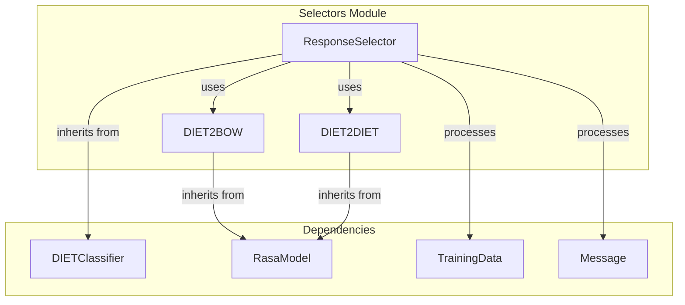
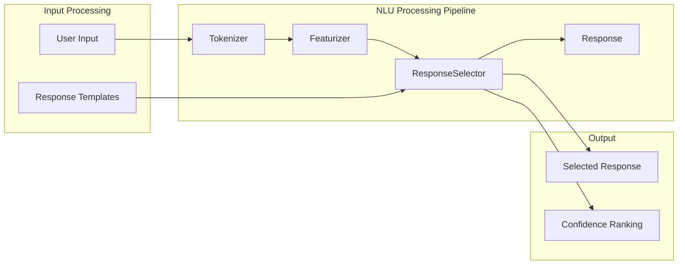
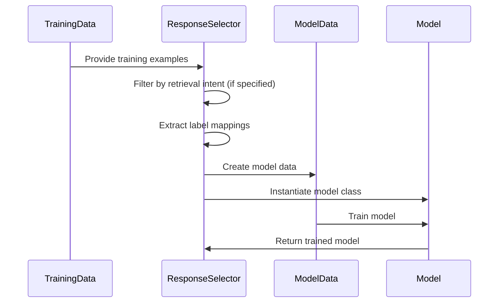
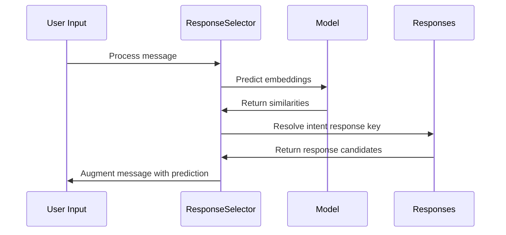

# Selectors Module Documentation

## Introduction

The selectors module is a critical component of Rasa's NLU processing pipeline, responsible for selecting appropriate responses based on user input. The module implements the `ResponseSelector` class, which uses supervised embeddings to match user messages with the most suitable responses from a predefined set. This module is particularly important for building conversational AI systems that need to retrieve contextually appropriate responses from a knowledge base or response templates.

## Module Overview

The selectors module contains the `ResponseSelector` component, which is designed to handle retrieval-based conversational scenarios. It embeds both user inputs and candidate responses into a shared vector space, then uses similarity measures to identify the best matching response. The module supports both single-intent and multi-intent scenarios, making it versatile for various conversational use cases.

## Architecture

### Component Structure



### Integration with NLU Pipeline



## Core Components

### ResponseSelector

The `ResponseSelector` is the main component of this module. It extends `DIETClassifier` and implements a supervised embedding approach for response selection. Key characteristics:

- **Purpose**: Selects appropriate responses from a set of predefined responses based on user input
- **Approach**: Uses supervised embeddings to map user messages and responses into a shared vector space
- **Training**: Maximizes similarity between user inputs and their corresponding responses
- **Inference**: Returns the most similar response along with confidence scores and rankings

#### Key Features

1. **Dual Model Support**: Supports both DIET2BOW and DIET2DIET model architectures
2. **Retrieval Intent Support**: Can be configured for specific retrieval intents or handle all retrieval intents
3. **Text-as-Label Mode**: Option to use actual response text as ground truth labels
4. **Ranking**: Provides confidence rankings for multiple candidate responses
5. **Transformer Support**: Optional transformer layers for enhanced representation learning

#### Configuration Parameters

The ResponseSelector accepts numerous configuration parameters, including:

- **Architecture Parameters**: Hidden layer sizes, transformer configuration, embedding dimensions
- **Training Parameters**: Learning rate, batch sizes, epochs, loss functions
- **Similarity Parameters**: Similarity type, ranking length, confidence renormalization
- **Regularization**: Dropout rates, regularization constants
- **Evaluation**: Validation frequency, evaluation examples

### Model Classes

#### DIET2BOW
- Uses bag-of-words approach for label representation
- Suitable for simpler response selection scenarios
- More efficient in terms of computational resources

#### DIET2DIET
- Uses full DIET architecture for both text and label processing
- Provides richer representations through transformer layers
- Better performance for complex response selection tasks

## Data Flow

### Training Process



### Inference Process



## Dependencies

### Internal Dependencies

The selectors module relies on several Rasa components:

- **[DIETClassifier](classifiers.md)**: Base class providing neural network architecture and training logic
- **[Featurizer](featurizers.md)**: Required component for feature extraction (must precede ResponseSelector in pipeline)
- **[TrainingData](shared_nlu.md)**: Data structure containing training examples and responses
- **[Message](shared_nlu.md)**: Data structure for processing individual messages

### External Dependencies

- **TensorFlow**: Deep learning framework for model implementation
- **NumPy**: Numerical computations
- **Rasa Engine**: Graph component framework for model lifecycle management

## Usage Patterns

### Basic Configuration

```yaml
pipeline:
- name: WhitespaceTokenizer
- name: CountVectorsFeaturizer
- name: ResponseSelector
```

### Advanced Configuration

```yaml
pipeline:
- name: WhitespaceTokenizer
- name: CountVectorsFeaturizer
- name: ResponseSelector
  epochs: 200
  hidden_layers_sizes:
    text: [256, 128]
    label: [256, 128]
  retrieval_intent: faq
  ranking_length: 5
```

### Multi-Intent Support

The ResponseSelector can handle multiple retrieval intents simultaneously or be configured to focus on specific intents:

```yaml
# For all retrieval intents
- name: ResponseSelector

# For specific retrieval intent
- name: ResponseSelector
  retrieval_intent: chitchat
```

## Integration Points

### With NLU Pipeline

The ResponseSelector must be preceded by appropriate featurizers in the NLU pipeline. Common configurations include:

- **CountVectorsFeaturizer**: For text-based features
- **SpacyFeaturizer**: For pre-trained word embeddings
- **RegexFeaturizer**: For pattern-based features

### With Dialogue Management

Selected responses are integrated into the dialogue management system through:

- **Intent Response Keys**: Linking responses to specific intents
- **Utter Actions**: Mapping responses to bot actions
- **Confidence Scores**: Providing uncertainty estimates for response selection

## Performance Considerations

### Training Efficiency

- **Batch Strategy**: Supports both 'sequence' and 'balanced' batching strategies
- **Checkpointing**: Optional model checkpointing during training
- **Evaluation Frequency**: Configurable validation frequency to balance training speed and monitoring

### Inference Performance

- **Ranking Length**: Configurable number of top responses to consider
- **Model Confidence**: Softmax-based confidence computation
- **Caching**: Model embeddings can be cached for repeated queries

### Memory Management

- **Connection Density**: Configurable fraction of trainable weights
- **Embedding Dimension**: Adjustable embedding size to balance accuracy and memory usage
- **Transformer Layers**: Optional transformer layers for enhanced representation capacity

## Error Handling

The module implements comprehensive error handling for:

- **Missing Responses**: Warns when responses are unavailable for predicted intents
- **Configuration Issues**: Validates configuration parameters and provides warnings
- **Training Data Issues**: Checks for consistency between training examples and responses
- **Model Loading**: Graceful handling of model loading failures

## Extension Points

### Custom Model Classes

Developers can extend the base model classes (DIET2BOW, DIET2DIET) to implement custom response selection logic:

```python
class CustomDIET2DIET(DIET2DIET):
    def batch_loss(self, batch_in):
        # Custom loss computation
        pass
```

### Custom Similarity Measures

The similarity computation can be customized by modifying the loss layers and similarity functions.

### Custom Preprocessing

Training data preprocessing can be extended to handle domain-specific requirements.

## Best Practices

### Training Data Preparation

1. **Balanced Data**: Ensure balanced representation of different response types
2. **Quality Responses**: Use high-quality, diverse response templates
3. **Intent Consistency**: Maintain consistent mapping between intents and responses
4. **Sufficient Examples**: Provide adequate training examples for each response type

### Configuration Tuning

1. **Start Simple**: Begin with default configurations and adjust based on performance
2. **Monitor Metrics**: Use tensorboard logging to track training progress
3. **Validation**: Use hold-out validation sets to prevent overfitting
4. **Iterative Refinement**: Gradually adjust parameters based on performance analysis

### Production Deployment

1. **Model Versioning**: Implement proper model versioning and rollback strategies
2. **Monitoring**: Monitor response selection confidence and accuracy in production
3. **Fallback Strategies**: Implement fallback mechanisms for low-confidence predictions
4. **Performance Monitoring**: Track inference latency and resource usage

## Related Documentation

- [Classifiers Module](classifiers.md) - For DIETClassifier base functionality
- [Featurizers Module](featurizers.md) - For feature extraction components
- [Shared NLU Components](shared_nlu.md) - For TrainingData and Message structures
- [Engine Graph](engine_graph.md) - For graph component framework details