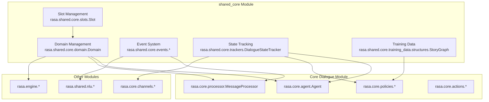
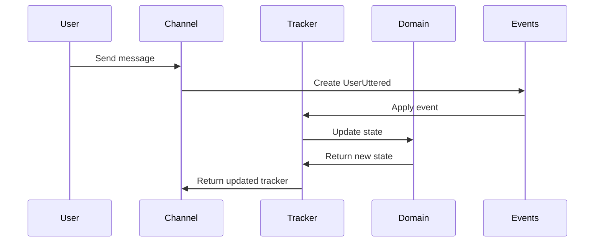

# Shared Core Module Documentation

## Overview

The `shared_core` module is a foundational component of the Rasa framework that provides core data structures and utilities for conversation management. This module contains the essential building blocks that are shared across different parts of the Rasa system, including domain definitions, event handling, conversation state tracking, and training data structures.

## Purpose

The shared_core module serves as the central repository for:
- **Domain Management**: Defining the universe of intents, entities, actions, and responses
- **Event System**: Handling conversation events that modify dialogue state
- **State Tracking**: Maintaining conversation history and current state
- **Slot Management**: Storing and managing conversation context
- **Training Data Structures**: Organizing story graphs and conversation flows

## Architecture



## Core Components

### 1. Domain Management ([domain.md](domain.md))

The `Domain` class is the central configuration object that defines the complete universe in which the bot operates. It encapsulates:

- **Intents**: User intentions that the bot can recognize
- **Entities**: Information extracted from user messages
- **Actions**: Operations the bot can perform
- **Responses**: Predefined bot responses
- **Slots**: Data storage for conversation context
- **Forms**: Structured data collection workflows

Key responsibilities:
- Domain validation and merging
- State generation for conversation tracking
- Entity and intent configuration management
- Response and action validation

### 2. Event System ([events.md](events.md))

The event system provides immutable representations of all conversation activities. Core event types include:

- **UserUttered**: Represents user messages with intent and entity information
- **ActionExecuted**: Records bot actions and their execution context
- **SlotSet**: Manages slot value updates during conversations
- **BotUttered**: Captures bot responses to users

The event system ensures conversation history integrity and enables state reconstruction.

### 3. Conversation State Tracking ([trackers.md](trackers.md))

The `DialogueStateTracker` maintains the complete conversation state by:

- Processing events to update internal state
- Managing slot values and their lifecycle
- Tracking active loops and forms
- Providing conversation history and current state snapshots
- Supporting event replay for state reconstruction

### 4. Slot Management ([slots.md](slots.md))

Slots provide typed data storage for conversation context:

- **TextSlot**: String values
- **CategoricalSlot**: Predefined value sets
- **FloatSlot**: Numeric values with ranges
- **BooleanSlot**: True/false values
- **ListSlot**: Collection of values
- **AnySlot**: Untyped storage (non-featurized)

### 5. Training Data Structures ([training_data_structures.md](training_data_structures.md))

The `StoryGraph` organizes conversation training data:

- **StoryStep**: Individual conversation segments
- **Checkpoint**: Connection points between story segments
- **RuleStep**: Special story steps for rule-based behavior
- **Story**: Complete conversation flows

## Data Flow



## Integration Points

The shared_core module integrates with:

- **[core_dialogue](core_dialogue.md)**: Provides domain and tracker instances to dialogue management
- **[nlu_processing](nlu_processing.md)**: Shares event structures for NLU result processing
- **[engine_graph](engine_graph.md)**: Supplies configuration and state information to the execution engine
- **[channels](channels.md)**: Enables conversation state persistence across different input channels

## Key Features

### Immutability
Events are immutable, ensuring conversation history integrity and enabling reliable state reconstruction.

### Type Safety
Strong typing throughout the module ensures data consistency and reduces runtime errors.

### Extensibility
The modular design allows for easy extension of event types, slot types, and domain configurations.

### Performance
Optimized data structures and lazy property evaluation ensure efficient memory usage and fast access patterns.

## Usage Examples

### Creating a Domain
```python
from rasa.shared.core.domain import Domain

domain = Domain.from_dict({
    "intents": ["greet", "goodbye", "inform"],
    "entities": ["name", "location"],
    "actions": ["utter_greet", "utter_goodbye"],
    "responses": {
        "utter_greet": [{"text": "Hello!"}],
        "utter_goodbye": [{"text": "Goodbye!"}]
    }
})
```

### Processing Events
```python
from rasa.shared.core.events import UserUttered, SlotSet
from rasa.shared.core.trackers import DialogueStateTracker

event = UserUttered(text="Hello", intent={"name": "greet"})
tracker.update(event)
```

### Managing Slots
```python
from rasa.shared.core.slots import TextSlot, CategoricalSlot

slots = [
    TextSlot("name", mappings=[]),
    CategoricalSlot("mood", mappings=[], values=["happy", "sad", "neutral"])
]
```

## Best Practices

1. **Domain Validation**: Always validate domain configurations before use
2. **Event Ordering**: Maintain proper event sequencing for consistent state
3. **Slot Design**: Use appropriate slot types for your data requirements
4. **State Management**: Leverage tracker methods for state queries rather than direct event inspection
5. **Training Data**: Structure stories with clear checkpoints for better organization

## Related Documentation

- [Core Dialogue Module](core_dialogue.md) - Dialogue management and policy execution
- [NLU Processing Module](nlu_processing.md) - Natural language understanding components
- [Engine Graph Module](engine_graph.md) - Execution engine and graph processing
- [Channels Module](channels.md) - Input/output channel management