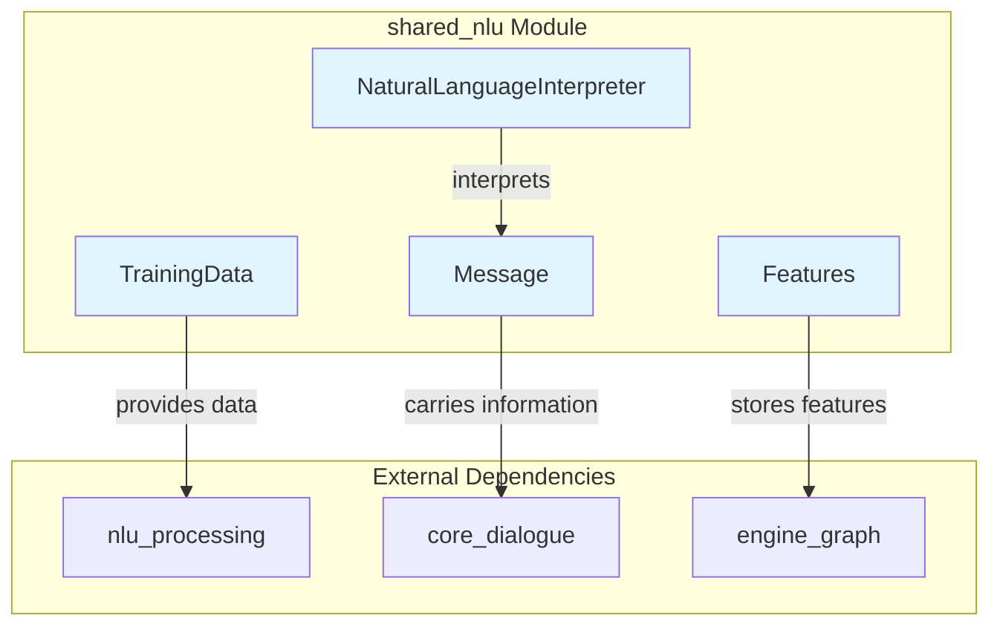
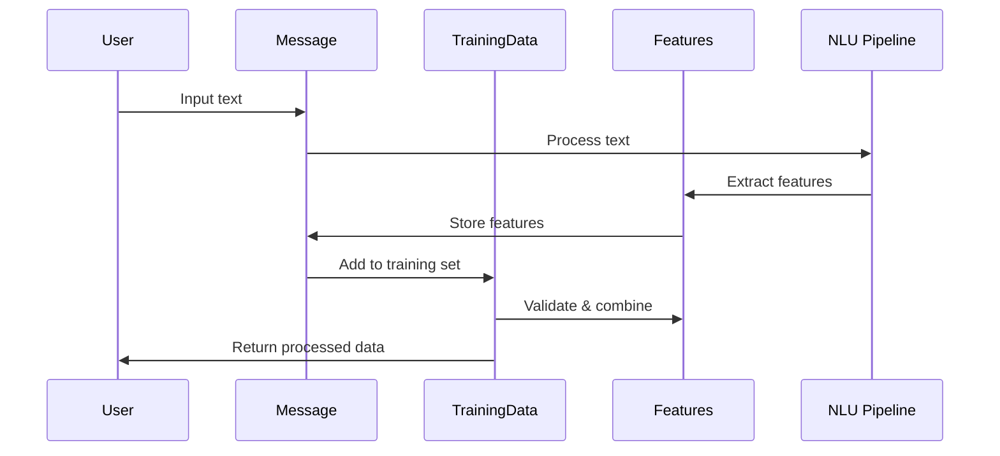

# Shared NLU Module Documentation

## Overview

The `shared_nlu` module is a foundational component of the Rasa NLU (Natural Language Understanding) system that provides shared data structures and utilities for handling natural language processing tasks. This module serves as the common interface between NLU training data, message processing, and feature extraction across the entire Rasa framework.

## Purpose

The primary purpose of the `shared_nlu` module is to:

- **Standardize NLU Data Representation**: Provide consistent data structures for training data, messages, and features
- **Enable Interoperability**: Facilitate communication between different NLU components and the broader Rasa system
- **Support Feature Management**: Handle the storage, combination, and manipulation of extracted features
- **Ensure Data Integrity**: Provide validation and fingerprinting mechanisms for NLU data

## Architecture



## Core Components

### 1. TrainingData ([training_data.md](training_data.md))
The `TrainingData` class is the central data structure for NLU training data. It manages:
- Training examples (messages with intent and entity annotations)
- Entity synonyms and lookup tables
- Regular expression features
- Response templates for retrieval intents

**Detailed documentation**: [training_data.md](training_data.md)

### 2. Message ([message.md](message.md))
The `Message` class represents individual training examples or user inputs. It provides:
- Storage for text, intent, entities, and metadata
- Feature management and retrieval
- Support for both NLU and Core (dialogue) messages
- Diagnostic data storage for debugging

**Detailed documentation**: [message.md](message.md)

### 3. Features ([features.md](features.md))
The `Features` class handles extracted features from text processing. It supports:
- Dense and sparse feature storage
- Feature combination and manipulation
- Serialization/deserialization for model persistence
- Attribute-based feature organization

**Detailed documentation**: [features.md](features.md)

### 4. NaturalLanguageInterpreter
A minimal interface class that serves as a placeholder for legacy compatibility.

## Data Flow



## Integration Points

The `shared_nlu` module integrates with several other Rasa modules:

- **[nlu_processing](nlu_processing.md)**: Provides the actual NLU processing components (classifiers, extractors, tokenizers)
- **[core_dialogue](core_dialogue.md)**: Uses messages for dialogue state tracking and policy decisions
- **[engine_graph](engine_graph.md)**: Leverages features for graph-based model training and execution
- **[shared_core](shared_core.md)**: Shares common data structures and utilities

## Key Features

### Data Validation
- Minimum example requirements per intent and entity
- Duplicate detection and sanitization
- Overlapping entity annotation detection

### Feature Management
- Support for both dense (numpy arrays) and sparse (scipy matrices) features
- Feature combination and concatenation
- Origin tracking for debugging and reproducibility

### Serialization
- JSON and YAML format support
- Safe tensor serialization for model persistence
- Fingerprinting for change detection

### Training Data Operations
- Stratified train/test splitting
- Data merging and filtering
- Statistics generation and validation

## Usage Examples

### Creating Training Data
```python
from rasa.shared.nlu.training_data.training_data import TrainingData
from rasa.shared.nlu.training_data.message import Message

# Create messages
messages = [
    Message.build("Hello there", intent="greet"),
    Message.build("I want to book a flight", intent="book_flight", 
                  entities=[{"entity": "intent", "value": "book_flight"}])
]

# Create training data
training_data = TrainingData(training_examples=messages)
```

### Working with Features
```python
from rasa.shared.nlu.training_data.features import Features
import numpy as np

# Create dense features
dense_features = Features(
    features=np.array([[1, 2, 3]]),
    feature_type="sentence",
    attribute="text",
    origin="CountVectorsFeaturizer"
)

# Add to message
message.add_features(dense_features)
```

## Best Practices

1. **Always validate training data** before use to catch potential issues early
2. **Use appropriate feature types** (dense vs sparse) based on your data characteristics
3. **Leverage fingerprinting** for efficient change detection and caching
4. **Follow the established patterns** for message creation and feature extraction
5. **Maintain consistency** in attribute naming across your NLU pipeline

## Related Documentation

- [NLU Processing Module](nlu_processing.md) - Actual NLU component implementations
- [Core Dialogue Module](core_dialogue.md) - Dialogue management and policy framework
- [Engine Graph Module](engine_graph.md) - Graph-based training and execution engine
- [Shared Core Module](shared_core.md) - Common utilities and data structures