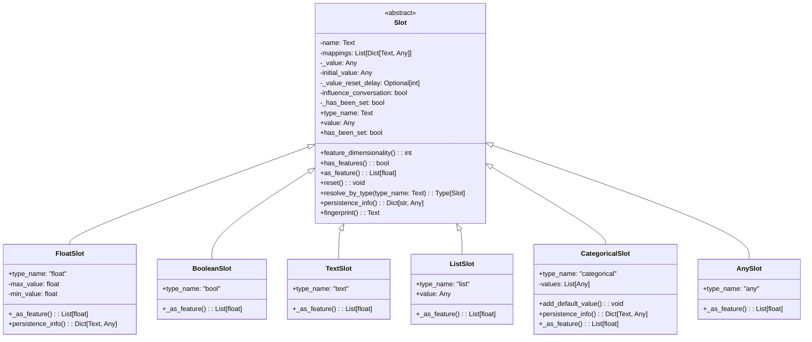
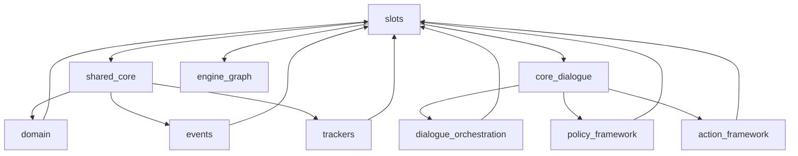
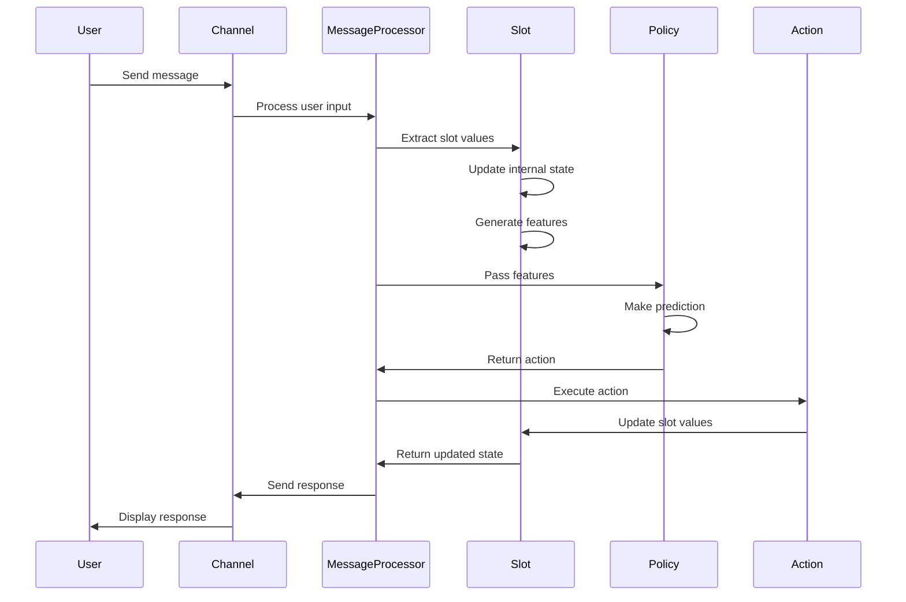
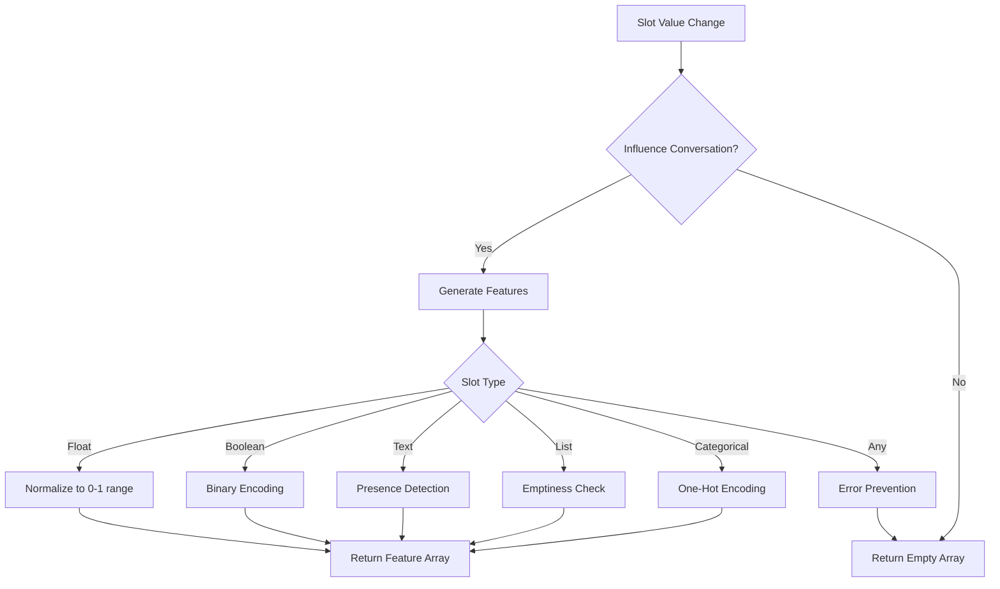

# Slots Module Documentation

## Introduction

The slots module is a fundamental component of Rasa's dialogue management system, providing a key-value storage mechanism for maintaining conversation state throughout interactions. Slots serve as the primary mechanism for storing and retrieving information that needs to persist across multiple turns in a conversation, enabling context-aware responses and decision-making in conversational AI applications.

This module implements a type-safe, extensible slot system that supports various data types including text, numbers, booleans, lists, and categorical values. The slot system is designed to integrate seamlessly with Rasa's policy framework, allowing stored information to influence conversation flow through featurization and policy predictions.

## Architecture Overview

### Core Components

The slots module is built around a hierarchical architecture with the abstract `Slot` base class at its foundation, providing common functionality and interfaces that are extended by concrete slot implementations for different data types.



### Module Dependencies

The slots module integrates with several other core Rasa modules to provide comprehensive conversation state management:



## Component Details

### Slot Base Class

The `Slot` abstract base class provides the fundamental interface and common functionality for all slot types. It manages slot lifecycle, value storage, feature generation for machine learning models, and persistence capabilities.

**Key Responsibilities:**
- Value storage and retrieval with type safety
- Feature generation for policy predictions
- Conversation influence control through featurization
- Slot lifecycle management (initialization, reset, persistence)
- Dynamic slot type resolution and instantiation

**Core Properties:**
- `name`: Unique identifier for the slot within the domain
- `value`: Current stored value with automatic change tracking
- `initial_value`: Default value used for initialization and reset
- `influence_conversation`: Controls whether slot affects policy predictions
- `mappings`: Configuration for automatic slot filling from user input
- `has_been_set`: Tracks whether the slot value has been explicitly set

### Concrete Slot Implementations

#### FloatSlot

Stores floating-point numerical values with configurable min/max ranges. Provides normalized feature representation for machine learning models by scaling values to [0, 1] range based on configured boundaries.

**Features:**
- Range validation and automatic value capping
- Normalized feature generation for policy predictions
- Configurable initial values and influence settings
- Comprehensive error handling for invalid configurations

#### BooleanSlot

Handles boolean values with flexible type conversion from various input formats (bool, int, float, string). Provides binary feature representation for conversation policies.

**Type Conversion:**
- Numeric values: 1.0/0.0 mapping to True/False
- String values: "true"/"false" case-insensitive parsing
- Invalid values: Graceful fallback with warning logging

#### TextSlot

Simple text storage with basic feature generation. Creates binary features indicating presence/absence of text values, suitable for basic conversation state tracking.

#### ListSlot

Manages collections of values with automatic list conversion. Ensures consistent list storage even when single values are assigned, with feature generation based on list emptiness.

#### CategoricalSlot

Supports discrete value sets with one-hot encoding for policy features. Enables conversation branching based on specific value categories with comprehensive value validation.

**Capabilities:**
- Predefined value set validation
- Default value handling for unspecified categories
- One-hot feature encoding for machine learning
- Case-insensitive value matching

#### AnySlot

Generic value storage without featurization capabilities. Designed for complex data types that don't require policy influence, with explicit prevention of featurization to avoid runtime errors.

## Data Flow and Integration

### Slot Lifecycle in Conversation Processing



### Feature Generation Process



## Integration with Core Systems

### Domain Integration

Slots integrate closely with the [domain](domain.md) system, where they are defined in the domain configuration and made available throughout the conversation lifecycle. The domain manages slot declarations, type validation, and provides slot access to other components.

### Event System Integration

Slot changes are tracked through the [events](events.md) system, with `SlotSet` events recording value modifications. This enables conversation state reconstruction and provides audit trails for debugging and analysis.

### Tracker Integration

The [trackers](trackers.md) system maintains slot state across conversation turns, persisting values and providing historical access. Dialogue state trackers coordinate slot updates with other conversation state elements.

### Policy Framework Integration

Slots provide essential features for the [policy_framework](policy_framework.md), enabling context-aware decision making. Policy components receive slot features as input for action prediction, allowing conversation flow to adapt based on stored information.

## Configuration and Usage

### Slot Definition

Slots are defined in the domain configuration with type-specific parameters:

```yaml
slots:
  name:
    type: text
    influence_conversation: true
    mappings:
    - type: from_text
  age:
    type: float
    min_value: 0
    max_value: 120
    initial_value: 25
  preferences:
    type: list
    influence_conversation: false
  category:
    type: categorical
    values:
      - option1
      - option2
      - option3
```

### Runtime Behavior

Slots can be accessed and modified through various mechanisms:

- **Automatic extraction**: Via slot mappings from user input
- **Action updates**: Through custom actions and forms
- **API access**: Direct manipulation via tracker interfaces
- **Conditional logic**: Used in stories and rules for conversation branching

## Error Handling and Validation

The module implements comprehensive error handling for common slot-related issues:

- **Type validation**: Ensures slot values match expected types
- **Range checking**: Validates numerical values against configured bounds
- **Configuration errors**: Provides clear error messages for invalid slot definitions
- **Runtime safety**: Prevents featurization errors that could disrupt conversation flow

## Extension and Customization

The slot system supports custom slot types through inheritance from the base `Slot` class. Custom implementations must provide:

- `type_name` property for identification
- `_as_feature()` method for feature generation
- Optional `persistence_info()` for serialization
- Type-specific validation and conversion logic

This extensibility enables support for complex data types and specialized use cases while maintaining integration with the broader Rasa ecosystem.