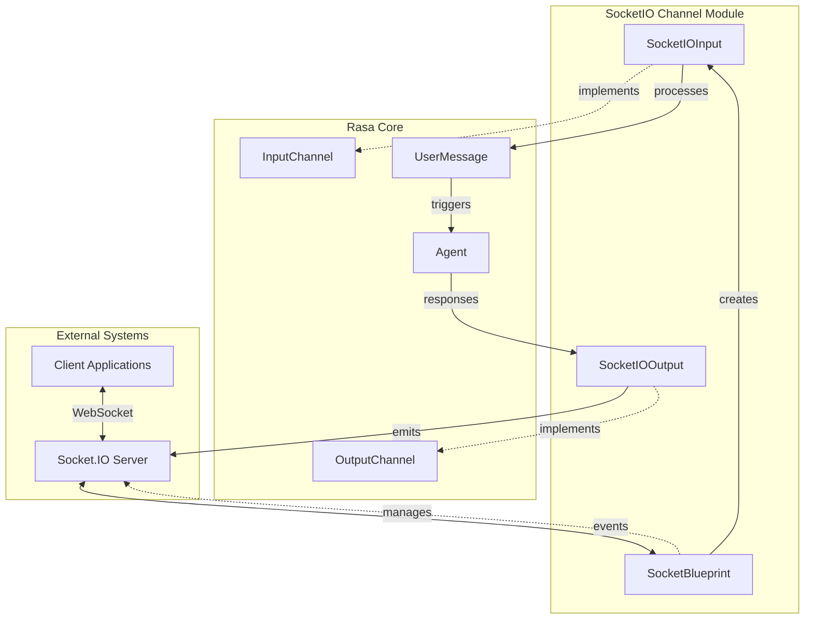
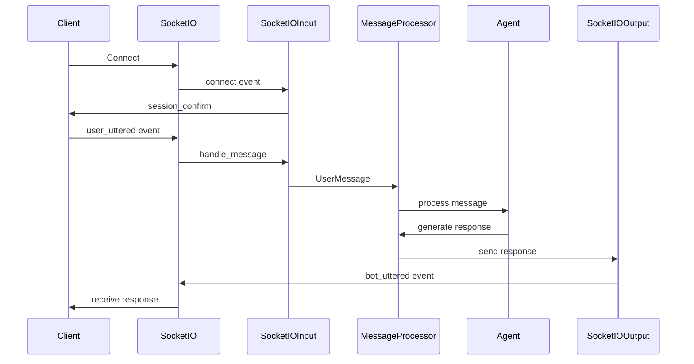
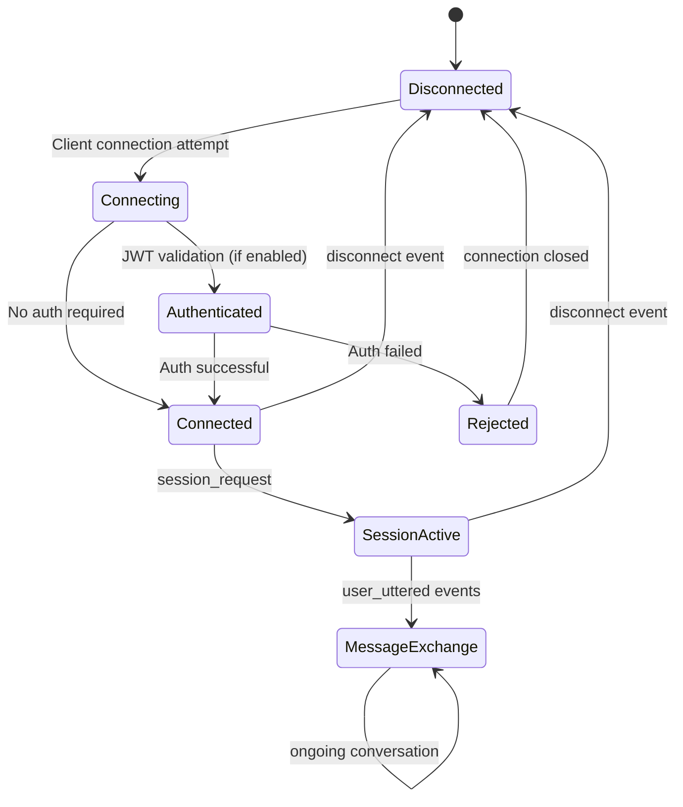

# SocketIO Channel Module

The SocketIO channel module provides real-time bidirectional communication capabilities for Rasa chatbots, enabling WebSocket-based interactions between users and the conversational AI system. This module implements the Socket.IO protocol to facilitate persistent connections, real-time messaging, and session management for interactive chat experiences.

## Overview

The SocketIO channel module serves as a bridge between Rasa's conversational AI engine and client applications using the Socket.IO protocol. It handles both incoming user messages and outgoing bot responses through WebSocket connections, providing features like session persistence, JWT authentication, and support for various message types including text, images, buttons, and custom JSON payloads.

## Architecture

### Component Structure



### Core Components

#### SocketIOInput
The main input channel class that handles incoming Socket.IO connections and messages. It manages:
- WebSocket connection lifecycle (connect/disconnect events)
- Session persistence and management
- JWT authentication for secure connections
- Message routing to the Rasa agent
- Multi-room support for session isolation

#### SocketIOOutput
The output channel class responsible for sending bot responses back to clients through Socket.IO events. It supports:
- Text messages with multi-part support
- Rich media (images, attachments)
- Interactive buttons and quick replies
- Custom JSON payloads
- Template-based messages

#### SocketBlueprint
A specialized Sanic Blueprint that integrates Socket.IO with the Sanic web framework, providing:
- Route registration for Socket.IO endpoints
- CORS handling for cross-origin requests
- Health check endpoints
- Event handler registration

## Data Flow

### Message Processing Flow



### Session Management



## Key Features

### Real-time Communication
- WebSocket-based bidirectional communication
- Low-latency message exchange
- Automatic reconnection handling
- Event-driven architecture

### Session Management
- Optional session persistence across connections
- UUID-based session identification
- Room-based message routing
- Session isolation for multi-user scenarios

### Security
- JWT-based authentication support
- Configurable JWT algorithms (HS256, etc.)
- Token validation on connection
- Secure WebSocket connections (WSS)

### Message Types
- Plain text messages with multi-part support
- Rich media (images, videos, files)
- Interactive buttons and quick replies
- Custom JSON payloads
- Template-based messages

## Configuration

### Basic Setup
```yaml
socketio:
  user_message_evt: "user_uttered"
  bot_message_evt: "bot_uttered"
  session_persistence: true
  socketio_path: "/socket.io"
```

### Advanced Configuration
```yaml
socketio:
  user_message_evt: "user_uttered"
  bot_message_evt: "bot_uttered"
  namespace: "/chat"
  session_persistence: true
  socketio_path: "/socket.io"
  jwt_key: "your-secret-key"
  jwt_method: "HS256"
  metadata_key: "metadata"
```

## Integration Points

### With Rasa Core
The SocketIO channel integrates with Rasa's core components:
- **[Agent](core_dialogue.md)**: Processes incoming messages and generates responses
- **[MessageProcessor](core_dialogue.md)**: Handles message routing and processing
- **[DialogueStateTracker](shared_core.md)**: Maintains conversation state

### With Channel Framework
Implements the standard Rasa channel interfaces:
- **[InputChannel](channels.md)**: Base interface for all input channels
- **[OutputChannel](channels.md)**: Base interface for all output channels
- **[UserMessage](channels.md)**: Standard message format

## Usage Examples

### Client Connection
```javascript
const socket = io('http://localhost:5005', {
  auth: {
    token: 'your-jwt-token'
  }
});

socket.on('connect', () => {
  socket.emit('session_request', {session_id: null});
});

socket.on('session_confirm', (sessionId) => {
  console.log('Session confirmed:', sessionId);
});

socket.on('bot_uttered', (message) => {
  console.log('Bot:', message.text);
});
```

### Sending Messages
```javascript
socket.emit('user_uttered', {
  message: 'Hello, how can you help me?',
  session_id: sessionId,
  metadata: {
    user_type: 'premium',
    timezone: 'UTC'
  }
});
```

## Error Handling

### Connection Errors
- JWT authentication failures result in connection rejection
- Invalid session IDs trigger warning messages
- Missing metadata is handled gracefully

### Message Processing Errors
- Invalid message formats are logged and ignored
- Missing session IDs in persistent mode trigger warnings
- Output channel recreation failures are handled with warnings

## Performance Considerations

### Scalability
- Socket.IO supports horizontal scaling with Redis adapter
- Session persistence enables load balancer affinity
- Room-based routing optimizes message delivery

### Resource Management
- Automatic cleanup of disconnected sessions
- Efficient event handler registration
- Minimal memory footprint for idle connections

## Security Best Practices

1. **Enable JWT Authentication**: Always use JWT tokens in production
2. **Use Secure WebSockets**: Implement WSS (WebSocket Secure) in production
3. **Validate Input**: Sanitize all incoming message data
4. **Rate Limiting**: Implement rate limiting to prevent abuse
5. **CORS Configuration**: Properly configure CORS origins

## Dependencies

### External Libraries
- **python-socketio**: Core Socket.IO implementation
- **sanic**: Async web framework for HTTP endpoints
- **PyJWT**: JWT token handling (optional)

### Rasa Dependencies
- **[rasa.core.channels.channel](channels.md)**: Base channel interfaces
- **[rasa.shared.utils.io](shared_core.md)**: Utility functions
- **[rasa.core.channels.channel.decode_bearer_token](channels.md)**: JWT decoding

## Troubleshooting

### Common Issues
1. **Connection Failures**: Check CORS configuration and firewall settings
2. **Session Persistence**: Ensure proper session ID management
3. **JWT Authentication**: Verify token format and secret key
4. **Message Delivery**: Check event names and payload formats

### Debug Information
- Enable debug logging for detailed connection information
- Monitor Socket.IO server logs for connection events
- Use browser developer tools to inspect WebSocket traffic

## Related Documentation

- **[REST Channel](rest_channel.md)**: HTTP-based channel implementation
- **[Core Dialogue](core_dialogue.md)**: Message processing and dialogue management
- **[Channels Overview](channels.md)**: General channel framework documentation