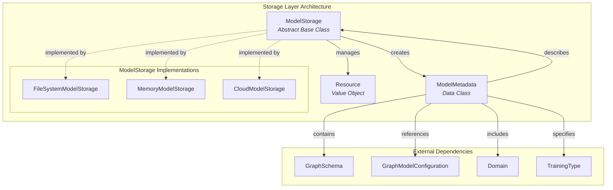
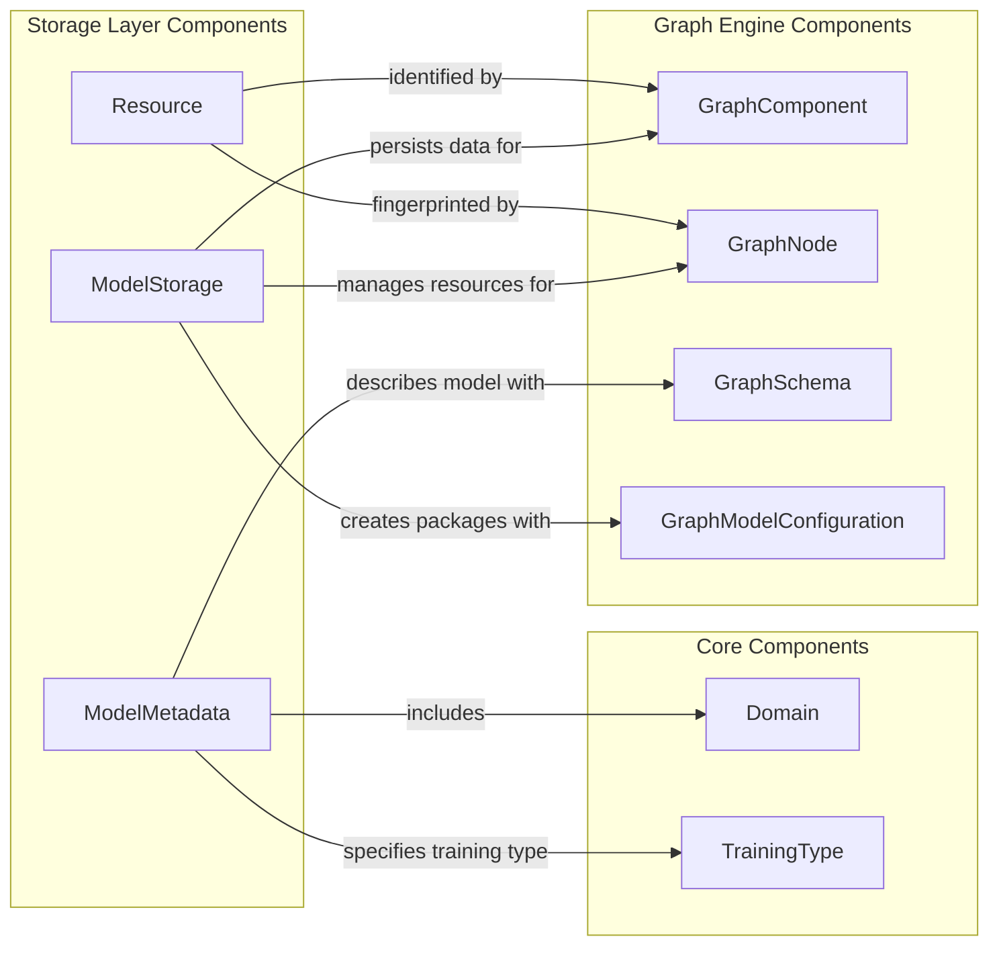
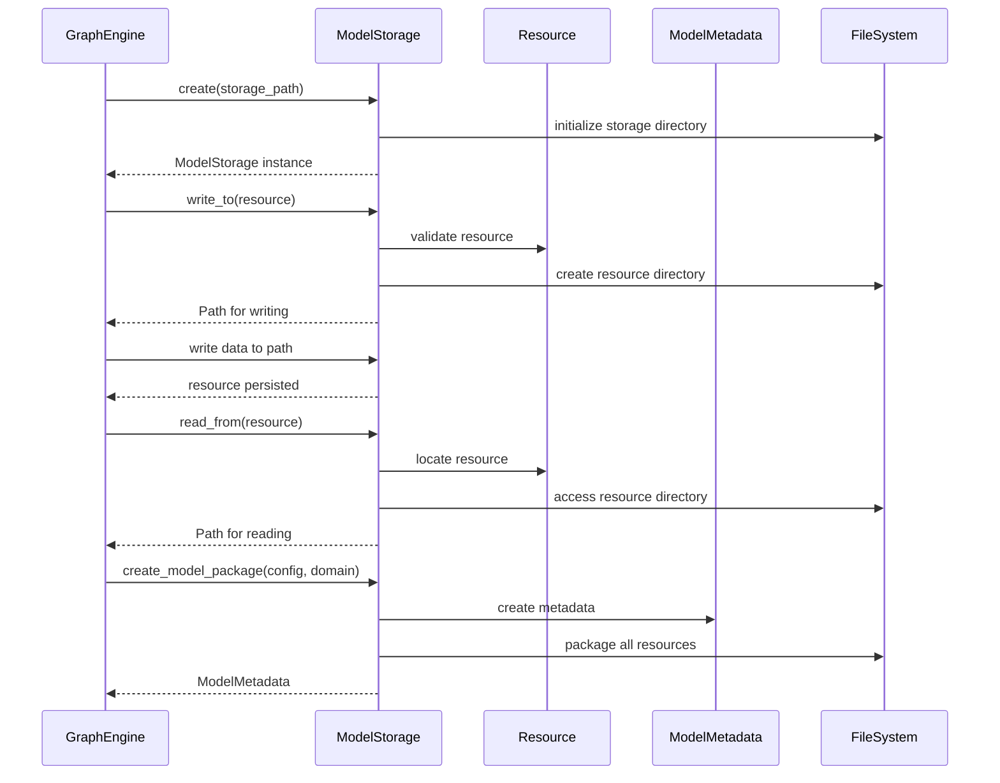
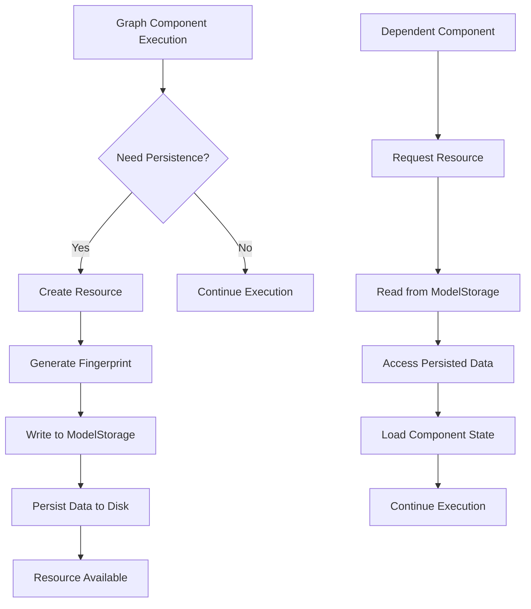
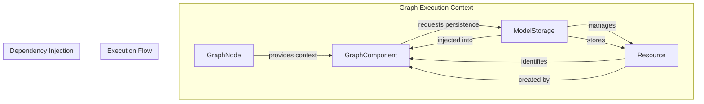
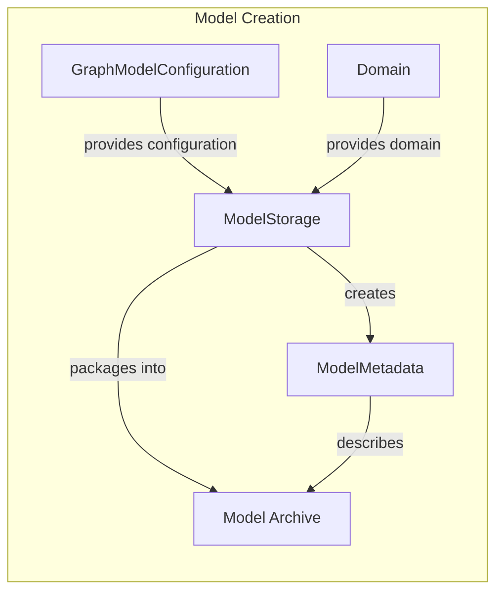
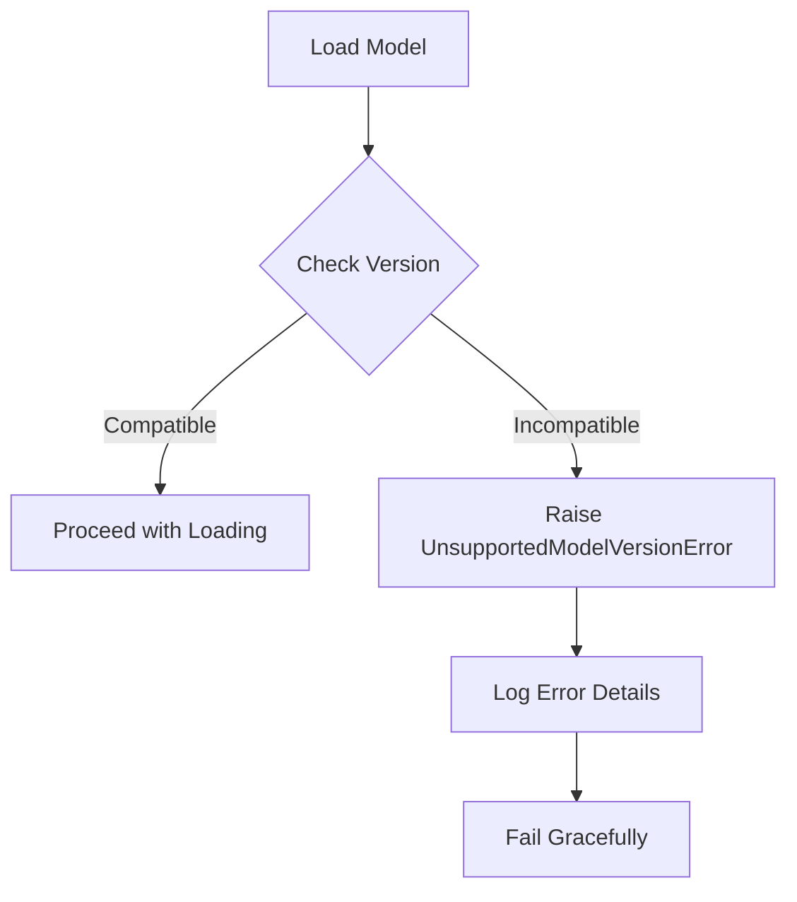

# Storage Layer Module

## Introduction

The storage layer module provides the persistence infrastructure for Rasa's graph-based architecture. It serves as the backbone for model storage, resource management, and model packaging, enabling the Rasa engine to persist and retrieve trained components, models, and their metadata throughout the ML lifecycle.

This module is critical for:
- **Model Persistence**: Storing trained graph components and their states
- **Resource Management**: Managing the lifecycle of persisted resources
- **Model Packaging**: Creating deployable model archives
- **Version Compatibility**: Ensuring model compatibility across Rasa versions
- **Caching Support**: Enabling efficient resource caching and retrieval

## Architecture

### Core Components



### Component Relationships



## Data Flow

### Model Storage Lifecycle



### Resource Management Flow



## Core Components

### ModelStorage

The `ModelStorage` abstract base class defines the contract for all storage implementations. It provides a unified interface for persisting and retrieving graph component data throughout the Rasa engine lifecycle.

**Key Responsibilities:**
- **Resource Persistence**: Provides context managers for reading and writing component data
- **Model Packaging**: Creates deployable model archives with all necessary resources
- **Version Management**: Handles model version compatibility checks
- **Storage Initialization**: Creates storage instances from scratch or model archives

**Core Methods:**
- `create()`: Initializes a new storage instance
- `from_model_archive()`: Loads storage from an existing model package
- `write_to()`: Provides write access for persisting resources
- `read_from()`: Provides read access to persisted resources
- `create_model_package()`: Creates a complete model archive

### ModelMetadata

The `ModelMetadata` data class encapsulates all metadata about a trained model, providing essential information for model loading, validation, and deployment.

**Key Attributes:**
- **Model Identification**: `model_id`, `assistant_id`, `trained_at`
- **Version Information**: `rasa_open_source_version` for compatibility checking
- **Configuration**: `train_schema`, `predict_schema` for graph execution
- **Domain**: Complete domain specification used for training
- **Training Context**: `language`, `training_type`, `project_fingerprint`

**Validation Features:**
- Automatic version compatibility checking
- Serialization/deserialization support
- Integration with Rasa's version management system

### Resource

The `Resource` class represents individual persisted components within the storage system, providing unique identification and fingerprinting capabilities.

**Key Features:**
- **Unique Identification**: Each resource has a unique name and fingerprint
- **Caching Support**: Integration with caching mechanisms for performance
- **Fingerprinting**: Automatic generation of unique identifiers for resource versions
- **Cache Operations**: `from_cache()` and `to_cache()` methods for cache management

## Integration with Graph Engine

### Storage in Graph Execution



### Model Packaging Process



## Dependencies

### Internal Dependencies

The storage layer depends on several core Rasa components:

- **[`rasa.engine.graph`](graph_core.md)**: Graph schema and model configuration
- **[`rasa.shared.core.domain`](shared_core.md)**: Domain specification and validation
- **[`rasa.constants`](shared_core.md)**: Version compatibility constants
- **[`rasa.exceptions`](shared_core.md)**: Exception handling for version errors

### External Dependencies

- **`packaging.version`**: Version parsing and comparison
- **`pathlib.Path`**: File system operations
- **`dataclasses`**: Data class functionality for metadata
- **`contextlib`**: Context manager support for resource operations

## Usage Patterns

### Basic Resource Persistence

```python
# Component persisting data
with model_storage.write_to(resource) as resource_directory:
    # Save model files, configurations, etc.
    save_model_files(resource_directory)

# Component reading persisted data
with model_storage.read_from(resource) as resource_directory:
    # Load model files, configurations, etc.
    load_model_files(resource_directory)
```

### Model Package Creation

```python
# Create a complete model package
metadata = model_storage.create_model_package(
    model_archive_path="path/to/model.tar.gz",
    model_configuration=graph_model_configuration,
    domain=domain
)
```

### Model Loading from Archive

```python
# Load storage from existing model
model_storage, metadata = ModelStorage.from_model_archive(
    storage_path="path/to/storage",
    model_archive_path="path/to/model.tar.gz"
)
```

## Error Handling

### Version Compatibility

The storage layer implements strict version checking to ensure model compatibility:



### Resource Validation

Resources are validated during read/write operations:

- **Missing Resources**: `ValueError` when accessing non-existent resources
- **Invalid Paths**: Path validation for storage operations
- **Permission Errors**: File system permission handling

## Performance Considerations

### Caching Integration

The storage layer is designed to work seamlessly with caching mechanisms:

- **Resource Fingerprinting**: Unique identifiers prevent unnecessary operations
- **Cache-aware Operations**: `from_cache()` and `to_cache()` methods
- **Directory Comparison**: Efficient cache validation using directory comparison

### Storage Optimization

- **Context Managers**: Efficient resource lifecycle management
- **Lazy Loading**: Resources loaded only when needed
- **Fingerprint-based Invalidation**: Smart cache invalidation strategies

## Extension Points

### Custom Storage Implementations

The abstract `ModelStorage` base class allows for custom implementations:

- **Cloud Storage**: AWS S3, Google Cloud Storage, Azure Blob Storage
- **Database Storage**: SQL-based storage for metadata and small resources
- **Hybrid Storage**: Combination of local and remote storage

### Metadata Extensions

The `ModelMetadata` data class can be extended to include additional fields:

- **Custom Training Metrics**: Performance indicators, validation scores
- **Deployment Information**: Target environments, deployment configurations
- **Audit Trail**: Training history, model lineage information

## Best Practices

### Resource Management

1. **Always use context managers** for resource operations
2. **Validate resource existence** before accessing
3. **Handle version compatibility** gracefully
4. **Implement proper cleanup** in error scenarios

### Model Packaging

1. **Include all necessary resources** in model packages
2. **Validate model metadata** before packaging
3. **Test model loading** from created packages
4. **Document model dependencies** in metadata

### Error Handling

1. **Provide meaningful error messages** for debugging
2. **Log storage operations** for audit trails
3. **Implement retry logic** for transient failures
4. **Validate inputs** before storage operations

## Related Documentation

- **[Graph Core](graph_core.md)**: Graph schema and component execution
- **[Shared Core](shared_core.md)**: Domain and event system
- **[Training Framework](training_framework.md)**: Model training process
- **[Execution Engine](execution_engine.md)**: Graph execution runtime