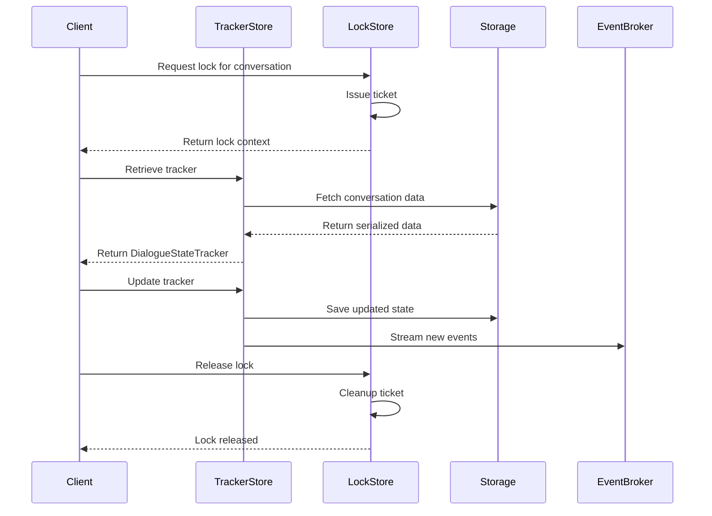

# Storage Persistence Module

## Overview

The `storage_persistence` module provides robust storage and persistence capabilities for Rasa's conversation tracking and locking mechanisms. This module is responsible for maintaining conversation state across sessions, ensuring data consistency, and managing concurrent access to conversation data.

## Purpose

The storage persistence layer serves as the backbone for:
- **Conversation State Management**: Storing and retrieving dialogue state trackers that maintain conversation history
- **Concurrent Access Control**: Managing locks to prevent race conditions in multi-user scenarios
- **Data Durability**: Ensuring conversation data persists across application restarts
- **Scalability**: Supporting multiple backend storage options for different deployment scenarios

## Architecture

```mermaid
graph TB
    subgraph "Storage Persistence Layer"
        TS[TrackerStore<br/><i>Abstract Base</i>]
        
        subgraph "Tracker Store Implementations"
            IMS[InMemoryTrackerStore]
            RTS[RedisTrackerStore]
            STS[SQLTrackerStore]
            DTS[DynamoTrackerStore]
            MTS[MongoTrackerStore]
            FTS[FailSafeTrackerStore]
        end
        
        subgraph "Lock Store Components"
            LS[LockStore<br/><i>Abstract Base</i>]
            IMLS[InMemoryLockStore]
            RLS[RedisLockStore]
        end
        
        subgraph "Serialization Layer"
            STR[SerializedTrackerRepresentation]
            STT[SerializedTrackerAsText]
            STD[SerializedTrackerAsDict]
        end
    end
    
    subgraph "External Dependencies"
        DST[DialogueStateTracker]
        D[Domain]
        EB[EventBroker]
        EC[EndpointConfig]
    end
    
    TS --> IMS
    TS --> RTS
    TS --> STS
    TS --> DTS
    TS --> MTS
    TS --> FTS
    
    LS --> IMLS
    LS --> RLS
    
    TS -.-> STR
    IMS -.-> STT
    RTS -.-> STT
    STS -.-> STT
    MTS -.-> STT
    DTS -.-> STD
    
    TS --> DST
    TS --> D
    TS --> EB
    
    LS --> DST
    
    IMS --> EC
    RTS --> EC
    STS --> EC
    DTS --> EC
    MTS --> EC
    FTS --> TS
    
    style TS fill:#e1f5fe
    style LS fill:#e1f5fe
    style STR fill:#fff3e0
    style IMS fill:#f3e5f5
    style RTS fill:#f3e5f5
    style STS fill:#f3e5f5
    style DTS fill:#f3e5f5
    style MTS fill:#f3e5f5
    style FTS fill:#f3e5f5
    style IMLS fill:#f3e5f5
    style RLS fill:#f3e5f5
```



## Core Components

### Tracker Store System

The tracker store system provides a pluggable architecture for persisting conversation state. The abstract `TrackerStore` base class defines the interface, while concrete implementations offer different storage backends.

#### Key Features:
- **Async Support**: All tracker store operations are asynchronous for better performance
- **Event Streaming**: Integration with event brokers for real-time event streaming
- **Session Management**: Support for multi-session conversations
- **Serialization Flexibility**: Multiple serialization formats (JSON text, dictionary)

#### Storage Backends:
- **InMemoryTrackerStore**: Fast, volatile storage for development and testing
- **RedisTrackerStore**: High-performance, distributed storage with TTL support
- **SQLTrackerStore**: Relational database storage with full ACID compliance
- **DynamoTrackerStore**: AWS DynamoDB integration for cloud deployments
- **MongoTrackerStore**: Document-based storage with flexible schema
- **FailSafeTrackerStore**: Wrapper providing automatic fallback capabilities

### Lock Store System

The lock store system manages concurrent access to conversation data, preventing race conditions when multiple processes or threads interact with the same conversation.

#### Key Features:
- **Ticket-based Locking**: Implements a ticket system for fair lock acquisition
- **Automatic Expiration**: Locks have configurable lifetimes to prevent deadlocks
- **Async Context Management**: Provides async context managers for safe lock usage
- **Multiple Backends**: Redis and in-memory implementations available

## Data Flow



## Integration Points

### With Core Dialogue System
The storage persistence module integrates closely with the [core_dialogue](core_dialogue.md) system:
- Provides conversation state to the `MessageProcessor`
- Persists tracker updates from the `Agent`
- Supports policy decision making by maintaining conversation history

### With Shared Components
Leverages shared components for data consistency:
- Uses `DialogueStateTracker` from [shared_core](shared_core.md)
- Integrates with `Domain` objects for slot management
- Works with `Event` objects for conversation history

### With Event System
Integrates with the event broker system for real-time updates:
- Publishes conversation events to external systems
- Supports event streaming for analytics and monitoring
- Enables real-time conversation state synchronization

## Configuration

Tracker stores and lock stores are configured through endpoint configurations, allowing flexible deployment options:

```yaml
# Example endpoint configuration
tracker_store:
  type: redis
  url: localhost
  port: 6379
  db: 0
  key_prefix: rasa
  
lock_store:
  type: redis
  host: localhost
  port: 6379
  db: 1
```

## Error Handling

The module implements comprehensive error handling:
- **Connection Management**: Automatic reconnection and fallback mechanisms
- **Serialization Safety**: Robust handling of serialization/deserialization errors
- **Lock Timeout**: Prevents deadlocks through automatic lock expiration
- **Graceful Degradation**: Fail-safe wrapper ensures service availability

## Performance Considerations

- **Async Operations**: All I/O operations are asynchronous for better concurrency
- **Connection Pooling**: SQL implementations use connection pooling for efficiency
- **Caching**: Redis implementations support TTL-based caching
- **Batch Operations**: Event storage optimized for batch processing

## Security Features

- **SSL/TLS Support**: Redis and SQL connections support encryption
- **Authentication**: Database connections support username/password authentication
- **Key Prefixing**: Prevents key collisions in multi-tenant environments
- **Schema Isolation**: PostgreSQL supports schema-based isolation

## Sub-modules

For detailed information about specific components, see:
- [tracker_store.md](tracker_store.md) - Conversation persistence implementations
- [lock_store.md](lock_store.md) - Concurrent access control mechanisms