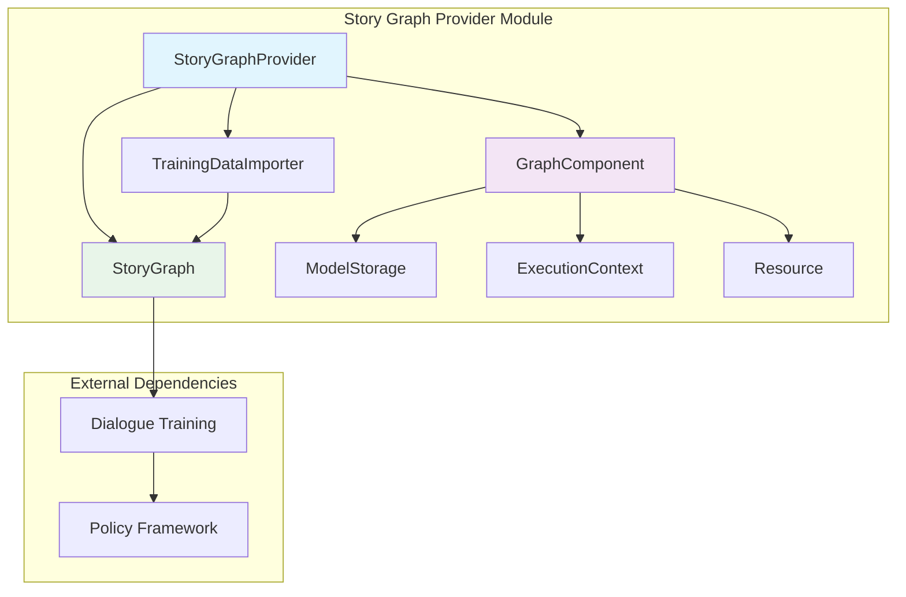
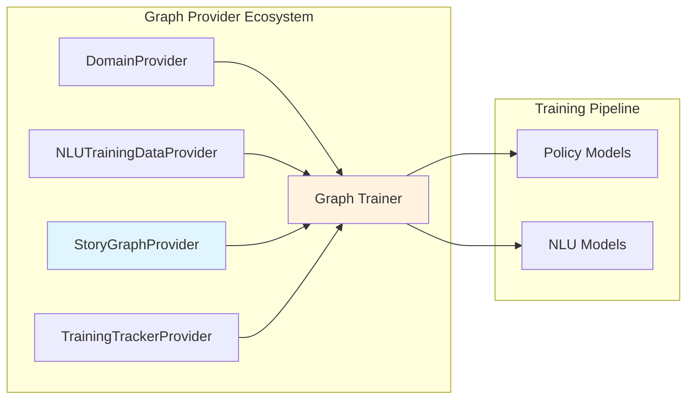
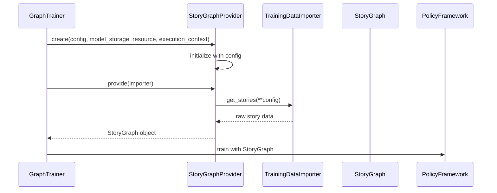
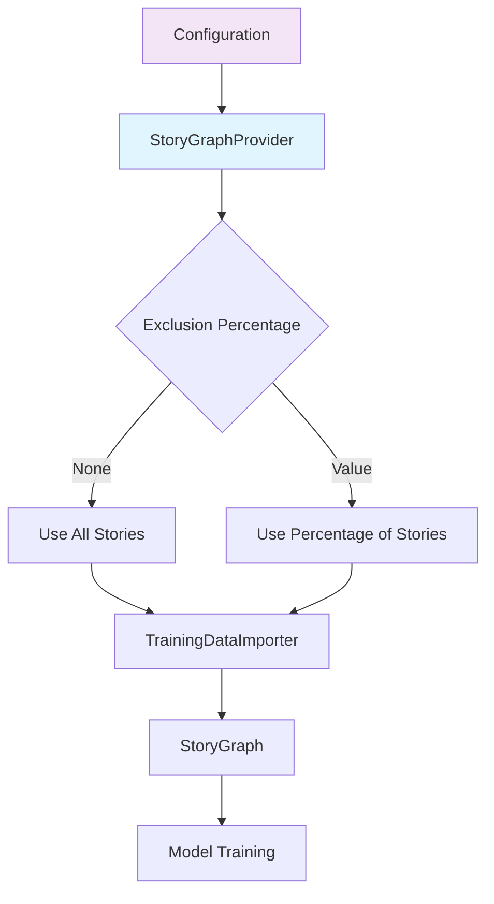
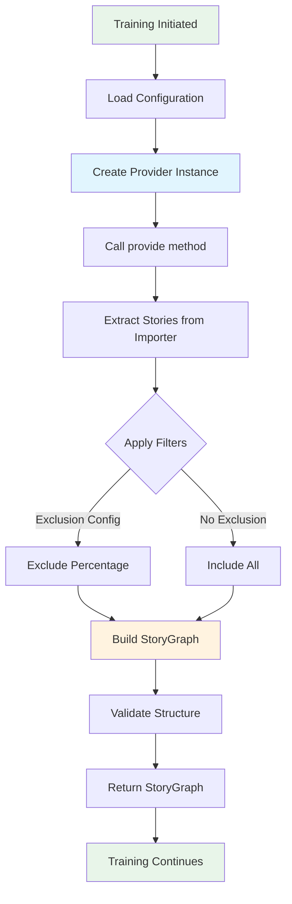

# Story Graph Provider Module

## Introduction

The Story Graph Provider module is a specialized component within the Rasa graph execution framework that handles the extraction and provision of conversational training data from story files. It serves as a bridge between the training data importers and the graph-based training pipeline, ensuring that story-based training data is properly formatted and available for downstream components.

## Overview

The `StoryGraphProvider` is responsible for converting raw story data into structured `StoryGraph` objects that can be consumed by dialogue policies and other training components. It operates as part of the graph provider ecosystem, working alongside other providers like `DomainProvider` and `NLUTrainingDataProvider` to supply the complete training dataset needed for model training.

## Architecture

### Component Structure



### Integration with Graph Framework



## Core Components

### StoryGraphProvider

The `StoryGraphProvider` class is the main component of this module, implementing the `GraphComponent` interface to integrate with Rasa's graph execution framework.

#### Key Responsibilities:
- **Data Extraction**: Retrieves story data from training data importers
- **Data Transformation**: Converts raw story data into structured `StoryGraph` objects
- **Configuration Management**: Handles exclusion percentages and other story-specific configurations
- **Graph Integration**: Provides seamless integration with the graph training pipeline

#### Class Definition:
```python
class StoryGraphProvider(GraphComponent):
    """Provides the training data from stories."""
    
    def __init__(self, config: Dict[Text, Any]) -> None:
        self._config = config
    
    def provide(self, importer: TrainingDataImporter) -> StoryGraph:
        """Provides the story graph from the training data."""
        return importer.get_stories(**self._config)
```

## Data Flow

### Story Data Processing Pipeline



### Configuration Flow



## Dependencies

### Internal Dependencies

The `StoryGraphProvider` depends on several core Rasa components:

1. **Graph Framework Components**:
   - `GraphComponent`: Base interface for graph execution
   - `ExecutionContext`: Provides execution context information
   - `ModelStorage`: Handles model persistence
   - `Resource`: Manages resource allocation

2. **Training Data Components**:
   - `TrainingDataImporter`: Interface for importing training data
   - `StoryGraph`: Data structure for representing conversational flows

### External Module Dependencies

The module integrates with several other Rasa modules:

- **[shared_core](shared_core.md)**: Uses `StoryGraph` from the shared core training data structures
- **[data_importers](data_importers.md)**: Relies on `TrainingDataImporter` for data access
- **[engine_graph](engine_graph.md)**: Integrates with the graph execution framework
- **[policy_framework](policy_framework.md)**: Provides training data to policy components

## Configuration

### Default Configuration

The `StoryGraphProvider` supports the following configuration options:

```python
{
    "exclusion_percentage": None  # Percentage of stories to exclude (0-100)
}
```

### Configuration Options

- **exclusion_percentage**: Optional integer between 0-100 that specifies what percentage of stories should be excluded from training. This is useful for experimentation and validation purposes.

## Usage Patterns

### Basic Usage

The `StoryGraphProvider` is typically used within the graph training pipeline:

```python
# The provider is automatically instantiated by the graph framework
provider = StoryGraphProvider.create(
    config={"exclusion_percentage": None},
    model_storage=model_storage,
    resource=resource,
    execution_context=execution_context
)

# Provide story data
story_graph = provider.provide(training_data_importer)
```

### Integration with Training Pipeline

The provider is automatically invoked during the graph-based training process, where it:

1. Receives configuration from the recipe system
2. Gets instantiated with appropriate model storage and execution context
3. Retrieves story data from the configured importer
4. Returns structured `StoryGraph` objects for downstream consumption

## Process Flow

### Story Graph Provision Process



## Error Handling

The `StoryGraphProvider` relies on the underlying `TrainingDataImporter` and `StoryGraph` components for error handling. Common error scenarios include:

- **Invalid Configuration**: Handled by the graph framework's configuration validation
- **Missing Story Data**: Delegated to the `TrainingDataImporter` implementation
- **Invalid Story Structure**: Managed by the `StoryGraph` validation logic

## Performance Considerations

### Memory Management

- The provider creates `StoryGraph` objects that are held in memory during training
- Large story datasets may require significant memory allocation
- The graph framework manages resource lifecycle and cleanup

### Optimization Strategies

- Use exclusion percentage to reduce dataset size during development
- Ensure efficient `TrainingDataImporter` implementations
- Leverage graph framework's caching mechanisms when available

## Testing and Validation

### Unit Testing

The provider can be tested in isolation by:

1. Mocking the `TrainingDataImporter` to return controlled story data
2. Verifying the returned `StoryGraph` structure
3. Testing configuration options and edge cases

### Integration Testing

Integration tests should verify:
- Proper integration with the graph training pipeline
- Compatibility with different `TrainingDataImporter` implementations
- Correct handling of various story formats and structures

## Future Enhancements

### Potential Improvements

1. **Advanced Filtering**: Support for more sophisticated story filtering options
2. **Caching Mechanisms**: Implement caching for frequently accessed story data
3. **Validation Enhancements**: Add story structure validation at the provider level
4. **Performance Optimization**: Implement streaming or lazy loading for large datasets

### Extension Points

The modular design allows for:
- Custom story processing logic through configuration
- Extension via inheritance for specialized use cases
- Integration with custom `TrainingDataImporter` implementations

## Related Documentation

- [Engine Graph](engine_graph.md) - Graph execution framework
- [Shared Core](shared_core.md) - Core data structures including StoryGraph
- [Data Importers](data_importers.md) - Training data import mechanisms
- [Policy Framework](policy_framework.md) - Consumers of story graph data
- [Graph Providers](graph_providers.md) - Overview of all graph providers